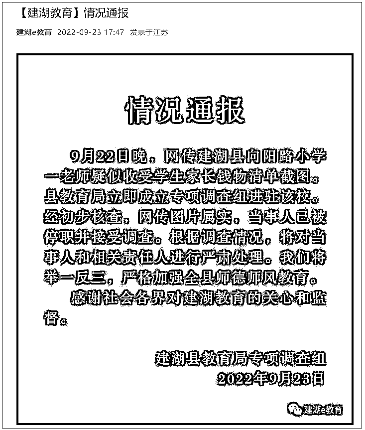
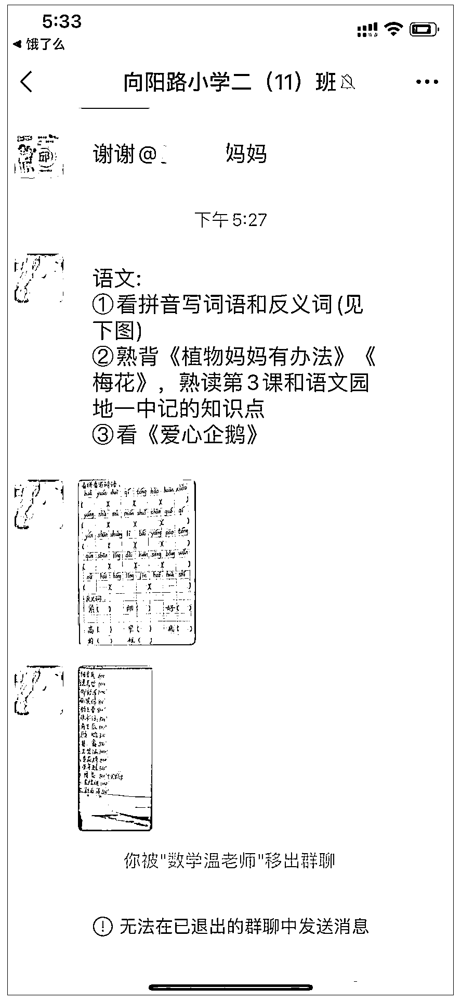
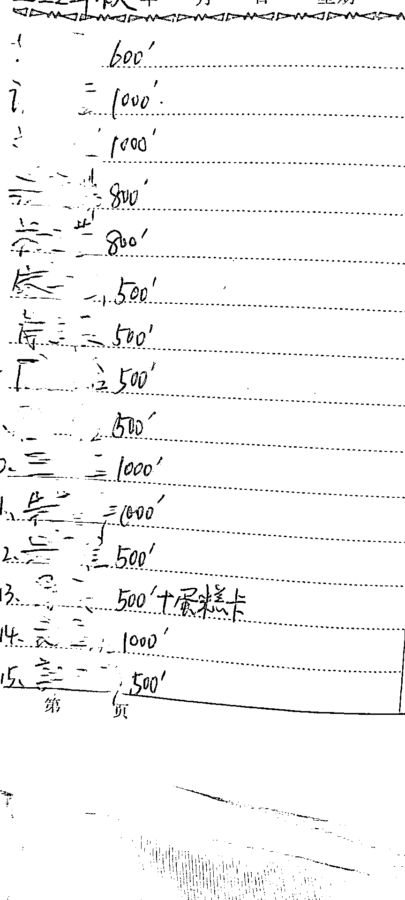
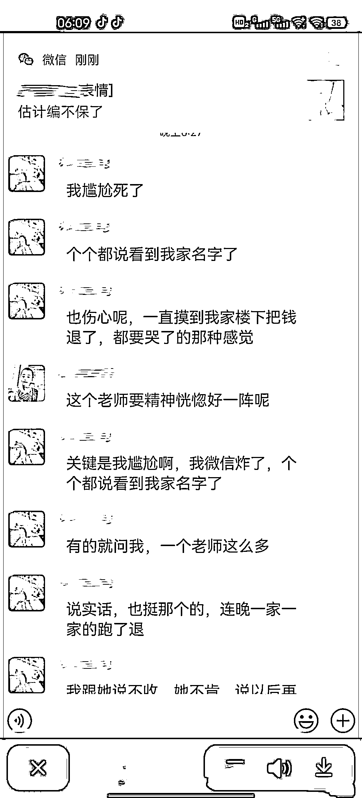

# 小学老师将万元收礼记录误发家长群，被停职

> 原文：[`mp.weixin.qq.com/s?__biz=MzIyMDYwMTk0Mw==&mid=2247544478&idx=2&sn=fbc8e34a51213cd1c74ca14cadc51e94&chksm=97cbe5a6a0bc6cb040f883ed0294c498aad0e3c7b643a2587d0892661342711fbbebfb68f177&scene=27#wechat_redirect`](http://mp.weixin.qq.com/s?__biz=MzIyMDYwMTk0Mw==&mid=2247544478&idx=2&sn=fbc8e34a51213cd1c74ca14cadc51e94&chksm=97cbe5a6a0bc6cb040f883ed0294c498aad0e3c7b643a2587d0892661342711fbbebfb68f177&scene=27#wechat_redirect)

针对网传“小学老师将收礼记录误发家长群”一事，江苏省盐城市建湖县 9 月 23 日发布通报，经初步核查，向阳路小学一老师疑似收受学生家长钱物清单截图属实，当事人已被停职并接受调查。通报全文如下：

**情况通报**

9 月 22 日晚，网传建湖县向阳路小学一老师疑似收受学生家长钱物清单截图。县教育局立即成立专项调查组进驻该校。经初步核查，网传图片属实，当事人已被停职并接受调查。根据调查情况，将对当事人和相关责任人进行严肃处理。我们将举一反三，严格加强全县师德师风教育。

感谢社会各界对建湖教育的关心和监督。

[`v.qq.com/iframe/preview.html?width=500&height=375&auto=0&vid=m33577iiuiz`](https://v.qq.com/iframe/preview.html?width=500&height=375&auto=0&vid=m33577iiuiz)

**此前报道**

@北京时间 消息，9 月 23 日，网曝江苏盐城向阳路小学二年级一老师，将收礼账本误发到家长群，收礼账本上共写有 15 人名字，收礼金额在 500 到 1000 元不等，总共近万元。对此，学校回应称正在走程序，一切以调查为准，当地教育局则表示已听说该事，纪委正在调查中。

根据网上流传的微信截图，在名为“向阳路小学二（11）班”的微信群里，一位据说是老师的群成员在发语文作业的同时，将一张笔记本内页的照片发到了群里，照片中可以看到手写的 15 个名字，每个名字后面都附有金额，其中一条还写着“+蛋糕卡”，疑似“收礼账本”。

网传图片

另一张微信截图则显示，上述老师在事发后“也伤心呢，一直摸到我家楼下把钱退了，都要哭了的那种感觉”，“连晚一家一家的跑了退”。

网传图片

向阳路小学某老师回应@北京时间 称，“这个问题暂时无法回答，因为正在走程序，一切以调查为准。”

建湖县教育局工作人员也表示，已听说此事，“目前纪委正在调查中”。

来源：观察者网，人间法则

欢迎关注灰产圈社群服务号

