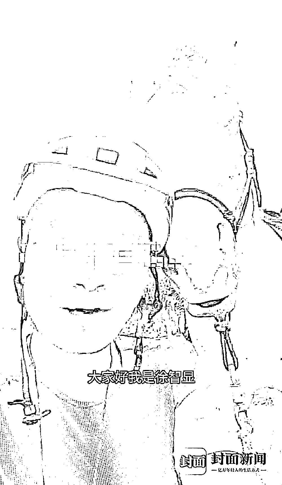

# "都是假的，我人在山西"

> 原文：[`mp.weixin.qq.com/s?__biz=MzIyMDYwMTk0Mw==&mid=2247544478&idx=5&sn=cc8b9146345ab1a381d40f0e2ac6e9e4&chksm=97cbe5a6a0bc6cb08adecb71742c7e19d61dcc0e4599da429c9b75853015e566a5523602eb76&scene=27#wechat_redirect`](http://mp.weixin.qq.com/s?__biz=MzIyMDYwMTk0Mw==&mid=2247544478&idx=5&sn=cc8b9146345ab1a381d40f0e2ac6e9e4&chksm=97cbe5a6a0bc6cb08adecb71742c7e19d61dcc0e4599da429c9b75853015e566a5523602eb76&scene=27#wechat_redirect)

  “我现在人在山西，没有在荷兰，从欧洲骑马回国是假的，现在玩大了，我要道歉！”

今年 2 月，32 岁男子徐智显欲横穿欧亚大陆，骑马从西班牙回国，此事经媒体报道后引发网友关注。9 月，徐智显发布视频称前进受阻，在荷兰被警察调查，原因是遭多人举报“虐待动物”。曾有旅居荷兰的华人告诉封面新闻记者，欧洲交规很严，不知徐是如何完成此举的，感觉他是想红。

9 月 23 日下午，徐智显致电封面新闻记者，称自己所谓的“从欧洲骑马回国”其实是假的，他目前人在山西某地，之前发布的视频和照片全是合成的。徐智显只透露自己在山西，但拒不透露具体在山西何处，称怕被网暴。

**突然致电记者 称所谓从欧洲骑马回国是编的**

封面新闻：你在欧洲跟马在一起的，都是假的？

徐智显：不是真的，都是做出来的。

封面新闻：我前两天在你的朋友圈里面看到一张你在欧洲的照片，也是在网上盗的吗？

徐智显：都是在网上盗的，都是在网上弄的，其实我朋友圈里没有几个留言。

徐智显说这些照片都是假的

封面新闻：你这 8 个月的人设是怎么打造的？

徐智显：平时吃完饭以后登个征婚广告，我这没结婚，也没有对象，在家里打游戏，现在游戏打得也累了，有空的时候就弄点东西，这不就弄出来了。

封面新闻：现在出来承认，是因为大家给你的压力太大了吗？

徐智显：是玩笑开大了，我不想等到大家压过来以后我再坦白从宽，我现在主动坦白，在未造成任何社会影响的前提下，我坦白从宽。

封面新闻：你这个事好几个月之前就开始了。

徐智显：好几个月之前，人设就跟开公司一样，人家开沃尔玛的时候刚开始也就是开个小店，但是开着顺手了就越开越多。这个人设打造也就是无数游戏中的一个，打造一下，慢慢一看，还真能钓上点鱼来，所以就越打造越离谱。现在就是主动让它崩塌一下，不再打造了。

封面新闻：现在是要公开道歉吗？

徐智显：这麻烦您，一是我要道歉，第二希望有人来投资，希望各位手里有资金的也能看好我一下，第三就是征一下婚，还有没出嫁的考虑一下我。我的照片是真的，我就长的那个模样。

封面新闻：你把大家都骗了，你这征婚还能征得上吗？

徐智显：我没有骗钱，我只是娱乐一下大家，我一分钱都没有骗大家。我现在还是用自己的收入维持自己的生活，我并没有骗大家的钱。

封面新闻：你说你现在不在欧洲，你在山西，是吗？

徐智显：对，我在山西。

封面新闻：所谓的从欧洲骑马回国，从西班牙骑马到了荷兰，这都是假的？

徐智显：对，都是假的，都是假的，而且现在已经假到我不想再假的情况了，就主动让自己人设崩塌。你看二舅不也是博了上亿的流量，然后就人设崩塌了。所以在我死之前，我没有做到人家那样的高度，但是我坦白一下。

徐智显说这些照片和视频都是制作的

封面新闻：但你这个事影响其实挺大的，你接受了许多采访。

徐智显：对，我是用其他的方式跟大家玩了一下。

封面新闻：你说的这些确实有点让人难以置信。

徐智显：这次再上热搜，（一些采访）我已经婉拒了，我玩了人家一次不能玩人家两次。

封面新闻：你现在是向大家道个歉是吧？你的意思就是。

徐智显：对，道个歉，拉个赞助拉个投资，然后再征个婚，如果其他两条也能办，我也很不请之情。

封面新闻：你确认你是没有去欧洲？

徐智显：我确认我还没结婚，我确认我一分钱没有收大家的。

封面新闻：你确认你现在不在国外吗？

徐智显：不在。

封面新闻：那你们现在在哪？

徐智显（拒绝透露）：我不想出了这么大的丑，然后再让大家网暴一下。

封面新闻：你在朋友圈里面说什么要开红包，那些都是假的是吗？

徐智显：都是假的，也开红包，所谓开红包都是我家的人给我打的红包，没有其他任何人打的红包，这个我是绝对不害怕的，全都是我家人给的红包。

封面新闻：网上那些关于你的文章，其实都是你自己就靠谷歌翻译出来翻译成各个文字，然后你放在网上，然后引导大家去看的？

徐智显：谷歌翻译一下，而且朋友圈里面会外语的也好几个了。

封面新闻：你大学是在哪读的？是国内吗？

徐智显：国内，都在国内。

封面新闻：研究生也在国内吗？

徐智显：对，都在国内，我不想被网暴。

封面新闻：因为我会意大利语，你说你在热那亚的学校读过，我搜过你的简历，但没有搜到。

徐智显：是吧？如果关于我道歉的新闻发出来后，请给我一个链接。

封面新闻：你不在自己的社交平台上面发一下吗？

徐智显：我现在已经不发东西了，适可而止了。它不是新闻平台，它就是个搞笑平台，用户已经有这个心态了，你就不需要再跟他们较真了。

徐智显说这些照片都是假的

**曾有荷兰华人质疑：大家都没看过这个新闻**

一位旅居荷兰的姜女士曾向封面新闻记者表示：”在欧洲哪个地方上路都有规定的，哪些供人走，哪些供自行车，哪些供马走，哪些供车走。我给我的同事摆这个事情，他们都在笑，他们都说没有看到过这个新闻。我感觉这个人就是想走红那种。“

两天前，曾有一位网友在徐智显的视频下留言：“不是早就回来了吗？”徐智显还点赞了此评论。

**声称未去过欧洲  却****曾****在社交小号分享欧洲生活**

记者向徐智显确认他是否曾经去过欧洲，徐智显通过微信回答“没”。问他马主人 Blanco 是谁，以及《加利西亚之声》曾经发布的报道是否是真的，他回答：“假的，脸都模糊了。”报纸“也是假的。”

徐通过微信与记者联络

记者希望徐智显能够通过中国的座机给记者打一个电话，证明他并不是在说谎，他回答：“人设崩塌我还能继续生活，暴露位置就死翘翘了。”“就此别过。”

徐在国外社交平台小号上晒的照片

徐在国外社交平台小号上晒的照片

但是封面新闻记者在 INS 上找到了疑似徐智显的个人小号，从 2018 年 1 月便开始分享在欧洲的生活，其中不乏自己出镜的照片，里面还有他跟一位牵着一匹黑马女士的合影。此外，徐智显在 3 月 31 日曾经在西班牙的塔尔达霍斯偶遇到两个骑自行车穿越法国、西班牙和葡萄牙的爱好者，对方也曾经分享了在路上遇到徐智显的照片。另外，他的小号里有两个视频值得关注，其中一个是他和 BLANCO 骑着马在 SANTIAGO 的广场上，有人跟他打招呼；另外一条是他在今年 1 月在西班牙的拉林骑马的视频，视频里面是一个说西班牙语的人的声音，视角也是该拍摄者的视角。

徐在国外社交平台小号上晒的照片

徐在国外社交平台小号上晒的照片

记者又提出了想要跟他视频，看看他所在地的要求，并未获得回应。

**律师：如果未以此骗取财物不构成诈骗罪**

徐智显目前社交平台上的粉丝有 18 万，有关他从欧洲骑马回国的消息也被各处转载，他此举是否涉嫌诈骗？封面新闻记者采访了四川一上律师事务所合伙人林小明，林律师表示：该人具有隐瞒真相虚构事实的情况，但并未以此骗取公私财物的情况则不构成诈骗罪，即便有人因此对其给予打赏，也应当归于赠予，如果打赏人知道真相后，要求退款而不退款则可能构成诈骗，但这种撒谎骗人的行为都应该受到谴责。 

来源：封面新闻

欢迎关注灰产圈社群服务号

