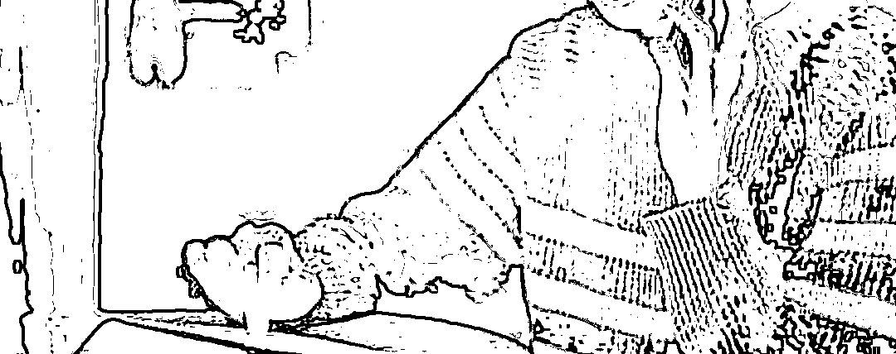

# 男子用假照片骗倒 39 名痴情女，判了！

> 原文：[`mp.weixin.qq.com/s?__biz=MzIyMDYwMTk0Mw==&mid=2247544478&idx=7&sn=9e4f5813e08a6e7896db2eca8d32134c&chksm=97cbe5a6a0bc6cb0bf221ef06231e333d04f8e6a39bd934805633bc4e74f94b641d73f5c6ad5&scene=27#wechat_redirect`](http://mp.weixin.qq.com/s?__biz=MzIyMDYwMTk0Mw==&mid=2247544478&idx=7&sn=9e4f5813e08a6e7896db2eca8d32134c&chksm=97cbe5a6a0bc6cb0bf221ef06231e333d04f8e6a39bd934805633bc4e74f94b641d73f5c6ad5&scene=27#wechat_redirect)

一会儿叫王颜清，一会儿叫李颜清，一会儿叫瞿颜清。

一会儿是北京医生，一会儿是深圳律师，一会儿是人大研究生。

**你以为你找的是一个优质男友，但其实他却是利用你的诚实善良，将你当做了取款机。**

湖北蕲春男子何谈真（化名），从第一次作案的 32 岁，到案发被抓的 36 岁，4 年间，仅用 2 张韩国帅哥照，以不同身份和话术，获得上海、深圳、南京、临沂、宜昌等地 39 名未婚女子青睐，骗得 56 万余元。受害人大多是 20 来岁的未婚女性。被骗最多的 11 万元，最少的 2000 元。

被冒用的韩国帅哥照片

通过半年努力，三峡坝区检察院与公安部门通力合作，多次侦查，最终将何谈真的罪名固定并送交法庭。**目前，该男子已因诈骗罪被判刑 11 年 6 个月，并处罚金 3 万元。**

****39 名未婚女性中招！****

****2020 年 5 月 12 日中午 1 点钟，两名妙龄女子走进三峡坝区中堡岛派出所报案。其中 22 岁的女子陈红（化名）称，她在 8 个月时间里借给一个网友 11 万元，多次索还不得。当日，又找她借款 1.3 万元。因积蓄已被借空，她去找姐姐借钱时，被家人提醒遇到骗局。陈红说，尽管他们从没见过面，但一直以恋人相处，应该不是骗局。****

****警方接到报案后，很快立案，并于 10 日后，赶至湖北蕲春一个小区门口，将正准备出门的犯罪嫌疑人何谈真抓获，随后在其手机和银行往来中，揪出一系列诈骗线索。****

****经三峡坝区检察院和三峡坝区公安分局共同努力，**查出何谈真从 2016 年 2 月至 2020 年 5 月 22 日，以李颜清、王颜清、瞿颜清及其他假名，在网上实施多次诈骗，**最终认定 39 名未婚女生被骗 56 万元。****

****在案件办理中，检察官发现，涉及全国各地的这 39 起诈骗案中，仅有三峡坝区的陈红报警。****

******“韩国帅哥”竟是骗子......******

******被陈红当成身高 1 米 80、年仅 27 岁，家住杭州的帅哥医生瞿颜清，实际是时年 34 岁的何谈真。******

******仅有初中文化的何谈真，已是 3 个孩子的父亲，平时游手好闲，天天手机抱在身上，说得一口流利的普通话，喜欢看时事新闻，善于交流。没想到，这样一个人，在网上化身帅哥之后，竟能如鱼得水。**不仅靠此生钱，买得人生第一套住房，平时的生活开销和网贷，竟然也在网上靠着三寸不烂之舌一路骗得。********

********据何谈真交代，2019 年 8 月 14 日，他在手机的交友软件上发现陈红，于是自称瞿颜清，说自己是杭州一家著名医院的外科医生，与其加为好友，从晚上 8 点一直聊到早上 6 点，并将网上下载的一名韩国男子的生活照发给对方，欺骗陈红，说这就是自己。此后，何谈真每天早、中、晚都要跟陈红聊天，很快确定了恋爱关系。********

****************

********眼看对方越来越依赖自己，一个月后，何谈真称要还房贷，问陈红手上有多少钱，陈红说身边有 3500 元。于是何谈真向其借款 3500 元。让何谈真没想到的是，他开了口，陈红就把钱打过来，顿时让他感觉对方是一条大鱼。********

********又一个月后，何谈真以去北京进修为由，继续找陈红借钱，有时说是还信用卡，有时说是交房租，有时说是家里缺钱。每次，陈红都是三千、四千的转给他。前前后后，陈红已经转了 11 万元给对方。**钱借出去后，何谈真从没说过还钱，陈红提出过几次，但他总说没有。**2020 年 5 月 12 日，何谈真又向陈红借钱，让她汇款 1.3 万元。********

******陈红想到将来和他的美好生活，尽管没钱，仍找在广州上班的姐姐借钱，陈红姐姐一听，就知道妹妹上当了，连忙委托家人陪她到派出所报警。******

******一开始，陈红对报警很排斥，还把报警的事告诉给何谈真。何谈真大怒，竟打电话骚扰陈红及其家人，称要让陈红姐姐的儿子去死。这时，陈红才感觉不妙。******

******陈红说，他们两个从来没有见过面。2019 年 10 月，她准备到杭州去见面，动身前，对方突然说家里有事。等 2020 年大年初二时来宜昌看她。结果自己准备好了，对方没有来。她之所以信任对方，是因为对方说自己是研究生毕业，后来当了医生，又在杭州买了房子，**她觉得对方条件很好，又勤奋，平时交往很关心她，不知不觉踏入“陷阱”。********

**********当她质疑时，微信、电话、QQ 都被拉黑！**********

********今年 32 岁山东临沂女生秦芳（化名），2019 年 5 月，在网上遇到自称李颜清的何谈真，说是浙江海盐人，在北京某律师事务所做律师。********

********每天早中晚，李颜清就会发一些关心体贴的话给秦芳，很多次都会说将来结婚以后，要去哪里旅游，以及两个人在一起会出现的生活场景，还有一些美食和高档场所的照片，说自己正在消费，又说母亲过生日，买了生日礼物，在深圳买了房子，让人感觉他的生活很体面。********

**********经过一个月聊天，秦芳觉得对方工作不错，又会关心人，便与其建立恋爱关系，也开启了对方不断向其借钱的模式。**********

******2019 年 9 月 12 日，她去北京找“恋人”，但对方短信不回、电话不接，后说自己在外出差。秦芳找到对方所说的律师事务所，因周末没有上班，她记下了律师事务所的电话，**回家后，致电该律师事务所，才得知律所里没有李颜清这个人。**当她提出质疑时，却发现微信、电话、QQ 都被李颜清拉黑。******

******此时，她已先后被骗 6.3 万元。******

******类似戏码还发生在上海、南京、深圳、临沂等地，仅在何谈真的老家湖北蕲春，就有 5 人被骗。******

********这次，他还没来得及出手......********

********2020 年 5 月 22 日，何谈真寻找到了新的诈骗对象。幸运的是，他还没来得及出手，就被宜昌办案民警抓获。根据警方调查，何谈真诈骗所得超过 56 万元，其中 24 万元被用来购置房产，另外 30 多万元已被挥霍一空。而这套房产因为是烂尾楼，没有产权，无法查封，也意味着被害人无法挽回损失。********

********法院开庭审理后认为，被告人何谈真通过网络交友软件和即时通讯工具，**数年内连续或同时与多名未婚成年女性“交友”、“恋爱”，隐瞒已婚育事实，虚构身份和容貌，编造话术，骗得女性信任和感情后，以借钱为名，或帮助解决经济困难为由，获取对方钱款，**且在他人质疑或要求索还时，对其辱骂、拉黑、删除，基本拒不返还，非法占有他人财产的动机和目的很明显，其持续诈骗多人钱财，累计数额特别巨大，其行为已构成诈骗罪。对其判决有期徒刑 11 年 6 个月，并处罚金 3 万元。********

******办案检察官建议广大民众，网上交流，一旦涉及金钱，就有可能是骗局，一定要慎之又慎，最好是跟自己家人商量之后，再做决定。******

******来源：三峡检察 、中央政法委长安剑，利箭在行动******

************

******欢迎关注灰产圈社群服务号******

************

************