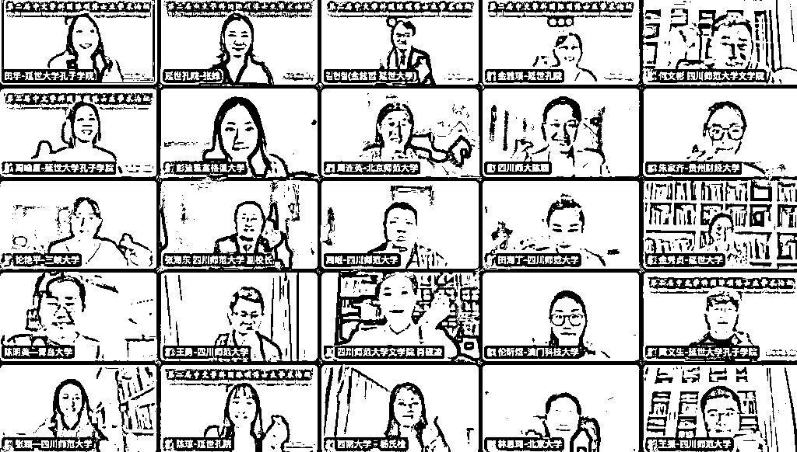
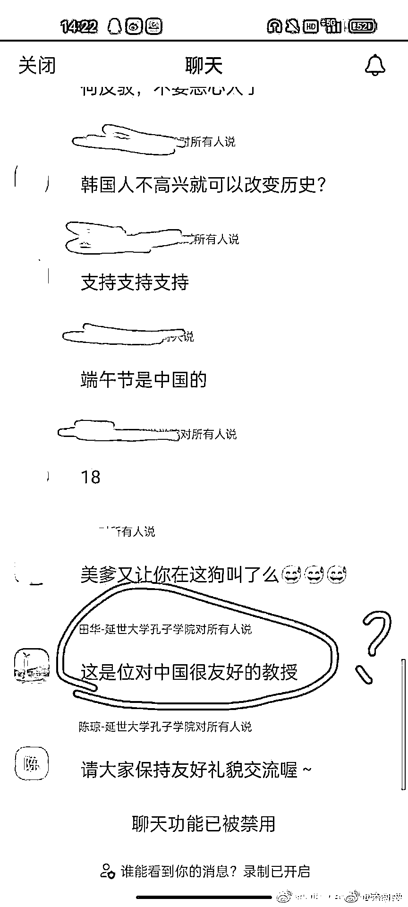

# 中秋是个韩国节？我怒了！

> 原文：[`mp.weixin.qq.com/s?__biz=MzIyMDYwMTk0Mw==&mid=2247544534&idx=2&sn=febffa484e56c3f4e214fb1513758303&chksm=97cbe5eea0bc6cf8a86d5caa08528ae63fca831b6346bc2bea259338804661e9c70d0a6d6a81&scene=27#wechat_redirect`](http://mp.weixin.qq.com/s?__biz=MzIyMDYwMTk0Mw==&mid=2247544534&idx=2&sn=febffa484e56c3f4e214fb1513758303&chksm=97cbe5eea0bc6cf8a86d5caa08528ae63fca831b6346bc2bea259338804661e9c70d0a6d6a81&scene=27#wechat_redirect)

9 月 24 日，四川某师大与韩国延世大学孔子学院组织的一个视频讲座，引起轩然大波。一、中韩文化交流讲座，韩国教授发言引发热议这名教授是韩国具有相当知名度的大学教授，他在中国的头衔也不少：北京大学博士，知名周刊特约记者、凤凰卫视评论员。在演讲中，韩国教授主要有两个表述引发了激烈的争论。第一：这名韩国教授表示，韩国的端午节和中秋节都是来源于韩国本土，属于不折不扣的韩国传统民族节日。奇葩的是，他表示中国人不要谈论这些，谈论这些会让韩国人不高兴。 这就奇怪了，既然是中韩文化交流，为何对“文化冲突”避而不谈，是不是只打算给中国人“洗脑”？第二：韩国教授认为萨德系统在韩国进行部署非常正常，是为了保卫韩国。此外，这名教授还主动提及中国抗日历史，表示历史记录不准确。这与网络上，大学教授认为南京大屠杀人数不准确有异曲同工之处，在没有调查的基础上，对中国人民的血泪历史进行曲解。二、中方老师行为再起争议：这只是中韩文化交流的误会学校的翻译老师在听到这些言论后，并未停止翻译，而在座的老师也未提出质疑。听到这名韩国教授的演讲之后，一些同学在视频评论区提出了自己的疑问，评论区马上被关闭了。一名学校女教师出面与同学沟通，但是在解释中同样引发了争论。后来证实这名女教师是延世大学孔子学院中方院长、该校的教授。因为无法评论，一名学生情绪激动开麦，言辞激烈。这名老师向韩国教授道歉，表示已经知晓了这位同学的名字，事后会和他好好“交流”。不知道是怎样的“交流”？批评、处分、是保研、评奖没有资格了，还是什么？在面临激情开麦后，韩国教授表示，“大人不计小人过”（这句话从他自己口中说出，不知道他是没有完全理解中文，还是足够傲慢）。这位“极具气度”的教授在讲座结束时表示，希望韩国的孩子越来越好，并未祝福中国的莘莘学子。是不是真的大度，由此可见。讲座即将结束时，又有一位男同学开麦连线，这位同学情绪稳定，礼貌地请韩国教授和学校老师对讲座中的不当言论作出解释。那位女老师并没有回答他的问题，而是非常严厉的批评了他自己开麦的行为不符合程序正义。 这名女教师针对同学的质疑表示：第一，举行文化讲座的目的是希望学校的同学有机会与国外学者交流，从中了解国外文化，尤其是韩国文化。第二，有些同学不能因为对中韩文化不了解而产生错误的情绪，这实际上只是一个沟通交流产生误会的问题。第三，既然对韩国教授的演讲有不同的意见，在提问环节为什么不主动提问，为什么不看视频讲座开始之前的温馨提示。同学则反驳道，整个讲座从来没有给自己提问的机会。从掌握的资料上看，延世大学孔子学院属于该校领办，是与延世大学合作设立一所文化机构，用来满足韩国学生学习汉语的需求。三、争论焦点：这是基本原则问题还是交流误会问题？关闭视频会议之后，在社交平台上，关于这个讲座的争论持续进行。围绕“到底是基本原则问题还是交流误会问题”，展开了激烈的争论。一些网友认为，关于中秋节、端午节的来源问题，看上去是一个节日起源问题，实际上是一个文化起源的原则问题。“现在居然都开始请韩国人到我们国家的高校来大谈中秋端午来自韩国，这实在是太离谱了吧。”“孔子学院应该对外文化输出，怎么到最后却变成了被韩国人输入文化洗脑了？”“原来为了在外的声誉可以放弃我们的尊严立场，某些大学真是让我开眼界了。”另外一些网友认为，这就是一个文化交流的误会问题。“韩国人与我们看问题的立场不同，大家应该互相尊重不同意见，否则就没法交流了。”“站在各自立场上发言，我们从我们的角度看问题，韩国教授自然是从韩国的角度看问题。”还有网友对于网上舆论针对该大学的老师表示不解。 “说错话的是韩国教授，怎么大家把矛头全部对准老师和学校了。”“学校为了海外的孔子学院传播中华文化付出了很多，包括一些老师都牺牲在海外，中韩文化交流这种线上会议更是和平进行了 20 多年，无法理解个别网友不了解事实一顿乱骂的态度。”对此，不得不说，30 多年前，资产阶级自由化思潮泛滥成灾，时至今日，特别是近十年来，舆论场发生了翻天覆地的变化。

学校邀请外国人搞讲座，属于正常的文化交流，没毛病。但是，讲座的主题，讲座的过程，讲座的效果或后果，应该可控吧？在明知外国教授有不当言论时，旁边的老师，该做什么，难道心里没数吗？不仅不制止，还批评和威胁提出质疑的同学，事后又道歉又私聊的做法，非常不妥。韩国教授已经明确提出，端午节和中秋节是韩国的，不知道现在你们是否也想要表述一下自己的看法？学生们有清醒的头脑，有坚定的立场，能勇敢地站出来，老师难道还没有学生懂得历史，懂得悍卫自己的国家？大学老师不应该得软骨病，为什么学生没跪，学校却先跪了？老师不能去坚持正义正确的理论方向，对这种歪曲历史的人都不敢提出批评，在大是大非面前没有警觉，可悲、可怕！

[`mp.weixin.qq.com/mp/readtemplate?t=pages/video_player_tmpl&action=mpvideo&auto=0&vid=wxv_2592222865605918724`](https://mp.weixin.qq.com/mp/readtemplate?t=pages/video_player_tmpl&action=mpvideo&auto=0&vid=wxv_2592222865605918724)

欢迎关注灰产圈社群服务号

