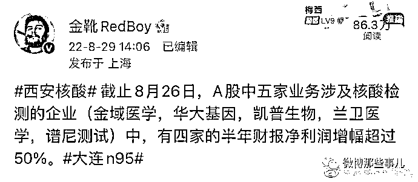

# 检出阳性未上报，石家庄一核酸检测机构被立案侦查，又是这家和合！

> 原文：[`mp.weixin.qq.com/s?__biz=MzIyMDYwMTk0Mw==&mid=2247544534&idx=4&sn=c9461c12f9f7fe8c705adba277a45116&chksm=97cbe5eea0bc6cf8b4f0beac71f8b06e7e6642040e18d6c7ab929c02243eabcfd974ab5ea4bf&scene=27#wechat_redirect`](http://mp.weixin.qq.com/s?__biz=MzIyMDYwMTk0Mw==&mid=2247544534&idx=4&sn=c9461c12f9f7fe8c705adba277a45116&chksm=97cbe5eea0bc6cf8b4f0beac71f8b06e7e6642040e18d6c7ab929c02243eabcfd974ab5ea4bf&scene=27#wechat_redirect)

疫情期间，最赚钱的要数核酸检测企业了 

今年频频爆出核酸检测实验室，发现阳性未上报，导致疫情暴发时间越来越长。

昨天，河北石家庄警方就通报了一起核酸检测实验室发现阳性未上报事件。 

细心的网友发现，又是和合医学！今年 4 月在合肥被取缔业务的“假阳性”机构——合肥和合医学，也是和合医学旗下第三方检测机构。

沈阳的和合在今年也被查处过问题

无论是以前的合肥和合，还是沈阳和合，以及这次的石家庄和合，大股东都是北京和合。

网友一查，这个人真牛呀！这个公司的法人刘志刚，在北京、深圳、郑州、黑龙江、沈阳、昆明、吉林等地方都有医学检验实验室，其他地方是不是也查一查核酸相关的东西呢

* * *

成都市精神内科副主任:让石家庄朋友先骂

倦了的是你:当利润达到 10%时，便有人蠢蠢欲动；当利润达到 50%的时候，有人敢于铤而走险；当利润达到 100%时，他们敢于践踏人间一切法律；而当利润达到 300%时，甚至连上绞刑架都豪不畏惧。

永华的小菜园:【检验机关发现混管阳性未上报】对这样的检验机构，除了追究刑事责任，经济上也要重重地处罚！

来源：微博那些事儿

欢迎关注灰产圈社群服务号

