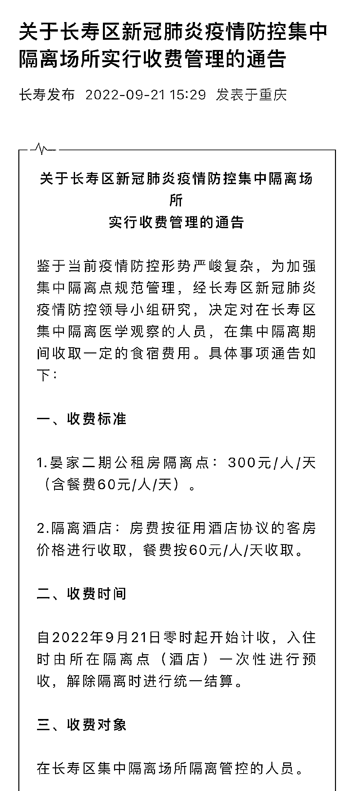
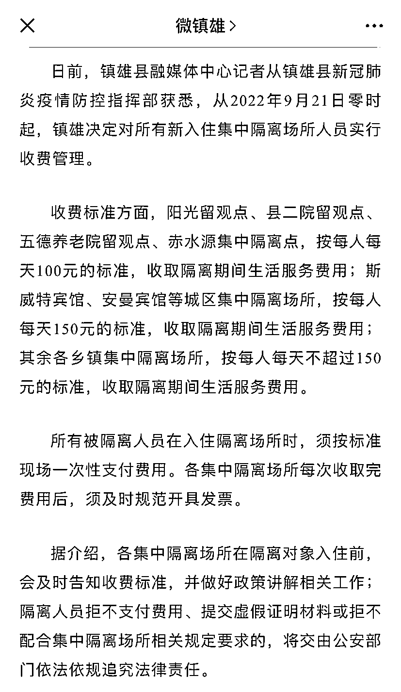

# 每天收费 300 元，集中隔离不能成了生财之道

> 原文：[`mp.weixin.qq.com/s?__biz=MzIyMDYwMTk0Mw==&mid=2247544534&idx=5&sn=1e6c77dbabf1481016ca8f76c1ab1779&chksm=97cbe5eea0bc6cf881633664eb4f4cc399cfbf23242532ba0d3aab5e79361fc9a3c014c4e583&scene=27#wechat_redirect`](http://mp.weixin.qq.com/s?__biz=MzIyMDYwMTk0Mw==&mid=2247544534&idx=5&sn=1e6c77dbabf1481016ca8f76c1ab1779&chksm=97cbe5eea0bc6cf881633664eb4f4cc399cfbf23242532ba0d3aab5e79361fc9a3c014c4e583&scene=27#wechat_redirect)

导读

据媒体报道，重庆长寿区从 9 月 21 日零时起，对辖区内新冠疫情集中隔离点实行收费管理，公租房隔离点为 300 元/人/天（含餐费 60 元/人/天），酒店征用为隔离点的按协议价收取，另收同等价格餐费。另外，从同一天开始，云南昭通市镇雄县也对所有新入住集中隔离点的人收费，费用在 100-150 元/人/天。（Jlls）

尽管同样是收费，两地在政策上略有不同。镇雄县是向所有隔离对象收费；长寿区在收费时规定了豁免条件，本区户籍人口、在本区缴纳社保或购房并实际居住人员、医生和学生等可享受费用减免。两地一致规定，对于拒不支付隔离费用或提供虚假证明材料的，“交由公安部门追究法律责任”。

隔离收费不是新鲜事，但近三年来各地在执行中没有统一起来，常见的隔离收费对象是回国入境人员、国内旅行流动人员等，对于配合密接或次密接人员一般都是免费隔离，对于配合社会面清零而采取集中隔离的小区居民也是免费。一句话概括，免费是常态收费是特例，但这个情形可能正在改变。

重庆和云南面向隔离人群的收费新政，激起了广泛的舆论影响。因为两地在宣布隔离收费的措施时，都没有说明收费原因，这引起了许多猜测。这些猜测集中在地方财政的承受力上，但也只限于猜测。人们最不安的是，政策动机不明，隔离收费的后果难以预料，一旦各地群起仿效，极易导致不好的局面。

综合重庆长寿区的收费政策，收费对象其实主要是外地人和流动人口，这种区别对待的收费政策，就将人分出三六九等，尤其是对非户籍人口不友好，潜在包含着驱离效应。直接的后果就是，人们将长寿区视作“禁区”，考虑到重庆其他县区可能采取的跟进动作，将进一步地削减重庆片区的人员流动性。

隔离政策所影响的流动性，也许早早地被排除在政策考虑之外，但对需要前往隔离收费地区出差办事或在当地讨生活的人来说，就是相当沉重的打击和负担。一个更加不确定的因素是，伴随着静默政策的隔离期间，有的短，有的长，谁都说不准，预估隔离费用有点难，它很可能变成很多人无法承受的经济负累。

以上合理担忧的前提是，承认隔离确有必要，收费隔离即使不明说理由，本着公心，人们相信它具有一定的正当性。然而公众还有一种担忧，怕的是当隔离收费成为有利可图的生意，有人会利用政策便利从中渔利，将隔离对象变成源源不断的财源。

重庆利用公租房作为隔离点，收取每人每天 300 元的费用，这种公租房收益相当高了。同样的价格放在当地酒店业者面前，也足够激发后者把酒店征作隔离酒店的积极性。以镇雄县的经济现状，每人每天最高 150 元的隔离收费，也是相当可观。所以人们有理由担忧隔离收费有可能迅速编织利益网，激发牟利意图。

一个很简单的道理是，如果一个谋利方式可以带来较大的经济收益，相关的利益团体就很难放弃这一生财之道。甚至于会利用关系影响政策，让政策为他们的生意保驾护航。具体来说，隔离收费一旦成为生意，会不会有人不想“疫情”停下来？

当然，目前这些担忧还只是合理推测。这种推测的合理判断，建立在隔离收费政策的诸多含糊特性上——从政策目的、具体执行到政策评估，它们都缺乏必要的透明度和公开性。公众立足被集中隔离人员的义务和权利，本着对疫情前景的分析，从多个层面推敲隔离收费政策的后果，得出一些不乐观的结论，并不算过分。

总之，地方对集中隔离人员实行收费管理，已经被重庆云南等地的基层行政摊开在台面上，隔离收费是该算经济账，还是该算社会账，成为公众聚焦的问题。另外，隔离收费的依据、收费多少及期限涉及行政收费的程序是否合法，都需要更高层级的行政机构加以明确。人们的所有担忧，就是如何让隔离收费成为一本明白账，而不是一本糊涂账，更不是在这个时候提倡“难得糊涂”。

来源：狐度观察，景来律师

欢迎关注灰产圈社群服务号

