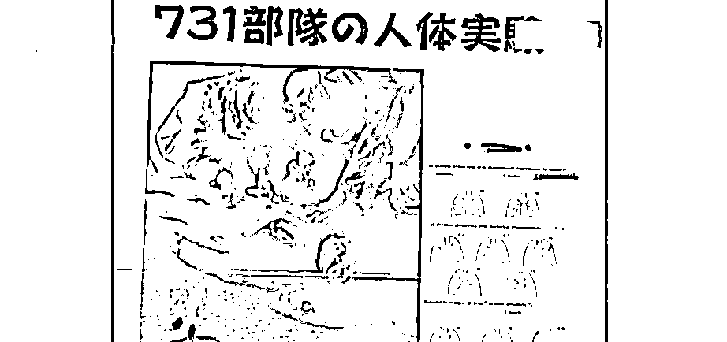

# 用幼儿制作标本！日本老兵揭露 731 部队滔天罪行

> 原文：[`mp.weixin.qq.com/s?__biz=MzIyMDYwMTk0Mw==&mid=2247544534&idx=6&sn=1dd8210bb45a0ceebe26ded26cb2297d&chksm=97cbe5eea0bc6cf826cab89b0521b4fdf1b158d9a92f0ea3cdf1ef0d555b6852ee6a5435c378&scene=27#wechat_redirect`](http://mp.weixin.qq.com/s?__biz=MzIyMDYwMTk0Mw==&mid=2247544534&idx=6&sn=1dd8210bb45a0ceebe26ded26cb2297d&chksm=97cbe5eea0bc6cf826cab89b0521b4fdf1b158d9a92f0ea3cdf1ef0d555b6852ee6a5435c378&scene=27#wechat_redirect)

侵华日军 731 部队

在中国发动惨无人道的细菌战

其累累罪行却被刻意掩盖隐瞒 

近日

记者采访前 731 部队老兵

揭露恶魔部队滔天罪行

**日本老兵揭露 731 部队罪行** **将幼儿胎儿制成标本** 

清水英男，今年 92 岁，住在长野县的一个村子里，几十年来经营着一家小型建筑公司。2016 年，一个偶然的机会，家乡人知道了他一直不为人知的另一个身份，当年 731 部队的一名士兵。

记者来到了清水英男的家中。面对镜头，清水英男回忆起了当年那段罪孽深重的经历。

1945 年 3 月，14 岁的清水英男初三没毕业，就在老师的推荐下，作为见习技术员加入了 731 部队，随后被派驻到中国哈尔滨的 731 部队总部。正式工作第一天，他在实验室中看到很多人体器官标本被泡在液体中。

清水英男说：“他们告诉我这是解剖俘虏做成的标本，但我看到的有幼儿、有妇女腹中的胎儿。**我印象深刻的是幼儿标本，为什么他们要做这些惨无人道的事，真是太残忍了。”**

在短短几个月的时间里，清水英男在 731 部队的所见所闻，让他夜里难以入睡，噩梦不断。 

**“那时的确做过活体解剖，不注射任何麻药就进行解剖。**我虽没有亲眼见过，但很多当时在现场的人说过这是事实，不给打麻药就活剥（人皮）。”清水英男回忆。

[`mp.weixin.qq.com/mp/readtemplate?t=pages/video_player_tmpl&action=mpvideo&auto=0&vid=wxv_2581697006533050371`](https://mp.weixin.qq.com/mp/readtemplate?t=pages/video_player_tmpl&action=mpvideo&auto=0&vid=wxv_2581697006533050371)

**日本老兵忏悔罪行** **“我要向中国人民道歉”** 

1945 年日本投降前夕，为掩盖罪证，731 部队在离开中国前炸毁了实验室和监狱，屠杀了所有被关押的囚犯，并集中焚烧了尸体。清水英男当时负责销毁证据，并被要求严格保守秘密。 

**70 多年以后，年迈的清水英男决定打破沉默，为 731 部队和自己当年犯下的罪行向中国人民道歉。**

清水英男表示：**“我要向中国人民道歉，日军在中国做了那样惨绝人寰的事。战争结束后，中国人民竟然还抚养日本人的孤儿，真的非常感谢中国人民。日本人必须向中国人民道歉，忏悔罪行。”**

**美日肮脏交易** **隐瞒 731 部队罪恶** 

**1931 年到 1945 年期间，731 部队以进行骇人听闻的人体实验和细菌战等在中国犯下滔天罪行。**数千名中国、苏联、朝鲜战俘和中国平民被用于人体细菌和毒气实验。 

然而，战后这些罪行却没有受到追究，很多战犯战后还在日本的一些公立机构担任要职。日本政府也对 731 部队受害人及其后人的控诉视而不见，还通过修改历史教科书的方式企图将这段历史从日本民众的记忆中抹去。

战争罪行被掩盖起来，除了日本政府的刻意隐瞒，美国的包庇也难辞其咎。为了获取生物实验数据，美日之间达成了秘密交易。**美国以豁免 731 部队战犯的战争责任为条件，向世界隐瞒其滔天罪恶，从而换取 731 部队进行人体实验、细菌实验、细菌战、毒气实验等方面的数据，并为此支付了 25 万日元。**

这些数据和资料，包括大量 731 部队的实验报告书，以及 8000 多张有关用细菌武器作活人试验和活人解剖的病理学标本和幻灯片等。

2017 年 8 月，日本某电视台播放的纪录片显示，在美国的庇护下，731 部队成员几乎没人因为他们的罪行受到过任何惩治。而美国获得这些血腥的数据资料后，加以利用，进行生物武器研究，促使某些生物实验室快速发展壮大，成为今天美国军方的 P4 生物实验室。

来源：央视军事综合 CCTV-13《新闻直播间》

欢迎关注灰产圈社群服务号

