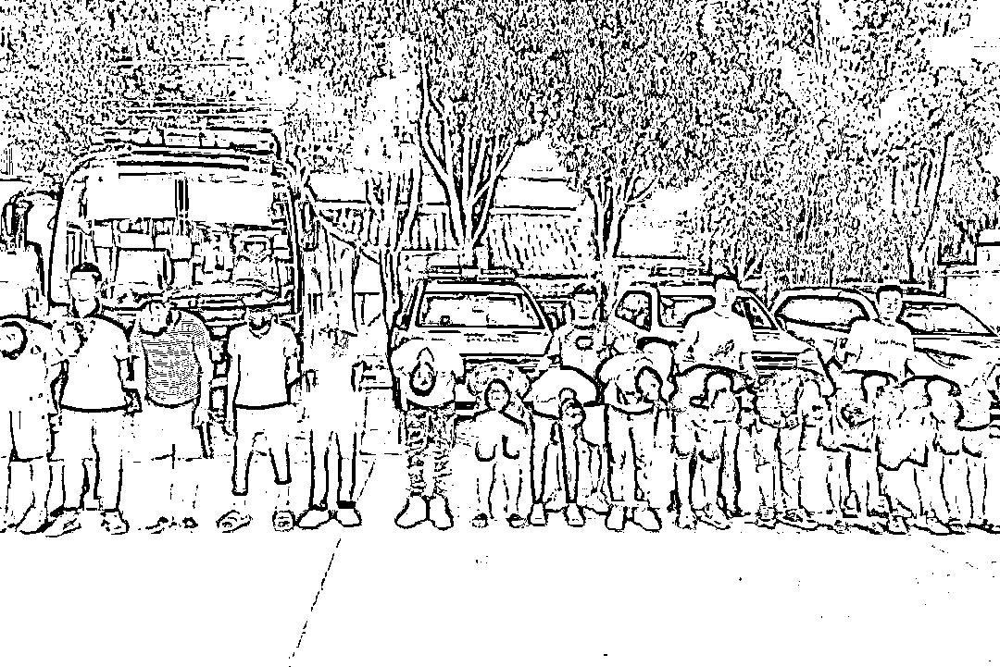
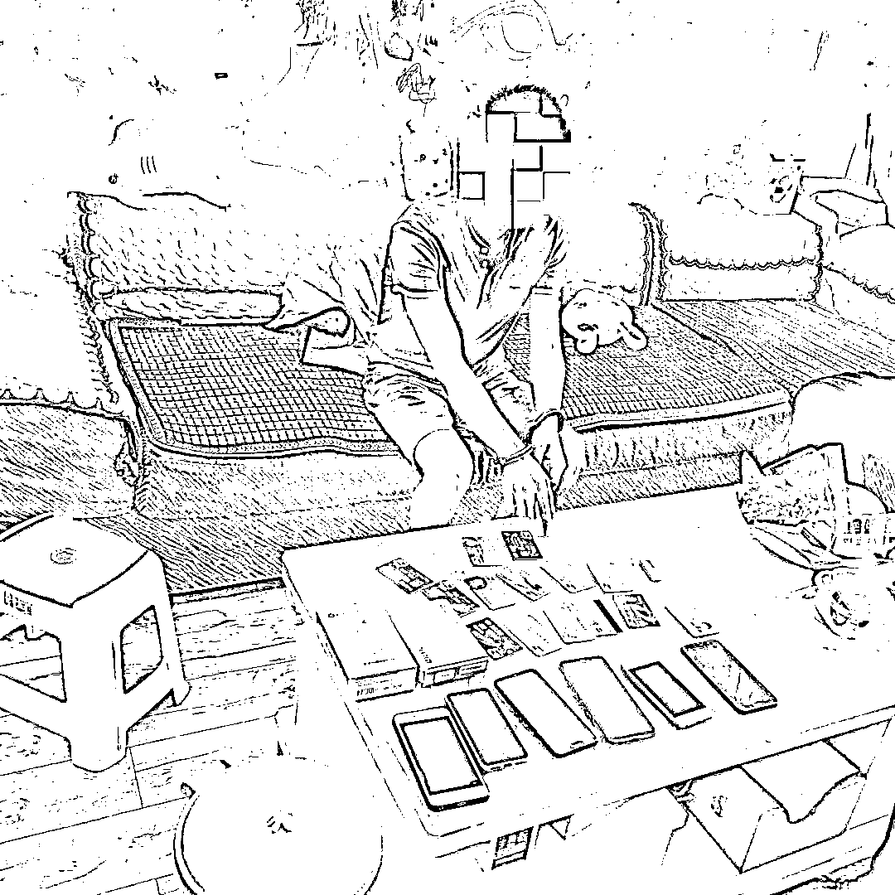

# 警方侦破全国首例深挖出以“演示网站”为桥梁的网络赌博犯罪团伙链条

> 原文：[`mp.weixin.qq.com/s?__biz=MzIyMDYwMTk0Mw==&mid=2247544534&idx=7&sn=5ad67d736f0a34644fdfd0565b14db70&chksm=97cbe5eea0bc6cf814f614d91e7b593a0d12785c2aea6f9dffea3487403b5f2dbdb21fbd9cbe&scene=27#wechat_redirect`](http://mp.weixin.qq.com/s?__biz=MzIyMDYwMTk0Mw==&mid=2247544534&idx=7&sn=5ad67d736f0a34644fdfd0565b14db70&chksm=97cbe5eea0bc6cf814f614d91e7b593a0d12785c2aea6f9dffea3487403b5f2dbdb21fbd9cbe&scene=27#wechat_redirect)

夏季治安打击整治“百日行动”开展以来，浙江绍兴诸暨网安部门严厉打击整治网络赌博类违法犯罪，**深挖出一个以“演示网站”为桥梁的网络赌博犯罪团伙链条。**

此类“演示网站”下游吸引赌博 APP 运营团队，上游对接技术开发团队，已形成较为完整的黑灰产业体系，危害巨大。线索上报后由公安部网安局牵头在全国发起集群战役，**目前已立案 13 起，打击处理违法犯罪嫌疑人员 100 余人，涉案金额高达 1.18 亿元。**

**抓捕现场▼**

**计算机人才却“捞偏门”**

今年 28 岁的王某，是国内某院校计算机系毕业生，也是本次被警方打击的团伙里负责开发赌博软件的重要嫌疑人。

据王某供述，大学毕业后他干过一段时间销售，想到在校期间自己成绩优异，舍不得放弃老本行，最终还是选择创业。2020 年中，王某成立了四川某网络科技有限公司，经营软件开发业务。

机缘巧合，王某认识了经营赌博“演示网站”的尹某某，**所谓演示网站，就是将各类赌博 APP 陈列在网页上供赌博运营者试玩、挑选，顾客再按需购买。**

为了挖掘更多潜在顾客、增加营业额，尹某某想联合王某给购买赌博 APP 的顾客提供私人订制服务，满足顾客个性化需求。尹某某有客户，王某有技术，两人当即一拍而合，由王某公司为在“演示网站”上下单的顾客**“优化”各类赌博 APP，并提供服务器搭建、后台运维等服务。**

短短一年时间，王某的网络科技公司已开发“星 X 娱乐”“金 X 城”“百 X”等**40 余款涉赌 APP，按每个平台收取 2.5 万至 10 万元不等的服务费，非法获利高达 100 余万元。**

**银商夫妻的****“逆袭”之路**

赵某某夫妇是公安机关抓获的赌博 APP 运营商，夫妻二人原先就在一家经营网络赌博游戏公司上班做代理，负责给赌客上下分。一年的工作经历让夫妻二人渐渐懂得了银商、控分、上下分等概念。后赵某某夫妇辞职回了老家，利用之前的工作经验干起网络赌博游戏代理（俗称银商）。

银商做久了，赵某某夫妇不再满足于每月几千元收入，想事业“逆袭”一把做点大的，自己做赌博 APP 运营老板去发展银商下级。

**2021 年 10 月，赵某某夫妇花 5.06 万元在“演示网站”上订制了一款赌博 APP，**自行命名“金 X 城”，两人通过微信、QQ 添加各种群聊，在群里疯狂发布广告提高自家赌博 APP 的知名度，吸引更多的赌客和银商加入。

**赵某还巧妙设计了充值渠道，赌客不能在 APP 上直接充值，得向银商购买金币才能上线玩游戏。**这样一来，吸引了更多银商谈合作，并主动去拉揽赌客，短短几个月里，赵某夫妇就赚得盆满钵满。

从赌博网站的“打工人”到“运营老板”，看似实现了人生逆袭，其实是将自己推入违法犯罪的深渊。

**黑灰产业链中的掮客**

警方在收网时发现，赌博网站已经从软件开发、运营购买到银商、赌客，形成了一条完整的网络赌博灰色产业链，还有犯罪分子专门做起了中介掮客，比如本案中“演示网站”经营者尹某某，就是这个身份。

据尹某某自己交代：“我对网络赌博陷得很深，我自己也在赌博，**玩着玩着我就发现有人想做赌博网站老板，有人会做赌博 APP，我何不就做他们中间的卖货平台赚差价。” **

尹某某一直都是网络赌博的爱好者，自己也在网络上认识一些网络赌博软件开发商，2020 年在帮忙给赌博 APP 运营商做了几次中间人开发赌博软件赚取了中间费后，尹某某看到了新的商机，就此正式开启了他的网络赌博 APP 开发中介事业。

为了扩大版图，更好的发展中介事业，2021 年 5 月尹某某找来了他的高中同学陈某，一起合伙注册了一家科技有限公司，**搭建了一个涉赌 APP“演示网站”，相当于一个贩卖赌博 APP 模型的网上超市。**

网站上展示上架了“房卡”类、“金币”类 20 余款涉赌样本软件供运营商下载试用，在吸引到客户谈妥价格后，尹某某会寻找技术开发公司进行开发、定制涉赌 APP，开发完成后整体打包交由运营商自主运营，尹某某团队会收取游戏开发费用 30%-50%的中介费用。

**很多人幻想可以不用工作靠赌博发财一劳永逸，但现实都是十个赌徒九个输，倾家荡产妻离子散。**

**警方提醒**

网络赌博虽然没有实地的赌场、赌资或者玩家，但是它比传统赌博具有更严重的传播性，诱发着更多的违法犯罪活动，一旦沾染危害巨大。

沉迷网络赌博者往往因一个“贪”字，掉入不法分子设好的圈套，输得血本无归，甚至倾家荡产，希望广大群众时刻保持清醒，切勿沾染赌博恶习。如果您遇到了，请立即向警方举报。

来源：浙江网警

欢迎关注灰产圈社群服务号

