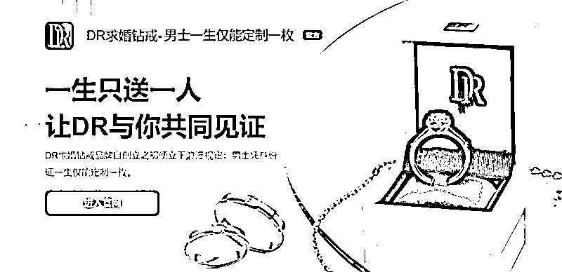
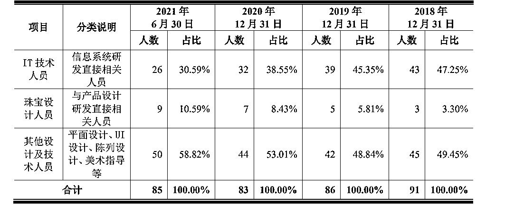

# 万元钻戒成本才 4 千？男士一生仅能买一枚，800 元能删记录？网友炸锅了，企业回应了

> 原文：[`mp.weixin.qq.com/s?__biz=MzIyMDYwMTk0Mw==&mid=2247544607&idx=5&sn=ad6c9ea474ac8a03ade6e2cb136f8c20&chksm=97cbe427a0bc6d3184d4abfdb14d6c8fa0850188e97c8e58a9e57804b6cbca5cceda64eeef82&scene=27#wechat_redirect`](http://mp.weixin.qq.com/s?__biz=MzIyMDYwMTk0Mw==&mid=2247544607&idx=5&sn=ad6c9ea474ac8a03ade6e2cb136f8c20&chksm=97cbe427a0bc6d3184d4abfdb14d6c8fa0850188e97c8e58a9e57804b6cbca5cceda64eeef82&scene=27#wechat_redirect)

围绕“男士一生仅能定制一枚”的钻戒品牌 DR 的相关话题，近日来引发网友关注。

此前有媒体报道称“DR 钻戒可删除购买记录”，9 月 25 日晚，DR 关联公司迪阿股份（301177.SZ）发布声明表示，声称“800 块即可删除 DR 购买记录”的淘宝店家发布不实消息已被下架处理，并强调 DR 钻戒需凭身份证购买，“记录永久不删不改”。此外，针对“DR 钻戒成本 4000 卖 1.5 万元”引发网友热议，9 月 26 日，DR 相关工作人员回应表示，“这样的理解是片面的，不应只看材料成本，还应看设计成本。”

**800 元就可以消除订单和购买记录？**

南都记者了解到，近日有报道指出，淘宝上的一家店铺声称 800 元就可以消除 DR 订单和购买记录，如果加急的话需要 1600 元。这与 DR 此前多次承诺“男士一生仅能定制一枚”，“相关信息终生不可删除和修改”的信息相悖，相关话题随即引发网友关注。

9 月 25 日晚，DR 关联公司迪阿股份（301177.SZ）就事件发布澄清声明表示，声称“800 块即可删除 DR 购买记录”的淘宝店家，是发布了不实消息，已被淘宝官方下架处理。迪阿股份强调，DR 钻戒需要用户持身份证购买，需要通过短信验证或人脸识别验证，相关购买信息会上传至 BSN 区块链，所有购买记录不可篡改，永久不可删除。

9 月 26 日，南都记者从相关电商平台检索“DR 删除购买记录”等关键词，发现平台上有关于销售 DR 删除购买记录服务的店铺均已下架。上述声明中，并未对此前网友热议的“DR 钻戒成本 4000 元卖 1.5 万元”的话题作出回应。

南都记者此前梳理迪阿股份 2021 年招股说明书发现，2018 年至 2021 年上半年，DR 的毛利率分别为 69.82%、70.21%、69.37%和 70.00%，即使与位列第二名的同行业可比公司相比，毛利率依旧高出至少 10 个百分点。此外，根据 2022 年中报显示，DR 上半年整体毛利率为 70.63%，较上年同期再增长 0.63%。对比之下，周大福今年上半年毛利率为 23.4%，周大生今年上半年毛利率约 22.16%。

而从具体产品的毛利率来看，2021 年上半年，其销售收入排名第一的产品 FOREVER 系列简奢款，成本仅为 4000 元左右，售价却高达 1.5 万元，毛利率超过 72%。9 月 22 日，“DR 钻戒成本 4000 卖 1.5 万”的话题刷上微博热搜。

此外，根据迪阿股份 2021 年招股书中披露，2018 年至 2021 年上半年，内部设计师人数分别为 3 人，5 人、7 人和 9 人 ，至 2021 年上半年，该公司 34 个新增款式中，内部设计师设计的数量仅为 2 款，其余均为合作厂商设计。

9 月 26 日，南都记者再就该话题联系 DR 方面，相关工作人员回应称，“DR 钻戒成本 4000 元卖 1.5 万元的理解是片面的，不应只看材料成本，还应看设计成本，DR 汇聚了全球知名的珠宝设计师，打造珍爱珠宝作品。”但对于内部设计师人数仅 9 人的情况，则未予回应。

**曾有产品因“标识错误”被认定为不合格**

据国家企业信用信息公示系统数据显示，迪阿股份成立于 2010 年 4 月，注册资本 4 亿元，法定代表人为张国涛。据其官网资料显示，目前，DR 全球直营店约 400 家，总部位于深圳。DR 旗下产品涵盖求婚钻戒、结婚对戒、套链、项链、吊坠、手镯等，通过线上官网、第三方销售平台、线下直营体验店进行售卖。

迪阿股份曾在招股书中，解释毛利率如此之高的原因，称是因其“品牌内涵”。迪阿股份称，公司“一生只送一人”的购买规则，很好地契合了婚恋人群对于爱情专一性的追求，进而与竞品形成了有效区隔，赋予了公司产品一定的溢价空间。因赋予 DR 品牌“独一无二”的稀缺性，支撑着其销售价格以及高毛利率。

南都记者注意到，根据迪阿股份 2021 年招股书中披露，2018 年至 2021 年上半年，内部设计师人数分别为 3 人，5 人、7 人和 9 人 ，至 2021 年上半年，该公司 34 个新增款式中，内部设计师设计的数量仅为 2 款，其余均为合作厂商设计，故 DR 销售收入的主要来源为合作厂商选款的款式，平均占比达到 83.8％。

此外，DR 钻戒的品质也难以得到完全保障。根据迪阿股份招股书披露，2017 年至 2019 年，三年期间，在检测过程中，迪阿共有六批次产品被发现加工商自配的副石并非天然钻石而是合成石。2018 年和 2019 年抽检过程中，分别有两批次抽检产品被发现贵金属含量低于合同约定标准。2020 年，蚌埠市市场监管局第一季度市级监督抽查情况报告显示，其两款产品因“标识错误”被监管认定为不合格产品。

报告期内，迪阿已因产品质量不合格被退货 23 次，累计金额为 16.75 万元；收到工商部门、消费者协会等涉及产品质量、售后服务的消费者投诉 38 起，客服投诉 476 起。产品质量问题涉及钻戒轻微擦痕、小钻容易脱落、戒托出现变形等。

**曾被曝存在顾客隐私泄露等问题**

即使 DR 极少自主设计产品，且品质也曾被质疑，但无碍迪阿股份在过去数年的快速发展。其 2021 年的招股书显示，迪阿股份的营业收入从 2018 年的 15 亿元增长至 2020 年的 24.64 亿元，2021 年上半年，营业收入达 23.20 亿元，接近上一年全年营业收入的水平。2021 年 12 月 15 日，迪阿股份成功在深圳创业板挂牌上市。

值得注意的是，迪阿股份在品牌塑造的路上曾出过不少岔子。早在 2017 年 11 月，DR 被沃尔弗斯珠宝告上法庭，被判立即停止实施针对原告的虚假宣传行为，并向原告赔偿经济损失及合理费用 20 万元。

2018 年 6 月，DR 钻戒因曾宣称隶属于香港戴瑞珠宝集团，与事实不一致，被深圳罗湖市场监督管理局处罚；2018 年 10 月，又因宣传广告内容问题，又被北京市工商行政管理局大兴分局处以 3 万元罚款。

近年来，DR 品牌随着“一生只送一人”的营销而名声大噪的同时，也让其屡陷舆论风波。

根据 DR 官网相关规则显示，DR 所有珠宝均一生只送一人，DR 钻戒被视为“用一生爱一人”的真爱承诺开启，DR 不支持买给自己、朋友或亲人，也不支持女士订购。首次购买产品时要求购买者提供所在国家或地区的身份 ID 信息，该信息与 DR 求婚钻戒产品绑定，购买人需签署《真爱协议》，自愿提交产品受赠方姓名与相关信息，以明确说明购买者将 DR 求婚钻戒产品赠予谁，此信息接受官网验证查询。且相关信息终生不可删除和修改。

早在 2021 年迪阿股份上市前，DR“一生只送一人”“男士一生仅能定制一枚”等宣传语，就曾被深交所问询是否存在涉嫌虚假宣传的风险。DR 方面当时回复称，相关理念不存在虚假宣传的风险，但存在被模仿、复制的风险，公司严格执行“一生只送一人”的购买规则，除升级换款和补购外，不存在一人多次购买求婚钻戒的情形。

据南都此前报道，去年 11 月，有网友称其通过 DR 钻戒“真爱验证查询”系统，查询到多名流量艺人被曝已购买 DR 钻戒。多名艺人先后发文否认购买该品牌钻戒，并称其个人信息被冒用，从而引发 DR 钻戒存在顾客隐私泄露风险的质疑。

今年以来，迪阿股份的增长势头明显放缓。据迪阿 2022 年中报显示，今年上半年，公司实现营业收入 20.85 亿元，同比下滑 10.13%；实现净利润 5.78 亿元，同比下滑 20.62%，营收净利首次出现双降。

来源：南方都市报 APP·南都即时

欢迎关注灰产圈社群服务号

