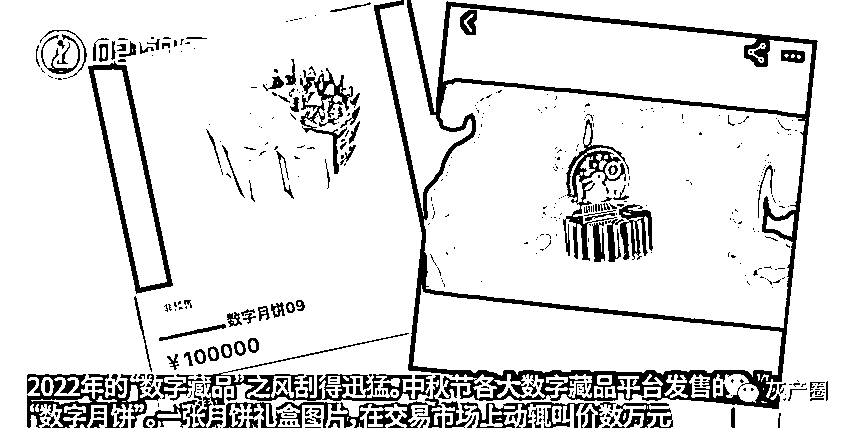
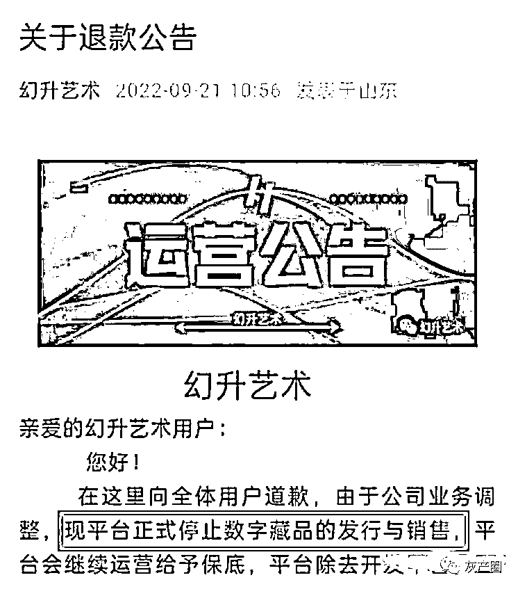
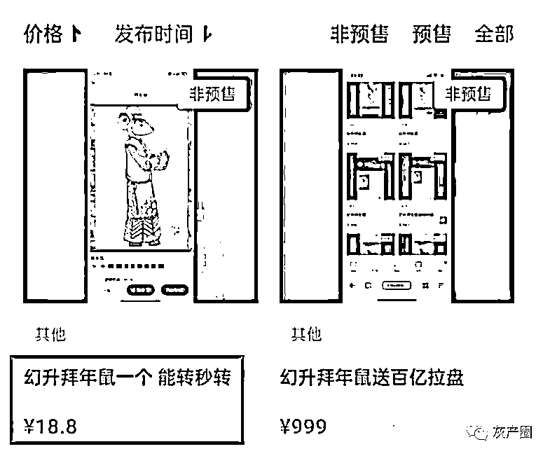
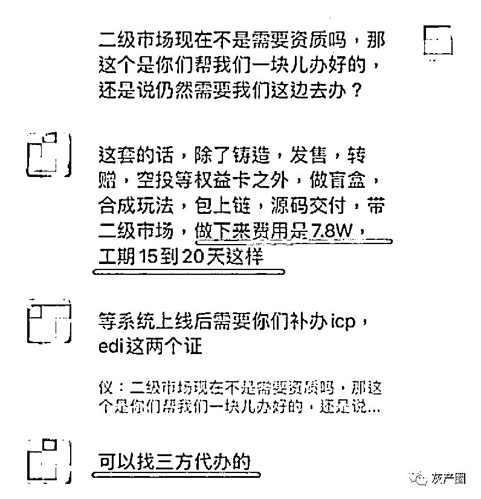
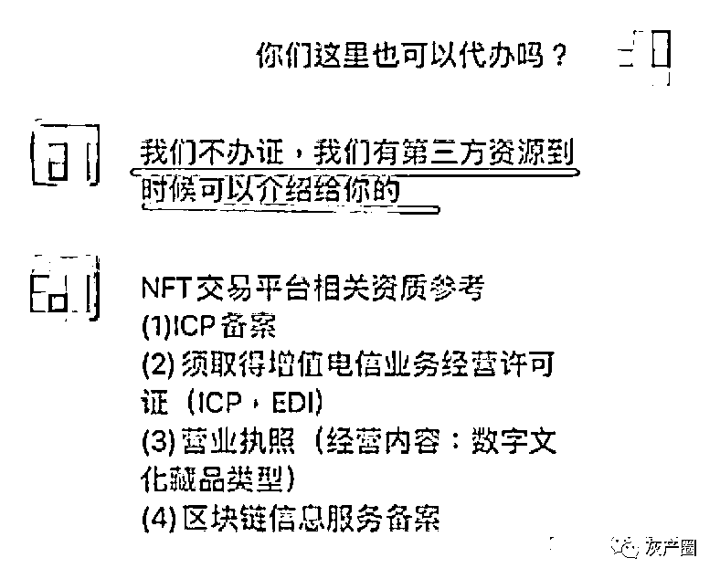
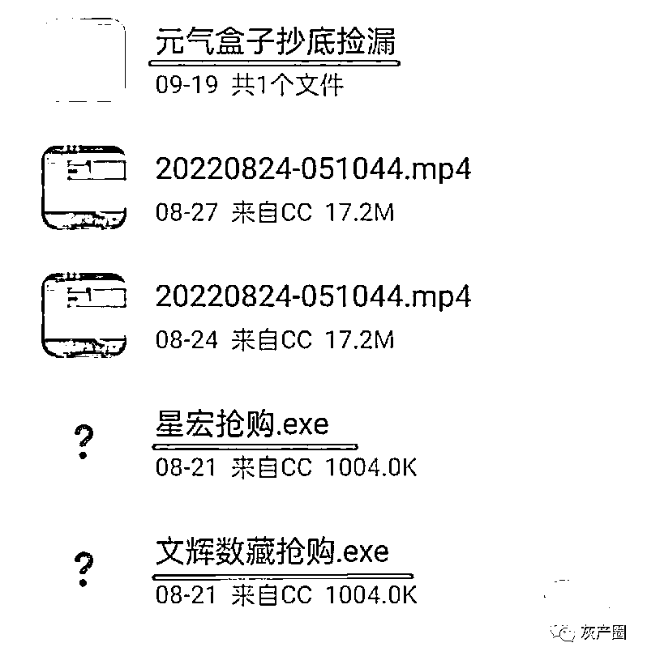
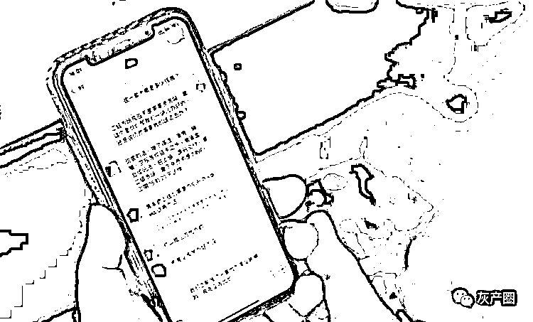

# 数字藏品“发疯”：最快 15 天搭建的平台能“一夜暴富”？

> 原文：[`mp.weixin.qq.com/s?__biz=MzIyMDYwMTk0Mw==&mid=2247544607&idx=6&sn=406564a0834e88430b7f137df150758c&chksm=97cbe427a0bc6d314209424c82e46ea0a5dc76d8fec93ec00fd7c689ae6ec41a0dee227b3081&scene=27#wechat_redirect`](http://mp.weixin.qq.com/s?__biz=MzIyMDYwMTk0Mw==&mid=2247544607&idx=6&sn=406564a0834e88430b7f137df150758c&chksm=97cbe427a0bc6d314209424c82e46ea0a5dc76d8fec93ec00fd7c689ae6ec41a0dee227b3081&scene=27#wechat_redirect)

亏了 20 万元后，数字藏品藏家“猫哥”(化名)马不停蹄地又在自己看好的新平台豪掷 30 万元，“这个台子能让我赚 50 万元。”他坚定地相信自己的选择。 

只要在数字藏品群里潜伏地够久，不难发现有这么一群人，即使是平台已经传出负面消息，藏品市场价格暴跌，他们依然幻想着“现在抄底，别墅靠海。”

只是，“数字藏品”的市场，真的能带来“一夜暴富”吗?

# **数字藏品平台扎堆暂停业务**

“半年工资都折进去了，真后悔。”意识到自己已经无力维系这场“交易游戏”，大学毕业一年的“逗号”(化名)只能告诉自己“再也不碰，好好工作”。

几个月前，“逗号”在朋友的推荐下，注册了数字藏品的电商平台 iBox 的账号，正式“入坑”。

“一开始确实赚了一些小钱。”可是，尝到甜头后，“逗号”手中的几个藏品市场价突然下跌，“很快就亏了大概 2 万元”。

[`v.qq.com/iframe/preview.html?width=500&height=375&auto=0&vid=u335761cnko`](https://v.qq.com/iframe/preview.html?width=500&height=375&auto=0&vid=u335761cnko)

▲视频：最快 15 天就能搭建数字藏品平台? 

对刚刚工作的“逗号”来说，2 万元并不是一个小数目，于是，他又投身于前段时间圈内大热的平台“十八数藏”，想多少回些本，结局却是“两边都折进去了”。

对于普通藏家来说，大平台的风险尚且不可控，小平台就更加让人雾里看花了。

9 月 20 日下午，“翼元 YY 数字艺术”发布“回收公告”称，停止数字藏品发行，将回收藏品，发放余额;9 月 21 日上午，“幻升艺术”发布公告，宣布平台正式停止数字藏品的发行与销售，将按照首发价的百分之八十进行回收;9 月 21 日下午，“荧核艺术”发布公告，将于 9 月 22 日起暂停数藏业务……短短几天，多家数字藏品平台突然宣布暂停数字藏品业务。

回过头翻阅“幻升艺术”官方 QQ 社群的聊天记录，也能发现一些端倪。

9 月 16 日，该平台管理员在社群内表示，平台遭受了不明人员的恶意攻击，正在抢修服务器。当晚，社群群主表示原定当日发售的数字藏品，时间将顺延至服务器维修完成。

9 月 17 日，平台管理员在社群内发布公告称，原定 9 月 18 日发售的藏品也暂停发售，并将停服一天……

▲“幻升艺术”发布的公告

而现在，该平台一边在公众号内宣布停止数藏的发行与销售，另一边平台管理员又在社群内解释称：“平台还继续运营，只是不做发新了，后面都是做‘空投’来进行运营，给大家一个保底机制，只是让大家知道幻升是一个负责任的平台，寄售只是为了退款暂时关闭。”

尽管如此，在数字藏品交易平台 X Meta 上，即便是“幻升”此前的大热藏品“拜年鼠“，市场价格也是一路走低。

记者发现，9 月 12 日至 14 日，“拜年鼠”在 X Meta 以 700 余元至 800 余元不等的价格大量成交。短短几日后，藏家挂出的“拜年鼠”价格已经跌至 100 余元至 200 余元，依然无人问津。截至 9 月 22 日，“拜年鼠”的价格更是跌至 18.8 元。

▲9 月 22 日，“拜年鼠”的价格跌至 18.8 元

这对于高位接盘的藏家来说，无疑是一大噩耗。

# **15 天便能打造数字藏品系统?**

记者通过“天眼查”发现，近日宣布停止数字藏品发售的平台，其主体公司集中成立于今年 6 月到 7 月——也就是说，从成立公司、上线平台、开通二级市场，到暂停业务、承诺退款，前后不过经历了短短两三个月，颇有些“来去如风”的架势。

# **一个“数字藏品”平台的成立，能有多快?**

8 月下旬，记者在“小红书”平台找到一家宣称能替人搭建数字藏品系统的科技公司，表示想在 10 月 1 日之前上线一款数字藏品平台。

该公司销售人员表示，时间来得及。她向记者推荐了一款平台模板，并宣称：“除了铸造、发售、转赠、空投等权益卡之外，还能做盲盒、合成玩法，该公司还包上链、源码交付，带二级市场。”

该销售人员表示，这样一套系统，做下来费用是 7.8 万元，工期大约是 15 到 20 天。

▲一家科技公司称，15 天到 20 天便能打造一套数字藏品系统

“系统上线后，还需要你们办理 ICP(电信与信息服务业务经营) 和 EDI(增值电信业务经营许可)两个证。”见记者有些懵，这名销售发来一段“NFT 交易平台相关资质参考”，表示上线数字藏品交易平台需要“(1)ICP 备案;(2)须取得增值电信业务经营许可证(ICP，EDI);(3)营业执照(经营内容：数字文化藏品类型);(4)区块链信息服务备案。”

当记者表示还没有营业执照时，该销售立刻热情地表示，无论是营业执照还是 ICP、EDI 两个证件，该公司都可以介绍第三方资源代办，“营业执照办的话也快，可以同期进行”。

▲该科技公司称，营业执照、ICP、EDI 均可代办

见记者还有些犹豫，这名销售人员介绍道，八九月正好是数字藏品的风口，最近找该公司开发系统的客户都有了不错的收益。说着，她发来一张“成功案例”的截图，图中的人表示：“88 的藏品，今天收到 50 万了，应该有几千个人充值了……”

# **“科技手段”已是公开秘密**

与上线一套数字藏品系统的“超低门槛”相对应的，是不少中小数字藏品平台堪忧的稳定性和安全性。

除了声称连续多日被攻击系统的“幻升”，许多平台也都查实过用户利用 BUG 盗刷、作弊的行为。如，5 月 24 日，“幻象潮流艺术”发文称，在此前的优先购券活动中，有 300 多名用户存在超额领券或盗刷奖券的行为;8 月 29 日，“ZY 臻元艺术”发布公告表示，平台查询到有人利用 BUG 盗刷平台藏品，反复提现……

记者调查发现，部分藏家利用“科技手段”来抢单、锁单、抄底、捡漏等，几乎已经是公开的秘密。

▲抄底、捡漏几乎已是公开的秘密

大大小小的“科技群”，不仅会在数字藏品交流群招揽“同好”，还会有人分享“科技群”的链接，公然打广告称“超高中率，先抢后付，反撸退车费，拉三人上车免车费一次”。

甚至，一些“科技群”会直接在群文件内放上用于在个别平台的“捡漏”“抢购”“抄底”的软件压缩包，还“贴心”地附上了视频教程。对于这些“使用科技”的行为，许多平台似乎也只能是“高高拿起，轻轻放下”，如幻象检测到用户盗刷奖券后，最后的措施也只是“全额退回用户积分并撤回相应奖券”，这也让一些作弊藏家有了侥幸心理。

# **专家建议投资者保持理性**

“当前，数字藏品市场存在数据所有权归属不清晰、缺少交易闭环、基础设施割裂、场景应用不足和炒作成风等突出问题。”知名互联网专家郭涛对新闻晨报·新闻 CT 记者表示，存在这些问题的同时，市场上打着数字藏品旗号的新型骗局层出不穷，普通投资者无法进行准确判断，如果盲目跟风，很容易造成财产损失。

记者了解到，早在今年 4 月 13 日，中国互联网金融协会、中国银行业协会、中国证券业协会就发布了《关于防范 NFT 相关金融风险的倡议》，指出 NFT 作为一项区块链技术创新应用，存在炒作、洗钱、非法金融活动等风险隐患，呼吁广大消费者树立正确的消费理念，自觉抵制 NFT 投机炒作行为，警惕和远离 NFT 相关非法金融活动。

今年 9 月刚刚发布的《数字藏品合规评价准则》(团体标准)，则将产业发展维度、区块链技术维度、合规稳定运营维度、产品内容维度、社会经济影响维度等都纳入了评价指标。

其中，“区块链技术维度”主要评价搭载区块链是否为自主研发;共识机制和验证节点是否具有权威度和信誉度;同时可控性符合国内市场监管要求、数据安全等。

▲专家建议投资者务必保持理性

“合规稳定运营维度”主要评价企业及个人自律管理、合法合规及可持续经营(执业)能力等。

在这样的评价体系下，低门槛、短工期、一条龙服务的代办平台，以及部分平台缺乏稳定性、易被钻漏洞的情况，有望得到改善。

北京市京师律师事务所数字经济法律事务部执行主任孟博坦言，作为一种新型商业模式，NFT 还在探索中发展。对数字藏品交易平台而言，不管想要以何种方式突围，都要坚持合规经营。对于新事物，广大投资者要保持理性，不要被所谓的暴利迷惑，切忌盲目投机，以免落入不法分子利用信息不对称所设置的各类陷阱。

来源：周到上海，李旭传防骗团队

欢迎关注灰产圈社群服务号

