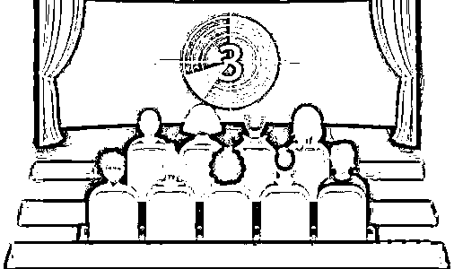

# 揭秘侵公诈骗一条龙的“剧本杀”

> 原文：[`mp.weixin.qq.com/s?__biz=MzIyMDYwMTk0Mw==&mid=2247544607&idx=7&sn=b881d9333a6c90e42c0aef7c11e868e0&chksm=97cbe427a0bc6d31084d0033e41b622e591bbd02cf7a9129c6717db2aa6469a001980af46543&scene=27#wechat_redirect`](http://mp.weixin.qq.com/s?__biz=MzIyMDYwMTk0Mw==&mid=2247544607&idx=7&sn=b881d9333a6c90e42c0aef7c11e868e0&chksm=97cbe427a0bc6d31084d0033e41b622e591bbd02cf7a9129c6717db2aa6469a001980af46543&scene=27#wechat_redirect)

随着网络时代的高速发展

个人信息被非法收集

乃至盗用、买卖的情况越来越多

特别是老年人群体

经常被**“扫码换鸡蛋”**等方式

定向收集个人信息

进而被实施诈骗

**真实案例**

该案恰似一出“剧本杀”，

各个链条上人物众多，

关系错综复杂。

**主要“角色”**

第一梯队——“始作俑者”罗某。

罗某自 2020 年 3 月以来，非法获取中老年公民个人信息数据 1200 余万条。为规避侦查，罗某放弃了线上“公开销售”，而是选择低调行事，将信息以 400-600 元/万条的价格卖给其“靠谱”的朋友黄某桐，非法获利 100 余万元。

第二梯队——“吃螃蟹者”黄某桐。

黄某桐在所购买的信息中精心挑选出中老年人群体，组织公司员工电话推销仿冒伪劣“营养品”，实施诈骗活动。

同时，他一鸡多吃，又将使用过的个人信息转卖给“信得过”的前女友徐某、表弟黄某及其他两个朋友李某和谢某。

第三梯队——“模仿者”黄某、徐某、李某、谢某。

这些人效仿黄某桐“赚快钱”模式，分别成立电话销售公司，以类似手段销售假冒伪劣“保健品”。

其中黄某更是明目张胆在互联网“公开”揽客寻找下家买主，迅速将手中公民信息非法出售给高某洋、涂某华等人，持续用于从事违法犯罪活动。

上述团伙成员拿到中老年群体个人信息后，大肆从事诈骗犯罪活动。

**“工作”特点**

【作案目标清晰】他们聚焦退休在家、有一定经济基础、热衷养生保健的老年人。

【“善于”抓住关键】老人最缺的是关爱，他们就通过嘘寒问暖打“感情牌”，老人最看重性价比，他们就搞免费试用、感恩回馈等小恩小惠。

【“更懂”市场价值】他们将每罐 5 元钱购买的伪劣保健品包装成高端保健品，以几十倍的价格出售并从中获利。

【“认真”钻研业务】他们对不同类型的老年群体分级分类开展诈骗活动，甚至详细制定了 1000 余页的话术资料。

**话术**

来看看诈骗团伙的常用话术清单：

①本公司成立八年，具有品牌保障，上网可以查到，是正规厂家，奶源在新疆伊犁，公司总部在上海，欢迎到公司亲自进行考察。

②我公司十周年店庆，推出双向优惠、补贴，厂家直接发货，省去经销商差价，非常便宜，一桶大半斤装，非常实惠。

③这款奶粉是专门针对中老年人补钙补气血的，健脾养胃，补肾健脑，养肝明目，喝过奶粉会觉得走路腿脚特别有劲，睡眠质量大幅提高。

④购买奶粉即可参与周年抽奖活动，中奖几率很大，之前有叔叔阿姨抽到了五福银碗、瑞士机芯手表，按摩枕，血糖仪等，预祝您可以中大奖。

⑤现在帮您登记，大概三四天能收到货，您记得开箱验货，确定是六桶奶粉两根大人参，再给快递员 198 元就可以了。

⑥有任何问题都可以随时拨打我们 400 售后电话，公司会第一时间帮您解决问题，而且奶粉收到后还有专业健康指导老师给您打电话做回访。

还真是欺骗性挺强的呀！

**真实案例**

该团伙骗了不少人，咱们来看看其中一个案例：

王大爷 65 岁，退休在家。某天，王大爷接到陌生电话，对方自称是驼奶粉的生产厂家，针对中老年人搞促销活动，王大爷很幸运地成为中奖顾客，现只需 198 元就可以购买到满 6 桶原生态驼奶粉，还额外赠送两根长白山野生人参！

起初王大爷没有相信，多次想挂断电话，但对方声称该产品是正规厂家生产并且支持货到付款、7 天无理由退货，对老年人的心脑血管有奇效。

王大爷心想正巧自己心脑血管不是特别健康，既然是正规厂家，应该有相应保障，随即购买了 6 桶驼奶粉。

然而在收货付款后王大爷才发现，所谓的驼奶粉根本冲泡不开，更没有什么疗效，气得不得了，马上报了警。

**大结局**

2022 年 7 月，警方捣毁该团伙犯罪窝点 6 处，扣押涉案电脑 62 台、手机 84 部，收缴公民个人信息 1200 余万条，查封涉案假冒保健品生产设备、包材、假冒食品多批，涉案金额 900 余万元。

该案件涉及全国多省市的 19 名犯罪嫌疑人全部抓获，均已依法采取刑事强制措施，部分人员已依法移送起诉，案件正在进一步办理中。

来源：武汉市反电信网络诈骗中心

欢迎关注灰产圈社群服务号

