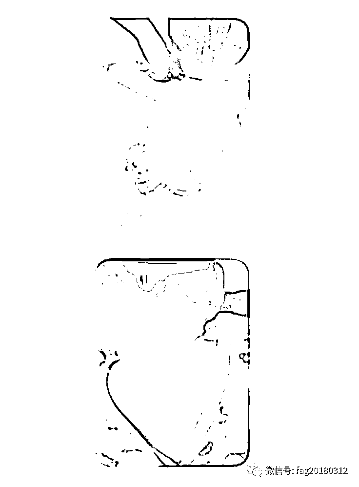
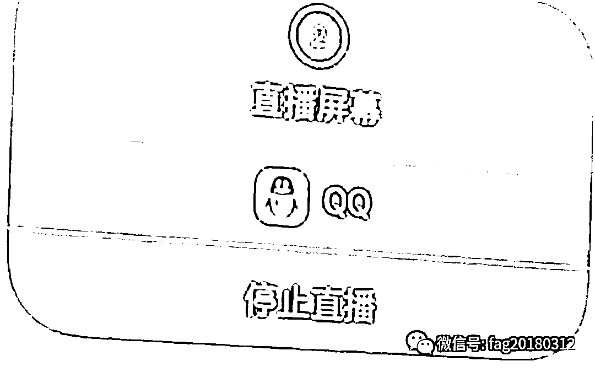
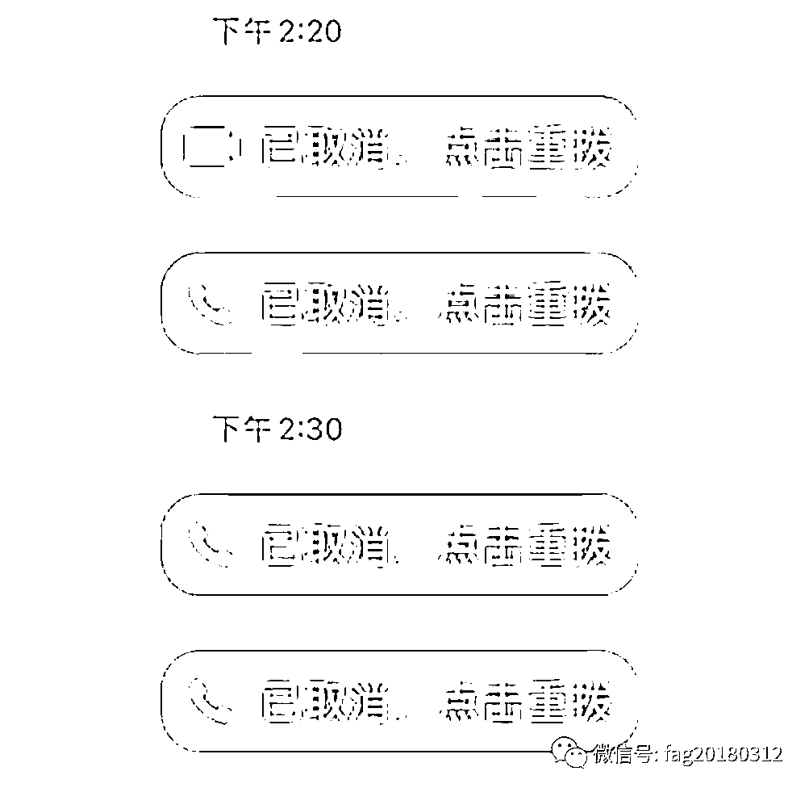

# 105 万“买”了件内衣，贵不贵？

> 原文：[`mp.weixin.qq.com/s?__biz=MzIyMDYwMTk0Mw==&mid=2247544607&idx=8&sn=930bb074e4b56e1f120d2bdeccdedc32&chksm=97cbe427a0bc6d31a523587592ce1acf82538607d3a429e985adf911e82fffed63c635132bcc&scene=27#wechat_redirect`](http://mp.weixin.qq.com/s?__biz=MzIyMDYwMTk0Mw==&mid=2247544607&idx=8&sn=930bb074e4b56e1f120d2bdeccdedc32&chksm=97cbe427a0bc6d31a523587592ce1acf82538607d3a429e985adf911e82fffed63c635132bcc&scene=27#wechat_redirect)

**导 读**

**近年来，随着网络视频会议广泛运用，“屏幕共享”功能逐渐普及。在给人们工作生活带来便利的同时，也成为了不法分子利用的新型“诈骗工具”。仅仅是“屏幕共享”，自己账户里的钱怎么就不翼而飞了呢？近日，陕西西安的张女士就被“屏幕共享”转走了 105 万！**

 **[`mp.weixin.qq.com/mp/readtemplate?t=pages/video_player_tmpl&action=mpvideo&auto=0&vid=wxv_1474789638111330306`](https://mp.weixin.qq.com/mp/readtemplate?t=pages/video_player_tmpl&action=mpvideo&auto=0&vid=wxv_1474789638111330306)** 

**刚刚当妈妈没多久的张女士说，她前两天接到了一个电话，对方自称是某宝客服，询问是否在他们店铺购买了内衣，随后说张女士购买的哺乳内衣**甲醛超标，穿了之后，对宝宝有害，会出现大面积红疹。****

****现在，他们愿意赔偿张女士 4 倍价款，要求添加张女士 QQ 好友，让张女士登录支付宝接受退款。****

**对方添加了张女士的 QQ 后，发了一些婴儿皮肤红肿的图片，并告诉张女士这就是穿了那件内衣之后造成的后果。**

****

**然后，骗子的套路来了。张女士被对方告知**信用分不够，让她刷一下额度。****

**深信不疑的张女士此时表示自己不会操作，更是给了骗子可乘之机。对方与张女士进行了语音通话，要求她**打开 QQ 的直播功能并开启屏幕共享，**打开支付宝根据对方的指示操作。**

****

****此时，对方已经通过屏幕共享窃取了张女士的支付宝密码和银行卡支付密码。****

**之后，对方先试探性转走了十几万，而后又转走了九十几万！**

**至此，张女士才反应过来被骗了，而骗子的电话早已关机再也无法联系到。**

****

**随后，张女士联系到当初网购的商家时，**商家表示该平台很多店铺信息都被盗取，**建议张女士赶快报警处理。**

****

**最终，一件价值 208 元的内衣变成天价，张女士**被骗子骗走了将近****105 万**！**

****什么是屏幕共享 ？****

**“屏幕共享”相当于手机的录屏操作。它会把屏幕上显示的内容全都记录下来，并同步让对方看到，包括弹框显示短信、微信、其他 App 推送的内容。**也就是说，你在手机上的任何操作，对方电脑上都能看到，包括输入密码、解锁的过程。****

****此类诈骗中，骗子往往**冒充“公检法”或注销校园贷款的银行工作人员、平台客服人员等**，诱导受害者使用网络会议视频内的“分享屏幕”功能。****

****一旦受害者使用此功能，即使骗子不主动询问，也能看到受害人手机上的所有信息，包括输入密码时跳动的字符、收到的验证码等，从而转走受害人卡内资金。****

********

******“屏幕共享”诈骗手法分析******

****警方通过梳理分析接报案件发现诈骗分子实施“屏幕共享”诈骗基本都分为两个步骤：****

******第一步→冒充身份******

****赢得受害人的信任****

******第二步→引导事主下载软件******

****实施“屏幕共享”诈骗****

****在开启“屏幕共享”后，信息又是如何被盗的？通过一段“屏幕共享”使用过程的演示，我们能更清晰地了解诈骗过程。****

****目前，“屏幕共享”正混合各种形式多样的诈骗出现，利用“屏幕共享”的诈骗手法层出不穷，还出现在冒充熟人领导屏幕共享确认事务，网络贷款屏幕共享填写资料，兼职刷单屏幕共享确认任务进度等诈骗套路中……****

****但不管混合什么类型的诈骗，**实施诈骗的最后一步都是让受害者使用或下载可以提供“屏幕共享”功能的网络视频会议软件，目的就是偷窥用户手机上的隐私。******

****因此，只需防范一点，**未经确认情况，千万不要随意打开“屏幕共享”！******

****来源：保定反诈，消费保，熊猫反诈****

********

****欢迎关注灰产圈社群服务号****

********

********