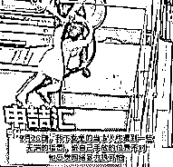
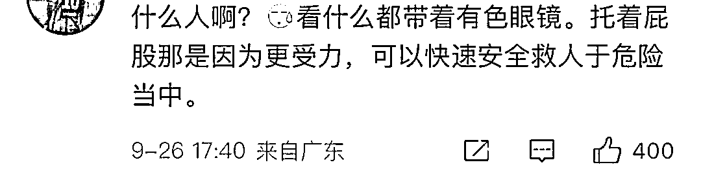

# 上海一女童手扒扶梯双脚悬空，好心人营救成功！键盘侠：你手怎么搭在小姑娘的屁股上？

> 原文：[`mp.weixin.qq.com/s?__biz=MzIyMDYwMTk0Mw==&mid=2247544653&idx=2&sn=7e75a67692fa067ab1cd4773a39709ed&chksm=97cbe475a0bc6d634e39217602a424c7ccd0808a18269ac6749cea9e3f26d2810053c6605f61&scene=27#wechat_redirect`](http://mp.weixin.qq.com/s?__biz=MzIyMDYwMTk0Mw==&mid=2247544653&idx=2&sn=7e75a67692fa067ab1cd4773a39709ed&chksm=97cbe475a0bc6d634e39217602a424c7ccd0808a18269ac6749cea9e3f26d2810053c6605f61&scene=27#wechat_redirect)

9 月 25 日上午

上海嘉定一市场内的视频刷屏了

……

一名女童手扒扶梯双脚悬空

情况十分危急

女童双手扒在扶梯扶手处

随着扶梯上升，双腿悬空

好在两名男子挺身而出

把小姑娘解救了下来

救人的男子丁先生是市场里的一名商户

事发 25 日上午，当时扶梯正升向二楼位置

小女孩抓住扶梯传送带后

越升越高感到害怕

后面就越发不敢松手了

他也是听到孩子呼救声，才知道孩子遇险了

就赶紧和弟弟一起将孩子救了下来

而现场没有看到孩子的监护人

小女孩有些皮外伤

事后他们将孩子交给市场的保安了

这件事怎么说，都是个好人好事吧？

而 26 日，救人的丁先生告诉记者

将孩子救下本是一件好事

但他们却遭到一些无端的指责

“有人说我救人的**速度慢了**

还有人说我救小女孩时

**手放的位置不对**”

这边有事后的理中客

说丁大哥是“摸小女孩私处”

？？？？

挺搞笑的，人家在救人

你说男女授受不亲是千年传统

我真是看不下去了…

丁先生倒还解释

因为当时手刚好托到小女孩屁股位置

但那个时候

**谁遇到了都有点措手不及**

**万一施救不当小孩就掉下去**

而且 不托屁股

就只能拉手和腿，容易受伤

键盘侠能不能也有点常识啊

为博眼球网爆正义行为，实属可耻

丁先生向记者表示

经过这次事情后

他感觉个别网友的网络暴力很可怕

小女孩：行

小女孩爸妈：行

键盘侠喷子：不行

还是希望不要让好心人寒了心

为丁先生和他弟弟的见义勇为点赞

不要在乎网上有些

饱饭专门挑刺的人

就蛮好笑的

这些质疑的人怎么没去救

那么厉害扛着键盘去啊

倒是这些能提出这种“质疑”的

本身就是一种思想龌龊的小人吧

键盘侠真是很神奇的一群人

特别喜欢标新立异

譬如在一堆彩虹屁中，说一句

不会只有我一个人

认为 ta 是个傻【消音——】吧？不会吧？

再比如去年东京奥运会上

摘得第一枚金牌的小将——杨倩

几分钟之后，键盘侠就找到了攻击她的点

说她 2020 年发过 nike 鞋的照片

上一秒还为她加油

下一秒就叫人家“跪族女孩”

我寻思也挺搞笑

人家给国家拿了金牌

你除了在家敲键盘还会干啥呀？

奥运会失利的运动员在微博发了个自拍

键盘侠又要说

“还有心情自拍呢，怪不得输了”

整得官媒都看不下去

现在上网，有时候真觉得蛮糟心的

各门各类的键盘侠

让人头疼的不行

总会有那么一些人

指手画脚，尖酸刻薄，评头论足

现实里唯唯诺诺

也就敢躲在显示器后面伤害普通人

但我相信更多人

会替这个小姑娘庆幸

丁大哥，绝对是好样滴

来源：上海全知道

欢迎关注灰产圈社群服务号

