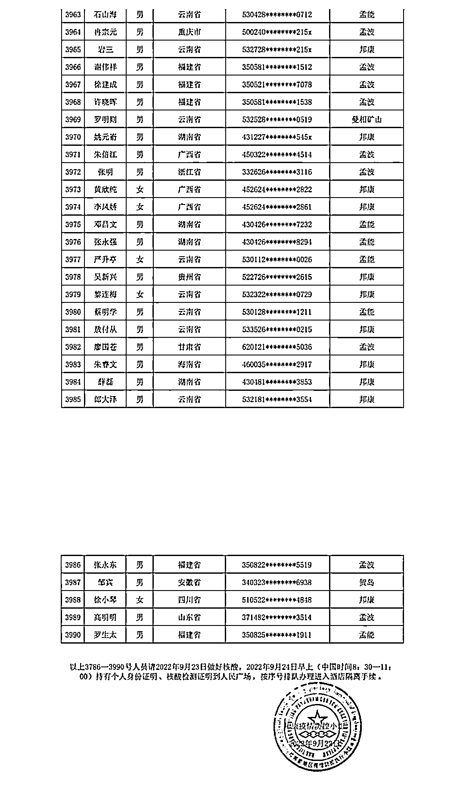
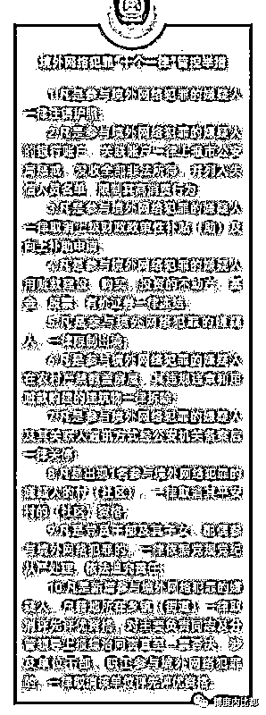
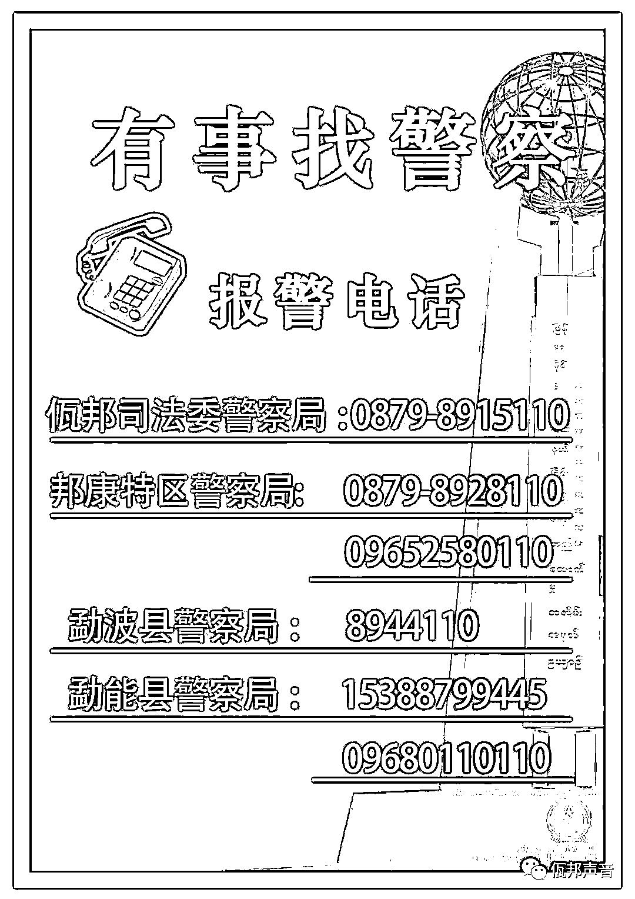

# 缅北发生多起中国人当街被绑案！，佤邦人口贩卖涨至 30 万！

> 原文：[`mp.weixin.qq.com/s?__biz=MzIyMDYwMTk0Mw==&mid=2247544653&idx=3&sn=40bb3659d3e686a5fa5b023104f81f37&chksm=97cbe475a0bc6d63f0c8d399ebf5fd789ddbe00a7e5d5134469dff556eff08521112aa68b1aa&scene=27#wechat_redirect`](http://mp.weixin.qq.com/s?__biz=MzIyMDYwMTk0Mw==&mid=2247544653&idx=3&sn=40bb3659d3e686a5fa5b023104f81f37&chksm=97cbe475a0bc6d63f0c8d399ebf5fd789ddbe00a7e5d5134469dff556eff08521112aa68b1aa&scene=27#wechat_redirect)

据佤邦爱国热心人士透露，最近缅北佤邦孟波等地接连发生了针对中国人的恶性绑架事件。 

[`mp.weixin.qq.com/mp/readtemplate?t=pages/video_player_tmpl&action=mpvideo&auto=0&vid=wxv_2592450816196804610`](https://mp.weixin.qq.com/mp/readtemplate?t=pages/video_player_tmpl&action=mpvideo&auto=0&vid=wxv_2592450816196804610)

佤邦孟波警察当局也特别重视，加强了夜间枪支巡逻、摩托车骑警巡逻和警车 24 小时巡逻。

据相关人士透露，佤邦辖区比较局限人生自由的诈骗园区公司【俗称黑公司】集中在勐能等地，以诈骗欧美、台湾、韩日等国家的杀猪盘为主。今年 8 月，佤邦邦康的中国孟连口岸开放自首回国申请通道以来，数千名偷渡者通过合法港口回国自首了。

（附图一）

同时，因为全国各地警方依次发布自首回国的最后通牒：不回国将严惩，随着劝返力度的加大，不回国的将面临注销户口、断卡，子女无法就学等问题，在佤邦大部分中国人也纷纷选择了回国。

所以，滞留在佤邦的中国人由 2020 年的顶峰 20 万人下降到目前的 8 万人左右（不加上别的，仅仅只是佤邦当局官方数据统计的，通过佤邦口岸自首回国人员就累计近 12 万人），其中有近 5 万人仍然分散在佤邦的孟波，贺岛开发区，勐能从事诈骗等黑灰产业。 

（附图二.全国多地警方发布劝返最后通牒）

从权威渠道了解到，**孟波等地发生的绑架事件大多是在中国人背后唆使的，****雇佣佤邦当地无业游民，在夜间，甚至白天也在黑暗的小路上绑架单独行走中国人。**

并使用武力或迷药，绑架当事人到佤邦勐能诈骗园区，**一个人的售价大约在 15 万至 30 万元之间，**并强迫这些被贩卖的人从事电信诈骗业务，签订合同，还不能让他们乱跑。

最后，无论是否相信缅北佤邦当局，但发生意外时，联系求救亲属或亲朋好友的同时，选择报警依然是最好的选择。

来源：博度内比都

欢迎关注灰产圈社群服务号

