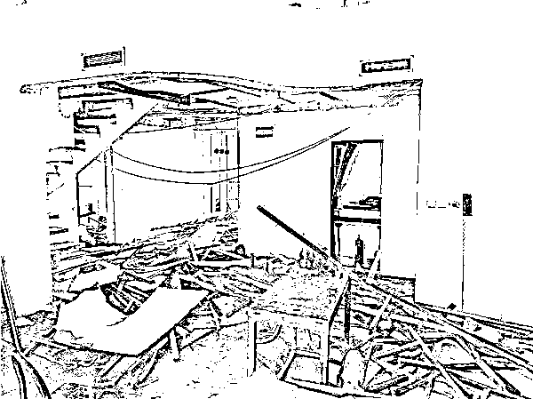
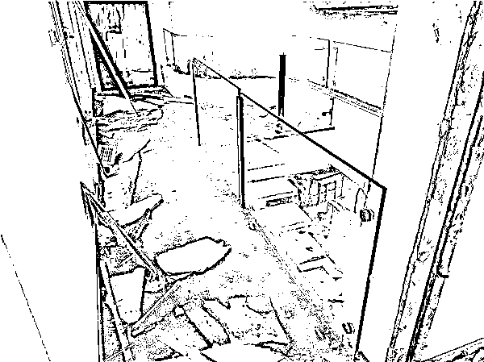
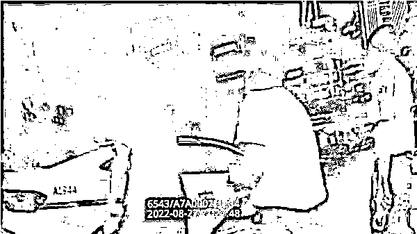
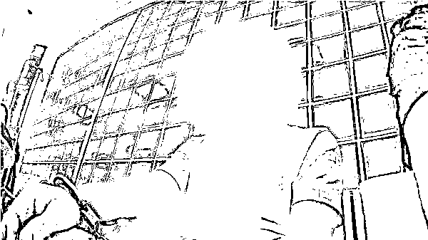

# 千万元房款！钱付了，房子没到手，警方调查有惊人发现……

> 原文：[`mp.weixin.qq.com/s?__biz=MzIyMDYwMTk0Mw==&mid=2247544653&idx=4&sn=31e96135aecdd50d38761e18a7417329&chksm=97cbe475a0bc6d638415cd352a6c19c6f47855133c6430a8958fcac5885f036366f39c728cfe&scene=27#wechat_redirect`](http://mp.weixin.qq.com/s?__biz=MzIyMDYwMTk0Mw==&mid=2247544653&idx=4&sn=31e96135aecdd50d38761e18a7417329&chksm=97cbe475a0bc6d638415cd352a6c19c6f47855133c6430a8958fcac5885f036366f39c728cfe&scene=27#wechat_redirect)

千辛万苦买到的心仪住宅，

自己竟然从未拥有？

**一场“房产纠纷”，**

**竟是历时 9 年的诈骗陷阱！**

而**千万房款**，

早已被诈骗分子**挥霍一空**

**……**

**新民晚报记者今天上午**

**从上海浦东警方获悉，**

**一起**中介人员利用职务便利****

******诈骗购房款**的案件近日告破。**** 

 ****[`mp.weixin.qq.com/mp/readtemplate?t=pages/video_player_tmpl&action=mpvideo&auto=0&vid=wxv_2594877765649367041`](https://mp.weixin.qq.com/mp/readtemplate?t=pages/video_player_tmpl&action=mpvideo&auto=0&vid=wxv_2594877765649367041)**** 

******自家房产******

******却被别人锁门装修******

****今年 8 月，一直居住在外地的胡先生突然回沪，来到浦东新区昌邑路，查看父亲过户给自己的房产。让他意外的是，**手中的钥匙竟然无法开锁，而好不容易进入屋内，房间陈设也已经大变**，正在装修中。满是疑问的胡先生立即来到浦东公安分局梅园新村派出所反映情况。****

********

****胡先生家屋内陈设已大变，正在装修中  浦东警方供图（下同）****

****民警初步调查后，发现**这处房产确系胡先生的父亲过户给他，用于日后结婚用，而且证照齐全。******

******另一边，却“跳出来”一位购房人：今年近 70 岁的周先生。**他称已支付 1000 余万元从胡先生的父亲手上购买了这处房产，只是尚未最终过户而已。**双方各执一词，争辩不休，民警本以来遇上一起房产纠纷，没想到，随着后续调查深入，真相逐渐令人心惊。******

******“一方否认卖房，一方却坚称有协议、有付款记录。”面对双方截然不同的说法，民警决定先从房屋产调信息入手，确认这处房屋户主确实为胡先生，而且产权清晰，并无他人历史信息在册。可是，周先生如此坚持，也不像是骗人的样子。此时，一个名叫陈某的房屋中介引起了民警的注意。******

************

********大胆中介********

********竟然上下家两头骗********

******原来，2013 年，胡先生的父亲曾经动过卖房的心思，当时委托的就是这个中介陈某。而从周先生这里了解的情况来看，这 9 年，也正是**陈某代为收取了 1000 余万钱款**。胡先生父亲也表示，**当时确实收到了来自周先生的 2 万余元意向金，但后续未再收到任何钱款，因此认为对方违约、买卖已经无效。********

********至此，一切的矛头均指向了陈某。今年 8 月 26 日，民警奔赴安徽当地将涉嫌犯有诈骗罪的陈某捉拿归纳。这场离奇房产纠纷的真相也由此浮出了水面。********

****************

********陈某已被浦东警方刑事拘留********

********2013 年，陈某所供职的这家房产中介公司为了防止意外发生，一直都是两名中介分别负责对接上下家的。但是当时负责上家的中介突然离职，于是变成了陈某一人同时负责联系上下家，这也为他的诈骗行为留下了可乘之机。********

**********伪造产证**********

********不断骗取房款千万元********

******当年的周先生虽然支付了意向金，但苦于无法及时筹集 1000 余万的房款正一筹莫展。******

********“有钱就打过来，交全了房款，房子就能买到手了！”**陈某利用信息差及自身职务之便，抓住周先生对过户流程不熟悉的薄弱环节，以支付“追加定金”用于“原价留住房源”为由，不断收取钱款。******

******如此离奇的购房方式，自然引起了周先生的怀疑。于是，刚巧离婚的陈某，竟还利用自己与妻子王女士离婚的材料，伪造成王女士与胡先生父亲离婚的材料，更伪造了相应产证，营造房屋产权人已经变更为王女士的假象。之后，陈某便通过王女士遗留的银行卡，收取百万以上数额的购房首付款等费用。******

********房产证、聊天记录、“房东”王女士的银行卡……众多虚假材料成功骗取了周先生的信任。**他一直认为房屋处于交易过程，直到今年房款基本付清，正式换锁进驻装修。可惜，一切终成泡影，他辛苦赚取的千万房款，早已被陈某挥霍一空。目前，**陈某已被浦东警方刑事拘留。********

****************

********陈某已被浦东警方刑事拘留********

**********警方提醒：**各位市民朋友在购置房产时，一定要注意通过正规渠道，面对明显存在问题的交易流程，要及时质疑并前往房地产交易中心等政府设立的官方机构进行咨询，避免因不懂、不熟，而被别有用心的人“钻空子”骗取钱款。********

******来源：新民晚报******

************

******欢迎关注灰产圈社群服务号******

************

************