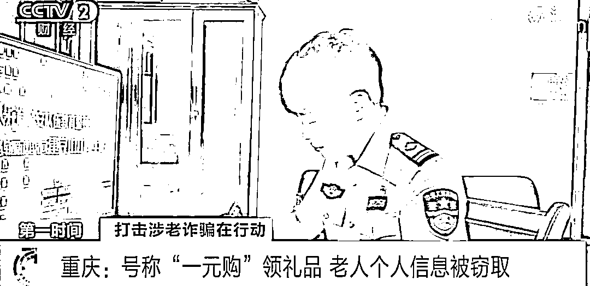
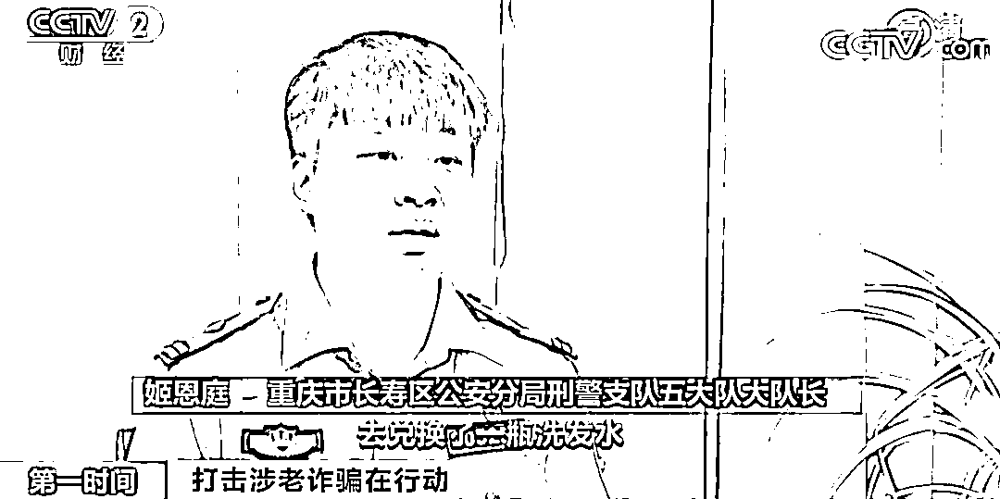

# “一元购”领礼品？有人的个人信息被骗走！警方紧急提醒→

> 原文：[`mp.weixin.qq.com/s?__biz=MzIyMDYwMTk0Mw==&mid=2247544653&idx=6&sn=cd26aa8f321f92f1a7792115d35ba9b9&chksm=97cbe475a0bc6d63493b5626b33c2f037aeaeb8022a88a3e6639aadd51b27fcdbb188ef2bbe1&scene=27#wechat_redirect`](http://mp.weixin.qq.com/s?__biz=MzIyMDYwMTk0Mw==&mid=2247544653&idx=6&sn=cd26aa8f321f92f1a7792115d35ba9b9&chksm=97cbe475a0bc6d63493b5626b33c2f037aeaeb8022a88a3e6639aadd51b27fcdbb188ef2bbe1&scene=27#wechat_redirect)

扫码“一元购”、手机注册送礼品，相信有不少人都曾在商超入口、街头巷尾遇到过类似的推销活动。然而这种看似“天上掉馅饼”的好事，背后可能会暗藏猫腻。近日，重庆警方就打掉一个利用“一元购”领礼品方式，骗取老年人个人信息，并进行倒卖的犯罪团伙。 

**重庆：号称“一元购”领礼品 老人个人信息被窃取**

[`mp.weixin.qq.com/mp/readtemplate?t=pages/video_player_tmpl&action=mpvideo&auto=0&vid=wxv_2594902712514019329`](https://mp.weixin.qq.com/mp/readtemplate?t=pages/video_player_tmpl&action=mpvideo&auto=0&vid=wxv_2594902712514019329)

△央视财经《第一时间》栏目视频

前不久，重庆长寿区 73 岁村民陈某接到浙江警方通知，自己电话注册的社交网络账户涉嫌一起诈骗案。

接到报警后，重庆长寿警方立即进行调查，**发现陈某的手机号确实注册了一个社交网络账号，在浙江地区实施诈骗，诈骗金额 15000 元。**

经过深入分析，**民警怀疑是有人使用陈某的手机，并且在手机上动了手脚**，陈某也回想起自己在今年五月的一次经历。原来，当天陈某到长寿区扇沱村赶集时，**遇到几名男女在摆摊办理“一元购”业务，声称只需一块钱即可获得品牌洗发水、沐浴露等礼品。**

**重庆市长寿区公安分局刑警支队五大队大队长 姬恩庭：**陈某花了一元兑换一瓶洗发水，兑换之后，对方就要求陈某把手机提供给他，当场就开始操作，他们拿去实施诈骗。

对方拿到陈某手机后，便开始套取陈某的各种信息，并利用他的手机号注册了多个社交媒体账号，倒卖给诈骗分子，用于实施电信网络诈骗。为切实维护老年人合法权益，重庆警方迅速成立专案组，进一步全力侦查。

**重庆：嫌疑人假意帮老人进行手机操作 趁机窃取信息**

[`mp.weixin.qq.com/mp/readtemplate?t=pages/video_player_tmpl&action=mpvideo&auto=0&vid=wxv_2594903376707223554`](https://mp.weixin.qq.com/mp/readtemplate?t=pages/video_player_tmpl&action=mpvideo&auto=0&vid=wxv_2594903376707223554)

△央视财经《第一时间》栏目视频

警方经过调查发现，今年 4 月份以来，以犯罪嫌疑人张某为首的犯罪团伙专门在乡镇寻找老年人，利用老年人对手机操作不熟悉的特点，**通过“一元购”、手机注册送礼品等方式，**假意帮老人进行手机操作，**骗取老年人个人信息、手机卡信息，并进行倒卖。**

经缜密侦查，专案组掌握该团伙组织构架、犯罪事实后采取集中收网行动，将张某等 5 名犯罪嫌疑人抓获。据张某等人交代，他们主要去一些偏远乡镇，在赶集的时候，**两到三人一组在街上摆地摊办理“一元购”业务，随后套取对方信息。** 

据统计，在短短 3 个月的时间里，这个团伙骗取老年人个人信息注册网络社交账户上万条，非法获利 10 多万元。目前，张某等 5 名犯罪嫌疑人因涉嫌侵犯公民个人信息被长寿警方采取强制措施，案件正在进一步侦办中。 

**警方提醒：**大家一定要增强个人信息安全保护意识，不要贪图小便宜，不要在网上、街头随意参加需填写真实信息、手机号码等个人信息的抽奖、竞猜、促销送礼等活动，老年人更不要轻易将手机交给陌生人操作，防止个人信息被不法分子利用造成损失。

来源：央视财经（ID：cctvyscj）

欢迎关注灰产圈社群服务号

