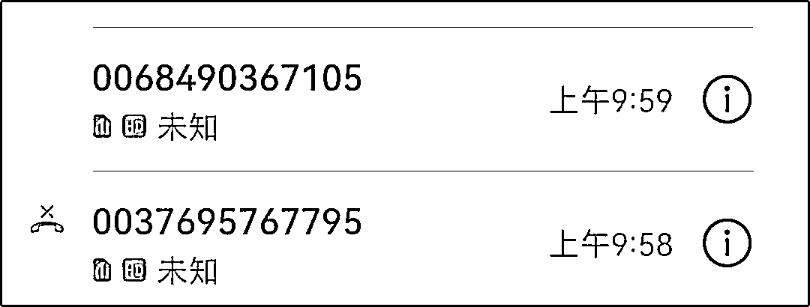
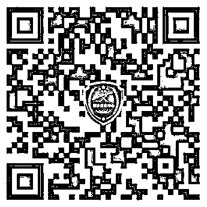
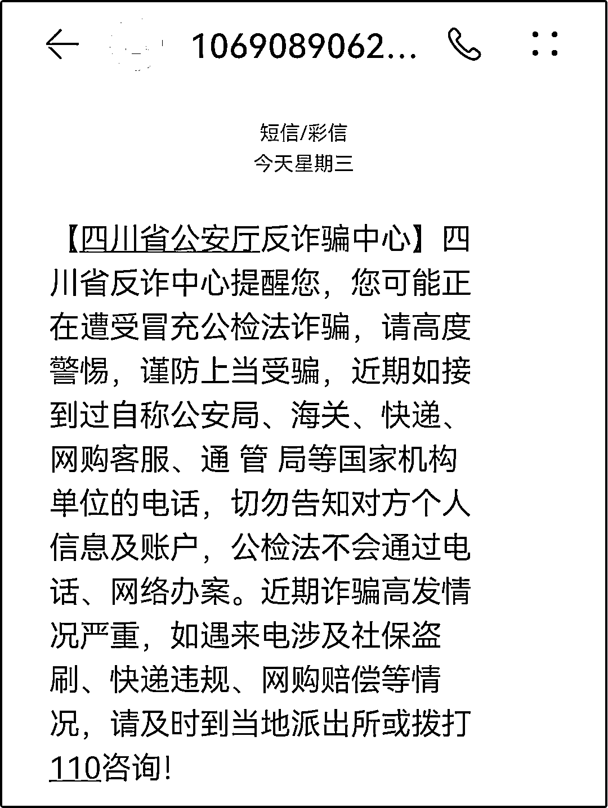

# 警花怒怼骗子：台词都没背熟就来骗人，回头是岸！

> 原文：[`mp.weixin.qq.com/s?__biz=MzIyMDYwMTk0Mw==&mid=2247544653&idx=7&sn=86550268e8ad6525079d45a7eb9dafb3&chksm=97cbe475a0bc6d637e3c6c55919ae19cf2f0bd07ef060e58b0ce828c448bbb3afcaeeebfd52b&scene=27#wechat_redirect`](http://mp.weixin.qq.com/s?__biz=MzIyMDYwMTk0Mw==&mid=2247544653&idx=7&sn=86550268e8ad6525079d45a7eb9dafb3&chksm=97cbe475a0bc6d637e3c6c55919ae19cf2f0bd07ef060e58b0ce828c448bbb3afcaeeebfd52b&scene=27#wechat_redirect)

墙都不扶就服你

“假警察”居然把诈骗电话

打到了真警察手机上

拙劣的演技

蹩脚的台词

让人笑掉大牙

今天

我们就带大家看看

睿智的警花是如何怒怼骗子的

“在我的印象中，护照不归户籍科管吧！”

（这块业务归出入境部门管）

“你把你的话术本翻好！”

[`mp.weixin.qq.com/mp/readtemplate?t=pages/video_player_tmpl&action=mpvideo&auto=0&vid=wxv_2584802133989048323`](https://mp.weixin.qq.com/mp/readtemplate?t=pages/video_player_tmpl&action=mpvideo&auto=0&vid=wxv_2584802133989048323)

**（点击右下角全屏观看效果更佳）**

8 月 31 日

西充县公安局的警花小姐姐

接到了一通自称

“南充市公安局户籍科主任刘超”的诈骗电话

骗子告诉小姐姐

她的护照有问题

让她到市局 302 办公室走一趟

好巧不巧

市局机关大楼小姐姐非常熟悉

“302”压根不是户籍科

也没有名为“刘超”的这号人物

骗子做梦没有想到

这边压根不按设定的套路走

而自己也难以自圆其说

眼见谎言被戳穿

他不禁恼羞成怒

在被正牌警察

送去“回头是岸”

这四字真言后

骗子挂断电话

仓皇而逃

……

不熟悉执法办案流程的群众

确实有可能被骗子迷惑

加上听到自己涉案

心中一慌

只要你信了

骗子就笑了

接下来就是

“视频（电话）笔录”

“安全账户”

“需要流水证明有足够资金”

……

总之，能骗多少就骗多少 

所以

请你们**一定要下载这款反诈神器**

**它就是**

****国家反诈中心 APP****

****

****▲扫码下载国家反诈中心 APP****

****你看****

****咱们的警花小姐姐手机上就收到了****

****来自反诈中心的预警短信****

********

****这些信息****

****或许可以让你在关键时刻****

****保留一丝清醒****

******冒充"公检法"诈骗套路******

******1、骗子会事先通过非法渠道获取受害者姓名、身份证号、地址等个人信息，以便获取受害者的信任。******

******2、骗子往往会自称是“国家机关工作人员”，以严厉的语气震慑受害者的意志，让受害者因急于证明自身清白或挽回损失，而答应配合其所谓的“调查”。******

******3、为了让骗局更加真实，骗子往往还会向受害者发送虚假的“警官证”“通缉令”“逮捕令”等法律文书，利用受害者的恐慌心理，骗取信任。******

******4、最后，骗子会向受害者提出“自证清白”的唯一方法：配合公安机关调查，将钱款转到所谓的“安全账户”。******

********“熊猫反诈”温馨提醒******** 

******1、公安机关不会通过电话办案，更不会通过微信、QQ 等网络平台发送相关法律文书和工作证件。******

******2、个人信息要保护好，特别是银行卡号、密码、短信验证码等信息，一定不能透露给任何陌生人。******

******3、不要轻易向任何陌生账号转账。******

******来源：熊猫反诈******

************

******欢迎关注灰产圈社群服务号******

************

************