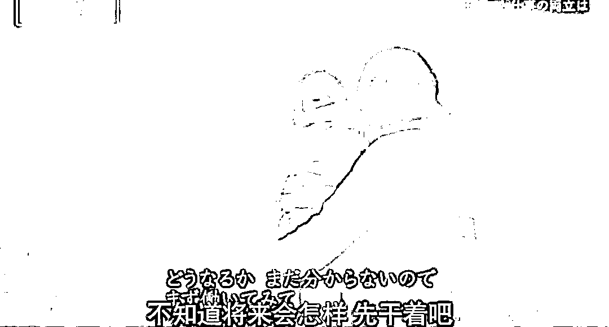

# 日本疫情危机中的女性现状好沉重：曾同情电视里的穷人，没想到现在小丑竟是我自己…

> 原文：[`mp.weixin.qq.com/s?__biz=MzIyMDYwMTk0Mw==&mid=2247544709&idx=1&sn=a9bad7aa31a0ac9650a1e957f014efe6&chksm=97cbe4bda0bc6dab9eba8ee5050fdfff044c1880f9af39f9a4e09585d14db6684d3e15804d6e&scene=27#wechat_redirect`](http://mp.weixin.qq.com/s?__biz=MzIyMDYwMTk0Mw==&mid=2247544709&idx=1&sn=a9bad7aa31a0ac9650a1e957f014efe6&chksm=97cbe4bda0bc6dab9eba8ee5050fdfff044c1880f9af39f9a4e09585d14db6684d3e15804d6e&scene=27#wechat_redirect)

最近刷到一段看完心情轻松不起来的 NHK 纪录片……

关键词：**疫情危机中的女性现状。**

当文字变为画面，更深刻地体会到，疫情下的个体，真的好难啊……

**①店家倒闭，如何兼顾工作和孩子？**

田边祐希，36 岁，是一家连锁餐厅的正式员工，原本月收入 16 万日元（约合 7971RMB）

但由于新冠影响，上班时间变短，收入减少了 4 万日元（约合 1992RMB）

田边是单亲妈妈，和 5 岁的儿子一起生活，每月要还房贷 9 万日元（约合 4480RMB），本来靠着餐厅工资和儿童补助，日子过得勉勉强强。

这种勉强维持生计的情况下，发生了更麻烦的事情——

因为疫情影响，很少有顾客来用餐，餐厅决定关门了。

疫情带来的问题突然一哄而上，田边不知道该怎么办才好。

原本的餐厅关门后，田边转到了公司旗下的另一家餐厅。

虽然没失业，但新餐厅的距离变远了。

一开始通知的新店铺是离家 2 小时的地方，通勤时间因此会增加 3 倍，工作时间相应减少，月收入很可能也会变少。

考虑到还要照顾孩子，田边希望公司再考虑一下。

最终定下来的是单程 1 个半小时的店铺，虽然是稍微近一些了，但通勤时间是原来的 2 倍，田边接受了。

只能先干着了，在这种不知道将来的情况下，总归比兼职打零工强。

**②双职工家庭，老婆收入减半，家庭难以为继。**

田中一家是双职工家庭，32 岁的丈夫自己创业，28 岁的妻子兼职做清洁工作。

疫情前，妻子在服饰店工作，月收入是 8 万，但疫情后孩子的学校受影响放假，为了照顾孩子，她辞去了服饰店的工作。

目前清洁工作的月收入只有 4 万日元。

而丈夫跟父亲一起做电气设备工程，月收入 27 万元（约合 13416RMB），和父亲那个时代相比，收入减半。

妻子的月收入减半后，家计吃紧，应该说无法运转了。

**③艰难断臂求生裁员的企业。**

东京都内的一家绘本专门店，雇佣的店员都是女性。

开店三年，原本欣欣向荣。

但疫情后的一天，56 岁的今本社长在开店前把员工聚在一起，说出了艰难的决定：为了降低运营成本，需要有员工主动提出年前提前离职。

原本的理想，在疫情面前，实在太难实现了。

今本想了很多方法来提高销售额。

但粉碎了这些努力成果的，是新冠疫情。

今本尝试打电话给银行求助融资，但没能撑下来，还是走到了削减人员的一步。

员工也十分体谅公司，虽然非常不想离开这份工作，但是要是店没了的话，就什么都没了，所以如果能减轻公司的负担，她愿意提前离职。

那时今本也和员工约定好了，如果店铺活下来了，到时候再请大家回来。

**④79 岁老奶奶：如果有人要我，我随时上岗。**

山口淑子，79 岁，原本在超市从事试吃销售，月收入 8 万日元。

但因为疫情，食品销售岗位骤减。

有一个月完全没收入。

快 80 岁的老奶奶，去职业介绍所也没什么希望，但她还是抱着乐观的心态。

**⑤逼良为娼，被迫进入风俗业的女性。**

kayo 桑，45 岁，近 20 年来从事普通零工。

5 年前成为一家公司的正式员工。

但 4 月份公司倒闭，koyo 桑失业。

koyo 桑拼命找工作但怎么都找不到，逼入绝处时，她在街上被劝诱进入风俗行业。

为了生活，koyo 说：“只能下狠心了。”

但风俗业也不是那么好挣钱的，和之前的工资相比，收入锐减，非常惨淡。

**⑥曾经同情电视里的穷人，没想到现在小丑竟是我自己——走投无路放声痛哭的单亲妈妈。**

住在关西的 40 多岁的单亲妈妈杉田，抚养 4 个女儿。

疫情影响下，杉田很难找到工作，存款见底，靠着每月 14 万日元的儿童补助，以及大女儿的打工补贴勉强度日。

疫情前，杉田坚信自己能抚养孩子，但疫情后，完全没想到情况会急转直下。

自己也沦落到了贫困的境地……

……

看完不知道该说点什么，好像说什么都是没用的，真的好沉重……

▼视频 48 分 54 秒

[`mp.weixin.qq.com/mp/readtemplate?t=pages/video_player_tmpl&action=mpvideo&auto=0&vid=wxv_2596513527482499072`](https://mp.weixin.qq.com/mp/readtemplate?t=pages/video_player_tmpl&action=mpvideo&auto=0&vid=wxv_2596513527482499072)

来源：脊梁 in 上海 SH

欢迎关注灰产圈社群服务号

