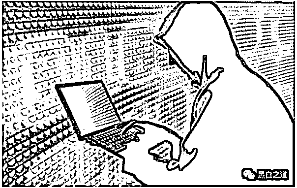
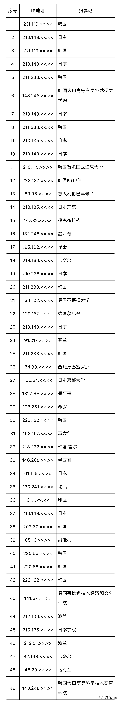
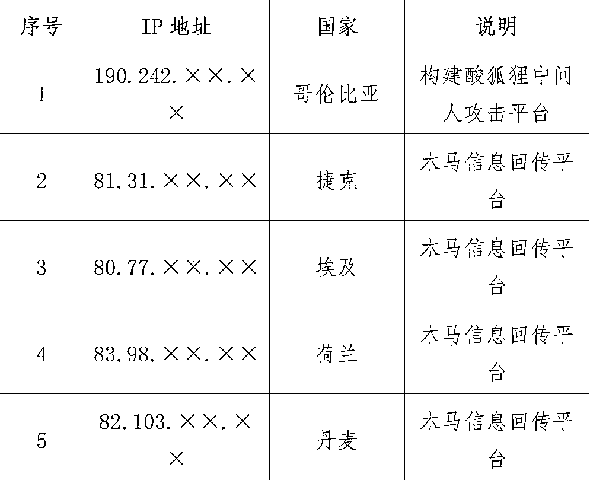

# 美国网攻西工大另一图谋曝光：查询中国境内敏感身份人员信息；

> 原文：[`mp.weixin.qq.com/s?__biz=MzIyMDYwMTk0Mw==&mid=2247544709&idx=2&sn=134ea8d9a78f22688969786ad8f5ff85&chksm=97cbe4bda0bc6dab9268de34b0d9a0fd35d5f5d4ec5495b1ebad2f53f2bf4dbc952cb4ee6651&scene=27#wechat_redirect`](http://mp.weixin.qq.com/s?__biz=MzIyMDYwMTk0Mw==&mid=2247544709&idx=2&sn=134ea8d9a78f22688969786ad8f5ff85&chksm=97cbe4bda0bc6dab9268de34b0d9a0fd35d5f5d4ec5495b1ebad2f53f2bf4dbc952cb4ee6651&scene=27#wechat_redirect)

美国网攻西工大另一图谋曝光：查询中国境内敏感身份人员信息

记者 27 日获得的最新调查报告进一步揭露了美国对西北工业大学组织网络攻击的目的：**渗透控制中国基础设施核心设备，窃取中国用户隐私数据，入侵过程中还查询一批中国境内敏感身份人员，并将用户信息打包加密后经多级跳板回传至美国国家安全局总部。**

6 月份西北工业大学曾发布声明称，有来自境外的黑客组织对西北工业大学服务器实施攻击。9 月份，相关部门调查显示针对西北工业大学的网络攻击来自美国国家安全局（NSA）特定入侵行动办公室（TAO）。

中国国家计算机病毒应急处理中心和 360 公司全程参与了此案的技术分析。研究团队经过持续攻坚，成功锁定了 TAO 对西北工业大学实施网络攻击的目标节点、多级跳板、主控平台、加密隧道、攻击武器和发起攻击的原始终端，发现了攻击实施者的身份线索，并成功查明了 13 名攻击者的真实身份。

最新的调查报告进一步表明，**TAO 长期隐蔽控制西北工业大学的运维管理服务器，同时采取替换原系统文件和擦除系统日志的方式消痕隐身，规避溯源。网络安全技术人员根据 TAO 攻击西北工业大学的隐蔽链路、渗透工具、木马样本等特征关联发现，TAO 对我国基础设施运营商核心数据网络实施了渗透控制。**

不仅如此，TAO 通过掌握的中国基础设施运营商的思科 PIX 防火墙、天融信防火墙等设备的账号口令，以“合法”身份进入运营商网络，随后实施内网渗透拓展，分别控制相关运营商的服务质量监控系统和短信网关服务器，利用“魔法学校”等专门针对运营商设备的武器工具，**查询了一批中国境内敏感身份人员，并将用户信息打包加密后经多级跳板回传至美国国家安全局总部。**

**入侵细节披露，人赃俱获**

**最新发布的报告公布了一系列细节进一步证明 TAO 实施网络攻击行为，其中包括其是在什么时间通过什么方式窃取中国用户隐私数据，相当于“人赃俱获”。**

细节显示：北京时间 20××年 3 月 7 日 22:53，TAO 通过位于墨西哥的攻击代理 148.208.××.××，攻击控制中国某基础设施运营商的业务服务器 211.136.××.××，通过两次内网横向移动（10.223.140.××、10.223.14.××）后，攻击控制了用户数据库服务器，非法查询多名身份敏感人员的用户信息。

同日 15:02，TAO 将查询到的用户数据保存在被攻击服务器“/var/tmp/.2e434fd8aeae73e1/erf/out/f/”目录下，被打包回传至攻击跳板，随后窃密过程中上传的渗透工具、用户数据等攻击痕迹被专用工具快速清除。

此外，TAO 运用同样的手法，分别于北京时间 20××年 1 月 10 日 23 时 22 分、1 月 29 日 8 时 41 分、3 月 28 日 22 时 00 分、6 月 6 日 23 时 58 分，攻击控制另外一家中国基础设施业务服务器，非法多批次查询、导出、窃取多名身份敏感人员的用户信息。

**TAO 在攻击过程中操作失误暴露工作路径**

针对西北工业大学遭受 TAO 网络攻击的技术分析行动中，中国打破了一直以来美国对我国的“单向透明”优势，掌握了美国实施网络攻击的充分证据。

值得一提的是，TAO 在实施网络攻击中因操作失误暴露工作路径。根据介绍， 20××年 5 月 16 日 5 时 36 分（北京时间），对西北工业大学实施网络攻击人员利用位于韩国的跳板机（IP:222.122.××.××），并使用 NOPEN 木马再次攻击西北工业大学。在对西北工业大学内网实施第三级渗透后试图入侵控制一台网络设备时，在运行上传 PY 脚本工具时出现人为失误，未修改指定参数。脚本执行后返回出错信息，信息中暴露出攻击者上网终端的工作目录和相应的文件名，从中可知木马控制端的系统环境为 Linux 系统，且相应目录名“/etc/autoutils”系 TAO 网络攻击武器工具目录的专用名称（autoutils）。

TAO 网络攻击西北工业大学所用跳板 IP 列表

此外，技术分析还发现，**美国仰仗自己强大的技术优势，针对西北工业大学的攻击窃密者都是按照美国国内工作日的时间安排进行活动的，肆无忌惮，毫不掩饰。**

根据对相关网络攻击行为的大数据分析，对西北工业大学的网络攻击行动 98%集中在北京时间 21 时至凌晨 4 时之间，该时段对应着美国东部时间 9 时至 16 时，属于美国国内的工作时间段。其次，美国时间的全部周六、周日时间内均未发生对西北工业大学的网络攻击行动。第三，分析美国特有的节假日，发现美国的“阵亡将士纪念日”放假 3 天，美国“独立日”放假 1 天，在这四天中攻击方没有实施任何攻击窃密行动。第四，长时间对攻击行为密切跟踪发现，在历年圣诞节期间，所有网络攻击活动都处于静默状态。

技术分析与溯源调查中，技术团队发现了一批 TAO 在网络入侵西北工业大学的行动中托管所用相关武器装备的服务器 IP 地址，举例如下：

 来源 ：环球时报-环球网（特约记者：袁宏）

欢迎关注灰产圈社群服务号

