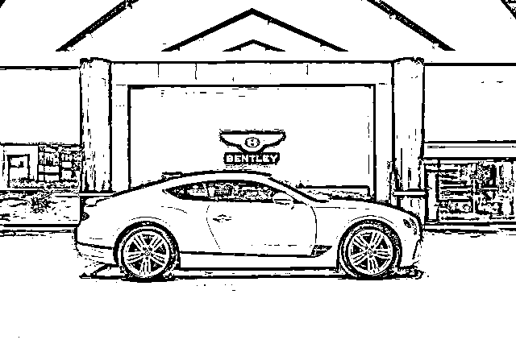
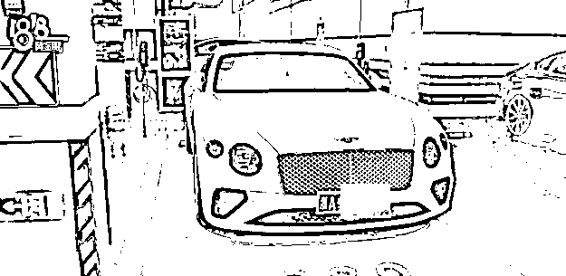
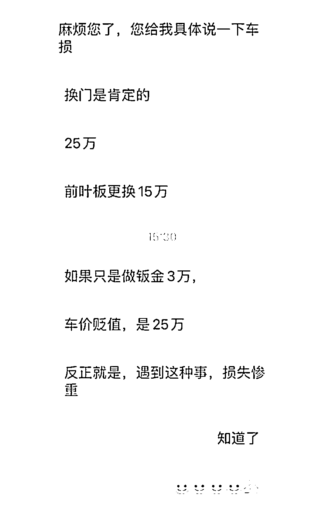
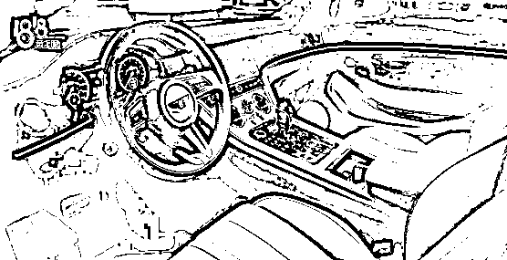
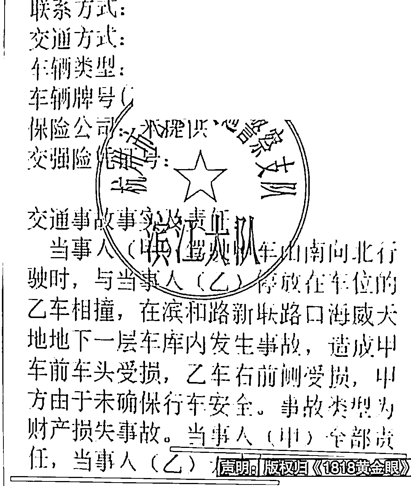
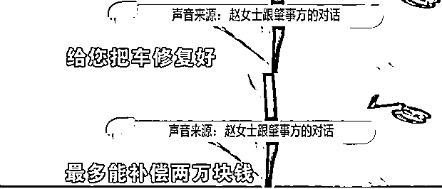
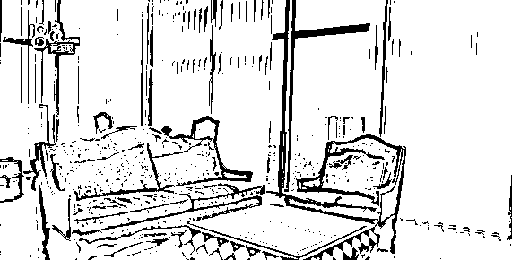
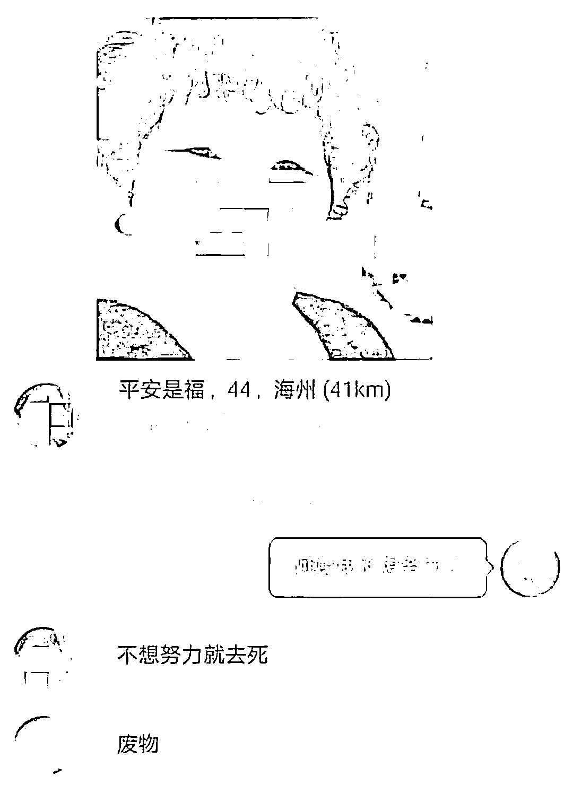

# 男子在地下车库练摩托车，撞到了 400 多万的宾利…两手一摊“最多赔两万”

> 原文：[`mp.weixin.qq.com/s?__biz=MzIyMDYwMTk0Mw==&mid=2247544709&idx=3&sn=b885f5d53ce039ebb428118b48bf6686&chksm=97cbe4bda0bc6dab83f5c22a3c7347d738bb981dad5bda2ab3b776b5c83401ac826f8ca9f5c2&scene=27#wechat_redirect`](http://mp.weixin.qq.com/s?__biz=MzIyMDYwMTk0Mw==&mid=2247544709&idx=3&sn=b885f5d53ce039ebb428118b48bf6686&chksm=97cbe4bda0bc6dab83f5c22a3c7347d738bb981dad5bda2ab3b776b5c83401ac826f8ca9f5c2&scene=27#wechat_redirect)

‍

‍22 号晚上，人在北京的赵女士

突然接到了杭州打来的电话

说她车库里的宾利被撞了

如果小编接到这个电话

肯定觉得是电信诈骗了

但人家赵女士

是真在外地车库里放了一辆宾利啊！

**车库练摩托车不慎撞宾利**

杭州一男子在地下车库练习摩托车时

撞到了停在车位上的一辆宾利

（价值 400 来万吧）

而且撞的还不轻

把宾利的车门附近撞出了一个洞

车库里练车就蛮搞笑的

这是树林里生火，厨房里跳街舞

博物馆里投标枪啊

赵女士的宾利欧陆 GT 跑车的右侧翼子板

有凹陷和擦痕

右侧车门被撞出了一个三四厘米长的口子

她说车子是今年 5 月份在上海买的

花了四百多万，开了不到两千公里

她说在北京摇不到车号和车牌

就把唯一的车放在这里

因为疫情也不方便回来

所以就没开过两次

车一下子摧残成这样特别心痛

可能你给我换辆新车，心里才平衡

如果说就考虑维修的话

就是要五六十万至少

更不谈这宾利欧陆

除了维修还有贬值的费用

400w 的车，贬值 25w…

而赵女士说自己这个车买了以后

就停在这里也不开

疫情原因就不能够回来

就没有及时办理保险

等于车目前只有交强险，没有商业险

这次事故是练车的摩托车事主全责

肯定要承担维修的全部费用咯

**摩托车事主：我不是故意的**

但是摩托车肇事方

只愿意在修复好车之后，再补偿两万

他说自己拿驾照没多久

车还是找朋友借的

张口就来不是故意的最多赔两万

反正听他的语气就一副

我没钱我赔不起

你有钱也不差这点的态度

真的很让人生气

而这个摩托车还是事主

和他朋友借的

他说，现在摩托车的车主还在找他赔偿

当事人赵女士好稳重

要是我早就暴跳如雷了

是我境界不够了

而物业也有点踢皮球的意思

说他们在地下室

练了大概几分钟的摩托车

直接就撞到业主的车上了

为啥说物业也踢皮球呢？

因为赵女士家在海威天地

跃层，两百多平，总价 1100 万

她说自己当时就是看中物业才买了这

赵女士也是真谦虚

买了一千多万的跃层豪宅

说是自己全部的积蓄

400 多万的宾利欧陆

也是自己唯一的车…

不少网友认为物业该负责

车位业主买的，你要收服务费

车子坏了，你说你不负责

那请问你这个服务在哪

车主为啥要交这个服务费？

这项事故的后续解决方案并未得知

肇事摩托驾驶员、宾利车主跟物业三方

还没有一个解决方案

 *[`v.qq.com/iframe/preview.html?width=500&height=375&auto=0&vid=l33575244kv`](https://v.qq.com/iframe/preview.html?width=500&height=375&auto=0&vid=l33575244kv)* 

*但已经又网友动了心思*

*开始认亲了？？*

*“赵阿姨我不想努力了*

*我可以叫你宝贝吗？”*

*对此，我们的建议是↓*

*‍**‍

来源：上海全知道* **

*欢迎关注灰产圈社群服务号*

**

**