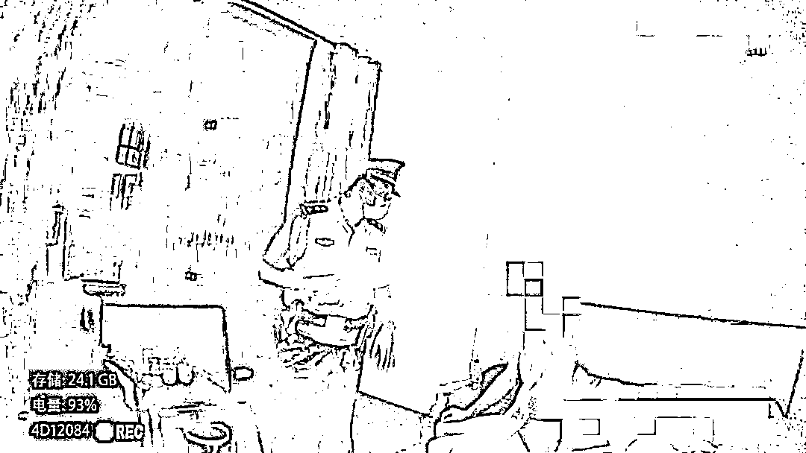

# 男子住宾馆将反诈号码当按摩广告，一个电话打进派出所！结果……

> 原文：[`mp.weixin.qq.com/s?__biz=MzIyMDYwMTk0Mw==&mid=2247544709&idx=4&sn=3a2ba6f403440341fb15ce7754105faa&chksm=97cbe4bda0bc6dabf74b5c0ac7ab2e0a3cdad923b7e54bf6b95c2171a4c6bb200f0d53e9f1df&scene=27#wechat_redirect`](http://mp.weixin.qq.com/s?__biz=MzIyMDYwMTk0Mw==&mid=2247544709&idx=4&sn=3a2ba6f403440341fb15ce7754105faa&chksm=97cbe4bda0bc6dabf74b5c0ac7ab2e0a3cdad923b7e54bf6b95c2171a4c6bb200f0d53e9f1df&scene=27#wechat_redirect)

近日

云南保山

青华派出所接到 1 名男子奇怪的

“报警”电话

[`mp.weixin.qq.com/mp/readtemplate?t=pages/video_player_tmpl&action=mpvideo&auto=0&vid=wxv_2593653809389518848`](https://mp.weixin.qq.com/mp/readtemplate?t=pages/video_player_tmpl&action=mpvideo&auto=0&vid=wxv_2593653809389518848)

**“你们那里有小妹没有？”**

值班民警非常疑惑

“请重复一次！”

“你们那里有小妹没有？”

话音刚落

男子意识到可能打错了

便立即将电话挂断

民警感觉情况非常可疑，便通过系统查询到该男子的活动区域，**随即前往该男子居住的宾馆核查情况。**

经了解得知，在宾馆客房内，**该男子看到电视机前摆放着派出所防范电诈宣传的摆件，误以为是“按摩”的广告**，于是拨通了摆件上派出所的电话，才发生了开始的那一幕。

**民警对该男子进行了法治宣传教育**，讲述“仙人跳”等电信网络诈骗的案例，并进行防范电信网络诈骗宣传。

来源：隆阳警方，红网

欢迎关注灰产圈社群服务号

