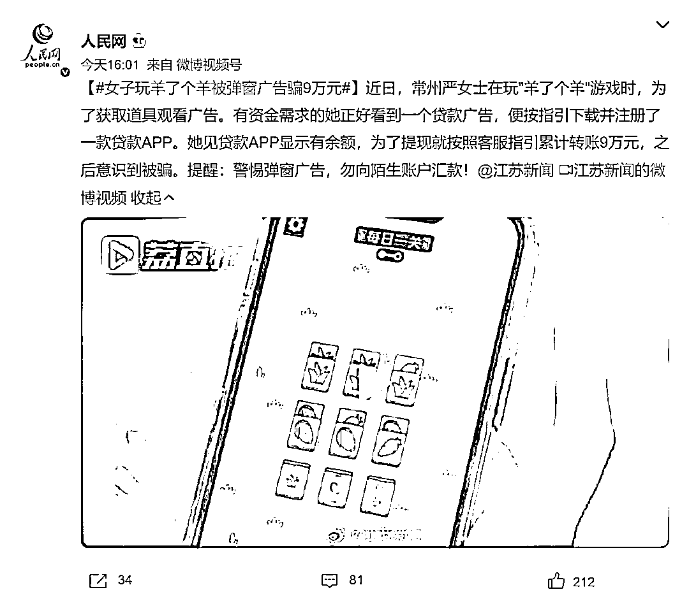
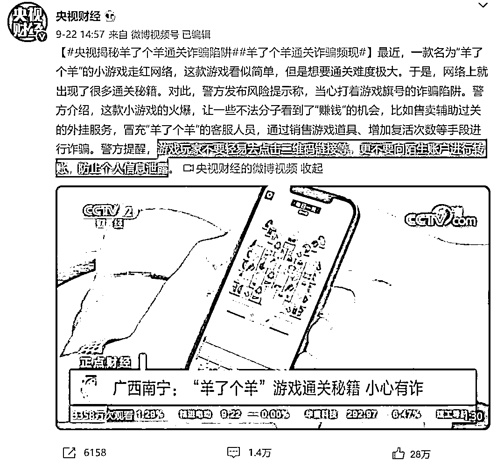
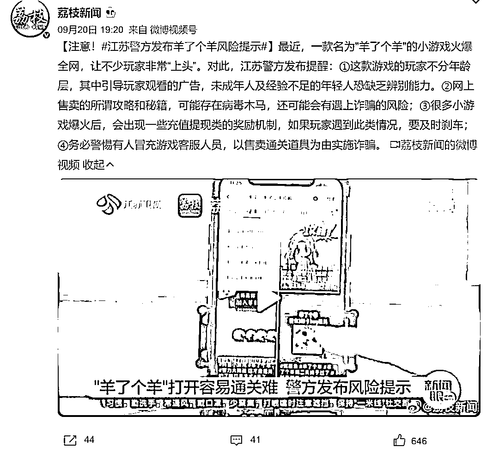

# 女子玩“羊了个羊”，被弹窗广告骗 9 万元

> 原文：[`mp.weixin.qq.com/s?__biz=MzIyMDYwMTk0Mw==&mid=2247544709&idx=5&sn=36c94a4795c804f8099b3161d8e44acc&chksm=97cbe4bda0bc6daba94a4b903b71ce78d6a9ca518b15ad2bc1c4ac6261ceb7febd3a8474da01&scene=27#wechat_redirect`](http://mp.weixin.qq.com/s?__biz=MzIyMDYwMTk0Mw==&mid=2247544709&idx=5&sn=36c94a4795c804f8099b3161d8e44acc&chksm=97cbe4bda0bc6daba94a4b903b71ce78d6a9ca518b15ad2bc1c4ac6261ceb7febd3a8474da01&scene=27#wechat_redirect)

近日，一款名叫“羊了个羊”的小游戏爆火网络。这款游戏让玩家们反复挑战、观看广告。

据@江苏新闻 报道，常州严女士在玩“羊了个羊”游戏时，为了获取道具观看了广告。这是一个贷款广告，有资金需求的她便按指引**下载并注册了一款贷款 APP**。她见贷款 APP 显示有余额，为了提现就按照客服指引**累计转账 9 万元**，之后意识到被骗。

[`mp.weixin.qq.com/mp/readtemplate?t=pages/video_player_tmpl&action=mpvideo&auto=0&vid=wxv_2596551295411666948`](https://mp.weixin.qq.com/mp/readtemplate?t=pages/video_player_tmpl&action=mpvideo&auto=0&vid=wxv_2596551295411666948)

网上这些陷阱 警方教你来辨别

“羊了个羊”小游戏火爆的同时，**多地警方也发布风险提示**。

一些不法分子看到了“赚钱”的机会，比如售**卖辅助过关的外挂服务**，**冒充“羊了个羊”的客服人员**，通过**销售游戏道具、增加复活次数**等手段进行诈骗。

警方提醒，游戏玩家**不要轻易去点击二维码链接**等，**更不要向陌生账户进行转账**，防止个人信息泄露。

①这款游戏的玩家不分年龄层，其中引导玩家观看的广告，未成年人及经验不足的年轻人恐缺乏辨别能力。

②网上售卖的所谓攻略和秘籍，可能存在病毒木马，还可能会有遇上诈骗的风险；

③很多小游戏爆火后，会出现一些充值提现类的奖励机制，如果玩家遇到此类情况，要及时刹车；

④务必警惕有人冒充游戏客服人员，以售卖通关道具为由实施诈骗。

网上这些陷阱，戳视频教你来辨别↓↓↓

[`v.qq.com/iframe/preview.html?width=500&height=375&auto=0&vid=s33579t1een`](https://v.qq.com/iframe/preview.html?width=500&height=375&auto=0&vid=s33579t1een)

来源：红网综合@江苏新闻，闪电新闻，@央视财经，@荔枝新闻等，红网

欢迎关注灰产圈社群服务号

