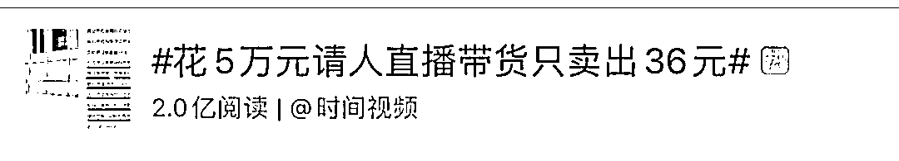
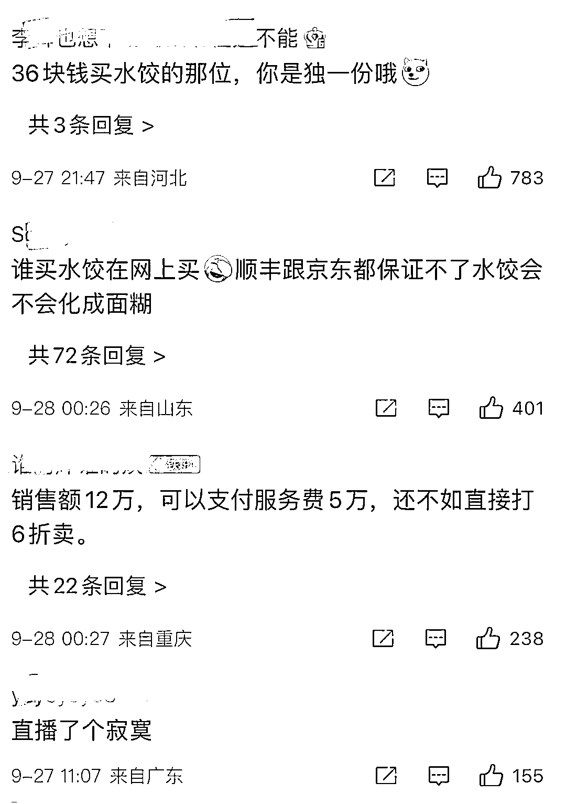

# 花 5 万元请人直播带货只卖出 36 元！法院这样判......

> 原文：[`mp.weixin.qq.com/s?__biz=MzIyMDYwMTk0Mw==&mid=2247544709&idx=6&sn=877d4f79f4ace50962dbd3e0ca95a368&chksm=97cbe4bda0bc6dab4028a8879ba6e85478ef0e7546010221ce9ee4361a86da8a9501a4b717d9&scene=27#wechat_redirect`](http://mp.weixin.qq.com/s?__biz=MzIyMDYwMTk0Mw==&mid=2247544709&idx=6&sn=877d4f79f4ace50962dbd3e0ca95a368&chksm=97cbe4bda0bc6dab4028a8879ba6e85478ef0e7546010221ce9ee4361a86da8a9501a4b717d9&scene=27#wechat_redirect)

近几年，直播带货火出新高度本想乘着直播带货提高销量不料，花 5 万元请公司直播带货销售额却只有 36 元近日，上海虹口法院对一起直播带货引发的营销服务费纠纷作出判决直播带货，只卖出 3 盒水饺 2021 年 4 月，华溪公司为提高速冻食品销量，找到提供直播带货服务的某传媒公司。双方签订带有对赌性质的营销服务合同，约定传媒公司提供有影响力的网红直播带货。双方约定服务费为 5 万元，传媒公司 45 天内完成总销售额 12 万元，如未能完成的，则需按照服务费与总销售额的对应比例进行退款。 华溪公司按约支付了 5 万元服务费，传媒公司安排主播对冷冻食品进行直播。2021 年 9 月 18 日销售 3 盒水饺，价格为 36 元，之后再无其他销售成交记录。合同约定的直播时间结束后，华溪公司要求传媒公司按约定退还相应服务费，然而传媒公司不光没退钱还在直播“翻车”后悄然跑路。网友：直播了个寂寞法院判决：退费！华溪公司将传媒公司诉至虹口法院，要求传媒公司按销售比例退还服务费用。案件受理后，传媒公司实际控制人王某偷偷办理了工商变更登记。虹口法院审理认为，两公司间合同真实有效，传媒公司可得服务费为 15 元，其余应退还。传媒公司内部股权转让事宜不能作为对原告行使合同权利的有效抗辩，最终虹口法院判决传媒公司退还华溪公司服务费 49985 元。

来源：新闻晨报综合上海虹口法院，新浪微博，红网

欢迎关注灰产圈社群服务号

