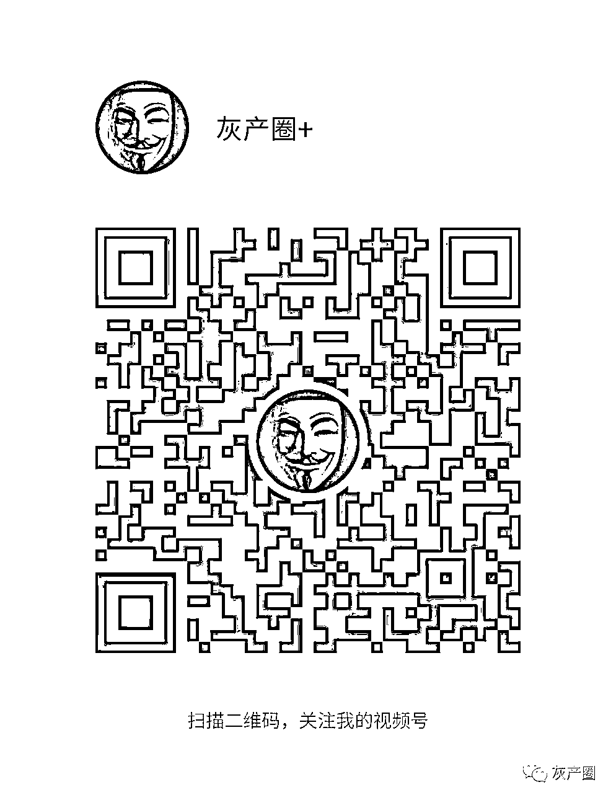

# 女商人被指“背景深”：补办他人身份证，转走他人账户 600 余万元

> 原文：[`mp.weixin.qq.com/s?__biz=MzIyMDYwMTk0Mw==&mid=2247544771&idx=2&sn=eb8da1512cb1854b428cacc22ca28adb&chksm=97cbe4fba0bc6dedfe2ce7b6a585a72f8c0811b4f77a0690b06df82e64e2945b00b73578234d&scene=27#wechat_redirect`](http://mp.weixin.qq.com/s?__biz=MzIyMDYwMTk0Mw==&mid=2247544771&idx=2&sn=eb8da1512cb1854b428cacc22ca28adb&chksm=97cbe4fba0bc6dedfe2ce7b6a585a72f8c0811b4f77a0690b06df82e64e2945b00b73578234d&scene=27#wechat_redirect)

创业有风险！

这句话对吉林润垚环境生物科技有限公司（以下简称“润垚公司”）法定代表人蔡女士来说并不陌生，令她没有想到的是，导致她一手创立的公司摇摇欲坠的居然是一张自己的身份证。

据蔡女士向“法度 Law”表示，这是一张“真”形式、“假”实质的身份证。

原来，在蔡女士不知情下，合作方女商人——刘某阳---爱斯特环境科技（吉林）有限公司（以下简称“爱斯特公司”）的实际经营者补办了她的身份证。

蔡女士说，正是利用这张新补办的身份证，刘某阳先以蔡女士的名义在银行重新办理了公司开户等业务，随后又将蔡女士公司账户上的 647 万元尽数转出。

而事后，刘某阳仅受到了 5 日行政拘留的处罚。

截至发稿时，蔡女士公司账户上被转走的钱款仍未追回，被刘某阳重新办理的公司账户也无法恢复到正常使用状态。

而蔡女士也曾报警，但“警方一直不立案，认为我们这是经济纠纷。”

**有“背景”的女商人**

2015 年 7 月，蔡女士创立了润垚公司，核心业务范围包括水处理设备、污泥处理及生物化工技术开发等。受到我国环保行业利好影响，公司业务自创立后蒸蒸日上。

据蔡女士介绍，刘某阳并非润垚公司最初的合作方，而是在 2020 年底才达成合作意向。

谈及设置公司合作方的初衷，蔡女士坦言道，她本人及公司核心团队均为科研出身，擅长的是开发技术领域，“合作方主要负责业务，包括签订项目、管理等。”

而刘某阳被看重的是她背后的政府资源。

最初，蔡女士与刘某阳并无相识。

在一家长期合作企业的介绍下，蔡、刘二人方才结识，介绍人曾向蔡女士表示，刘某阳是一个有“政府背景”的女商人。

“她的关系是吉林市副市长张某某，刘某阳对外说张副市长是她的姐夫，刚刚合作时，她带着张副市长来过我们厂区，当时，刘某阳当众喊姐夫，张副市长也没有反驳。”针对蔡女士的说法，“法度 Law”曾向张某某核实，但未得到回应。

**签订合作协议**

2020 年底，蔡女士与刘某阳双方达成合作协议，约定润垚公司和爱斯特公司合作开展处理污泥项目，润垚公司提供资质设备和厂房，爱斯特公司则负责项目运营。

协议还约定，所有合作项目均以润垚公司的名义对外签订，且加盖润垚公司公章，合作项目回款也须打入润垚公司的对公账户。同时，合同中还约定了详细的利润分配方法。

2021 年 1 月，蔡女士与刘某阳正式开始合作，不久，刘某阳就以“方便运营合作项目”的名义，要求蔡女士将润垚公司的营业执照、公章交由她的财务人员管理。

交接公章仅仅 2 个月时间，双方合作的隐忧就显露了出来。

当时，润垚公司因 160 多万元欠款被别人诉上了法院。

“这 160 万元是公司以前做项目的回款，项目是在刘某阳入场之前做的，回款跟她毫不相干，但这笔钱被刘某阳挪用了，说是项目需要购买设备等，还不上合同企业的回款，所以对方才把我们告了。”蔡女士解释说。

据蔡女士介绍，除账目问题之外，刘某阳一方对公章的管理方式也引发了润垚公司的不满。为此，3 月 11 日，润垚公司登报声明原公章作废，并重新办理了新公章，同时在开户行吉林银行汇通支行办理了印鉴变更。

**一张“真实”的假身份证**

2021 年，更大的危险降临。

一次偶然机会，蔡女士发现刘某阳在她毫不知情的情况下补办了一张自己的身份证。

事后，经警方调查与蔡女士多方了解，才还原出了事件的大致过程：

2021 年 3 月 16 日，刘某阳在吉林市高新区火炬大厦二楼户籍窗口，成功补办到了蔡女士的身份证。

对于刘某阳补办他人身份证的具体过程，负责办理此案的吉林市高新派出所的警察至今尚未对外公布，作为受害者的蔡女士也未能获悉更多细节。

11 月 4 日，刘某阳携带润垚生物公司法定代表人委托书、原公章和营业执照，向吉林银行汇通支行提出作废润垚公司原有的开户许可证，并申领新的开户许可证。

一番操作后，刘某阳顺利拿到了润垚公司的开户许可证。

11 月 19 日，刘某阳凭借着新的开户许可证在浦发银行吉林市分行开设了一个新的润垚公司账户。

自 11 月 22 日开始，陆续有项目回款进入到刘某阳开设的润垚公司账户中，累计金额达 647 万元。

随后，刘某阳分多笔将上述 647 万元项目回款转至自己实控的、与润垚公司并无业务关系的吉林环投科技有限公司。

因刘某阳在银行开设账户使用的身份证与蔡女士的身份证存在使用期限、地址的不同，蔡女士本人的身份证无法通过银行系统，至今无法取得自己公司账户的实际控制权，更遑论公司正常经营。

**蹊跷的行政处罚**

2021 年 12 月 8 日，在发现第二张身份证的存在后，蔡女士随即向高新派出所报案，但警方却迟迟未予立案，直到次年的 1 月 26 日，高新派出所才出具了受案回执。

随后，该案花费了近 5 个月的办理时间。

6 月 23 日，吉林市公安局高新分局对刘某阳作出的行政拘留 5 日的处罚决定。

据决定书内容显示：2022 年 3 月 16 日（此处为高新分局笔误，应为 2021 年），刘某阳在蔡某垚不知情的情况下，指使其司机刘某旭办理一张蔡某垚的居民身份证，刘某阳使用补办身份证在浦发银行吉林分行开设吉林润垚生物科技有限公司对公账户，用于接收公司回款 640 余万元。

针对这份迟来的行政处罚，蔡女士直呼诧异，“伪造我的身份证，转走了公司账户上的 600 多万，结果只是一个 5 天的行政拘留。”

处罚过后，警方仍未向蔡女士公开刘某阳补办她人身份证的详细过程。

北京市京师律师事务所张丽丽律师表示,办理身份证必须本人亲自办理，不能由他人代办，但对于个人原因不能亲自办理的，可以签订委托授权书，由直系亲属代为办理。但具体情况由当地公安机关按照规定的程序来处理。

北京家理律师事务所首席合伙人律师、主任易轶也表示，特殊情况本人不能亲自办理第二代居民身份证的，可以委托亲属代为办理。但代办人需要携带的有关证件，包括申领人书面委托书(涵盖内容：办证原因、申办证件种类、与代办人关系、代办人姓名、公民身分证号码、申领人亲笔签名)、本人在外地的居住证原件或复印件、申领人户口簿、符合标准的人像信息介质和代办人居民身份证原件及复印件。

根据《中华人民共和国居民身份证法》第十七条，有下列行为之一的，由公安机关处二百元以上一千元以下罚款，或者处十日以下拘留，有违法所得的，没收违法所得：

(一)冒用他人居民身份证或者使用骗领的居民身份证的; 

(二)购买、出售、使用伪造、变造的居民身份证的。

伪造、变造的居民身份证和骗领的居民身份证，由公安机关予以收缴。

第十八条则明确：伪造、变造居民身份证从事犯罪活动的，依法追究刑事责任。

实际上，为了恢复公司账户的正常使用，7 月 25 日，蔡女士向高新派出所提交了刑事立案申请，但派出所使用以“经济纠纷，构不成刑事”为由，拒绝立案，并拒绝向蔡女士出示不予立案通知书。

对于润垚公司账户的问题，高新派出所一位张姓警察在电话中给对蔡女士提出了建议：重新补办一张身份证。

2022 年 8 月，吉林市纪委监委驻公安局纪检组向蔡女士口头通报，称高新分局户籍部门因违规操作，民警魏某等三人行政降级，5 名领导受到警告处分。

至此，蔡女士被他人补办身份证、公司资金被转移一案再无其他进展。

针对此事，“法度 Law”曾向吉林市公安局以及高新派出所进行核实，但被婉拒。

**法学专家：或超出经济纠纷范畴**

2022 年 9 月 12 日，面对蔡女士的疑惑和求助，中国人民大学法学院教授杨立新、冯军和清华大学法学院教授黎宏出具了一份专家法律意见书。

认为刘某阳未经蔡女士本人同意或者授权，利用吉林市公安局高新分局制作蔡女士的身份证，涉嫌构成伪造身份证罪。

上述三位专家认为，“伪造”是指制作不真实的东西，包含有形伪造和无形伪造，后者指的是具有制作证件权限的人擅自以国家机关的名义制作与事实不符，内容虚假的证件的行为。

法律意见书还指出：本案中，刘某阳利用高新分局补办蔡女士的身份证的行为属于无形伪造。

同时，三位专家还认为，刘某阳使用伪造的蔡女士的身份证办理许可证、银行卡，转移润垚公司的资金，可能超出经济纠纷的范畴，公安机关应当进一步查清事实，确认刘某阳的行为是否有可能涉嫌使用虚假身份证件罪、盗窃罪等。

意见书显示，构成刑法中的盗窃罪需要具备两方面要件，一是主观上必须具有非法占有他人财物的目的，二是客观上具有秘密窃取他人财产，转移占有的行为。

法律意见书显示，虽然刘某阳确实与润垚公司签订了《合作协议》，如果经查证，刘某阳于《合作协议》乡下所享有的权利仅仅及于部分回款，可以认为 640 余万元并非全部归其所有。在此情形下，刘某阳将不属于自己的回款转移至其控制的账户，行为可能超出了经济纠纷，具有构成盗窃罪的嫌疑。

来源：法度

欢迎关注灰产圈社群服务号

