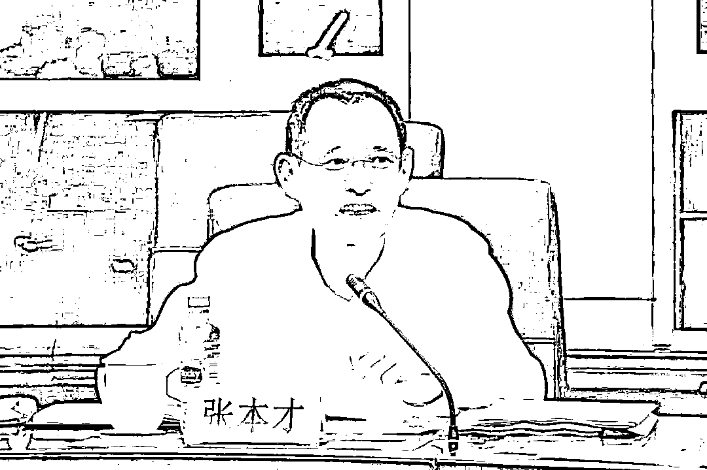
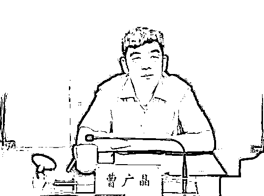
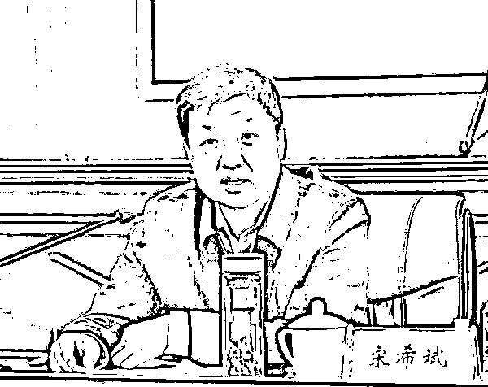

# 搞假结婚，辽宁原副省长王大伟被“双开”！张本才、曹广晶、宋希斌也被“双开”

> 原文：[`mp.weixin.qq.com/s?__biz=MzIyMDYwMTk0Mw==&mid=2247544771&idx=3&sn=05c43d2ab56d5d43645bd4e68fbd2f5b&chksm=97cbe4fba0bc6dedec6a841332611d131ef94fe69502c4ee67c112120d6394fefabb3cb3f58a&scene=27#wechat_redirect`](http://mp.weixin.qq.com/s?__biz=MzIyMDYwMTk0Mw==&mid=2247544771&idx=3&sn=05c43d2ab56d5d43645bd4e68fbd2f5b&chksm=97cbe4fba0bc6dedec6a841332611d131ef94fe69502c4ee67c112120d6394fefabb3cb3f58a&scene=27#wechat_redirect)

9 月 29 日晚 18 点，中央纪委国家监委网站发布消息，王大伟、曹广晶、宋希斌、张本才 4 名中管干部被处理。

落马近四个月，上海市检察院原党组书记、检察长**张本才**被“双开”。《检察日报》创始人之一，曾为最高检机关最年轻的厅官。

辽宁省原副省长、公安厅原厅长**王大伟**被“双开”。官方通报指其为掩盖“裸官”问题，搞假结婚欺骗组织，且徇私枉法践踏纪法底线，贪婪无度。

湖北省政府原党组成员、副省长**曹广晶**被“双开”，曾任三峡集团董事长。通报指其既想当官又想发财，把手中权力异化为谋取私利的工具。

黑龙江省人大常委会原党组成员、副主任**宋希斌**被“双开”，他在黑龙江省“两会”期间被带走，通报指宋希斌宗旨意识淡薄，漠视群众切身利益，不担当、不作为，严重损害党和政府的威信，纪法底线失守，胆大妄为。

**张本才：大搞迷信活动 破坏司法公正**

据中央纪委国家建委网站 9 月 29 日消息，日前，经中共中央批准，中央纪委国家监委对**上海市人民检察院原党组书记、检察长张本才**严重违纪违法问题进行了立案审查调查。

图片来源：中央纪委国家监委官网 （资料图）

经查，张本才丧失理想信念，弃守职责使命，对本职工作不担当不作为，履行全面从严治党主体责任不力，**大搞迷信活动，对抗组织审查；**违反组织原则，不按规定报告个人有关事项，利用职权为多人安排工作，败坏任职单位选人用人风气；纵容、默许亲属利用其职务影响谋取私利；违规干预和插手司法活动，**破坏司法公正；**执法犯法，以权谋私，利用职务便利为他人在项目开发、企业经营等方面谋利，并非法收受巨额财物。

张本才严重违反党的政治纪律、组织纪律、廉洁纪律、工作纪律和生活纪律，构成严重职务违法并涉嫌受贿犯罪，且在党的十八大后不收敛、不收手，性质严重，影响恶劣，应予严肃处理。依据《中国共产党纪律处分条例》《中华人民共和国监察法》《中华人民共和国公职人员政务处分法》等有关规定，经中央纪委常委会会议研究并报中共中央批准，决定给予张本才开除党籍处分；由国家监委给予其开除公职处分；收缴其违纪违法所得；将其涉嫌犯罪问题移送检察机关依法审查起诉，所涉财物一并移送。

2022 年 6 月 1 日晚，中央纪委国家监委官网宣布：担任上海市检察院检察长已七年多的张本才落马。

公开资料显示，张本才出生于 1967 年 5 月。2016 年，他任上海市人民检察院检察长、党组书记。

张本才今年 55 岁（1967 年 5 月出生），山东临沂人，先后毕业于山东大学中文系汉语言文学专业和吉林大学刑法学专业。他 1990 年大学毕业后即进入最高检，旋即赴辽宁省辽阳县检察院锻炼，1991 年 3 月入职《中国检察报》（1995 年底更名《检察日报》），五年内由科员、编辑逐步晋升至总编辑助理、总编室主任。

1999 年 4 月，32 岁的张本才转任最高检政治部宣传部部长，从而成为当时最高检机关最年轻厅官。2004 年 2 月，张本才重返《检察日报》社任总编辑，2005 年 3 月任社长、党委书记兼最高检影视中心主任，2008 年 4 月挂职任北京市检察院副检察长一年；

2009 年在任《检察日报》社党委书记、社长时，张本才被评为享受国务院政府特殊津贴人员。

2011 年 9 月，张本才出任最高检计划财务装备局局长；2013 年 1 月任最高检办公厅主任、新闻发言人；2014 年最高检新闻办公室成立后，又兼任新闻办公室主任。

2016 年 1 月，49 岁的张本才升任上海市检察院党组书记、检察长，成为当时最年轻的省级检察院检察长，至今已六年多。

**王大伟：为掩盖“裸官”问题**

**搞假结婚欺骗组织**

据中央纪委国家建委网站 29 日消息，日前，经中共中央批准，中央纪委国家监委对**辽宁省政府原党组成员、副省长，公安厅原党委书记、厅长王大伟**严重违纪违法问题进行了立案审查调查。

图片来源：中央纪委国家监委官网 （资料图）

经查，王大伟毫无理想信念，背弃初心使命，对党不忠诚、不老实，**为掩盖“裸官”问题，搞假结婚欺骗组织；**无视中央八项规定精神，违规收受他人大额钱款、借用管理和服务对象车辆；**大肆卖官鬻爵，**在干部选拔任用工作中为他人谋利，严重破坏任职地区和系统的选人用人制度和政治生态；生活腐化，道德败坏；既想当大官又想发大财，徇私枉法践踏纪法底线，贪婪无度，利用职务便利为他人在企业经营等方面谋利，并非法收受巨额财物。

王大伟严重违反党的政治纪律、组织纪律、廉洁纪律和生活纪律，构成严重职务违法并涉嫌受贿犯罪，且在党的十八大后不收敛、不收手，性质严重，影响恶劣，应予严肃处理。依据《中国共产党纪律处分条例》《中华人民共和国监察法》《中华人民共和国公职人员政务处分法》等有关规定，经中央纪委常委会会议研究并报中共中央批准，决定给予王大伟开除党籍处分；由国家监委给予其开除公职处分；免去其第十三届辽宁省委委员职务，终止其辽宁省第十三次党代会代表资格；收缴其违纪违法所得；将其涉嫌犯罪问题移送检察机关依法审查起诉，所涉财物一并移送。

2022 年 3 月 1 日晚，中央纪委国家监委网站发布王大伟落马的消息。随后，其简历从辽宁省政府官网撤下。

公开资料显示，王大伟今年 58 岁（1964 年 4 月生），黑龙江望奎人，26 岁参加工作，成为国家林业投资公司林业森工项目部综合处的一名干部。一年半后，王大伟进入国务院经贸办，先后任秘书局干部、助理工程师、主任科员。1994 年 5 月至 1998 年 9 月，王大伟又先后任国家经贸委办公厅副处级秘书、正处级秘书。

1998 年 9 月，王大伟进入中国联通公司任计划市场部副部长。仅三个月后，王大伟又进入中国发展研究基金会工作，后任中国发展研究基金会副秘书长，明确正局级。其间，2001 年 6 月至 2003 年 6 月，王大伟挂职任黑龙江省哈尔滨市副市长。

2003 年 6 月，王大伟正式出任哈尔滨市副市长；2007 年 1 月，王大伟任哈尔滨市委常委、政法委书记。

两年半后的 2009 年 7 月，王大伟升任黑龙江省公安厅党委副书记、副厅长（正厅级）。

2013 年，他调任辽宁省公安厅党委书记、厅长，后任辽宁省政府副省长、省公安厅厅党委书记、厅长，直至此次落马。

# **曹广晶：干预司法 既想当官又想发财** 

据中央纪委国家建委网站 29 日消息，日前，经中共中央批准，中央纪委国家监委对**湖北省政府原党组成员、副省长曹广晶**严重违纪违法问题进行了立案审查调查。

图片来源：中央纪委国家监委官网 （资料图）

经查，曹广晶丧失理想信念，背弃初心使命，**结交“政治骗子”，搞政治投机，对党不忠诚不老实，处心积虑对抗组织审查，搞迷信活动；**违反中央八项规定精神，违规收受礼金，接受可能影响公正执行公务的宴请和旅游安排；不按规定报告个人有关事项，在组织函询时不如实说明问题，在干部选拔任用、职工录用工作中违规为他人谋利；违规从事营利活动，搞权色、钱色交易；违规干预和插手司法活动；贪欲膨胀，既想当官又想发财，把手中权力异化为谋取私利的工具，利用职务便利为他人在企业经营、工程承揽等方面提供帮助，并非法收受巨额财物。

曹广晶严重违反党的政治纪律、组织纪律、廉洁纪律、工作纪律和生活纪律，构成严重职务违法并涉嫌受贿犯罪，且在党的十八大后不收敛、不收手，性质严重，影响恶劣，应予严肃处理。依据《中国共产党纪律处分条例》《中华人民共和国监察法》《中华人民共和国公职人员政务处分法》等有关规定，经中央纪委常委会会议研究并报中共中央批准，决定给予曹广晶开除党籍处分；由国家监委给予其开除公职处分；收缴其违纪违法所得；将其涉嫌犯罪问题移送检察机关依法审查起诉，所涉财物一并移送。

半年多前的 2 月 24 日，中央纪委国家监委官网发布消息：曹广晶涉嫌严重违纪违法，目前正接受纪律审查和监察调查。

公开资料显示，曹广晶今年 58 岁（1964 年 3 月生），山东邹平人，1985 年自华东水利学院（河海大学前身）水港系港口及航道工程专业本科毕业后，即在中国长江三峡集团公司（下称“三峡集团”）任职 29 年，一路从见习逐步晋升至集团董事长，2010 年 1 月，他任三峡集团董事长、党组书记。

在三峡集团期间，曹广晶获得了不少荣誉，如 2001 年获国务院颁发的政府特殊津贴，被评为 2003 年度十大科技新闻人物，获“第十四届全国十大杰出青年提名奖”等。此外他还先后完成了在河海大学管理工程系水利发电工程专业和天津大学建筑工程学院管理与工程专业的学习，获得工学硕士、管理学博士学位。

2014 年，他转任湖北省副省长，8 年后在任上被查。

**宋希斌：漠视群众利益、纪法底线失守**

据中央纪委国家建委网站 29 日消息，日前，经中共中央批准，中央纪委国家监委对**黑龙江省人大常委会原党组成员、副主任宋希斌**严重违纪违法问题进行了立案审查调查。

图片来源：中央纪委国家监委官网 （资料图）

经查，宋希斌丧失理想信念，**政治意识淡漠，对抗组织审查，大搞迷信活动；**无视中央八项规定精神，多次违规接受宴请，在分配、购买住房中侵犯国家利益；不按要求报告个人去向，在干部选拔任用等工作中为他人谋利；违规收受礼金，搞权色、钱色交易；**宗旨意识淡薄，漠视群众切身利益，不担当、不作为，严重损害党和政府的威信；违规干预司法活动；纪法底线失守，胆大妄为，**利用职务便利为他人在企业经营、工程承揽等方面谋利，并非法收受巨额财物；挪用公款，数额巨大。

宋希斌严重违反党的政治纪律、组织纪律、廉洁纪律、群众纪律、工作纪律和生活纪律，构成严重职务违法并涉嫌受贿、挪用公款犯罪，且在党的十八大后不收敛、不收手，性质严重，影响恶劣，应予严肃处理。依据《中国共产党纪律处分条例》《中华人民共和国监察法》《中华人民共和国公职人员政务处分法》等有关规定，经中央纪委常委会会议研究并报中共中央批准，**决定给予宋希斌开除党籍处分；由国家监委给予其开除公职处分；**收缴其违纪违法所得；将其涉嫌犯罪问题移送检察机关依法审查起诉，所涉财物一并移送。

2022 年 1 月 26 日，中央纪委国家监委网站发布消息称，宋希斌涉嫌严重违纪违法，目前正接受纪律审查和监察调查。

公开资料显示，宋希斌今年 59 岁（1963 年 4 月出生），山东蓬莱人，1985 年从哈尔滨师范专科学校毕业后到哈尔滨市第十四中学任教师、团委书记。1986 年 3 月，宋希斌步入仕途，从共青团黑龙江省哈尔滨市委少年部干事做起，19 年内在黑龙江共青团系统逐步晋升至团省委书记。

2005 年 6 月，42 岁的宋希斌离开共青团系统，转任黑龙江省政府副秘书长，但就在五个月后即“外放”大兴安岭地委副书记、行署专员、林管局局长，两年多后改任大兴安岭地委书记。

又两年后的 2010 年 2 月，宋希斌重返哈尔滨出任省发改委主任。但在这个位置上不足两年，2011 年 12 月，宋希任斌哈尔滨市委副书记、副市长；2012 年任哈尔滨市市长。

六年后的 2018 年 1 月，54 岁的宋希斌由哈尔滨市长平级转任黑龙江省人大常委会副主任，并于 2019 年 8 月兼任省总工会主席。

封面图片来源：中央纪委国家监委官网 （资料图）

来源：每日经济新闻综合自中央纪委国家监委官网、上观新闻、公开资料、政事儿

欢迎关注灰产圈社群服务号

