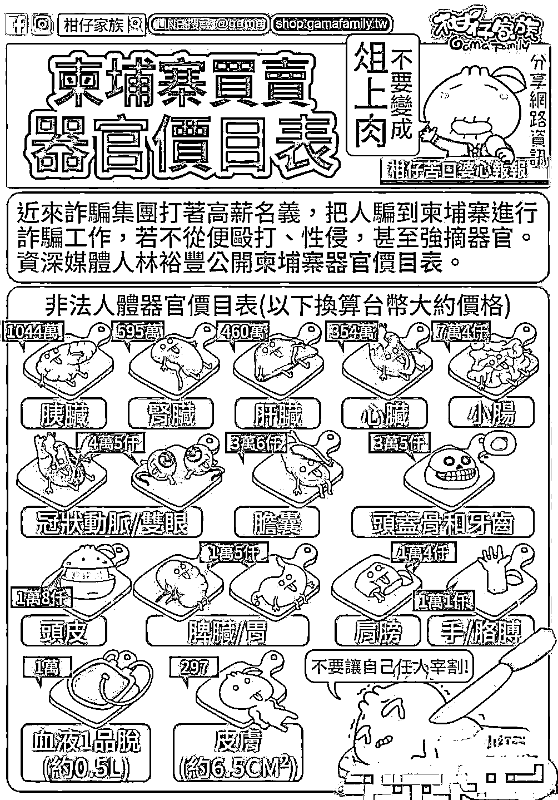

# 水牢、毒打、电击、活埋……诈骗之后，东南亚绑架和人口买卖生意猖獗

> 原文：[`mp.weixin.qq.com/s?__biz=MzIyMDYwMTk0Mw==&mid=2247544771&idx=4&sn=70b19551c039e488bba8af5e7f055d9e&chksm=97cbe4fba0bc6ded7596c52199ceedfe721dd23642f06c4615a200aa1e9b4427725f78121881&scene=27#wechat_redirect`](http://mp.weixin.qq.com/s?__biz=MzIyMDYwMTk0Mw==&mid=2247544771&idx=4&sn=70b19551c039e488bba8af5e7f055d9e&chksm=97cbe4fba0bc6ded7596c52199ceedfe721dd23642f06c4615a200aa1e9b4427725f78121881&scene=27#wechat_redirect)

近日央视网报道

从事捕鱼业的何氏两兄弟

经中间人介绍协助组织者潘某

接运中国公民偷渡境外

从事涉诈犯罪活动

并最终在一次接运人员的过程中

被广西边境管理部门查获

一同被抓获的还有

组织偷越国边境的主犯潘某等人

以及船上 18 名欲偷渡人员

[`mp.weixin.qq.com/mp/readtemplate?t=pages/video_player_tmpl&action=mpvideo&auto=0&vid=wxv_2596333688511135746`](https://mp.weixin.qq.com/mp/readtemplate?t=pages/video_player_tmpl&action=mpvideo&auto=0&vid=wxv_2596333688511135746)

（视频源自：央视网微博）

为牟利组织、运送他人偷越国边境 

替境外诈骗集团输送“劳动力”的人

可恶至极、罪有应得

那些抱着虚幻发财梦的偷渡者

同样受到了法律的制裁

但他们又无疑是幸运的

这些年

中国公民前往东南亚“淘金”

特别是缅北和柬埔寨

遭受**殴打**、**凌虐**、**强奸**

**囚禁**、**绑架**、**贩卖**

甚至遇害**活埋**的消息

屡屡见报

01

《法治在线》曾报道

**#一男子去缅北淘金却每日遭暴打#**

[`mp.weixin.qq.com/mp/readtemplate?t=pages/video_player_tmpl&action=mpvideo&auto=0&vid=wxv_2596499141019697154`](https://mp.weixin.qq.com/mp/readtemplate?t=pages/video_player_tmpl&action=mpvideo&auto=0&vid=wxv_2596499141019697154)

在国家移民局

多地警方的协作努力下

李某终于摆脱魔爪 

但并不是每个人都有如此幸运

据缅甸掸邦北部消息，今年 2-4 月份，仅在掸邦北部就发现了**32****具无主遗体**，很多都是被枪杀的，有的是被反绑着双手杀害的。最后只能由公益组织帮助下葬。更多的，是大量的失踪人口，活不见人，死不见尸。

02

自国内各地开始大力劝返

在缅北和柬埔寨等地区的涉诈人员

各诈骗集团立马面临

**一线人员不足**的问题

（这一点从诈骗集团购买“人头”的费用也可以看出变化。2019 年一个人头费还只要 5000 左右，到今年已经普遍涨到 2、3 万。）

诈骗集团为招募“劳动力”

可谓无所不用其极

不仅通过各种大流量窗口

向外发布鼓吹境外赚大钱的广告 

引诱不谙世事的年轻人前往淘金

****

还将黑手伸向国内的亲朋好友

家住南通的小孟曾因打架被判刑

释放后在一家汽车租赁公司上班

2021 年年初公司因疫情倒闭

一家日子过得紧巴巴

恰在小孟苦恼时转机出现

其儿时的玩伴小胖给他发微信

说自己在柬埔寨开了一家 KTV

生意很好，需要人手

邀请小孟去上班承诺包吃包住

一个月能赚 1 万元到 2 万元

还手把手安排小孟偷渡 

小孟一行人跋山涉水东躲西藏 

在越南、柬埔寨边境遭遇检查

被关进小黑屋没吃没喝十个多小时

后趁机跑了出来被越南警方发现

将其一行人遣返

民警前往隔离点将小孟等人带回

并在当地向小孟等人了解案件事实

经调查小孟的儿时好友小胖 

在柬埔寨从事电信网络诈骗活动

根本不是开 KTV 的老板

招募小孟等人就是为了从事诈骗活动

03

**诈骗集团如此疯狂地招募**

**究其原因是**

电信网络诈骗并不受

“人头边际效应”的影响

【即员工达到一定数量后，再增加员工会导致整体的生产效率下降】

团伙人越多骗到的钱越多

对暴利的电诈集团来说

那点人头费根本不算什么

而且人还能转卖出去 

一个劳力可以反复被卖 30 多次

每卖一次还能加价一次

至少不会亏本大多还能狠赚一笔

**因此不少诈骗团伙甚至干脆转行** 

**专门做起了人头生意**

卖不了人还可以卖身体器官

血液、眼角膜、心脏

肝脏、肾脏、头皮、牙齿、韧带

与骨骼甚至人皮......

除了排泄物

人体的大部分零件都可以

明码标价直接出售

****

（更奇葩的是有个公司搞团建，去的就是柬埔寨，结果一公司的人一锅端全被老板卖了。）

这些可都是稳赚不赔的生意啊

所以东南亚的诈骗集团全年无休

24 小时都在招人

利益的刺激

让绑架、敲诈勒索、凶杀

在缅北和柬埔寨等地愈加猖獗

不仅中国人，越南、泰国、老挝等

周边国家人口也成为了主要目标

奉劝那些企图偷渡 

去国外发大财的人

及早打消念头

同时正告那些仍滞留境外

从事违法犯罪活动的人

看清形式，早日回国自首

争取依法从轻或减轻处罚

来源：南通反诈，邯郸市反诈中心

欢迎关注灰产圈社群服务号

