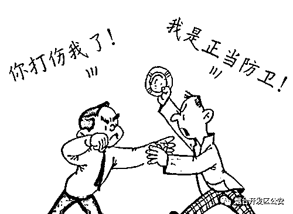
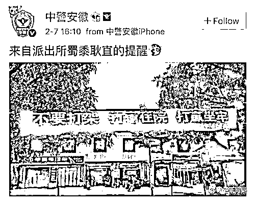

# 统一回复：别人先动手打我，我还手，难道不是正当防卫吗？

> 原文：[`mp.weixin.qq.com/s?__biz=MzIyMDYwMTk0Mw==&mid=2247544771&idx=5&sn=79555e932e99e0575668c40dca63dcf9&chksm=97cbe4fba0bc6ded839c92a1eae806b0eb7335619ad45f70e21bdb95cdda74e58c9989861caa&scene=27#wechat_redirect`](http://mp.weixin.qq.com/s?__biz=MzIyMDYwMTk0Mw==&mid=2247544771&idx=5&sn=79555e932e99e0575668c40dca63dcf9&chksm=97cbe4fba0bc6ded839c92a1eae806b0eb7335619ad45f70e21bdb95cdda74e58c9989861caa&scene=27#wechat_redirect)

生活中，有时会发生这样的一幕，你跟对方吵架，对方打了你一拳，恼羞成怒的你立马打对方一拳还了回去。警察过来处理时要将你带走，这时，相信很多人会理直气壮地说：“是别人先动手打我，我还手，难道不是正当防卫吗？”

**下面，**

**让小编用真实的案例**

**来为你解读**

**到底什么属于——正当防卫**

**案情回顾**

小王和朋友小张一起在开发区某饭店吃饭喝酒，两人都喝得有点多，开始以谁更有钱，生意做的更大吹嘘起来，结果两人互不相让，争吵起来。小王先将一个酒瓶摔在地上，小张见状一拳打在小王面部，小王见对方先动手也还手和小张打了起来，但因为喝的太多被小张打倒在地，小王恼羞成怒，捡起刚才摔碎的啤酒瓶一下扎到小张的颈部，小张的脖子顿时鲜血直流。民警赶来后立即把小张送到医院救治，小王也被传唤到派出所接受讯问。面对民警，小王理直气壮的说，是对方先动手打他才还手，他是正当防卫，不应该抓他。后经法医鉴定，小张的伤势已经构成轻伤，小王因涉嫌故意伤害罪被刑事拘留。小张的行为也涉嫌殴打他人，将给予行政拘留处罚。

**评案说法**

生活中，经常会发生这样的一幕，对方打了你一巴掌，你立马打对方一拳还回去，警察过来了，很多人然后理直气壮的说：“是他先动手打的我，我还手属于正当防卫!”

如果遭到对方殴打，可以选择报警、躲避，但是如果还手殴打了对方，造成事态扩大，双方都要承担相应的责任的。正当防卫的本质在于制止不法侵害，保护合法权益。而别人先动手打你，你还手，通常被认定为互殴行为，斗殴双方都在积极追求非法损害对方的结果，因而根本上不存在正当防卫的意图，不能构成正当防卫。

从现有的司法判例来看，被打后还手造成对方伤亡，被认定为正当防卫的判例少之又少，所谓实施了“正当防卫”行为的当事人大多以故意伤害，故意杀人被定罪判刑。正当防卫是法律赋予公民的一项重要权利，是鼓励和保障公民同违法犯罪行为做斗争的重要手段。该出手时就出手，但切记不要乱出手、出重手，一定要结合实际情况作出正确判断，否则要承担相应的刑事责任。

  **正当防卫**

根据我国刑法第二十条的规定，为了使国家、公共利益、本人或者他人的人身、财产和其他权利免受正在进行的不法侵害，而采取的制止不法侵害的行为，对不法侵害人造成损害的，属于正当防卫，不负刑事责任。

它应该符合五个条件：

**一、正当防卫所针对的，必须是不法侵害;**

**二、必须是在不法侵害正在进行的时候;**

**三、正当防卫所针对的、必须是不法侵害人;**

**四、正当防卫不能超越一定限度;**

**五、对不法侵害行为人，在采取的制止不法侵害的行为时，所造成损害的行为。**

 **特别防卫**               

刑法第 20 条第 3 款规定：“对正在进行行凶、杀人、抢劫、强奸、绑架以及其它严重危及人身安全的暴力犯罪，采取防卫行为，造成不法侵害人伤亡的，属于正当防卫，不负刑事责任。”

根据这一规定，特别防卫权的行使，必须具备三个条件：

**第一，客观上存在着严重危及人身安全的暴力犯罪，这是行使特别防卫权的前提条件;**

**第二，严重的暴力犯罪是正在进行中的，这是行使无限防卫权的时间条件;**

**第三，防卫行为只能是针对不法侵害人本人实施的，这是行使无限防卫权的对象条件。**

在符合上述三个条件的情况下防卫人因防卫行为至不法侵害人伤亡后果的，即使造成重大损害的，仍为正当防卫而不属于防卫过当，应受法律的保护而不负刑事责任。

这主要是因为行凶、杀人、抢劫、强奸、绑架以及其它严重危及人身安全的暴力犯罪，对社会及公民的危害性非常严重，而且制止这些犯罪的难度非常大，新刑法特别如此规定，有利于鼓励公民同那些极端犯罪分子作斗争，使广大公民更有利于保护自己的合法权益。

**上述案例中小王的行为明显不构成正当防卫，因为对方殴打的行为不属于明显的暴力行为，且未严重危及到生命安全。其主观上也不是为制止对方。其本人先挑衅摔酒瓶，对案件的发生也有过错责任。两人的行为应属于互相殴斗。因此，两人都要承担相应的法律后果。**

**互相斗殴**，指双方或多方在主观上均具有不法侵害的故意，客观上均实施了不法侵害对方的行为。是互殴各方均有对对方加害的行为，根据《中华人民共和国刑法》的相关规定，在互相斗殴的过程中一般不存在正当防卫的行为。

**正当防卫误区**

**       特别需要指出的是，大致有以下 9 种行为不属于正当防卫：**

       1、打架斗殴中，任何一方对他人实施的暴力侵害行为。两人及多人打架斗殴，一方先动手，后动手的一方实施的所谓反击他人侵害行为的行为，不属于正当防卫。 

       2.对假想中的不法侵害实施的所谓“正当防卫”行为。不法侵害必须是在客观上确实存在，而不是主观想象的或者推测的。 

       3.对尚未开始不法侵害行为的行为人实施的所谓“正当防卫”行为。 

       4.对自动停止，或者已经实施终了的不法侵害的行为人实施的所谓“正当防卫”行为。 

       5.不是针对正在进行的不法侵害者本人，而是无关的第三者的所谓“正当防卫”行为。 

       6.不法侵害者已被制伏，或者已经丧失继续侵害能力时的所谓“正当防卫”行为。 

       7.防卫挑拨式的所谓“正当防卫”行为。即为了侵害对方，故意挑逗他人向自己进攻，然后借口正当防卫加害对方。 

       8.对合法行为采取的所谓“正当防卫”行为。公安人员依法逮捕、拘留犯罪嫌疑人等合法行为，嫌疑人不得以任何借口实行所谓的“正当防卫”。对紧急避险行为也不能实行正当防卫。 

       9.起先是正当防卫，但后来明显超过必要限度造成重大损害的行为。此种行为，法律称为“防卫过当”，不属正当防卫的范畴（出现刑法第二十条第三款规定的情况例外）。

**那么问题来了，**

**别人先动手打你时你该怎么办呢?**

**1\. 保证自己人身安全的情况下，立马报警。**

**2\. 立马跑路，躲避殴打。**

**名词解释：打架**

****

 在法律上称为殴打他人，或故意伤害他人身体，按照法律规定，一般可处以拘留或者罚款。如果殴打他人经法医鉴定，受害人的伤势为“轻伤”或“重伤”，行为人可判有期徒刑。

**伤情较轻，属轻微伤的**

虽然致人轻微伤不构成故意伤害罪，但是依据《治安管理处罚法》的相关规定，应受治安处罚。** 应处五日以上十日以下拘留，并处二百元以上五百元以下罚款；情节较轻的，处五日以下拘留或者五百元以下罚款。**

**常见二级轻伤**

1、头皮创口或者瘢痕长度累计 8.0 厘米以上

2、肢体皮肤一处创口或者瘢痕长度 10.0 厘米以上；两处以上创口或者瘢痕长度累计 15.0 厘米以上

3、面部单个创口或者瘢痕长度 4.5 厘米以上；多个创口或者瘢痕长度累计 6.0 厘米以上。

4、颈前部单个创口或者瘢痕长度 5.0 厘米以上；多个创口或者瘢痕长度累计 8.0 厘米以上。

5、体表单个创口或者瘢痕长度 10.0 厘米以上；多个创口或者瘢痕长度累计 15.0 厘米以上

6、牙齿脱落或者牙折 2 枚以上。

7、除拇指外的一个指节离断或者缺失。

8、人身体的四肢长骨骨折、髌骨等主要部分骨折原则上都是轻伤，但是肋骨骨折要 2 处以上，指节骨折要区分情形，两节指骨线性骨折或者一节指骨粉碎性骨折，且应注意骨折和骨裂是两个概念。

9、听力：外伤性鼓膜穿孔 6 周不能自行愈合。

**重伤**

《刑法》第二百三十四条故意伤害他人身体的，处三年以下有期徒刑、拘役或者管制。

**犯前款罪，致人重伤的，处三年以上十年以下有期徒刑；致人死亡或者以特别残忍手段致人重伤造成严重残疾的，处十年以上有期徒刑、无期徒刑或者死刑。本法另有规定的，依照规定。**

* * *

**打架成本有多高？你知道吗？** 

**1.轻微伤的打架成本**=5 日至 15 日拘留 **+** 500 元至 1000 元罚款 **+** 医药费、误工费等赔偿 **+** 因拘留少挣的工资。

**2.轻伤的打架成本**=3 年以下有期徒刑 **+** 赔偿金 **+** 医药费、误工费等赔偿 **+** 因判刑少挣的工资。

**3.重伤的打架成本**=3 年以上 10 年以下有期徒刑、无期徒刑或死刑 **+** 经济赔偿 **+** 社会及家庭严重影响。

**4.打架附加成本**=民事责任费用（诉讼费+律师费+医药费+误工费） **+** 公安机关留下前科劣迹** +**心情沮丧郁闷 **+ **名誉形象受损 **+** 家人朋友担忧 **+** 工作生意等遭受更大损失。

除此之外，在一旦在公安机关留下前科劣迹之后，犯罪记录伴随终生，今后个人甚至自己的子女考公务员、参军、入党、出国、留学、就业都受限制。

**人与人之间并没有什么深仇大恨，也许双方坐下来谈谈问题就可以完美的解决，打架前请三思！**

来源：刑事正义,人间法则

欢迎关注灰产圈社群服务号

