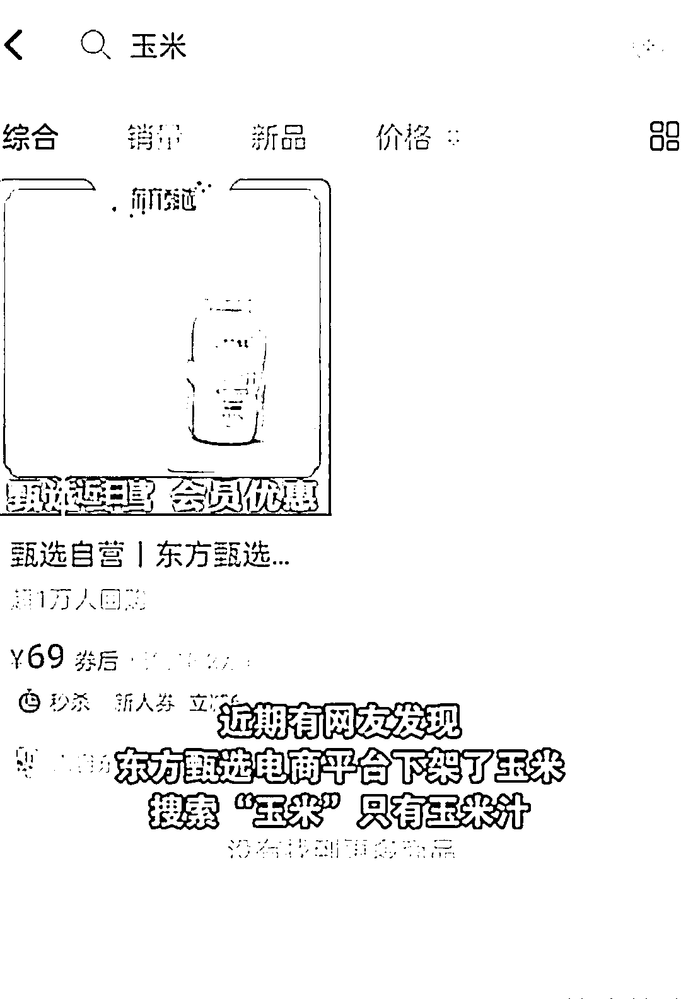
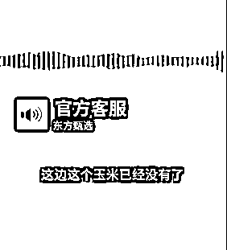
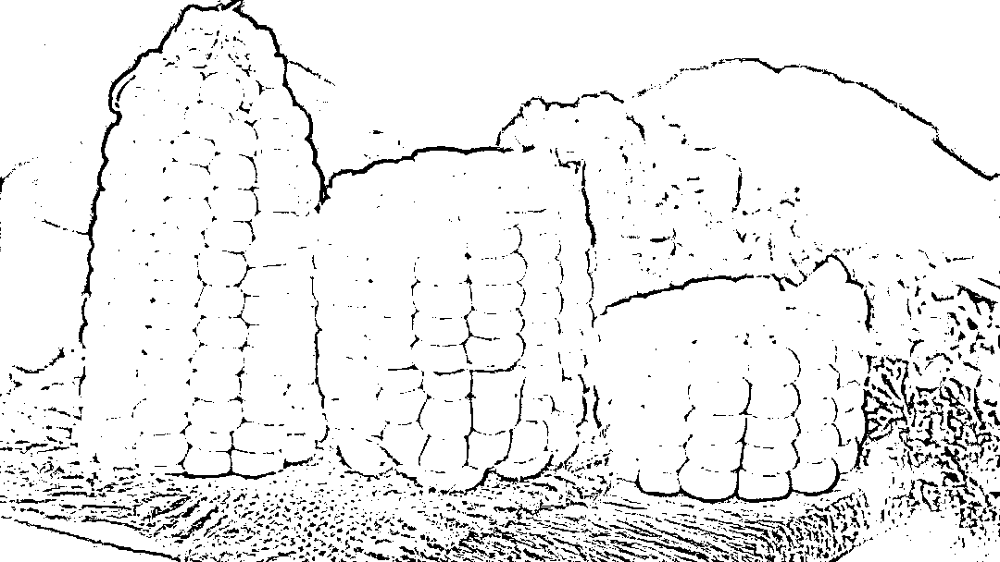

# 6 元一根的玉米，东方甄选下架了？回应来了

> 原文：[`mp.weixin.qq.com/s?__biz=MzIyMDYwMTk0Mw==&mid=2247544771&idx=7&sn=38bad71126f5818292a70c0e1f09da28&chksm=97cbe4fba0bc6ded3f403b3a6e01199daf1cc46c274df26a36f80b8cc2b1717b7a8aeec1c2e5&scene=27#wechat_redirect`](http://mp.weixin.qq.com/s?__biz=MzIyMDYwMTk0Mw==&mid=2247544771&idx=7&sn=38bad71126f5818292a70c0e1f09da28&chksm=97cbe4fba0bc6ded3f403b3a6e01199daf1cc46c274df26a36f80b8cc2b1717b7a8aeec1c2e5&scene=27#wechat_redirect)

9 月 29 日，“东方甄选回应下架玉米”消息冲上热搜。近期，有网友发现东方甄选电商平台下架了玉米，搜索“玉米”只有玉米汁。客服回应称，为了保证品质，厂家不能超量生产，产品的产量是不固定的，只要厂家有产能就会尽快上架商品链接。

图片来源：网络视频截图 

在此之前“东方甄选一根玉米卖 6 元”的事件曾引起热议。主播辛巴曾在直播时质疑东方甄选把批发价 7 毛钱一根的玉米卖 6 块钱，“丧良心”。而东方甄选主播董宇辉则回应称，东方甄选卖的玉米收购价已达 2 元，并且农产品根本没有暴利。

问题来了，6 块钱一根的玉米究竟贵不贵？

**一根玉米引发的争议**

近日，一根鲜食玉米让直播带货界吵翻了天。

事情起因是这样的。9 月 18 日，网红辛巴在直播间中质疑东方甄选将批发价 7 毛一根的玉米卖 6 元，还标榜“谷贱伤农”。

也有网友质疑东方甄选直播间“一根玉米 6 元钱”太贵，带货农产品价格普遍较高。对此，前新东方老师、主播董宇辉回应说，“谷贱伤农”，一个东西如果彻底没有利润，那么农村种地的人就会越来越少，所以价格不能太低。

董宇辉回应称，大部分的玉米是用来（作饲料）养牲口的，所以价格确实是 4、5 毛钱一根。我们找的生食玉米来自东北好的产地，成本本来就很高，从地里收上来就是 2 元一根。另外还有包装、物流和营销方面的投入。

**6 元一根玉米贵吗？**

9 月 28 日，《农民日报》对此刊文评论称：一根玉米卖 6 元还是 7 毛？别伤了农民就好。

《农民日报》称，7 毛一根的玉米有没有？可以简单算笔账。据统计，2020 年全国玉米种植总成本为每亩 1079.98 元，亩均单产 421.13 千克。一根长势好的玉米，重量大约能达到六七两左右，按此估算，7 毛一根差不多也就是成本价。尤其今年在农资价格上涨等因素的推动下，农民生产成本也随之水涨船高。

图片来源：摄图网 _501219981 

更何况，此玉米非彼玉米。我们惯常认知中玉米是煮着吃的，而统计口径中和农民实际生产的玉米，既包括食用玉米，更多的还是瞄准饲用等大宗消费市场的“大路货”，食用玉米在我国玉米消费中还占不到 10％。食用玉米中的优质鲜食玉米对品种品质、种植方法、采摘时机、采摘方式等都有更严格的要求，成本自然只高不低。比如在这次争论中，就有被网友说玉米卖得贵的黑龙江农户站出来，算了一笔账。据她所说，种植鲜食黏玉米的农田大多是交通条件好、较为平整、有一定规模的地块，在当地，这样的良田流转费用每亩大约需要 1800-2000 元，再加上农机购置及维护、人工、化肥等各项费用，**一根优质鲜食玉米仅种植成本就约合 1.7 元左右。**

种植成本 1.7 元，和董宇辉口中的“玉米收购价已经 2 元”较为接近。

《农民日报》此前还点评分析，其实如果玉米质量真如直播间所说，这个价格一点不贵。新东方直播间卖的是鲜食玉米，目前市场上不少该品类产品都能卖到这个价格。和省心省力耐储运的大田玉米不同，种鲜食玉米在土地、人工、种子和化肥等方面都需要更高的成本投入。玉米成熟后，为避免糖分衰退影响口感，还必须做好保鲜、更快地卖出去，这就需要在包装、物流和营销方面增加投入。为打造品牌，一些鲜食玉米还经过了绿色、有机等认证，这些环节也都需要真金白银的投入。而为了保证品质和口感增加的投入，最后往往会平摊到每一根玉米的价格上。

北京商报还有一篇报道称，黑龙江五常市一位农业基地生产负责人表示，粗略统计，一根鲜食玉米从田里出来到工厂，经过杀菌等处理，再加上团队和设备的费用，成本能合到 2.5 元。而鲜食玉米必须走顺丰快递，仓储费、库损率再加上快递费，**一根玉米从田间到直播间下单再到消费者手中，平均的成本已经达到了 3.3 元左右。**

北京商报援引一位业内人士的话称，工厂从农民手里把玉米收购了之后需要加工，整个加工环节再加上包装、人工等，至少要加价 30%-40%，而且这还不算上游的收购者、运输等费用，在电商领域，整个环节的成本逐渐加起来，终端零售的毛利率如果做不到 40%，其实是很难赚钱的。

**延伸阅读：**

[新东方卖的玉米刺客，背后有何门道，便宜了就是谷贱伤农吗？](http://mp.weixin.qq.com/s?__biz=MzIyMDYwMTk0Mw==&mid=2247544362&idx=3&sn=2ddac0a478498627224b14646ca6e5ba&chksm=97cbe512a0bc6c0427d1333589070ee0f07dd523ccf716558a641ec13097e2ca9757e33aeade&scene=21#wechat_redirect)

[一根玉米卖 6 元，网红炮轰东方甄选“丧良心”！“董宇辉解释玉米贵”登上微博热搜](http://mp.weixin.qq.com/s?__biz=MzIyMDYwMTk0Mw==&mid=2247544279&idx=7&sn=4dd73ffde074a36d74c2126e23eb94b8&chksm=97cbe6efa0bc6ff908d7df263186263c2b41b3f32c7cb2da34ed89ae92047c2a314375200893&scene=21#wechat_redirect)

来源：每日经济新闻综合自中国经济周刊、北京商报、农民日报

欢迎关注灰产圈社群服务号

