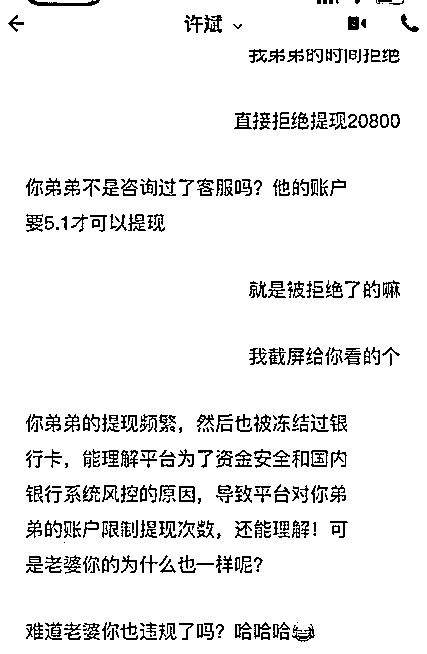
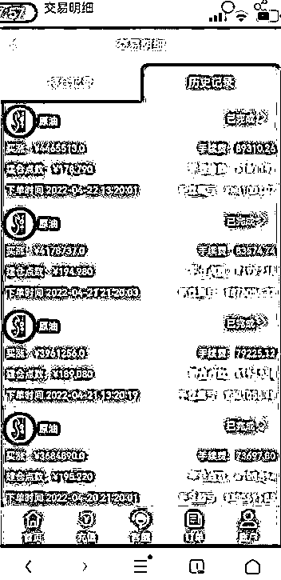
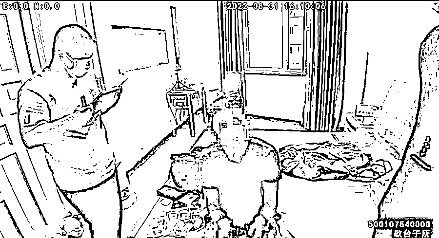

# “驻外高管”诈骗百万后爱上了受害者？回国“奔现”被“反杀”

> 原文：[`mp.weixin.qq.com/s?__biz=MzIyMDYwMTk0Mw==&mid=2247544771&idx=8&sn=83244c9eb28d564bcbc48b35f99603e0&chksm=97cbe4fba0bc6ded1884f9384ff2c54874e768375b98d92f17032531abd1eb8a5994569fb5a8&scene=27#wechat_redirect`](http://mp.weixin.qq.com/s?__biz=MzIyMDYwMTk0Mw==&mid=2247544771&idx=8&sn=83244c9eb28d564bcbc48b35f99603e0&chksm=97cbe4fba0bc6ded1884f9384ff2c54874e768375b98d92f17032531abd1eb8a5994569fb5a8&scene=27#wechat_redirect)

虚假的“成功人士”人设、虚假的“赚钱投资”渠道，“杀猪盘”的套路并不是什么新鲜事，但“操盘手”陷得比受害者深，动了“真感情”，要回国“奔现”不说，还被成功“反杀”，就有点新鲜了。近日，重庆九龙坡警方成功抓获被“反杀”的境外诈骗人员陈某，到案嫌疑人现身说法，为所有人敲响警钟。 

自称“驻外高管”，
聊天中嘘寒问暖关怀备至......

今年初，在某交友软件上闲逛的沈女士收到了一个陌生男士发来的打招呼消息。出于好奇，沈女士添加了对方好友，聊了几句后，对方提出互加微信，沈女士不疑有他，与对方成为了微信好友。

男子自称“许斌”，系某石油公司驻迪拜的高管。聊天中，许斌一日三餐嘘寒问暖，对沈女士关怀备至，称呼也逐渐亲昵起来，从沈女士的大名到小名，到充满爱意的“老婆”……

朋友圈里晒的全是精致生活，又对自己时刻关心，遇到自己心情低落还细心安慰……离异又带着娃的沈女士在许斌的连番进攻下，很快沦陷进温柔情网，和许斌确定了男女朋友关系。 

相信“内幕消息”赚钱，
越陷越深被骗百万

确定关系后，许斌向沈女士介绍了一个“生财之道”，称由于自己是石油公司高管，在石油期货市场里有“内幕消息”可以赚钱，还不时发来收益截图。从事相关行业的沈女士知道这门槛不低，并没有加入。

某天，许斌以乘坐飞机不能操作手机为由，将账号密码交给了沈女士，请她代为操作。按其指导，沈女士不出意外地赚了一笔。随后，有了兴趣的沈女士注册了自己的账户，开始了这场“资本游戏”。

第一次，沈女士投入 10 万元，很快就收到了 11 万元。眼看有得赚，沈女士大着胆子再次投入 20 万。

可这一次，APP 上显示有收益，却怎么都提不了现。联系许斌，对方解释是账户异常，可以通过打保证金的方式，进行“解绑”或是继续加大投入。

20 万已经投入，沈女士不想看钱打水漂，便前前后后往“石油期货市场”投入了 140 余万元！

钱一笔笔投入，收益也在 APP 上增长，可提现一直不成功。再联系许斌时，沈女士发现自己已被对方拉黑。

意识到陷入骗局，今年 4 月，沈女士来到重庆市公安局九龙坡区分局歇台子派出所报警求助。

骗子动了真感情，
回国“奔现”被“反杀”

接警后，歇台子派出所迅速开展工作，经侦查发现，许斌的确身在阿联酋，同时告诉沈女士，这是一起典型的“杀猪盘”诈骗，一般来说，会经历“引粉、养猪、杀猪”三个步骤。

“引粉”就是诈骗分子通过各种聊天软件搭识有一定经济基础的被害女性，与她们互加微信；“养猪”就是与被害女性保持频繁的暧昧聊天，在朋友圈营造“优秀成功男性”的形象，并通过持续不断地更新工作、生活照、视频来经营形象、建立感情、取得信任，待到时机成熟，便诱导被害女性帮忙登录证券平台；“杀猪”则是通过情感劝说、高额利诱被害女性往虚假平台里充值，最开始一两次往往都能获得可观的回报，等到被害女性放松警惕大额充值后，平台再以收取各种保证金的名义进行诈骗。

由于许斌身处境外，如何实现跨国打击是案件的侦办难点。好在转机很快出现。

沈女士报警后，意外在某 K 歌 APP 上收到了许斌的消息。对方向她坦白称，目前在阿联酋的某诈骗组织中，迫于无奈骗了沈女士的钱，并按照组织要求拉黑了她，但他动了真感情，只能通过其他软件联系，希望与沈女士再续前缘。

沈女士立即将情况反映给办案民警，民警迅速跟进，对沈女士进行全程指导，警惕发生二次诈骗。

聊天过程中，沈女士的大度让许斌觉得沈女士对他也有感情，更加坚定了要在一起的念头。很快，许斌告诉沈女士自己即将回国，并想到重庆找份工作。沈女士“欣然答应”，表示将为他介绍一份工作，“好好工作，慢慢还钱，我们一起经营今后的生活”。

7 月，许斌来到重庆，沈女士再次联系派出所，民警开始部署对许斌实施抓捕。8 月 31 日，民警在主城某区一出租房内，抓获了化名为“许斌”的犯罪嫌疑人陈某。

必须按照指示实施诈骗，
否则将遭受打骂.....

到案后，陈某交代其 2021 年到阿联酋打工，本想从事自媒体工作，却误入电信诈骗组织，成为了一名“操盘手”。身陷组织，其一举一动都在组织监控中，必须按照指示实施诈骗，否则将遭受打骂，若想通过聊天报警求助，更会遭遇严重惩罚。

陈某表示，自己所在的组织专门针对国内单身女性实施“杀猪盘”诈骗，通过非法购买某婚恋交友网站的客户资料，筛选 30 至 50 岁之间、有一定经济基础的单身女性，由“操盘手”使用话术与目标人物聊天，构建虚拟身份，引诱被害女性登录所谓的“石油期货市场交易平台”，该平台系诈骗组织找人开发的假 APP，其中的交易数据也由诈骗组织后台操控，随时可以用小额盈利博取被害女性信任，也随时可以“杀猪”。

陈某说，“操盘手”其实是诈骗组织中较低的层级，实施百万诈骗后获利甚微，他确实想回国与沈女士交往，但以其在诈骗组织中的收入，远不能偿还沈女士的受骗资金。

目前，犯罪嫌疑人陈某已被公安机关依法采取刑事强制措施，案件正在进一步深挖扩线中。

**警方提醒：**

**网络交友要谨慎！**

1、网络交友要提高警惕，不要被陌生人的甜言蜜语迷惑，不要和没有见过面的人谈钱；

2、不要相信“有内幕、稳赚不赔”的博彩、理财，守紧自己的钱袋子；

3、不向陌生人提供个人身份证号、银行卡号、密码、验证码等信息，不扫描陌生人发来的二维码，不点击来历不明的网页链接；

4、如遇“杀猪盘”诈骗，请及时留存证据报警，在警方指导下与对方保持联系，避免遭遇二次诈骗。

来源：九龙公安，红网

欢迎关注灰产圈社群服务号

