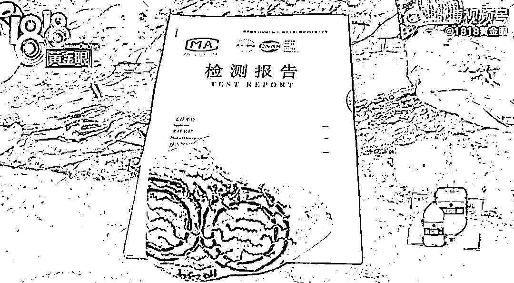

# 女子 10 天花掉 106 万买 30 多块翡翠原石，其中 103 万是借贷，网友：精神状态还好吗？

> 原文：[`mp.weixin.qq.com/s?__biz=MzIyMDYwMTk0Mw==&mid=2247544817&idx=1&sn=1cf77046463cc9985b79e9e462b14546&chksm=97cbe4c9a0bc6ddf16f88e7242d40f9045f3a96fa38313a5f01ce897bf103d0f8199030c5ca4&scene=27#wechat_redirect`](http://mp.weixin.qq.com/s?__biz=MzIyMDYwMTk0Mw==&mid=2247544817&idx=1&sn=1cf77046463cc9985b79e9e462b14546&chksm=97cbe4c9a0bc6ddf16f88e7242d40f9045f3a96fa38313a5f01ce897bf103d0f8199030c5ca4&scene=27#wechat_redirect)

国庆放假**前**倒计时！来看点轻松的酝酿下情绪。

不过说是轻松，也是蛮匪夷所思的轻松…

**震惊！为何一女子敢 10 天内借一百多万买石头？！**

点开这期 1818，开头就给我震到了

只见一位陈姓女士指着一块石头说：这个是**31600 元。**

接着又指另一块：这块是**9680 元。**

黄袋子里又拿出一块：**88000 元。**

陈女士说这么几块石头就花了**十几万**，但这些只是冰山一角。

还有二十几块石头，家里实在放不下，她只能在小区里租了一个房间专门放宝贝石头。

石头都装在快递箱子里，满满当当摆放在床上。

陈女士在房间里给记者看一块石头，她摩挲着石头说这块 3 万多，跟 9000 多的比起来，差别很大，它不掉皮。

据陈女士反映，她买的这些石头是**翡翠原石。**

一共买了 33 块，其中 2 块拒收，最贵的一块**近 20 万元。**

加起来总共花了**106 多万。**

100 多万的花费里，只有 3 万是存款，其他 103 多万都是借来的。

基本是信用卡或者网贷平台，电子账单都能整理成好几个文件夹了。

而花掉一百多万的时间，**总共才 10 天。**

“……”

陈女士，各种意义上都很**强**啊！！！

无论是存款 3 万借到 100 多万，还是 10 天内花掉 100 多万

关于怎么会突然着魔似的狂买翡翠原石，陈女士有一段相当合理的心路历程。

陈女士说，本来是想自己 40 岁了，8 月份想买个翡翠手镯压压惊。

但她自己不懂怎么分辨成品真假，担心买到假的。

然后她听说有些人说，如果买翡翠原石再去加工，是不会有假的。

陈女士就这样心动了。

但当记者问她有没有识别原石品质的经验时，陈女士摇了摇头：

**“没有，我一点都不懂。”**

陈女士的购买渠道是 pdd 的直播间，听主播吹得花好月好，陈女士搪不住，激情下单。

记者再次灵魂发问：买来后您找谁加工呢？您认识相关渠道吗？

陈女士再次摇头：**没有，不认识。**

不过（卖家）他们说可以委托合作的加工厂。

陈女士是一位全职妈妈，当时听说买原石能赚钱，就没想太多，谁想越买越多。

明明一开始是想买手镯，糊里糊涂的就变成了狂买原石……

有一次收到货后，陈女士觉得原石没有宣传的那么好，就挑了一块售价 9000 多的石头去检测。

检测报告的结果显示，确实是翡翠，但质地级别是**最粗糙的一级。**

陈女士觉得被网店骗了，要求退货退款。

这就是比较麻烦的情况了，因为陈女士收到原石后，已经开窗，按原则这种是不退不换的。

*开窗：指在原石上开个小口，看看翡翠品质。

店铺表示只能尽量争取退 40%，比如 100 万能退 40 万。

陈女士显然不接受这个处理方式，所以找到了 1818。

平台方面正在跟踪此事处理。

▼视频 5 分 28 秒。

[`mp.weixin.qq.com/mp/readtemplate?t=pages/video_player_tmpl&action=mpvideo&auto=0&vid=wxv_2599347221192753153`](https://mp.weixin.qq.com/mp/readtemplate?t=pages/video_player_tmpl&action=mpvideo&auto=0&vid=wxv_2599347221192753153)

……

网友都无语凝噎，40 岁了准备买个玉镯给自己压压惊，结果让人大吃一惊。

陈女士：“不懂，没经验，没有，不认识。”

对相关知识，行业背景和渠道统统一无所知，但是敢一掷百万……绝大部分是借来的钱……

不是，我就是稍微问一句，绝对没有冒犯的意思，也可能是我搞错了，又或者其实我是出现了幻觉，不管怎么样，我都希望我们能秉持着友好理性的相处原则，不要因为一些可能的误会伤害了我们之间的友谊，最后再说一句，我绝对没有冒犯的意思，只是本着对于宇宙本质的伟大探究精神以及求真务实精神发问:

**陈女士精神状况还好吗？**

不过一般人也借不到一百万吧，还租了房子专门放石头，陈女士的流水和存款应该不止 3 万块的水平。

而且看新闻里陈女士叙述时波澜不惊，是个干大事的人。

有网友猜测：有没有可能是纯粹的**赌石**？？

买原石多数就是赌石了啊，见过杠杆炒币炒股的，杠杆赌石还第一次见。

anyway，看过算过，花百万买原石，还是赌石，这都不是国庆上班的我等该关心的事

来源：上海全知道

欢迎关注灰产圈社群服务号

