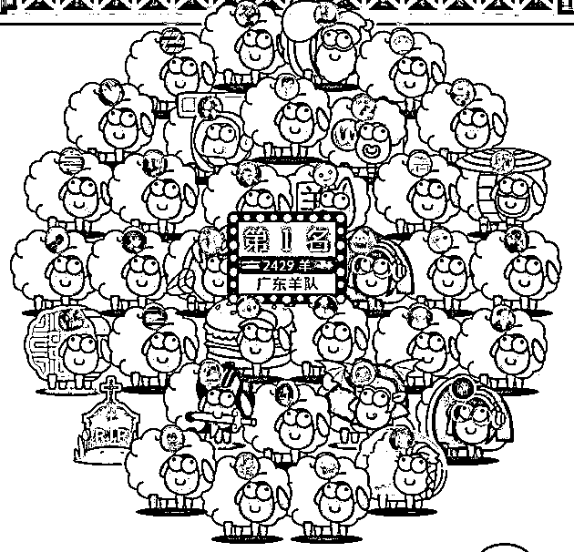
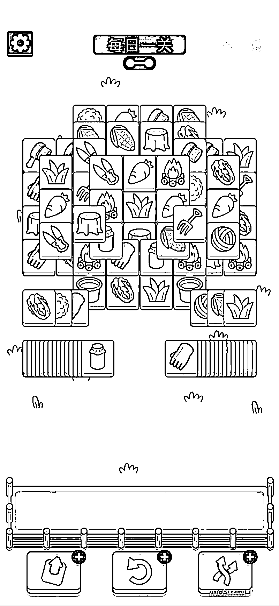
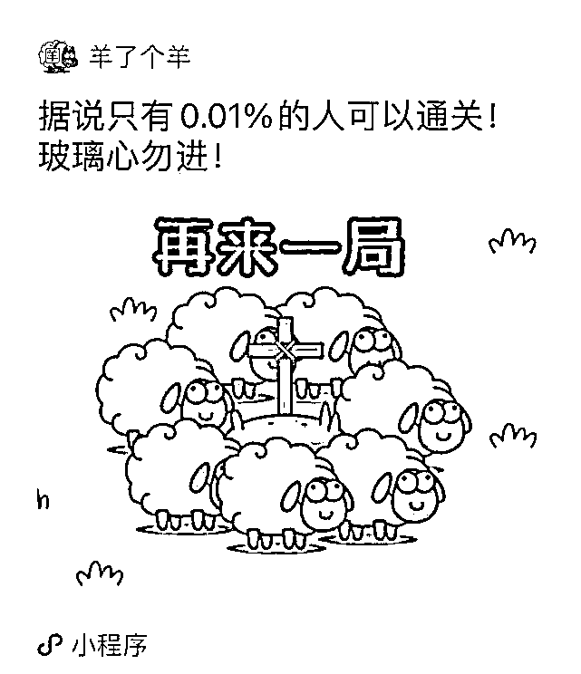
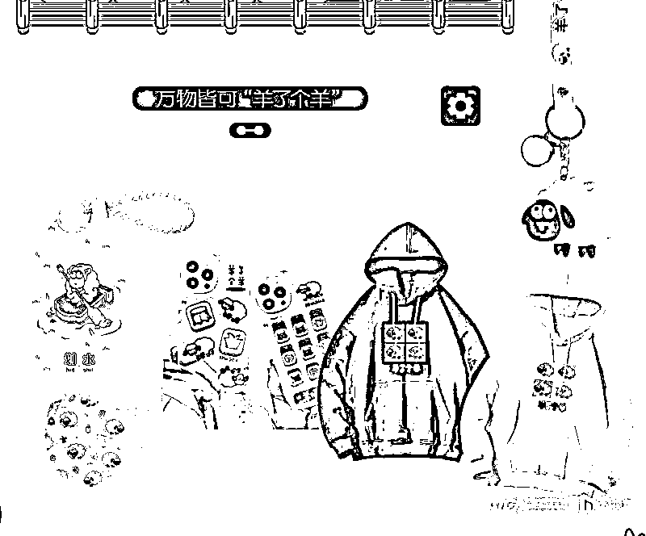

# 《羊了个羊》还能火多久？业内人士揭秘背后套路

> 原文：[`mp.weixin.qq.com/s?__biz=MzIyMDYwMTk0Mw==&mid=2247544817&idx=3&sn=e190613497fc3f405d7d7635da94da74&chksm=97cbe4c9a0bc6ddfafbe081e1c9f0fb54e026d610aabceeb0c8d3a830c5d9ca721e6ec4b8491&scene=27#wechat_redirect`](http://mp.weixin.qq.com/s?__biz=MzIyMDYwMTk0Mw==&mid=2247544817&idx=3&sn=e190613497fc3f405d7d7635da94da74&chksm=97cbe4c9a0bc6ddfafbe081e1c9f0fb54e026d610aabceeb0c8d3a830c5d9ca721e6ec4b8491&scene=27#wechat_redirect)

**你被薅羊毛了吗？**

“你通关了吗？”

很久没见过这么风靡社交圈的游戏了。

在国内日活最高的软件——微信里，近日，一款名为《羊了个羊》的微信小游戏正在实现“病毒性传播”。即便你不关心热搜、不刷朋友圈，也避免不了来自朋友分享的链接轰炸。

不过，“全网热玩”中，关于游戏的吐槽也越来越多。

“我一年看的广告都没有最近看得多。”

“没几个人晒通关截图，我都怀疑这个游戏通不了关。”

但这些吐槽并不妨碍《羊了个羊》的大爆：微博#羊了个羊#话题累计阅读量已高达 30 亿次，有超过 100 万的微信用户玩过该款游戏。

《羊了个羊》是怎样变成最近人们茶余饭后的谈资的？《羊了个羊》的营收方式、营销方式如何实现？在游戏“爽感”上，《羊了个羊》又是怎样实践的呢？南都记者近日采访了游戏行业从业人员和玩家，试图挖掘《羊了个羊》火爆起来背后的秘密。

**你“羊群效应”了吗？**

茶余饭后，最近人们的问候都变得“羊里羊气”。

“你加入羊群了吗？”

“你通第二关了吗？”

社交平台上的数据能更直观地显现《羊了个羊》的爆度：据统计，微博#羊了个羊#话题累计阅读量已高达 30 亿次，讨论次数达 35 万。游戏页面显示，已有超过 100 万的微信用户玩过该款游戏。据悉上线仅 48 小时，创造了 22 个热搜，一度冲上热搜第一名，人气之高导致《羊了个羊》服务器在 24 小时内崩溃 3 次。 

打开《羊了个羊》，首先映入眼帘的是地域排名，根据全国各地游戏情况排名，还搞出壮大本省羊群的噱头，打出“看看哪个省份智商最高”“敢不敢测测你的智商”等标语，一下子就激起了大家的胜负欲。

谈及对该款游戏的第一印象，有玩家表示“就像在玩低门槛的消消乐”。不过和第一印象中的“低门槛”不同，度过了“有手就能玩”的新手村，玩家不会来到“进阶村”，而是直接坠入“地狱难度”的第二关。有玩家表示，第一次玩的时候感觉可以通关，“但玩着玩着就会发现并不是那么回事”。

为了辅助玩家通过这种“地狱难关”，游戏中提供了三种道具和一次复活机会，玩家需要通过观看广告来获取。为此有玩家吐槽“一年看的广告都没有最近多”。

当观看广告次数达到上限，玩家想获得道具还需将游戏页面转发至社交群聊中，这就无形中触发了游戏的“羊群效应”。

“羊群效应”来源于对动物群聚行为的研究，后来被引申到社会中，指人们在选择过程中会受到他人影响。《羊了个羊》通过社交渠道发散、话题发散等方式，营造了这样一种“羊群效应”，最近的我们聊天不带“羊”仿佛都落伍了。

有游戏业内人士分析，三消玩法长盛不衰，近年国内和海外都有很多以三消玩法为主的游戏取得了不错的成绩。而三消游戏玩法简单，非常适合微信小程序的轻量级。

“操作简单、单局时间短，玩家不停重开，绞尽脑汁时他们根本注意不到时间飞逝，但又可以随时暂停，这样既能消磨时间又能碎片化玩乐。玩法上头，它的负反馈（通关率低）则会让玩家产生一种‘赢一把就下线，然后决战到天亮’的心理。”上述业内人士说。

**故意卡通关率让玩家“停不下来”？**

在被戏称为全国“犟驴”选拔大赛的《羊了个羊》火爆全网的同时，一些质疑声也逐渐被更多人听到。这些质疑声主要是针对《羊了个羊》诱导分享、植入广告、抄袭等热议。

<mpvideosnap class="js_uneditable custom_select_card channels_iframe videosnap_video_iframe" data-pluginname="videosnap" data-id="export/UzFfAgtgekIEAQAAAAAA4UoaWDUCugAAAAstQy6ubaLX4KHWvLEZgBPE5IF4OiYbdLCCzNPgMIuqSV1-2aSXrYtFEe-9GkCM" data-url="https://findermp.video.qq.com/251/20304/stodownload?encfilekey=rjD5jyTuFrIpZ2ibE8T7Ym3K77SEULgkiaRCnQZD3rS5iaCjj94y0biaoicIvqjpADdicRozpWb91wcv1Twe1JPldT2zpOaU4dPtWibVMqgMdNMRA1qTxBx4yTRBg&amp;adaptivelytrans=0&amp;bizid=1023&amp;dotrans=0&amp;hy=SZ&amp;idx=1&amp;m=&amp;scene=0&amp;token=x5Y29zUxcibCRj4OkDVkzia1d8D6wsRrM8G27FkSn19kmxicaHBLsBlR6wazO49MafdbSAJBIUXZv0" data-headimgurl="http://wx.qlogo.cn/finderhead/47CicbLQOxtWkC45DhPeBZzTsQf2icIgckQLog0aWSkvbmZdqGNT27Lg/0" data-username="v2_060000231003b20faec8c7e58e19c3d2c804ef33b077e7afb76c9cf4b97cb6f6a3bc38a0d53b@finder" data-nickname="湾财社" data-desc="这只“羊”吃相有点难看" data-nonceid="16652831946311700132" data-type="video" data-width="1080" data-height="2344"></mpvideosnap>

《2022 微信小游戏增长白皮书》显示，目前微信小游戏主要有三种变现形式，IAP（内购付费）、IAA（广告变现）、IAP+IAA（混合变现）。其中，开发者可以快速实现盈利的就是 IAA（广告变现），这也是休闲类游戏核心商业模式。

以《羊了个羊》为例，它在游戏内设置激励视频广告，场景分别是游戏内道具获取时和游戏死亡复活时，用户可通过观看激励视频广告获取奖励。如果游戏难度极高，则意味着玩家观看广告次数也会直线攀升。据了解，目前通过用户观看广告来变现仍是游戏《羊了个羊》的唯一营收来源。

在这样的关联性下，有网友质疑“游戏存在故意设卡诱导用户看广告并获取收益的行为”。

在《羊了个羊》官博评论区中，不乏各种玩家的质疑声：“搞个录屏或直播证明一下，每次玩到最后摆出来的都配不齐三个”“死局，就是骗分享骗看广告”“我怀疑你们的游戏设置无解，仅随机一些可解情况给少量玩家通关，如果要否认请主创团队直播通关给大家瞧瞧”。

玩家东东向南都记者表示，自己一开始并没有察觉到游戏的变现方式，直到发现没有“氪金”入口才明白，“这个小程序就是靠观看广告实现变现”。

玩家麦麦更具体地指出了游戏通关的难度。

“游戏一共就 14 种图案，即使按照逐渐消层的最优解，底下的牌也有 200 多万种可能性，但能通关的牌序只有 0.009%的概率，也就是说，每 10 万局游戏里只有一次能通关。这跟你的技术没关系，是算法设置好的。换句话说，99.99%的人一开始拿到手的牌就一定是死牌，系统已经把你安排得明明白白，你再怎么熬夜通关自然都是无用功。”

有从事游戏开发运营的业内人士向南都记者表示，一般的游戏会在玩家的通关、升级路上给予正反馈，让游戏难度循序渐进。但《羊了个羊》直接将通关路与“运气”挂钩，打破了这种循序渐进性。

“这个游戏从第二关开始就是个单纯的数学问题，14 种图案，存放格子只有 7 个，有没有解、能不能通关完完全全看运气。后面看到《羊了个羊》的源代码解析，存在故意分配给玩家不同的图案，甚至可能出现每种图案数量不是 3 的倍数的情况，所以这个游戏不仅设置了一个很大概率无解的数学题，还通过代码控制进一步降低了能通关的概率。”

博主“毕导 THU”做了一个类比，一次广告时间为 30 秒，按一局使用 3 个道具估算，玩 50 局游戏大概要看 75 分钟的广告、100 局为 150 分钟，看广告的时间已经可以看场电影了。另据数据显示，《羊了个羊》的 DAU 从 9 月 12 日开始呈指数式上升，并于 9 月 15 日突破 1 亿。

在玩家体感和日活数据的相互佐证下，不少人开始对游戏背后制作公司的盈利情况产生了好奇。

公开资料显示，创造出游戏《羊了个羊》的幕后推手——北京简游科技有限公司成立于 2021 年，为张佳旭所有。

在《羊了个羊》爆火后，张佳旭近日被母校长治学院做成展板，展出信息称在创造出《羊了个羊》之前，张佳旭还制作过峰值月流水曾过亿、至今总利润超 20 亿元的《海盗来了》。

9 月 15 日，一张“流量主数据日报”截图在网上流传。图片显示，《羊了个羊》单日广告收入为 468 万元，月收入更是达到了惊人的 2564 万元。

对此，腾讯首席执行官马化腾在线辟谣，《羊了个羊》创始团队简游科技创始人张佳旭在接受媒体采访时亦予以了否认，回应称“图片是假的，游戏为了用户体验，没有加 Banner 广告和插屏广告，所以收入的截图根本不对，而且火的时间也凑不够这个总收入。”

除此之外，游戏所使用的背景音乐也被质疑没有购买版权。还有玩家指出，《羊了个羊》涉嫌抄袭一款由国外游戏公司于 2020 年开发的游戏《3 Tiles》，简游科技也被推到了舆论的风口浪尖。

游戏开发者、《百万在线：大型游戏服务端开发》一书作者罗培羽认为，两款游戏的玩法几乎一模一样，《羊了个羊》有较明显参考《3 Tiles》的嫌疑。不过从法律上说，游戏的美术、程序受到著作权保护，而游戏玩法并没有著作权。《3 Tiles》没有《羊了个羊》火爆，从这个层面上看，游戏的火爆不仅仅与玩法有关，更与营销有关，《羊了个羊》显然在营销方面做得更好。

**从游戏“爽感”上来看，我们为何热衷于“加入羊群”？**

在游戏开发者、《百万在线：大型游戏服务端开发》一书作者罗培羽看来，《羊了个羊》达成这样的爆度，就在于它将游戏的几大特征实践得简单、易于上手。

“主要有几个方面的原因，其一是它上手简单，用户几乎没有学习成本，使得它的用户面很广；其二是游戏虽然看似简单，但要通关有一些难度，会让玩家有一种触手可及却又差一点点的感觉，当玩家没有通关时，不但不会有很强的挫败感，反而容易产生越挫越勇的心理；其三，游戏的运营也起到不小作用，当身边朋友都在讨论游戏时，用户也会有兴趣去看看这游戏到底是什么样的。”

简·麦戈尼格尔曾在《游戏改变世界》一书中提出，所有的游戏都有四个决定性特征：目标、规则、反馈系统和自愿参与。我们不妨从这些维度出发，一一比照着看看《羊了个羊》的实践程度。

“目标”即玩家想要达成的结果、玩家为此参与到游戏中来。《羊了个羊》属于“三消类”游戏，它和互联网古早时期人们常玩的“连连看”游戏一样，终极目标都是化繁为简，让手机界面变得更加干净。除了满足人们实现极简的需求，当相同的图案连在一起，产生爆炸效果继而消失时，你可以看作游戏创作本身也在满足人们的破坏欲。

同时《羊了个羊》在针对“目标”上设置了一个“有手就能玩”的第一关，又进一步助力了游戏的营销传播。“从目标来说，游戏给玩家设立一个看似触手可及的目标，从而让玩家拥有挑战关卡的信心。”罗培羽说。

“规则”是为玩家实现目标做出了限制，规则常常能带给玩家探索的动力和欲望，推动玩家去探索。《羊了个羊》在这一点上首先遵循的是三消游戏的“三消”模式，三个一样的图案连在一起就可以消除，游戏规则简单无上手门槛，使得参与的用户面被瞬间拓宽。进一步地，广大的用户群体又对营销传播起到了积极作用。

不过更体现“规则”限制感的是游戏极限通关比例，《羊了个羊》先以极低门槛“有手就能玩”的第一关吸引受众进入，进而是堪称地狱级难度的“第二关”，虽然第二关难倒了不少人，但难度的负反馈又让不少玩家燃起了征服欲。

游戏的“自愿参与”特征则要求所有玩游戏的人了解并接受目标、规则和反馈，有任意参与和离去的自由。罗培羽提出，《羊了个羊》的优势在于其营销手段提供了社交需求，让玩家自愿参与到游戏中去。

“从自愿参与的角度看，当游戏火爆趋势稍见苗头，用户身边会有不少朋友在讨论游戏，用户也就很乐意去尝试。另外，游戏中的道具对通关很有帮助，而这些道具需要通过看广告的方式来获取，这也在一定程度上促使用户愿意看广告。”

游戏中的“反馈系统”常常告诉玩家距离目标还有多远，通过点数、级别、得分、进度条等形式来反映。《羊了个羊》展现出实时排名、好友排名等具有排位特征、能激发玩家竞争意识的排名榜。

不过，实时反馈应该是一种承诺，即承诺玩家“目标是可以达到的”。因此，当全网多位网友 po 出自己经历了地狱级难度仍难以通关时，针对《羊了个羊》的不满也在网上不断发酵。

有业内人士指出，《羊了个羊》很火爆，跟风也很容易。但当人们受够了戏耍，“下头”也是自然的事。这样一款游戏并不会长久地火爆，也许会有它的后辈前赴后继地推陈出新。

“就单个游戏而言，这样的设计不太能长久运营，主要是为了赚一波快钱。游戏的设计思路和营销套路也许会给很多体量小的游戏制作商带来新想法，但对于大的游戏公司而言，他们的游戏基本不太可能靠广告赚钱，他们甚至可能是在这些游戏里面打广告的一员，他们还是会以长线运营的游戏为主。”

义乌小商品商家已火速推出同款桌游、手机壳、钥匙扣、美甲、卡套、服饰、口罩等。

来源：南方都市报 采写：南都记者 郑若琳 林文琪 张圣博  编辑：郑若琳

欢迎关注灰产圈社群服务号

