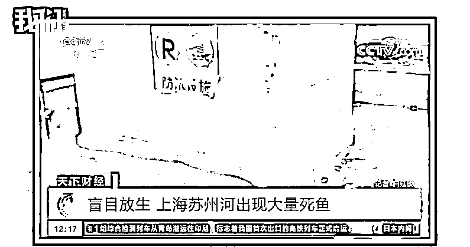

# 迷惑放生事件为什么屡屡发生？有人为求功德，有人做成产业丨你以为呢

> 原文：[`mp.weixin.qq.com/s?__biz=MzIyMDYwMTk0Mw==&mid=2247544817&idx=4&sn=f015a695f2e97e23a49be0e89213cec1&chksm=97cbe4c9a0bc6ddfd21dd81a1df0f91995053420089080dda7e7e68f638d67e611d9ef39f986&scene=27#wechat_redirect`](http://mp.weixin.qq.com/s?__biz=MzIyMDYwMTk0Mw==&mid=2247544817&idx=4&sn=f015a695f2e97e23a49be0e89213cec1&chksm=97cbe4c9a0bc6ddfd21dd81a1df0f91995053420089080dda7e7e68f638d67e611d9ef39f986&scene=27#wechat_redirect)

清道夫

学名甲鲶

又叫吸盘鱼、垃圾鱼

原产于南美洲

上世纪 80 年代作为观赏鱼种引进国内

但当它们从鱼缸被放入河流

一场生物入侵开始了

清道夫鱼的泛滥情况很严重

一边有人捞

另一边却还有人在放

事实上

盲目放生造成的生态灾难

正愈演愈烈

据央视消息 

上海市苏州河最近有大量鱼类死亡后

漂浮水面散发恶臭

这些死鱼来源主要是市民大规模放生

可能有些人认为是小题大做了

不就是几条鱼的事儿吗？

我们视频（ID：wevideo）在采访了

专家和当事人后发现

这背后所涉及的人群、利益链

远比我们想象的要复杂

在广东中山

打捞清道夫鱼 6 年的小孟称

清道夫鱼刚引进过来的时候 

是放在鱼缸里的

它会吃一些青苔、鱼拉粪便等

在鱼缸里面有一定的清理作用

但它在水里面基本上没有天敌

一次可以繁殖几千个鱼卵

“它只有尾巴后面有肉

其他地方是没有肉的

再就是它的鳞角特别坚硬

鳄鱼都不吃它”

据相关资料显示

珠江流域广州河段的清道夫鱼

数量近年来呈明显上升趋势

部分地区的渔获占比

甚至已经超过 50%

更可怕的是

这种鱼以其他鱼的鱼卵为食

一条鱼一天就能吃

3000-5000 个鱼卵

▼

[`v.qq.com/iframe/preview.html?width=500&height=375&auto=0&vid=y3358cw3ow9`](https://v.qq.com/iframe/preview.html?width=500&height=375&auto=0&vid=y3358cw3ow9)

▲迷惑放生事件为什么屡屡发生？有人为求功德，有人做成产业。新京报我们视频出品（ID：wevideo）

清道夫鱼的泛滥

只是诸多外来生物问题的其中之一

《2020 中国生态环境状况公报》显示

全国已发现 660 多种外来入侵物种

外来生物入侵每年造成的

直接经济损失超过 2000 亿元

中国水产科学研究院

南海水产研究所研究员陈丕茂称

“个别市民弃养、野生放养

或存在观赏水族逃逸的现象

是导致鳄雀鳝、清道夫

还有巴西龟这些外来水生动物

进入野外成为水生入侵物种的主要原因”

公益放生活动志愿者

参与放生 20 年的李杰

从小就跟着家人参加放生活动

后来也参加了很多放生组织和机构

对于放生的理解和态度是不断变化的

李杰称对放生有质疑甚至鄙视

是一部分放生民众的功利心

人们希望通过放生

让祈福之人身体康健

这本身可以理解

但是这就会导致很多放生的人

忽视了被他们放生的生物本身

只追求了放

而没确保生

除此之外

更有人把放生做成了一种产业

形成了一种商业模式

让放生慢慢变了味

 香格里拉土著鱼类

恢复和保护协会会长屈天文称

“科学放生其实就只有一个指标

就是要用土著鱼”

除了放生鱼的品类

还要注意鱼的生存环境

和维护放生现场等问题

“在放生的场所是要有人守护

鱼放下去以后

不要被别人捞走或者电死”

真正做到科学放生

其实是个很系统的工程

平常我们个人放生

就按照放生手册来

不要放生外来物种

有条件的朋友

也可以参加本地放生协会

组织的放生活动

有专业人士指导

放生也会更规范

效果更好

来源：我们视频

欢迎关注灰产圈社群服务号

