# 凭实力薅的羊毛却违法？《你安全吗?》揭秘的骗局还有这些

> 原文：[`mp.weixin.qq.com/s?__biz=MzIyMDYwMTk0Mw==&mid=2247544817&idx=5&sn=c10b9afc2ea912085f24ea6d816e9d8d&chksm=97cbe4c9a0bc6ddff87dea1f47d48e99b6ef64615794016a7d9722d1a80fef09e9dd05258cb9&scene=27#wechat_redirect`](http://mp.weixin.qq.com/s?__biz=MzIyMDYwMTk0Mw==&mid=2247544817&idx=5&sn=c10b9afc2ea912085f24ea6d816e9d8d&chksm=97cbe4c9a0bc6ddff87dea1f47d48e99b6ef64615794016a7d9722d1a80fef09e9dd05258cb9&scene=27#wechat_redirect)

## 

**如何悄无声息地通过手机知道老公的动态？**  

第一步：看**微信步数**，判断他的运动量。

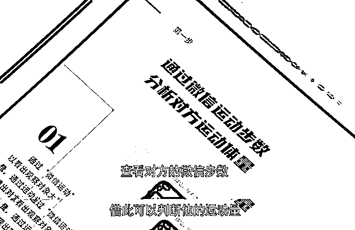

第二步：把**购物链接发给他**，如果他转给其他人，你就会收到提醒。 

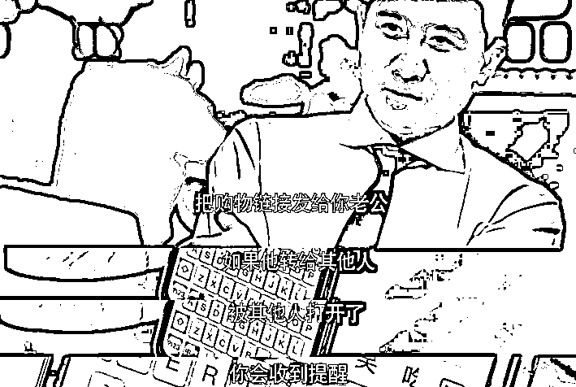

第三步：在他的**百度网盘打开同步功能**。相册、通话记录等信息就能实时同步。

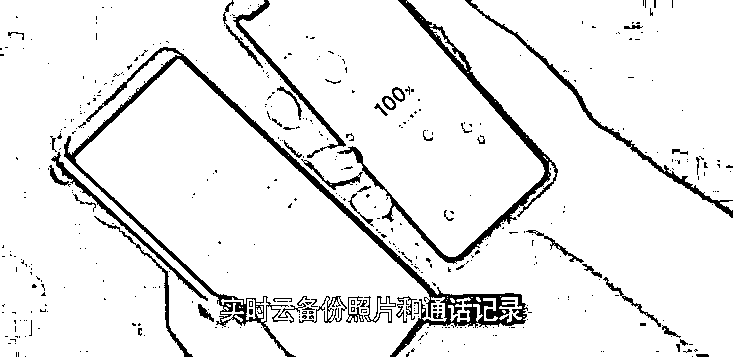

第四步：打开**打车软件，将紧急联系人设置成你的号码**，打开默认分享行程，实时掌握他的行程。

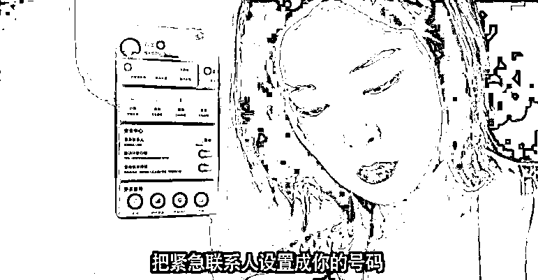

这一堪称互联网时代的【大数据捉奸四步法】来自于网络热剧**《你安全吗?》**的经典场面。

小珊连炫几集根本停不下来，悬疑又搞笑，最重要的还学到不少网安知识。

作为国内首部**以网络信息安全为题材**的网络剧，《你安全吗?》集合了**职场性骚扰、网暴、赌球诈骗、杀猪盘诈骗、违法监控、公交车咸猪手、个人信息泄露、视频裸聊**等等社会热点话题，可以说是为我们描摹出一副生动的**反诈图鉴**！

你能在剧里看到：

删掉的照片别人一样有渠道可以复原；

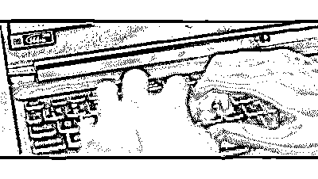

借用个充电宝或许早就把你的信息泄露得干干净净；

免费领取的赠品可能被安装了网络探针；

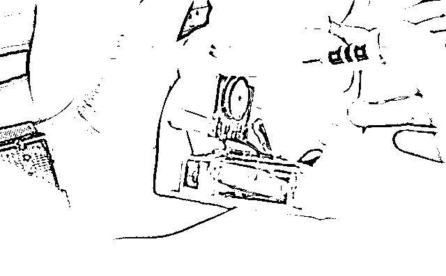

发张照片就能知道拍摄的时间、地点、甚至是楼层……

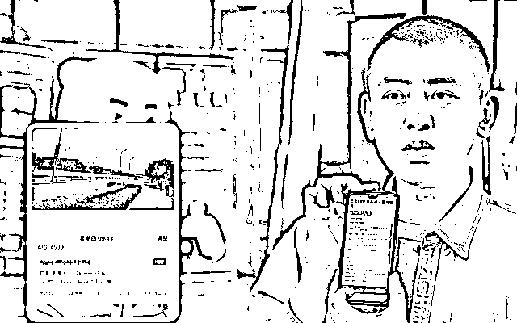

以至于网友越看越觉得该剧真实地反映了自己遇到的网络安全问题。

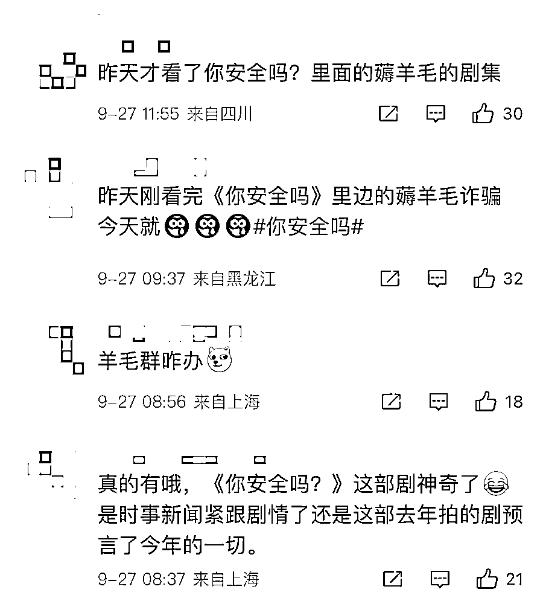

剧情上，不玩高大上、不悬浮，《你安全吗?》走的是接地气路线。

剧中也出现了很多经典台词，比如：**“网友们看的不是真相，而是热闹”、“没有什么是一拨水军解决不了的，要是解决不了，推两拨”**等。

这种幽默通俗的讲故事方式，有趣的剧本内容，突破了普及网络安全的传统形式，收获了一堆追剧迷。

广大网友纷纷给出了**良心剧认证**，该剧豆瓣评分目前为 7.3。

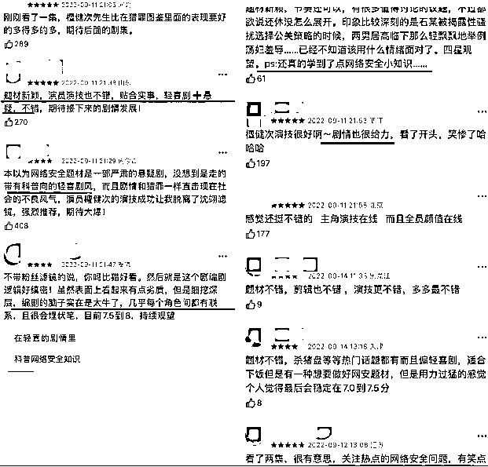

网友一致表示看剧的同时，还学到了如何防范网络风险的小知识，可以说是超值了。  

在《你安全吗?》最近更新的剧情中，有一个**#**薅羊毛违法#****话题引起网友热议。

剧中，主角阿明误入薅羊毛组织被洗脑：

**“想不想月入过万，学会薅羊毛，轻轻松松实现......”**

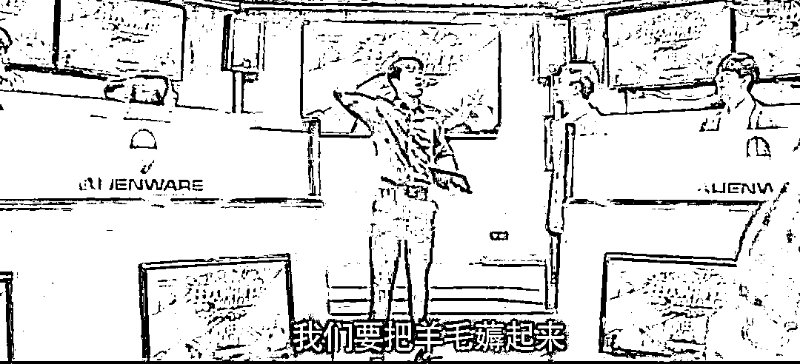

**看着热血程度堪比成功学励志演讲课，洗脑程度堪比传销。**

但所谓但漏洞券其实是「羊毛组织」**利用商家规则疯狂套利，或者利用非法软件绕过风控系统骗取商家的优惠券、现金红包，属于违法行为。**

于是，前一秒还在炫耀业绩的群主，下一秒就被逮捕了。

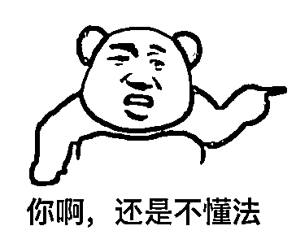

特别巧的是。

剧中这集热播之后，**「大学生薅羊毛诈骗被判刑」**也上了热搜。

说是江苏某大学的在校生小徐，在利用肯德基客户端点餐过程中无意间发现两个“生财小门道”。 

在 APP 客户端用套餐兑换券下单，进入待支付状态后暂不支付，之后在微信客户端对兑换券进行退款操作，然后再将之前客户端的订单取消，这时候客户端上竟可以重新获取兑换券，等于分文未付骗取了一份兑换券。

**小徐心想，这不是天降羊毛吗？**

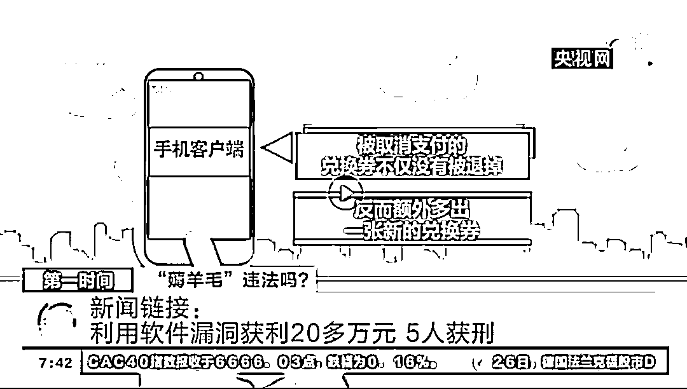

在发现了这个漏洞之后，小徐还做起了“副业”，将诈骗得来的套餐产品通过线上交易软件低价出售给他人，从中获利，同时还传授给 4 名同学，导致百盛公司损失**超 10 万元**。

最后这几名同学都获得不同程度的判刑。 

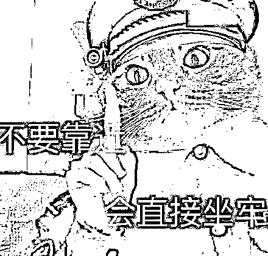

这样利用漏洞恶意薅羊毛的例子还有很多。

之前媒体报道的一名“90 后”小伙儿，在发现网购平台运费险的规则漏洞后，先后虚假下单**4800 余次**。

通过购买有运费险的商品后拒收，再申请退货可获得运费险的方式，骗取赔付款**7.3 万余元**。

运费险虽然保费不高，但也是保险的一种，利用平台运费险赔付漏洞运行退货流程，编造未发生的运费险保险事故，获取运费险赔偿金，达到数额较大标准的，根据我国刑法第一百九十八条的规定，已经构成**保险诈骗罪**了。

最后该小伙因犯保险诈骗罪被法院判处**有期徒刑三年，缓刑三年**，并**处罚金 2 万**元。

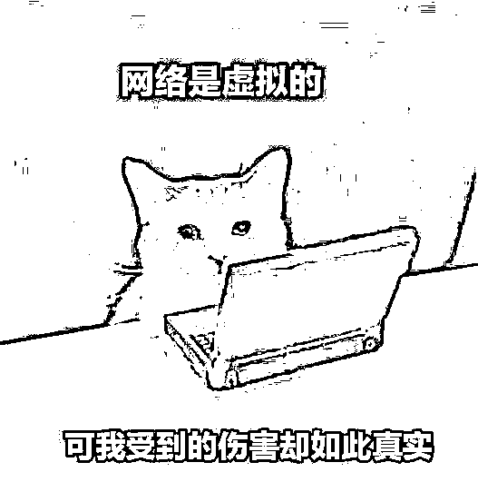

最经典的例子还属几年前某 50 万粉的博主号召粉丝**“26 元买 2 吨水果”**薅羊毛事件。

该博主发现某电商卖水果时将**“26 元 4500 克”**误写成**“26 元 4500 斤”**。

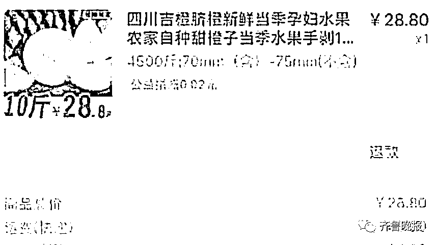

于是在十几个羊毛群里带领上万粉丝疯狂下单，水果店一夜被“薅”近**700 万元！！！**

事后，水果店店主发布道歉信，恳求羊毛族们不要投诉，申请退款订单，给他们一条生路。

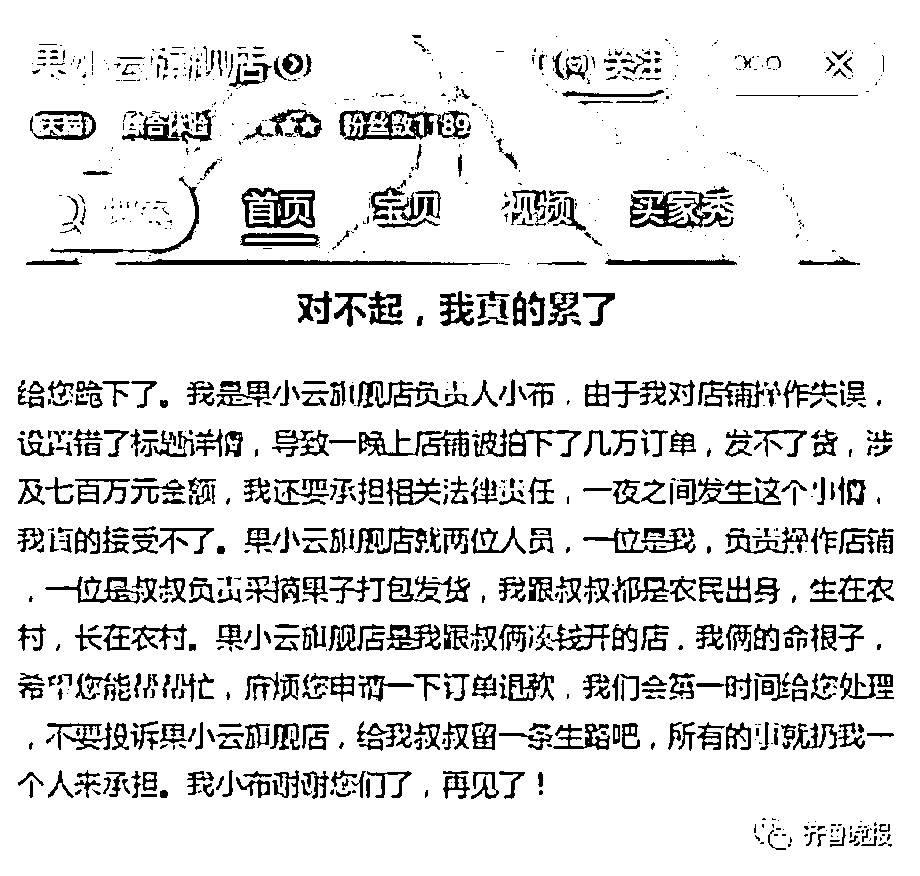

但是粉丝们还是不依不饶，去平台投诉商家，使商家**10 万保证金**全扣完，被平台原地关店而倒闭。

网友纷纷指责博主：**和那种翻车抢别人水果的人一样。**

随着事情发酵，电商平台第一时间把店家“保护”起来，并发布通告——坚决抵制恶意下单的“羊毛族”。

咱就是说，买东西求便宜，是很正常的消费者心理。

## 

拼 XX500 无门槛漏洞券

一块钱 XX 视频会员

某品牌手机订购价只要 999！

……

以上这些羊毛，相信即使大家没薅过，也听说过。

**但是，不是什么“羊毛”都能“薅”的。**

“薅羊毛”本意指的是去享受商家推出的优惠活动，是一种合理省钱的行为。

但如果使用非法手段获取他人信息，或进行刷单，利用商家过失或平台漏洞虚假交易并以此牟利，则可能**涉嫌侵犯公民个人信息罪以及诈骗罪****，触碰到法律底线，属于非法“薅羊毛”了。**

在此，小珊想说，大家要有法律意识，利用漏洞专门套利属于网络灰黑产行为，在经济窘迫的时刻，也要提高警惕，不是什么钱都能赚，什么羊毛都能薅的，不要让贪欲蒙蔽了双眼，贩卖了自由。

如果像《你安全吗?》剧中那样误入“专业”的薅羊毛组织，要么是身份信息被盗用，要么是成为犯罪团伙的一员，警惕起来啊安友们。

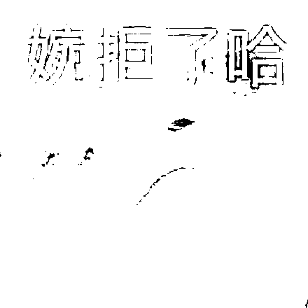

君子爱财，取之有道。

大家要认清合理的省钱

与非法“薅羊毛”的区别，

可不能越界哟！

来源：微信珊瑚安全

欢迎关注灰产圈社群服务号

