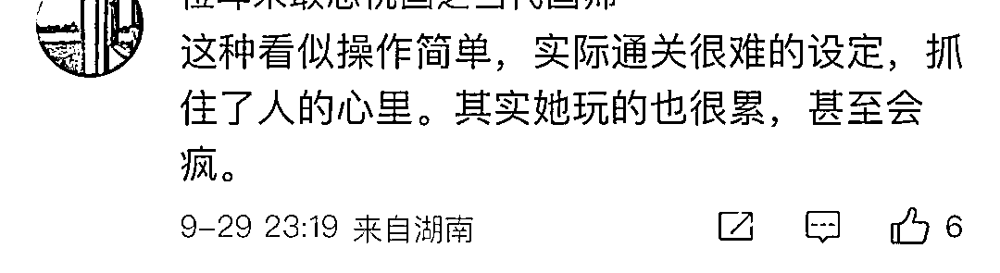
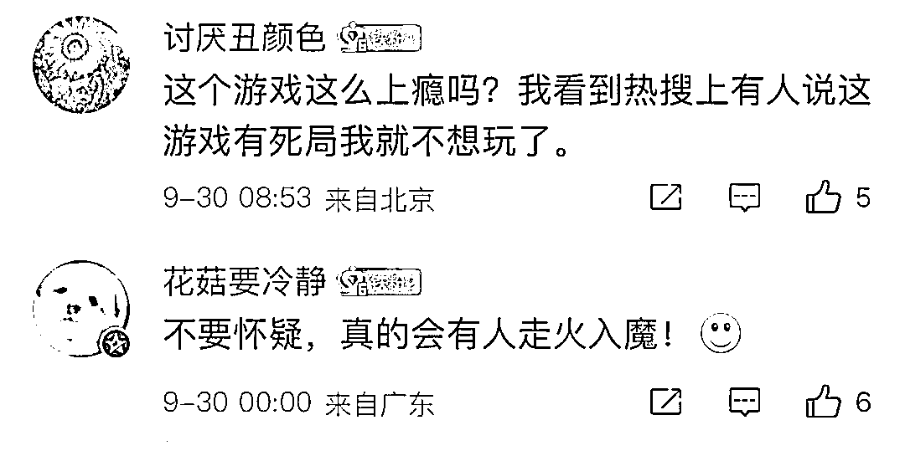
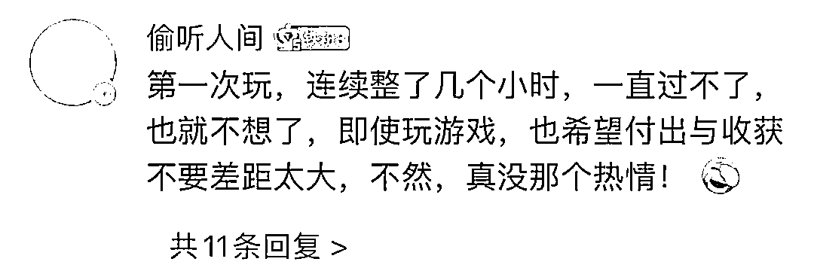
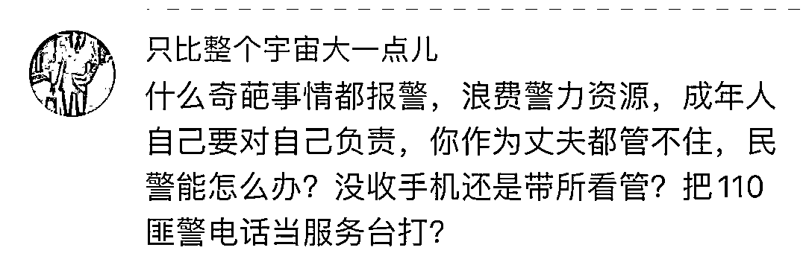
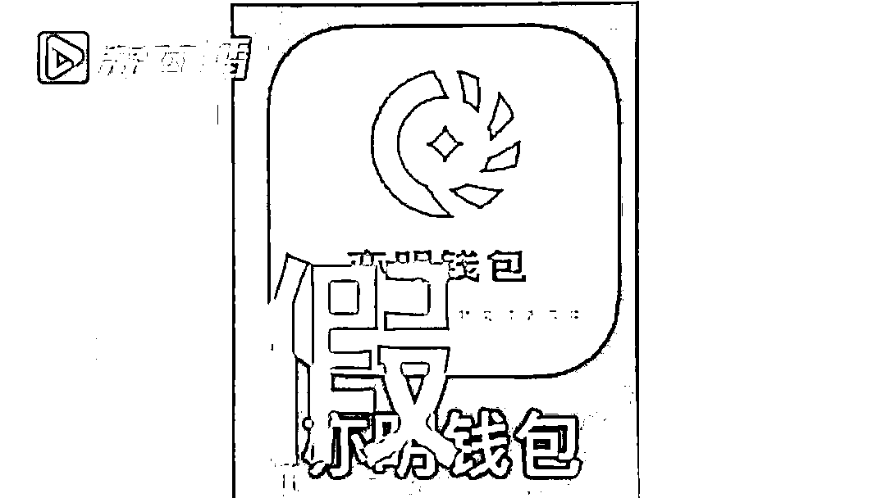
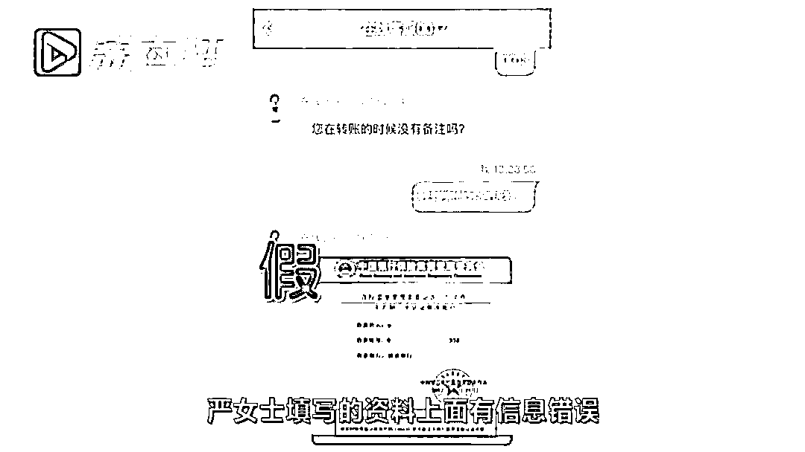
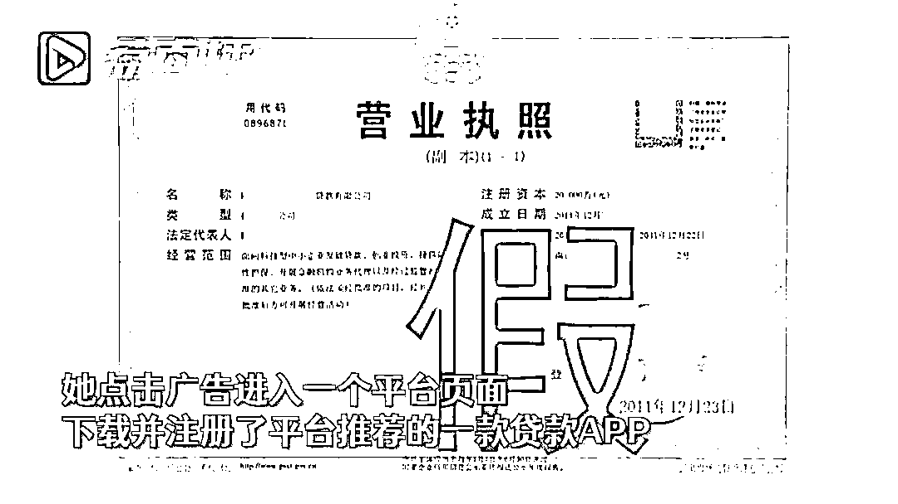
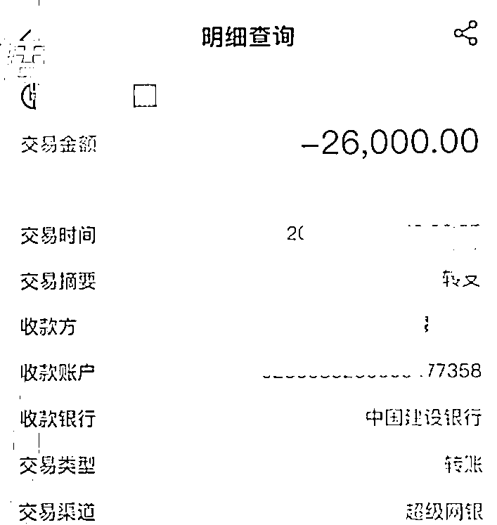
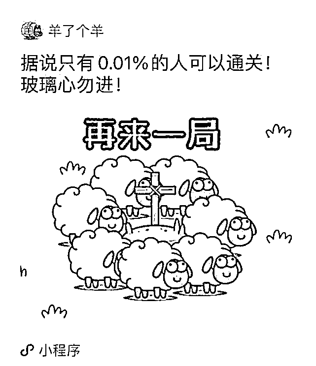

# 妻子沉迷游戏，丈夫报警求助

> 原文：[`mp.weixin.qq.com/s?__biz=MzIyMDYwMTk0Mw==&mid=2247544817&idx=6&sn=2676be1cc17094650a9d2447a83d4bb3&chksm=97cbe4c9a0bc6ddf134306bbd843b8ccffd97a32c5563b9307736ae88c61aea96350d5df9c59&scene=27#wechat_redirect`](http://mp.weixin.qq.com/s?__biz=MzIyMDYwMTk0Mw==&mid=2247544817&idx=6&sn=2676be1cc17094650a9d2447a83d4bb3&chksm=97cbe4c9a0bc6ddf134306bbd843b8ccffd97a32c5563b9307736ae88c61aea96350d5df9c59&scene=27#wechat_redirect)

“羊了个羊”小游戏火爆

近日在浙江嘉兴

男子报案称

妻子小刘沉迷玩《羊了个羊》

他担心妻子上当受骗

劝了很多次都不听

[`mp.weixin.qq.com/mp/readtemplate?t=pages/video_player_tmpl&action=mpvideo&auto=0&vid=wxv_2599075435594874880`](https://mp.weixin.qq.com/mp/readtemplate?t=pages/video_player_tmpl&action=mpvideo&auto=0&vid=wxv_2599075435594874880)

相关人士赶到后对正兴致勃勃玩游戏得小刘进行了劝导，并提示确实有骗子利用该游戏进行诈骗。这些话小刘听进去了，退出游戏放下手机。

不少玩过这款游戏的网友
前来报到

有人质疑 

什么事情都要找警察

至于吗

还真有人因为玩这款游戏 

被骗了 9 万

近日

常州的严女士就因此遇到了麻烦

她在玩“羊了个羊”游戏时

为了获取道具观看广告

有资金需求的她

**正好看到一个贷款广告**

**便按指引**

**下载并注册了一款贷款 APP**

客服提示说

严女士填写的**资料有信息错误**

导致账户被冻结

想提现的话

就一定要提交保证金、解冻金

才能够把账户余额拿出来

见客服提供的
账号图片上带有公章
严女士信以为真

**累计转账 9 万元之后
才意识到被骗**

这款游戏到底是什么

简单来说

“羊了个羊”就是升级版消消乐

三个一消，只有两关

羊了个羊

第二关你过了吗？

为了追求“通关”

有的人费尽心思搜索“秘籍”

殊不知“骗局”也在悄悄降临！

警方提醒

游戏玩家谨防诈骗

下面这些套路千万别信！

**01
中奖诱惑玩家付费**

以去年爆火的小程序游戏《合成大西瓜》为例，就是凭借诱导性的广告，让玩家在玩游戏时，领取游戏界面弹出的“100 手机话费券”。大量网友在社交媒体上反馈称，领取了所谓的“100 手机话费券”，但在按网站指示支付了 9.9 元或 19.9 元后却发现话费无法兑现，也不能退款。

**02
提现环节接连挖坑**

还有不少小游戏直接给钱，但提现的过程几乎让人崩溃。如近几年流行的《阳光金币屋》《欢乐养猪场》《欢乐摇钱树》等小游戏，其中《阳光金币屋》明确设置了 75 元的提现门槛，让很多玩家充值再提现。

**03
99%误点广告几率**

部分小游戏在界面设计中，很容易就点到广告链接。此类小游戏一般玩法简单粗暴，很容易满足用户的虚拟成就感，以《我的逆袭人生》小游戏为例，广告误点率为 99%，甚至动不动就会自动下载个 APP。以现在 APP 的获客成本看，通过小游戏的方式获客无疑是一种低成本且效率很高的方式。

**04
给钱买秘籍**

骗子在社交平台发布有通关秘籍的广告信息，诱导受害人在虚假游戏交易平台、微信群或 QQ 群内进行交易，让受害人支付 9.9 元等小额金额来换取秘籍或以“注册费、押金、解冻费”的名义支付各种费用。待收到钱后，将受害人联系方式拉黑或者失联。

**05
秘籍在网盘自取**

通常骗子通过社交平台与受害人添加好友后，声称索要秘籍的人较多，已经将 word 文档存在某网盘里，随即发来链接要求受害人自取，岂不知，骗子利用发送带有病毒的木马链接，诱骗游戏玩家进行点击，通过远程操控对其电脑、手机等进行控制。

来源：综合江苏新闻，丹东警事，微博留言，红网

欢迎关注灰产圈社群服务号

