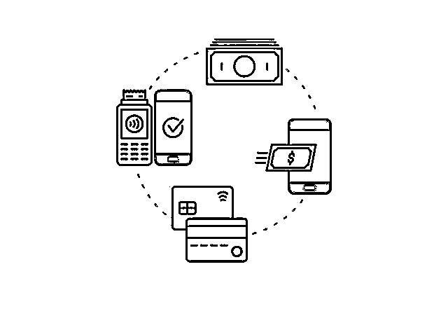

# App Store 五年自动扣费上千元！用户心太大，苹果藏太深？

> 原文：[`mp.weixin.qq.com/s?__biz=MzIyMDYwMTk0Mw==&mid=2247544817&idx=7&sn=4d8e4320c9bc74475c58b5eddfeedefb&chksm=97cbe4c9a0bc6ddf710b86a0c55ccda389b519ea975c6f4db0ed8066cd54ced24c4f77087bf4&scene=27#wechat_redirect`](http://mp.weixin.qq.com/s?__biz=MzIyMDYwMTk0Mw==&mid=2247544817&idx=7&sn=4d8e4320c9bc74475c58b5eddfeedefb&chksm=97cbe4c9a0bc6ddf710b86a0c55ccda389b519ea975c6f4db0ed8066cd54ced24c4f77087bf4&scene=27#wechat_redirect)

图源：东方 IC

“您的会员即将到期，近期将为您自动续费。”每当收到这样的短信，不少人心头一紧，随后便开始查阅账单，回忆自己在何时，又为哪一款 App 开通了自动续费功能。

上海市民张女士最近“大吃一惊”，她发现**五年来苹果 App Store 一直在自动扣费，金额超过千元**。她认为，苹果公司应该通过短信或者微信方式将自动扣款提示信息发送给用户，邮件提醒容易被用户忽略。

**   01    **

****看到账单时“吓一跳”****

****“9 月 15 日晚上 7 点左右，我打开支付宝账单的时候吓了一跳，发现有好几笔来自苹果 App Store 的扣款。”苹果用户张女士对《IT 时报》记者说道。****

****张女士查阅支付宝账单后发现，近五年来，App Store 一直在进行自动扣费，**扣费平台主要是爱奇艺、腾讯视频和网易云音乐，费用从八元到几十元不等**。张女士粗略计算了下，有将近七八十张这样的账单，一共被自动扣费了上千元。****

****面对上千元的账单，张女士颇感委屈，她表示：“自己没有登录爱奇艺、腾讯视频和网易云音乐，即便之前开通过续费会员，但平台发现用户长期不登录的情况，也应该取消收费。”张女士还认为，五年时间自己没有收到扣费提示短信，苹果邮箱提醒方式很容易被用户忽略。****

****张女士将此事件发至朋友圈后，不少人表示自己也有类似经历，莫名被自动扣费了几十元甚至上百元。在苹果官网社区中，记者也看到一些用户关于自动扣费的投诉，其中有两位用户反映，自己使用 Apple ID 订阅后忘记取消，之后没有使用过所订阅的 App，但 App Store 依旧会自动扣费。苹果官网社区给出的回复是，试用期结束后，用户没有及时取消订阅，App Store 依旧会为付费 App 提供自动扣费服务，直到用户取消，并且不是所有 App 都能成功退款。****

****************

****《IT 时报》记者在黑猫投诉平台搜索“苹果自动扣费”后发现，3952 条投诉主要集中在“App Store 莫名扣费”“无法成功退款”“没有明显扣费提醒”等。****

********

******截至记者发稿，爱奇艺退回了张女士最近的两次扣款。******

******   02    ******

********警惕免费试用后自动续费********

******想要知道为什么苹果 App Store 会自动从用户账户中扣费，就要先了解 App Store 的付费逻辑。******

******目前，App Store 的付费方式主要分为购买 App 和 App 内购买（In-App Purchas）两种。购买 App 需要付费才能下载，App 内购买则是免费下载后，在 App 内进行消费，例如游戏充值、开通会员等。******

******无论是哪种方式，必不可少的前提步骤是，用户需要输入 Apple ID 和密码来授权付费。授权之后就意味着用户已经确认要购买这一项目，并且允许平台从 Apple ID 所绑定的支付方式（支付宝、微信或银行卡等）中进行自动扣款。因为订阅内容在 App Store 中也被视为 App 内购买，所以同样需要用户进行付费授权。******

********尤其是对“先试用，再订阅”方式，苹果用户更需要注意。用户常常以为自己授权的是免费试用，试用期结束后卸载 App 就不会扣费，实际情况则是：免费试用后，再以付费方式进行订阅。**举例而言，商家为了促销开展“购买 1 年会员，多赠送 7 天”的活动，只要用户参与了前 7 天的活动，就表示同意购买之后的 1 年会员。这也是为什么点击“免费试用”后，弹出的授权窗口中仍会显示金额。因此，不少用户被自动扣费了却不自知。******

******我国《电子商务法》第十九条规定：“电子商务经营者搭售商品或者服务，应当以显著方式提请消费者注意，不得将搭售商品或者服务作为默认同意的选项。”也就是说，经营者可以搭售相关商品，但需要以显著的方式来提醒消费者，让消费者有充分的知情权。******

******《网络交易监督管理办法》也明确规定：“网络交易经营者采取自动展期、自动续费等方式提供服务的，应当在消费者接受服务前和自动展期、自动续费等日期前 5 日，以显著方式提请消费者注意，由消费者自主选择。”******

******中国法学会消费者权益保护法研究会副秘书长陈音江在接受媒体采访时表示：“消费者在遇到软件自动默认购买并扣费的行为后，可以要求经营者或 App 应用商店退还；还可以向有关部门投诉举报，用法律来维权。”******

*********#相关链接#*********

******如何取消自动扣费？******

******苹果用户******

****用户要取消 App Store 自动扣费，首先进入“设置”，点击 Apple ID，通过管理 App Store 的入口，点击“订阅”，就会看到所有绑定 ID 的自动扣费项目，用户可以根据自己的需求解除自动扣费的项目。****

****苹果用户发现自己被自动扣费后，可以登录苹果官网，在菜单栏上找到“技术支持”，进入“账单和订阅”后，点击“申请退款”，接下来在指定网址登录 Apple ID 和密码，详情填写退款理由，并选择自己所购买的项目后，完成提交。用户也可以选择拨打苹果客服电话，详细询问扣费项目等具体情况，判断是平台问题还是自身原因后，再进行退款申请，这样可以提升退款成功率。****

******支付宝用户******

****在“我的”里面，点击右上角“设置”按键，找到“支付设置”后，点击“免密支付/自动扣款”，可以看到已签约的自动扣费项目，然后选择相应的项目进行退订。特别提醒的是，支付宝的免密支付，以《IT 时报》记者使用经历为例，在“乘车码服务”中，有 13 条开通记录，分别是不同城市的交通电子卡，用户点击“去管理”后，将不使用的交通卡进行退卡处理。**** 

******微信用户******

****点击“我”，进入“服务”，选择“钱包”后，便可以看到“支付设置”，点击“自动续费”，关闭不需要的扣费服务即可。****

******其他 App 用户******

****一些 App 同样可以取消自动扣费。以哔哩哔哩为例，点击左上角的头像，进入主页后，点击“我的大会员”，点击右上角“签约续费管理”，不仅可以看到签约状态、签约渠道、扣费时间和金额等，还可以查看开通记录，了解扣费详情。****

****来源：IT 时报****

********

****欢迎关注灰产圈社群服务号****

********

********