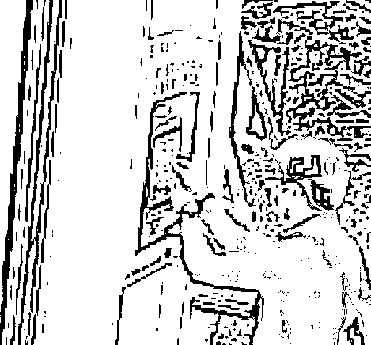
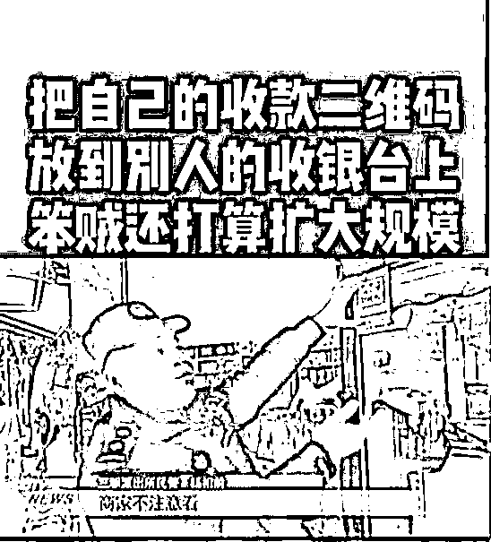

# 上海有地铁站的场所码扫出来是红包？居然有人利用这个赚钱…

> 原文：[`mp.weixin.qq.com/s?__biz=MzIyMDYwMTk0Mw==&mid=2247544872&idx=1&sn=89d8e3164017a9aae95cf801e1c68068&chksm=97cbfb10a0bc720655ff43177c86abc3f0decbed026ff0d36124894cd4a1fce7431611f33bbf&scene=27#wechat_redirect`](http://mp.weixin.qq.com/s?__biz=MzIyMDYwMTk0Mw==&mid=2247544872&idx=1&sn=89d8e3164017a9aae95cf801e1c68068&chksm=97cbfb10a0bc720655ff43177c86abc3f0decbed026ff0d36124894cd4a1fce7431611f33bbf&scene=27#wechat_redirect)

今天就是国庆小长假第一天惹！

看朋友圈大噶行程都很满

走亲访友 周边自驾游 blabla

然后就，人从众𠈌了

今天早上的崇明也是有点夸张

5 公里要开 38 分钟

火车站↓

这辣辣长的队伍

还是蛮吓人额

而就在前几天，上海地铁

还发生了一个诡异又好笑的事情…

**场所码扫出红包？？**

大噶现在都习惯了吧

为了公共安全，坐地铁之前

总归要扫场所码的

但有一些市民反映 

**“我扫地铁里的场所码**

**怎么变成红包了啦？？？”**

而这一站，有不少乘客扫来扫去

都无法显示正确信息

甚至还有人扫出红包

个么，路人也很莫名啊

到底是技术性调整

还是道德的沦丧？？

为什么扫不出场所码了

车站工作人员接到乘客反映后

就立刻去看 是怎么一回事

于是就发现了蹊跷…

进入车站通道内的场所码

居然被一个**“红包”二维码**覆盖了

其实也没什么技术可言

就是打印出来黏上去

这行为，是脑洞大开后进水了吗

工作人员将红包码清除

并立即报警

这才把事情调查清楚..

9 月 24 日、25 日，一名男子

**在****9 号线台儿庄路站和蓝天路站**

**进口和通道处**

**连续贴了几张红包二维码**

这？？看到这里就感觉

多少有点智商捉急

人菜瘾大啊

这么明显的行为，肯定是无所遁形的

轨交警方调查后

在 9 月 26 日将嫌疑人黄某抓获

很难不怀疑他看了

那些替换收款码的新闻

所有商家都贴我的收款码

人在家中睡，钱从四处来

难道他看新闻的时候都不看标题吗？

——笨贼

据黄某交代，是最近发现别人

扫了他红包二维码并使用该红包后

就能获得一定金额的**返现**

于是黄某就通过自己的朋友圈和微信群

发布红包二维码，让朋友帮他助力
接着还把歪心思动到地铁上了

原来是这样

怪不得难怪朋友圈

老有人分享红包二维码…

作案道具

就是几张自己打印的二维码

黄某：就是赚点零用钱。

民警：那你为啥要把场所码贴掉？贴了那几个站？

黄某：反正就 9 号线沿线，还有 6 号线。

要说黄某也蛮搞笑

据民警透露，他四天获利了 300 多元

大部分获利还是来源于朋友圈和微信群

……白忙活一场

但是他贴码覆盖场所码的行为

也已经构成了扰乱公共秩序

目前，警方已对黄某

作出行政拘留 5 天的处罚

要说这就是财迷心窍啊

喜提班房五日游

好在这事情在小长假前

调查清楚了，警察叔叔还是给力啊

不然本就人从众𠈌的出游日

又要雪上加霜了…

来源：上海全知道，新闻坊

欢迎关注灰产圈社群服务号

