# 广州华商学院女厕辣眼大瓜：渣男跳窗走，女生被社死

> 原文：[`mp.weixin.qq.com/s?__biz=MzIyMDYwMTk0Mw==&mid=2247544872&idx=2&sn=dc131f73ee33aebe236c40aa85c621e3&chksm=97cbfb10a0bc7206a2c2f8cc4179222e0a17ad56065286d9a2fe54351d39663a4ab61e75690a&scene=27#wechat_redirect`](http://mp.weixin.qq.com/s?__biz=MzIyMDYwMTk0Mw==&mid=2247544872&idx=2&sn=dc131f73ee33aebe236c40aa85c621e3&chksm=97cbfb10a0bc7206a2c2f8cc4179222e0a17ad56065286d9a2fe54351d39663a4ab61e75690a&scene=27#wechat_redirect)

这所高校“女厕演唱会”的瓜，被很多人吃到了。

男女生在学校一楼的女厕所里嘿咻被众人围观直播。当事人发现被围观后，没有担当的小男生丢下女生跳窗跑，丢下女生一个人面对社死。

男生专科，女生本科，于是就有了“专插本”的传说。

据说这是一对小情侣，年轻人嘛，不知怎么就控制不住自己的身体了，两个人在女厕所里就做起了那种事。 

厕所不是贴有玻璃纸吗，有同学说，好像是玻璃纸贴反了，贴玻璃纸的人可能也没想到，他们贴反了玻璃纸，会引发这么一出围观。 

最初不知道是谁先发现的，一传十，十传百，引发了人山人海的围观。

现场的热闹与演唱会和粉丝接机有得一比。 

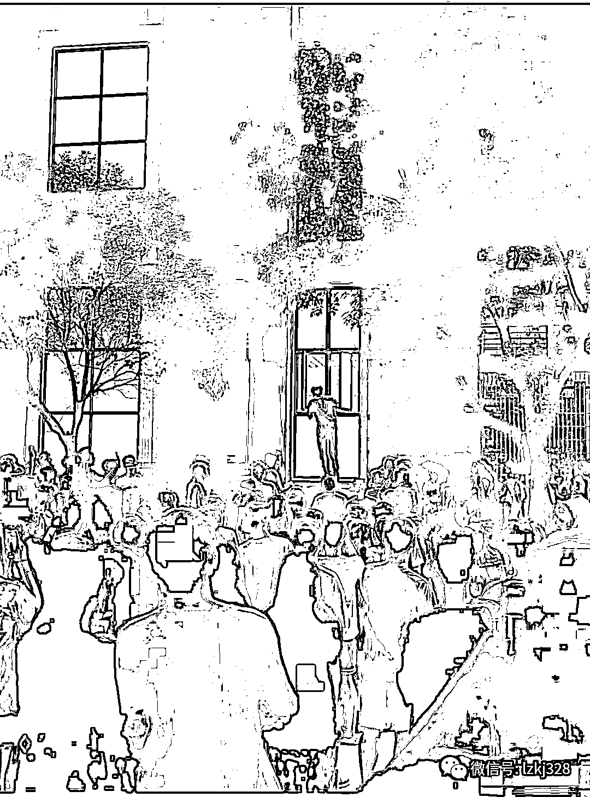

这是不是很壮观。

画面确实有点辣眼睛。 

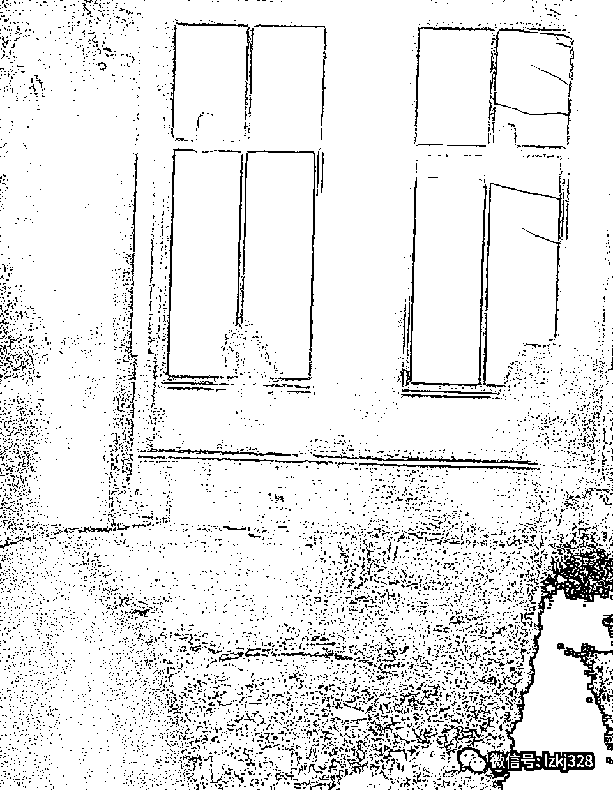

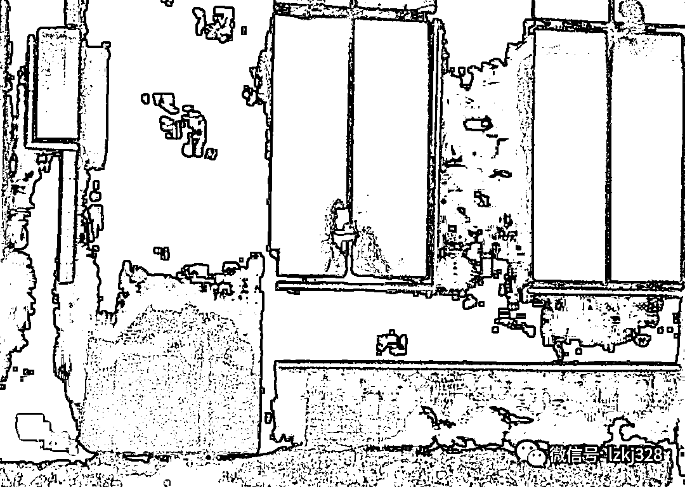

围观的人越来越多。

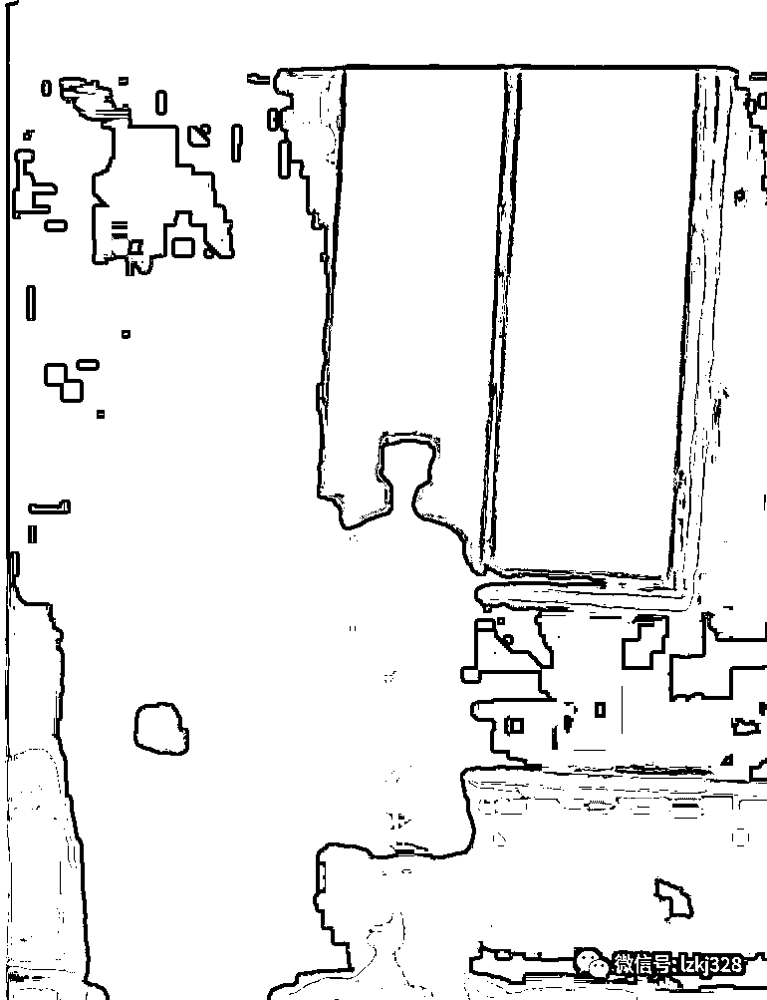

有男生贴着窗户往里看。

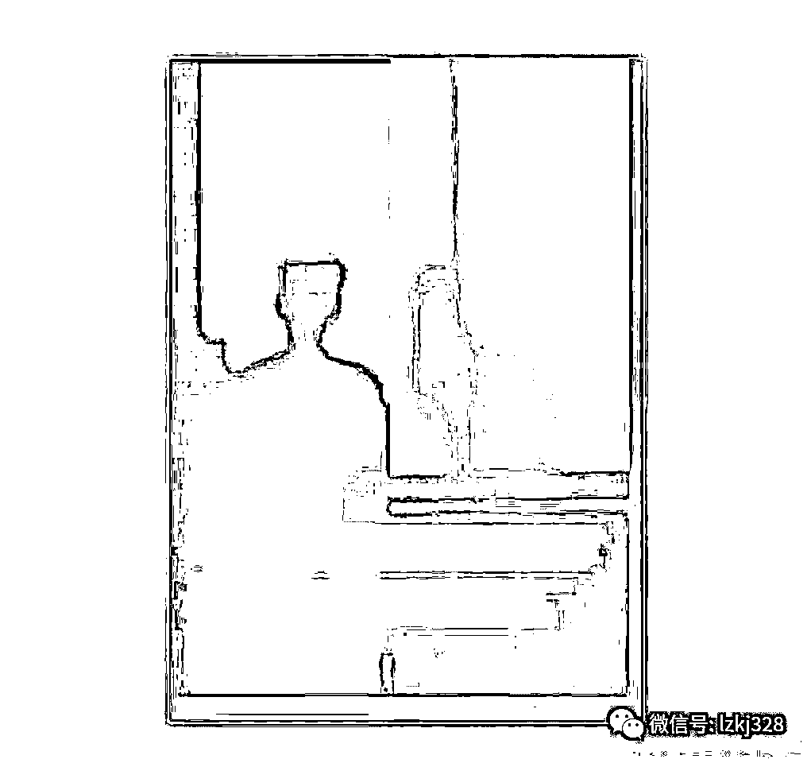

许多人拿出手机，搞起了现场直播。

有网友无法理解两个人做的事情，认为两个人太没自制力了，也太随意，男欢女爱没错，也要找个合适的地方。毕竟这还是在大学里，还是公共厕所，属于公共场合，突破了大众的认知。

> @旧故里与你: 看了，但是觉得很无语，在公共场所这样做，真的能干出来这事我也很服气，而且，真的不嫌脏吗！

在这位网友的留言下面，是一堆求瓜的。 

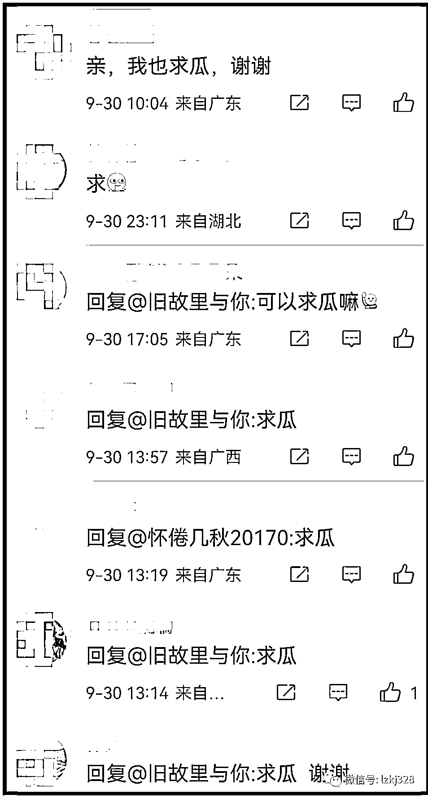

“求瓜”的人排成了长队。

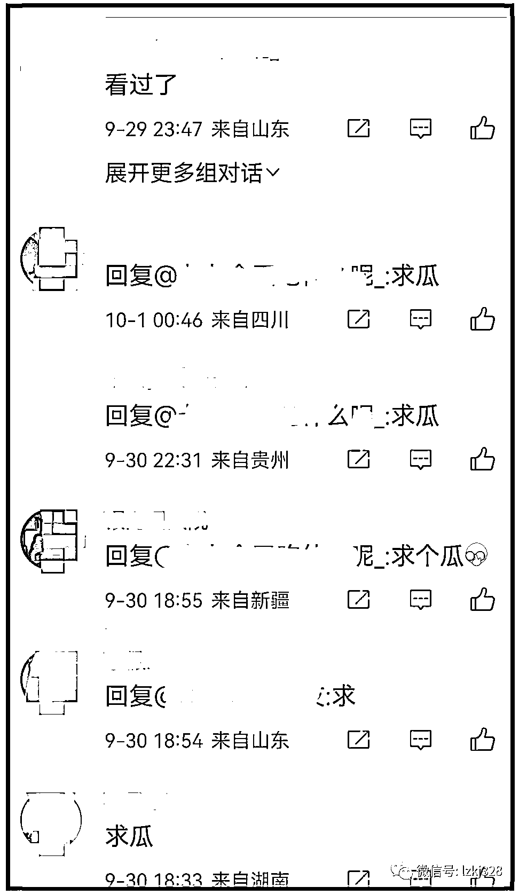

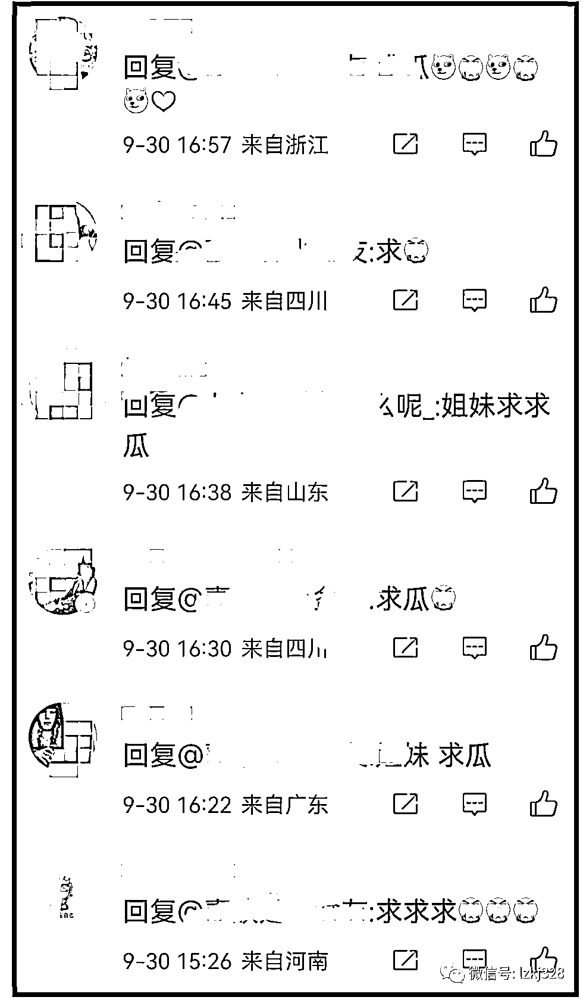

还有“求瓜”被骗的。

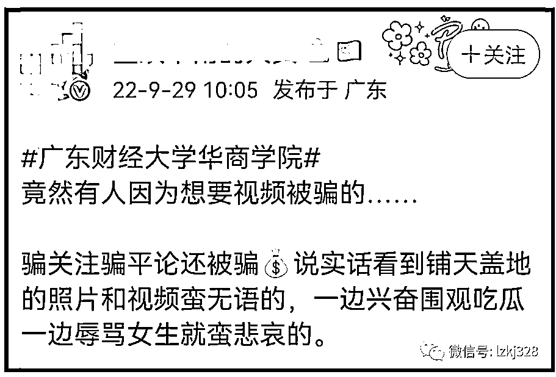

有人担心，女厕所玻璃这么透明，在外面就能看见，这俩人自身有问题被拍了怪不得别人，但正常进去整理服装的女生们，谁来保护她们的隐私？

事情的发展出人意料，男生发现“险情”之后，把女生扔在厕所里自己翻窗户跑掉了，让女生一个人面对众人的围观。

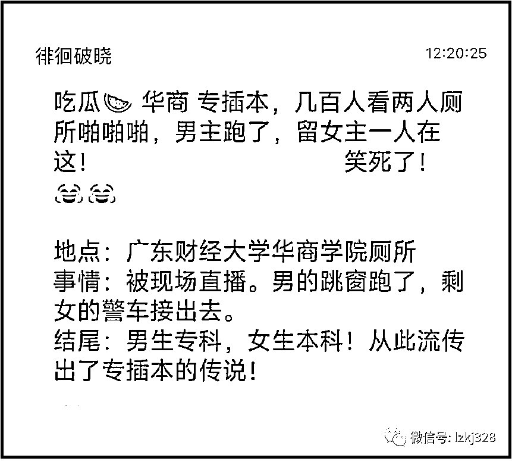

许多人为这个女生感到不值，因为男生太没担当了，没有保护好女生。

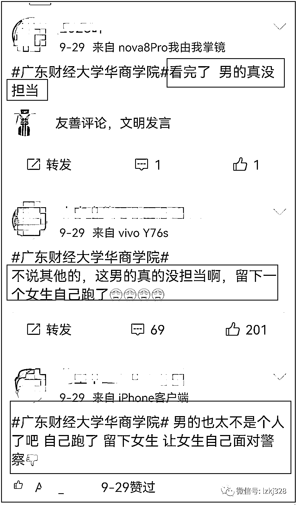

许多人对跳窗跑路的男生进行了谴责。

网友呆呆小玉米：男生也是太恶心了了，直接走了，女生我感觉社会性死亡，太尴尬了。

网友@Wowww_ 不愧是罗烨：男生自私自利，没有担当，但做这种事，更应该分场合，控制自己的欲望，约束自身的行为，网络上也不要再传播相关视频了，舆论真的可以杀死人的。

有网友希望学校能够善待这件事，可以给双方处分，但是男生受处分的力度应该大一点。理由是，一个男的既然跟人家发生关系的时候被他人看见，首先保护的不是自己身体下面的女生而是自己的脸面，这种男的今后就是到了社会上会有担当吗，一个没有担当的男生，算是一个男人吗？

这个事情，相关话题的阅读量已经超过 380 万了。

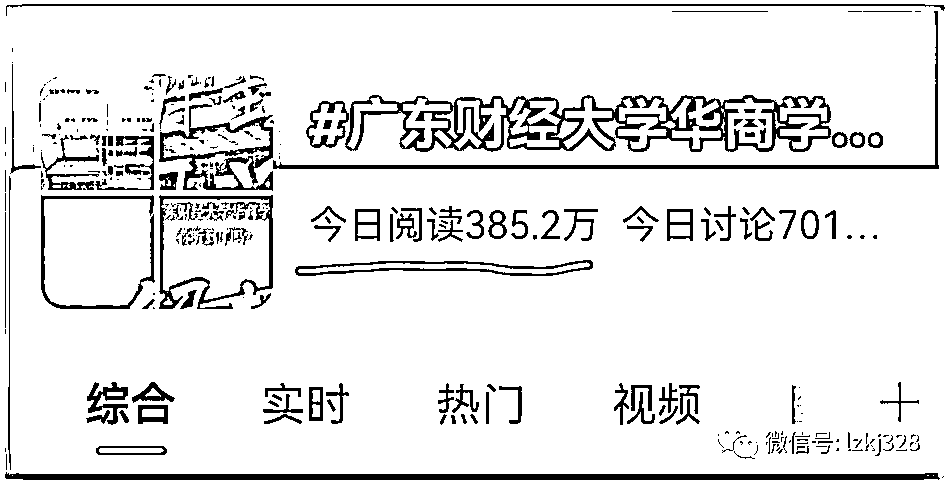

有人说，这事儿发生在广东财经大学华商学院，也有人纠正，说是广州华商学院，和广东财经大学没有关系了，该院校已经独立。

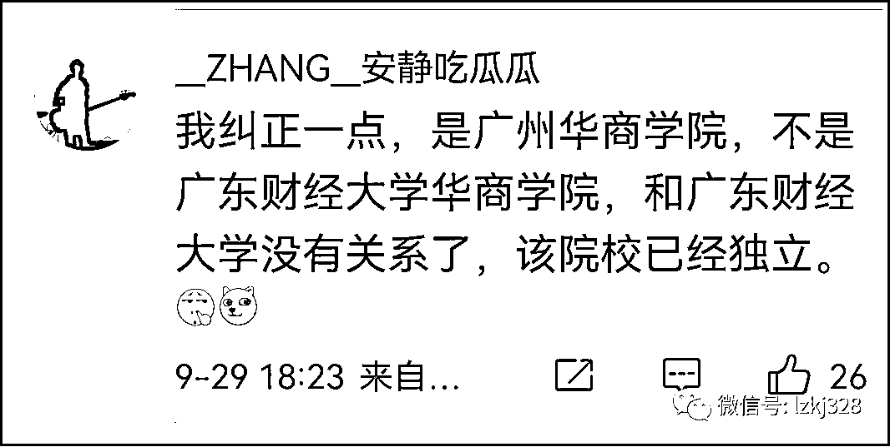

来源：宾曰语云  ID 号：lzkj328 作者：宾语

欢迎关注灰产圈社群服务号

