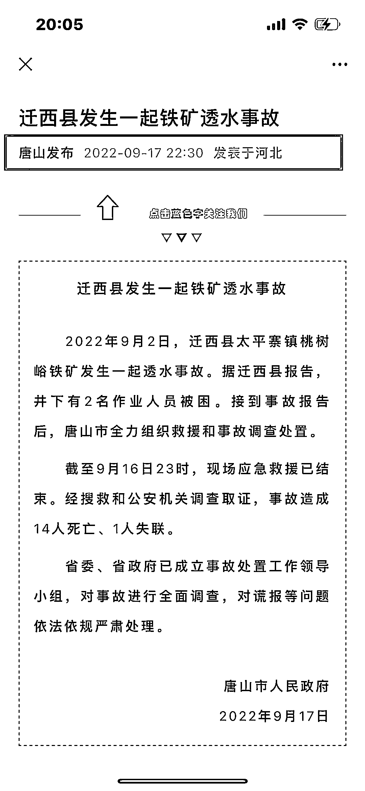
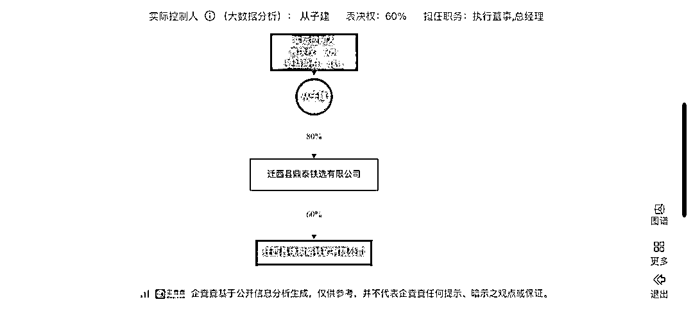
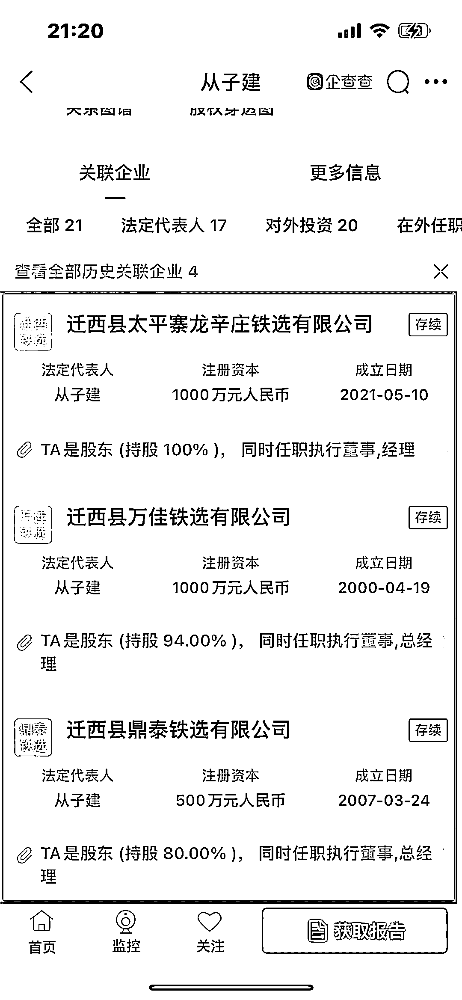
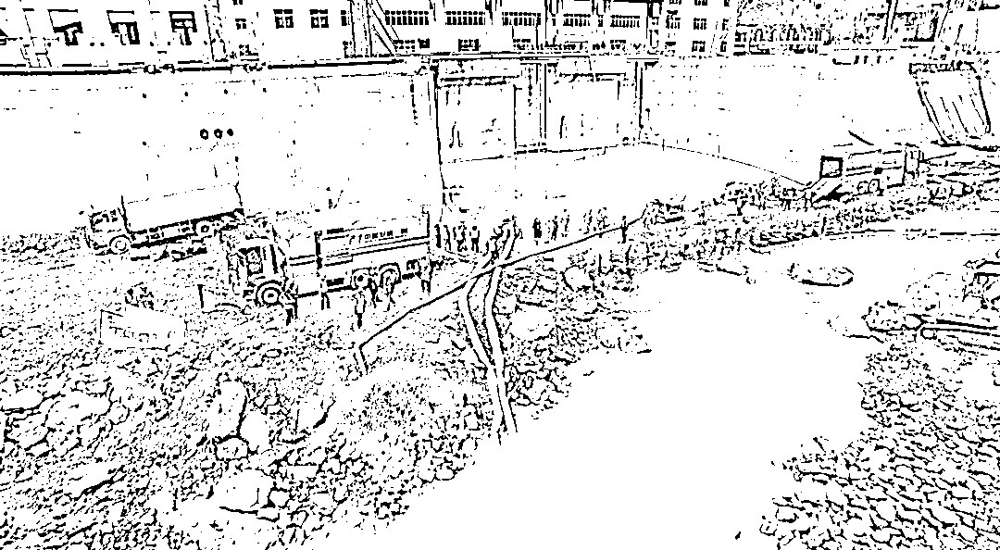
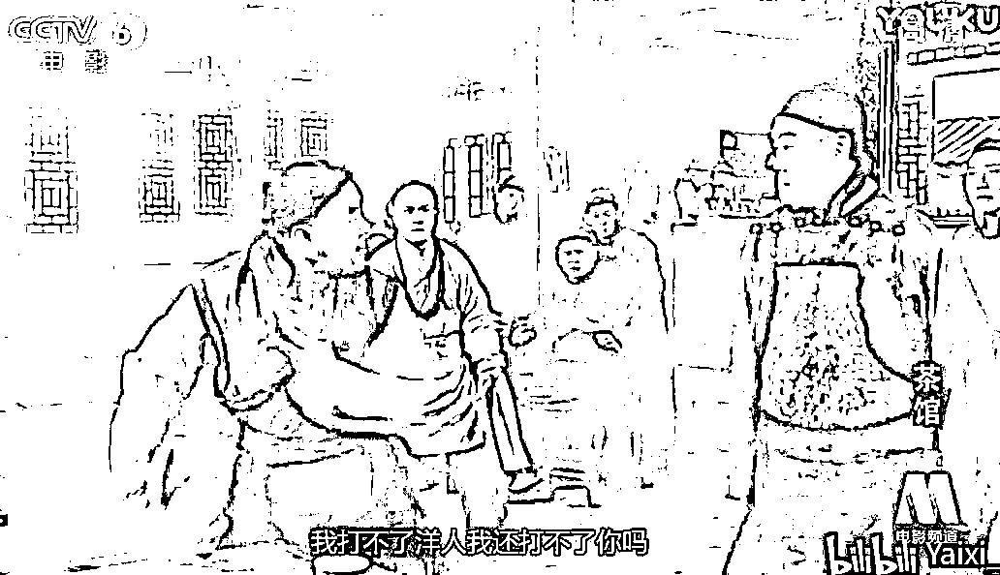

# 铁矿透水事故谎报 15 天背后的罪与罚

> 原文：[`mp.weixin.qq.com/s?__biz=MzIyMDYwMTk0Mw==&mid=2247544872&idx=3&sn=e0aa684af978c66c7f55b69df59fb35d&chksm=97cbfb10a0bc72065d58a7bcfeb41c70be78f837850a151b9143b1ebbe2da61b04c7e512b69d&scene=27#wechat_redirect`](http://mp.weixin.qq.com/s?__biz=MzIyMDYwMTk0Mw==&mid=2247544872&idx=3&sn=e0aa684af978c66c7f55b69df59fb35d&chksm=97cbfb10a0bc72065d58a7bcfeb41c70be78f837850a151b9143b1ebbe2da61b04c7e512b69d&scene=27#wechat_redirect)

**据“唐山发布”9 月 17 日发布的信息：**

（1）2022 年 9 月 2 日，迁西县太平寨镇桃树峪铁矿发生一起透水事故。据迁西县报告，井下有 2 名作业人员被困。截至 9 月 16 日 23 时，现场应急救援已结束。经搜救和公安机关调查取证，事故造成 14 人死亡、1 人失联。

（2）这个一个高度信息化的网络时代，然而，迁西县发生的这起铁矿透水事故却可以成功谎报长达 15 天之久，若不是唐山市委宣传部对外公布，迄今，公众包括其他 13 名被瞒报的死亡或失联矿工家属仍被蒙在鼓里，试问：这又需要多大的基层能量和舆论控制力？

（3）又据 9 月 19 日消息：迁西县委书记蔡宗健、县长石井满，分管副县长唐海生三位县领导已被免职。

（4）此次矿难涉事企业为迁西县桃树峪铁矿有限公司，法定代表人从子建，名下控股多家铁矿石公司。

**实控人从子建涉嫌：重大责任事故罪（《刑法》第 134 条第一款）。**

1、该罪的主体，包括对生产、作业负有组织、指挥或者管理职责的负责人、管理人员、实际控制人、投资人等人员，以及直接从事生产、作业的人员。

2、依据《关于办理危害生产安全刑事案件适用法律若干问题的解释》（法释〔2015〕22 号）第七条：造成死亡三人以上或者重伤十人以上，且负事故主要责任的，对相关责任人员，处三年以上七年以下有期徒刑。

概言之，仅重大责任事故罪这一罪就可能跳入了第二个量刑区间，即 3-7 年有期徒刑。

 

**从子建涉嫌：谎报安全事故罪（《刑法》第 139 条之一）**

1、负有报告职责的人员不报、谎报安全事故的行为，直接导致安全管理在报告环节受阻，影响下一个环节救援处理的进行。因此，违反安全事故报告制度直接侵害了安全管理秩序，并贻误了救援时间。

2、于本案而言，主观层面只能表现为故意，这又需要分两个层面来阐述：

（1）明知自己的不报、瞒报行为会产生贻误抢救的后果，但因害怕承担重大安全事故带来的行政责任、刑事责任，因此为了逃避事故责任，才选择谎报，并进而放任了危害后果的发生，矿工遇难人数的攀升既不是从子建的积极追求，但也不违反他最初选择谎报的计划，投下去的是弃权票，缺乏对于生命的敬畏意识，本质上是一种听之任之、放任自流的间接故意！

（2）假如调查组认定：从子建存在伪造、破坏事故现场，或毁灭、伪造、隐匿与事故有关的证据等行为，因其主观上明知安全事故的发生以及事故本身的严重程度，并且站在一般理性人人的角度可以推定其明知不报、谎报会贻误事故的抢救，却存在积极的意志因素去选择谎报，这显然又是直接故意的犯罪心态。故主观形态上起码是一种间接故意。

**关于谎报安全事故的定量分析**

《关于办理危害生产安全刑事案件适用法律若干问题的解释》第八条：

在安全事故发生后，负有报告职责的人员不报或者谎报事故情况，贻误事故抢救，具有下列情形之一的，应当认定为刑法第 139 条之一规定的“情节严重”：

（一）导致事故后果扩大，增加死亡一人以上，或者增加重伤三人以上，或者增加直接经济损失一百万元以上的；

（二）实施下列行为之一，致使不能及时有效开展事故抢救的：

1.决定不报、迟报、谎报事故情况或者指使、串通有关人员不报、迟报、谎报事故情况的；

2．在事故抢救期间擅离职守或者逃匿的；

3．伪造、破坏事故现场，或者转移、藏匿、毁灭遇难人员尸体，或者转移、藏匿受伤人员的；

4．毁灭、伪造、隐匿与事故有关的图纸、记录、计算机数据等资料以及其他证据的；

为加深认知，配图为四川水电站透水事故的救援现场

**关于谎报安全事故的认定**

《解释》第九条:在安全事故发生后，与负有报告职责的人员串通，不报或者谎报事故情况，贻误事故抢救，情节严重的，依照刑法第 139 条之一的规定，以共犯论处。

**关于罪数形态：是择一重罪还是数罪并罚？**

（1）一般而言，重大责任事故罪是不报、谎报安全事故罪的“上游犯罪”，但两者并不是非此即彼，比如迁西县安监局的相关责任人员、分管副县长是不构成重大责任事故罪的。

退一万步，哪怕与工矿企业负责人从子建一起参与共谋，并决定对唐山市的领导选择谎报、瞒报，也不成立不报、谎报安全事故罪。

因为负有报告职责的国家机关工作人员不报或者谎报事故情况，并贻误事故抢救的，应当按照滥用职权罪或玩忽职守罪定罪处罚。

（2）于从子建而言，重大责任事故罪与不报、谎报事故罪存在着事实上的必然延伸性，进而成立事后不可罚。同时，两个罪名所侵害的法益也具有同一性。

故笔者不赞同对从子建采取数罪并罚，而是以上游的重大责任事故罪从重处罚，即把谎报、瞒报的行为作为前罪的从重处罚情节以一罪论处。

笔者：付士峰律师、李晨露律师 

标题:《铁矿透水事故谎报 15 天背后的罪与罚》

来源：景来律师

欢迎关注灰产圈社群服务号

