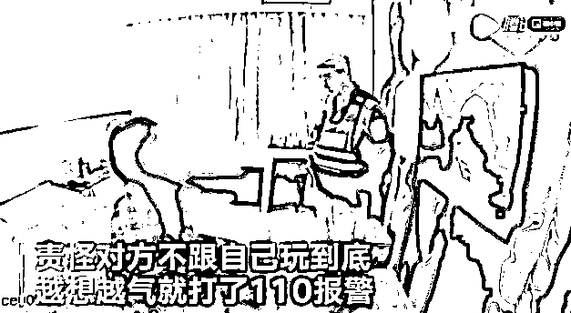
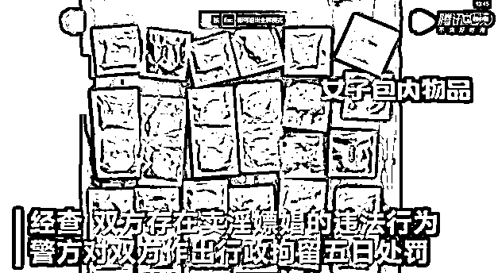
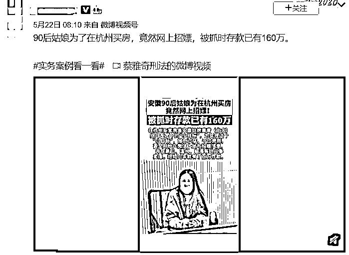

# 奇葩女子带 30 个避孕套，强迫男子与其发生关系后报警："我还没玩够..."

> 原文：[`mp.weixin.qq.com/s?__biz=MzIyMDYwMTk0Mw==&mid=2247544872&idx=5&sn=f20633e339ba1a4c46ea2a74430ad3e0&chksm=97cbfb10a0bc7206c79f1d04c2de8df477d3a769ad8e607b452ffb3c3c005641bf20b0721e15&scene=27#wechat_redirect`](http://mp.weixin.qq.com/s?__biz=MzIyMDYwMTk0Mw==&mid=2247544872&idx=5&sn=f20633e339ba1a4c46ea2a74430ad3e0&chksm=97cbfb10a0bc7206c79f1d04c2de8df477d3a769ad8e607b452ffb3c3c005641bf20b0721e15&scene=27#wechat_redirect)

近日，突然看到了一则颇为奇葩的新闻：

一女子约男网友“约 P”，事后非常满意，并邀请男子一起过夜，遭到男子拒绝后，女子气不过就报了警，要警察主持公道。

这应该是警局有史以来接到的最懵逼的报案了吧！人家看到警察跑的比兔子还快，这女子竟然还把自己给送进去了，真是个狠人。

事情的经过是这样的。 

这名女子和男网友是浙江杭州人，一开始，女子是通过社交软件上认识了男网友“小黄”。

两人加上好友后，便聊了起来，因为是同乡所以话题也自然的就多了，正当聊得起劲时，女子突然对男子小黄说：“自己可以提供上门服务”。

怕男子不能理解，还特意的强调了一下是“特殊服务”。

既然是服务当然也不可能是免费的，女子随后就发出了价格表，让男子选择。

面对突如其来的诱惑，在加上漫漫长夜，男子最终也没忍住诱惑，于是便按照价位表，支付了 2030 元钱。

达成协议后，小黄给对面发去了酒店地址。

当晚 11 点，女子来到小黄的房间，进行了不可描述的服务。

事后，女子觉得男子很不错，于是便邀请男子升级下套餐，想着让对方包夜。

可没想到男子不仅拒绝了她，还让女子赶紧滚，语气略微的不是太好，这让女子心里非常的不舒服。

为了惩戒一下小黄，一气之下就报了警。

警方到达现场时，先是了解了一下情况，后感觉两人的不对劲就带回了警局调查。 

在警方的审问之下，两人便承认了卖淫嫖娼的事实。

更让人震惊的是，从女子的随身物品搜查，发现包里有 30 多个的安全套。

由此可见，女子早就做足了“赚钱”的准备。

最终，两人受到了行政拘留五日的处罚。

若不是因为两人对法律的无知，这荒唐的事情还会一直持续下去。 

有网友更是忍不住感叹：“她真是太拼了，完全是拿命在换钱！”

人在金钱的驱使下，真是什么难以置信的事情都做得出来。

02

**俗话说得好：“人在岸边走，哪有不湿鞋。”**

在当下这个浮躁的时代，很多人急于求成，慌不择路，企图通过走捷径满足贪欲。

却唯独忽视了其中所隐藏的巨大风险。

曾看到过这样的一个新闻。

一名 90 后安徽女子，因为从小家庭条件就不是很好，早在 16 岁时就辍学在外打工。

她很努力，也很省吃俭用，但即便如此，努力了 10 年下来也就攒了 100 多万。

这离她想要在杭州定居的目标还是很遥远，毕竟杭州的房价一直都很高，想要实现真的不知道需要多久的时间。

为了尽快的实现，于是她便有了邪念，想通过捷径达成目标。

在一次偶然的机会，她了解到 piaochang 可以很快的来钱，便在各个平台发布了招 p 的信息。

每次的价格在 500-800 不等，包夜 2000 以上。

她自己怕忙不过来，还邀请了小姐妹一起做。

短短的半年时间，她就赚了 60 万。

但是最后因为违法，被警方抓获，卖淫来的钱，也全都被没收。

其实这也不是她第一次被抓，此前她就曾因涉嫌卖淫嫖娼被行政拘留。

可她却不知悔改，在这条错误的道路上越走越远。

这些钱财看似来得快，但是付出的是自己的青春，切莫为了金钱而拿自己的身体去换取，短时间内或许能满足你内心的物质欲望，但是失去的却是自己的精神世界。

出卖身体和灵魂换来的财富，终究会被世俗所唾弃。

03

这个世界上原本就不存在一夜暴富，成功的道路没有任何捷径，只有脚踏实地，一步一个脚印，才能到达理想的彼岸。

你看看星爷，他在成功时跑了多少的龙套，

在看看周杰伦，为了写歌，熬了多少个日夜，才获得的成就。

还有最近消失的李子柒，为了展现最好的视频给大家。

光是在选材，取景，光线，配音，后期，剪辑上，都是自己一点一点的研究，再一次一次的试拍，为了那一帧一秒，付出了多少的心血。

还记得拍雪山的那个视频吗？她自己一个人背着设备爬了 9 个小时的雪山，就为了拍下雪山日出的那几秒镜头。在寒冷的冬天，她都不敢睡下去，就怕自己在山上冻死。

你现在看到的她是很光鲜的收货，你可知她背后的辛苦。

她最后的成功也许大家会说她的机遇好。

但有句俗话说得好：“机会是给有准备的人留的”。

人有发财梦，没什么毛病，但一定要脚踏实地，遵守法纪，做任何事都不能突破法律底线。

那些不是通过自己的努力与奋斗得到的东西，终究会变成坑。

**正如茨威格所说：“她那时候还太年轻，不知道所有命运赠送的礼物，早已在暗中标好了价格。”**

走捷径的后果，就是让你无路可走。

 来源：幸福小酒馆

欢迎关注灰产圈社群服务号

