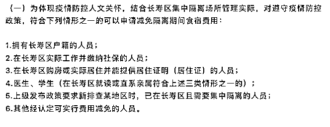

# 央媒怒批：对防疫隔离人员强制收费涉嫌违法

> 原文：[`mp.weixin.qq.com/s?__biz=MzIyMDYwMTk0Mw==&mid=2247544872&idx=6&sn=a95ff22a692028d20755618e082db774&chksm=97cbfb10a0bc7206038651c19a3d55bd991cca3eeb55429a0d3f47bc23710dd34c0876aa9180&scene=27#wechat_redirect`](http://mp.weixin.qq.com/s?__biz=MzIyMDYwMTk0Mw==&mid=2247544872&idx=6&sn=a95ff22a692028d20755618e082db774&chksm=97cbfb10a0bc7206038651c19a3d55bd991cca3eeb55429a0d3f47bc23710dd34c0876aa9180&scene=27#wechat_redirect)

**咖叔小注：**

**今天的人民日报健康客户端，也就是人民日报社所属《健康时报》，发表了一篇重磅文章《对防疫隔离人员收费应于法有据》。** 

**这篇文章，标题非常温和，语言非常克制，表达非常理性，但是，隔着屏幕，也能感受到，作者一腔为国为民为正义呐喊的拳拳之情。**

**前几天，几个地方相继出台了一项奇葩的规定，还堂而皇之地进行了“官宣”，宣布对防疫隔离人员收费，拒不缴纳的，要强制处理。**

**这显然违反了有关法律法规，消息一出，舆论哗然，但也就是几个自媒体嚷嚷了几声，主流媒体基本都沉默不语。**

**人民日报健康客户端，终于发声了，很多网友感叹：“关键时刻，这才是媒体中的定海神针，舆论场的中流砥柱！”**

**本文作者赵广泉，人民日报社《健康时报》首席评论员，也是咖叔好友，大哥。**

**闲言少叙，废话少说，直接上文，各位看官，请往下读：**

**** 对防疫隔离人员收费应于法有据****

****做任何一件事，得想想为什么做、该怎么做、怎么做才能做好，这是正常思维。遇到紧急情况，来不及细想也情有可原，但一定要依法依规做，这是底线思维。尤其是疫情防控，更不能突破法治的底线。****

****近日，相关疫情防控的两则消息引发广泛非议。先是 9 月 21 日重庆市长寿区官微“长寿发布”通告称：关于新冠肺炎疫情防控集中隔离场所收费的通告，公租房隔离点 300 元/人/天（含餐费 60 元/人/天），隔离酒店房费按征用酒店协议的客房价格进行收取，餐费按 60 元/人/天收取。**** 

****紧接着，云南省镇雄县疫情防控指挥部决定：9 月 21 日零时起，对所有新入住集中隔离场所人员收费管理。收费标准从每人每天 100 元到 150 元不等的价格，对被隔离人员收取隔离期间生活服务费。镇雄县在其官微“微镇雄”发布的消息中还强调，“隔离人员拒不支付费用的，将交由公安部门依法依规追究法律责任。”**** 

****为迅速实现动态清零，重庆、云南两地对涉疫人员集中隔离无可非议。但对涉疫被隔离人员强行收费，既不合情也不合法。**** 

****现行《中华人民共和国传染病防治法》第 41 条规定，对发生甲类传染病病例的场所或者该场所内的特定区域的人员，所在地县级以上地方人民政府可以实施隔离措施；第二款明确，“在隔离期间，实施隔离措施的人民政府应当对被隔离人员提供生活保障。被隔离人员有工作单位的，所在单位不得停止支付其隔离期间的工作报酬”；**** 

****现行《中华人民共和国突发事件应对法》第 49 条第三款、第七款，对受困人员也有“提供生活必需品，实施医疗救护和卫生防疫以及其他保障措施”的明确规定……**** 

****虽然《传染病防治法》第四十一条规定是对发生甲类传染病设立的，但国家卫健委 2020 年疫情初期就发布公告，“经国务院批准，将新型冠状病毒感染的肺炎纳入《传染病防治法》规定的乙类传染病，并采取甲类传染病的预防、控制措施。”**** 

****只要国务院对于新冠肺炎的认定未变，无论是依据《传染病防治法》还是《突发事件应对法》，各地政府因疫情防控需要对集中隔离群众应当提供生活保障，这是法律明确规定的政府责任。**** 

****疫情反复折腾近三年了，国家经济社会发展和民众生活工作，都遭受了前所未有的影响和冲击。为涉疫被隔离群众免费提供基本生活保障，不仅是依法防控、科学防疫的政府义务，也是以人为本、体恤民生不易的政府情怀。**** 

******至于镇雄县官宣，“隔离人员拒不支付费用的，将交由公安部门依法依规追究法律责任”的说法，不仅于法无据还涉嫌违法。******

****【延伸阅读】：近日，两个热搜话题引起了网友的广泛关注——****

******话题一：云南镇雄县集中隔离场所开始实行收费管理******

********

****图源：微博截图****

****据界面新闻消息，日前，镇雄县融媒体中心自镇雄县新冠肺炎疫情防控指挥部获悉，**从 2022 年 9 月 21 日零时起，镇雄决定对所有新入住集中隔离场所人员实行收费管理。******

****收费标准方面，阳光留观点、县二院留观点、五德养老院留观点、赤水源集中隔离点，按每人每天 100 元的标准，收取隔离期间生活服务费用；斯威特宾馆、安曼宾馆等城区集中隔离场所，按每人每天 150 元的标准，收取隔离期间生活服务费用；其余各乡镇集中隔离场所，按每人每天不超过 150 元的标准，收取隔离期间生活服务费用。****

****所有被隔离人员在入住隔离场所时，须按标准现场一次性支付费用。各集中隔离场所每次收取完费用后，须及时规范开具发票。****

****据介绍，各集中隔离场所在隔离对象入住前，会及时告知收费标准，并做好政策讲解相关工作；隔离人员拒不支付费用、提交虚假证明材料或拒不配合集中隔离场所相关规定要求的，将交由公安部门依法依规追究法律责任。****

******话题二：重庆长寿区集中隔离场所实行收费管理******

********

**** 图源：微博截图****

****“长寿发布”微信公众号 9 月 21 日消息，重庆长寿区发布关于新冠肺炎疫情防控集中隔离场所实行收费管理的通告。****

****鉴于当前疫情防控形势严峻复杂，为加强集中隔离点规范管理，经长寿区新冠肺炎疫情防控领导小组研究，决定对在长寿区集中隔离医学观察的人员，在集中隔离期间收取一定的食宿费用。具体事项通告如下：****

****一、收费标准****

****1.晏家二期公租房隔离点：300 元/人/天（含餐费 60 元/人/天）。****

****2.隔离酒店：房费按征用酒店协议的客房价格进行收取，餐费按 60 元/人/天收取。****

****二、收费时间****

****自 2022 年 9 月 21 日零时起开始计收，入住时由所在隔离点（酒店）一次性进行预收，解除隔离时进行统一结算。****

****三、收费对象****

****在长寿区集中隔离场所隔离管控的人员。****

****四、费用减免对象****

****（一）为体现疫情防控人文关怀，结合长寿区集中隔离场所管理实际，对遵守疫情防控政策，符合下列情形之一的可以申请减免隔离期间食宿费用：****

****1.拥有长寿区户籍的人员；****

****2.在长寿区实际工作并缴纳社保的人员；****

****3.在长寿区购房或实际居住并能提供居住证明（居住证）的人员；****

****4.医生、学生（在长寿区就读或直系亲属符合上述三类情形之一的）；****

****5.上级发布政策要求新排查某地区时，已在长寿区且需要集中隔离的人员；****

****6.其他经认定可实行费用减免的人员。****

****（二）符合费用减免的对象，向隔离场所工作专班提供相关证明材料，由隔离场所工作专班核查属实后，予以费用减免。****

****五、工作要求****

****1.集中隔离对象入住的隔离场所，由隔离点管控组统一安排，隔离人员应按规定支付由个人承担的相关费用，拒不支付的或以虚假资料骗取减免的，依法追究相关法律责任。****

****2.对单位集中承接实施集中隔离的，实行一事一议。****

****集中隔离要收费！此消息一出，网友立即炸开了锅：****

****“没钱怎么办？”****

****“合法吗？”****

****“强制消费？”****

****“多少人辛苦工作一天也没有 300 元！”****

****“吃相难看至极！”****

****从这些评论中，肉眼可见大家的愤怒。因为疫情三年，不管是大家的精神还是钱包，都已遭受重创。有时候通告里的一句话，落在一个人头上就可能是一座山。****

****不过集中隔离收费管理，此番操作合法吗？****

****根据《中华人民共和国传染病防治法》第四十一条：**在隔离期间，实施隔离措施的人民政府应当对被隔离人员提供生活保障。**第六十一条：**地方各级人民政府应当保障城市社区、农村基层传染病预防工作的经费。******

****而落实到各地，做法不一。****

****比如武汉隔离政策，当前入境人员集中隔离费用自费，其他集中隔离范围人员免费。****

****但有些地方是中高风险区返乡或去往其他地区的人员，所产生的隔离费用是由自己承担。****

****因此，目前全国各地规定不一。但是对于上文中提到的云南镇雄县和重庆长寿区直接对所有集中隔离人员收费管理的情况还是比较少见。****

****对此，我们可以结合当地的疫情形势分析一下：****

******1.云南镇雄县******

****据百度疫情实时大数据，**镇雄县所在的昭通市已经连续 5 个月没有疫情。******

********

****图源：百度疫情实时大数据****

****那么，在这样的情景下，发布这样的通告是何用心呢？****

****是以此来警示大家不要随意流动？****

****还是当地财政压力大提前打好预防针？****

****据悉，镇雄县作为云南第一人口大县，总人口 171 万人，镇雄隶属的昭通市全市人口 501.4 万，镇雄占据了全市人口总数的 34.1%。****

****2021 年，经济方面，镇雄县 GDP 达到 246.43 亿元，昭通市 GDP 为 1462.1 亿元，也就是说镇雄占全市 GDP 总量的 16.85%。****

****在疫情防控形势如此严峻的情况下，镇雄县以占昭通全市 16.85%的经济体量承担了全市 34.1%的人口防疫责任，可谓压力山大。****

****可是就算是当地财政压力大，强制对所有集中隔离人员收费管理就合理了吗？****

******2.重庆长寿区******

****与镇雄县不同的是，重庆长寿区有一个“费用减免对象”，如下图：****

********

****图源：网页截图****

****从这六类减免对象中可以看出，这个通告主要针对的是外来隔离人员。****

****因此，结合两个通告的目的，似乎都有异曲同工之妙，那就是似乎都在避免人员流动所带来的疫情风险。****

****可是，如此做法是否存在防疫过度之嫌？****

****再者，重庆长寿区的收费标准在网上也引发了网友热议：****

****“疫情期间，就业困难，多少人累死累活一天也挣不到 300 块钱，现在隔离费就要 300 元一天，太难了！”****

****据查，长寿的酒店住宿，稍微便宜一点的 100 多元一天，好一点的酒店 200、300、400 都有。因此就收费标准而言，加上餐费 60 元，一天隔离费 300 元的话算合理范围。但从实际情况出发的话，并不划算，很多人可能会选择 100 多元的酒店，加上餐费，每天费用控制在 200 元左右。****

********

****图源：网页截图****

****当然，也有人开始担心，如果别的地区纷纷效仿此种办法，之后大家会不会碍于费用而减少流动？那会不会影响发展？另外会不会有人隐瞒不报？****

****目前我们不得而知，且行且看吧！****

****来源：宾曰语云 融观天下 杏林苑社群 人民日报社《健康时报》   作者：首席评论员赵广泉；医脉通****

********

****欢迎关注灰产圈社群服务号****

********

********