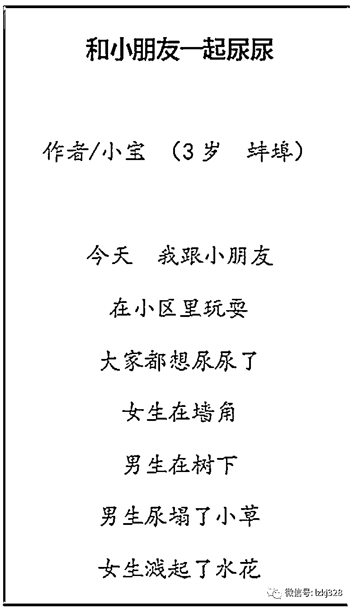

# 蚌埠 3 岁小朋友的尿尿诗赢得 7.3 万点赞

> 原文：[`mp.weixin.qq.com/s?__biz=MzIyMDYwMTk0Mw==&mid=2247544929&idx=1&sn=8934b9ee5f63881e76d3dd5b1d4622a6&chksm=97cbfb59a0bc724ffaebd790da20cd5d44b25d6f793bef24e5fa8e1665a080fa1d6410feacf0&scene=27#wechat_redirect`](http://mp.weixin.qq.com/s?__biz=MzIyMDYwMTk0Mw==&mid=2247544929&idx=1&sn=8934b9ee5f63881e76d3dd5b1d4622a6&chksm=97cbfb59a0bc724ffaebd790da20cd5d44b25d6f793bef24e5fa8e1665a080fa1d6410feacf0&scene=27#wechat_redirect)

[`mp.weixin.qq.com/mp/readtemplate?t=pages/video_player_tmpl&action=mpvideo&auto=0&vid=wxv_2601890682521452545`](https://mp.weixin.qq.com/mp/readtemplate?t=pages/video_player_tmpl&action=mpvideo&auto=0&vid=wxv_2601890682521452545)

小宝，出生于 2018 年 12 月 13 日，还不到 4 周岁，安徽省蚌埠市人。在网上拥有 91.7 万粉丝。

他的一首即兴之作，《和小朋友一起尿尿》，赢得 7.3 万个赞。

> 
> 
> **《和小朋友一起尿尿》**
> 
> 今天  我跟小朋友
> 
> 在小区里玩耍
> 
> 大家都想尿尿了
> 
> 女生在墙角
> 
> 男生在树下
> 
> 男生尿塌了小草
> 
> 女生溅起了水花
> 
> 

对于小宝的诗，大家是这样评价的：

> 妮妮：小宝说的好，连娃都知道什么是好诗。
> 
> 
> 
> 文摘：小孩都能辨别好诗还是烂诗。
> 
> 青翠田野：小宝也是专家级别的啦。
> 
> 
> 
> 锦绣芳华：比大诗人做的好多了。
> 
> 会飞的鱼：比一条线一个坑有意境多了。
> 
> 
> 
> 老虎头上的兔子：下个进作协的人是你。
> 
> 杨柳：小宝也能进作协了。
> 
> 

**专业人士如何评价小宝的诗？**

**资深媒体人，连续三届“中国新闻奖”获得者老萧：**小宝对日常存在、日常场景的即时感受，以接近口语的表达方式，运用叙述、陈述和强化的修辞手法，诗意地传达生活体验和主观感悟。目之所见，笔之所录，生活的画面感十足。

**北京大学中文系博士，北京大学中文系教授孔庆东：**这是网上掀起的恶搞贾浅浅的浪潮中的浪花吧。其实没有必要。

孩子如果有诗才，可以正面引导培养，一不要让孩子介入此类风潮，二不要脱离孩子生活实际。

**文学博士，博士后。山东师范大学文学院教授，博士生导师，山东省文艺评论家协会会员，中国作家协会会员陈夫龙：**自然，率真，生活的日常在小朋友的朴实讲述中充满了诗意和情趣。

**编剧、掌阅文学网白金作家，中国传媒大学特聘专家，辽宁文学院特聘教授，上海视觉艺术学院特聘教授，江苏省网协副主席、海南省网协副主席，中国作协成员月关：**是在学贾浅浅么，三岁的小孩子，童趣而已。

**《诗参考》主编，著名诗人、出版人、资深媒体人、文化评论人、影视评论人中岛：**这个不要为难我。我就说一句，如果没有贾浅浅的诗出现，这首诗会出现吗？模仿和跟随是毫无意义的。创新，开拓，发现才是硬道理，任何行业的发现与创新都有价值意义，而跟屁虫那就可笑了。你作为作家，文化人应该明白这个道理。       

我是一个不喜欢说假话的人，对于孩子写的诗，无论怎么被他人认可，都无法和贾浅浅的那首《雪天》相提并论，显然在诗歌价值上落后不是一丁半点儿，况且是在步贾浅浅后尘，且害了孩子的认知。我劝这位兄弟千万别通过这种方式玩，你以为用一个孩子写的有抄袭嫌疑（客气的说是模仿）的诗就可以调侃贾浅浅的诗了吗？如果真懂还好，不懂就成大笑话，还把孩子引入歧途，见谅谢谢。

**著名艺术家、诗人、画家、梨花体诗歌创始人、国家一级作家赵丽华：**我可没觉得这样的小朋友可爱。这个就是他的父亲本身就做出这种视频来，经过了很认真的编辑，这不是小朋友心血来潮写出来的，就最后两句，一看就是成人的文笔。还有一点就是，这样，就严格的限制了孩子的想象力跟想象空间，就是他给他规定了什么样的诗是诗，以他爸爸的这种审美，他对这个诗，实际上对现代诗歌他是一丁点儿都不懂，现在大部分的网民都是这样，真正的高手儿，都不说话，就是这种三流儿四流儿，七流儿八流儿的人，就在那网上撇着个嘴的都在骂贾浅浅，就大家也就是骂浅浅浅好骂，骂贾浅浅好骂，现在就是这样，就是说别的你也不敢说，就这类人，对现代诗歌儿跟现代艺术这块儿几乎是完全的不懂，但是，每个人都在那儿蹭热度，都在那儿说。

**武汉方舱医院女护士、著名诗人、中国作家协会会员弱水吟：**童言无忌。

**文化名人、音韵学专家、北京外国语大学丁启阵教授：**说实话，不是小孩子的语言，应该是经过了大人的加工。

**报人、杂文家，台州日报报业传媒集团副总编辑赵宗彪：**比浅浅好。

**报告文学作家张敏宴：**非常可爱，但是受贾平凹之女屎尿体的影响，恐怕会不讨巧。三岁小孩，值得鼓励，家长要注意记录（也可以视频记录），也许还会出妙句的。

**诗人，武义县作家协会主席鄢子和：**小诗机敏有趣，缺乏纯粹的童真。

**网络作家晴了：**哈哈，童趣满满。

**网络作家“梦入洪荒”：**应该比真深深的强一点。

**中国作协会员，杭州市青联委员 、杭州市妇联执委会委员、杭州市网络作家协会主席团成员、网络作家“疯丢子”：**有高人风采哈哈哈哈。

**中国民主促进会会员、资深媒体人、书画评论家李旭昊：**三岁，这水平可不浅，比贾浅浅的要“深”。

**湖南星辰在线新媒体集团副总编辑王重浪：**比浅浅好多了。

**艺术家红迪居士：**孩子写的真好。

**诗人韩振球：**童趣很足，想象力很丰富。

**望江摄影@师******：****孩稚写就真童诗。

**延伸阅读：**

[贾浅浅高考 200 多分，却上 211（她的诗曝光，震惊了网友）](http://mp.weixin.qq.com/s?__biz=MzIyMDYwMTk0Mw==&mid=2247542844&idx=1&sn=01887b794b4ec74a3abe16daf31cdd1c&chksm=97cbe304a0bc6a12ecf89d4eeb70ff29ebb15140970c966e8289958a33b6e4be8d330c189ef0&scene=21#wechat_redirect)

[贾浅浅的第一篇文章是如何发表的](http://mp.weixin.qq.com/s?__biz=MzIyMDYwMTk0Mw==&mid=2247542883&idx=4&sn=fec19002e47c3df2ea77150251fcb37f&chksm=97cbe35ba0bc6a4d71eeaeb2b5be5fcda8a1a14c4edc4e126033cf642f23b5407c6928ce8e90&scene=21#wechat_redirect)

[中国作协定了：贾浅浅，没入选！有同行称她“有才情”：庄子早就讲过“道在屎溺间”](http://mp.weixin.qq.com/s?__biz=MzIyMDYwMTk0Mw==&mid=2247543239&idx=3&sn=a78e5a8e16298d75792fc56652e01b20&chksm=97cbe2ffa0bc6be941173db5421b0da5aa3cb1175ceeb6627069fd5bd96c530a2428a1c4b592&scene=21#wechat_redirect)

[贾浅浅：这三首诗不是我写的](http://mp.weixin.qq.com/s?__biz=MzIyMDYwMTk0Mw==&mid=2247543444&idx=4&sn=373561966e7ab3604ce566a1a61ec9f3&chksm=97cbe1aca0bc68bae34c1a9b86d57770b09f2d4bf6253d52e2523410d0d1f62d96432ebdb4e7&scene=21#wechat_redirect)

作者：宾语 来源：宾曰语云 ID：lzkj328

欢迎关注灰产圈社群服务号

