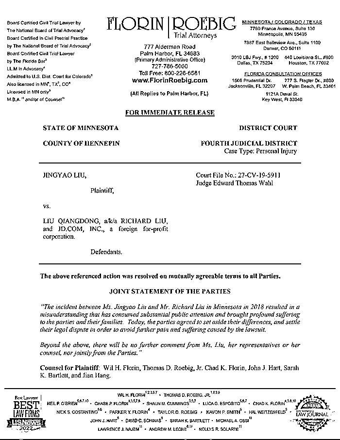

# 刘强东明州事件双方以和解终结，本人回应

> 原文：[`mp.weixin.qq.com/s?__biz=MzIyMDYwMTk0Mw==&mid=2247544929&idx=2&sn=98f27fa11981c05042cc80558f6fc215&chksm=97cbfb59a0bc724f06775148af3ac498397b223d45d3ee703f784433b2b8c92576dde2ca75fb&scene=27#wechat_redirect`](http://mp.weixin.qq.com/s?__biz=MzIyMDYwMTk0Mw==&mid=2247544929&idx=2&sn=98f27fa11981c05042cc80558f6fc215&chksm=97cbfb59a0bc724f06775148af3ac498397b223d45d3ee703f784433b2b8c92576dde2ca75fb&scene=27#wechat_redirect)

刘强东明州事件迎来意外转折，北美时间 10 月 1 日晚间双方律师团队发表联合声明，声明显示案件双方已经达成和解，和解细节未对外公布。该案原定于 10 月 3 日在明尼苏达州明尼阿波利斯市市中心的亨内平郡地区法院开庭审理。

联合声明称：刘强东先生和刘婧尧女士于 2018 年在美国明尼苏达的一次偶然事件所造成的误会，占用了大量的社会资源，也给彼此的家庭造成了深重的困扰。今天，为了避免进一步的诉讼伤害，双方决定消除误会，达成和解，为这次事件画上句号。除以上声明，刘婧尧女士及其代表和律师不再发表任何评论，双方也不会出具其它的联合声明。

界面新闻从刘强东律师处获悉，10 月 2 日，刘强东就明州事件发表声明：纠葛四年的事情，今天终于结束了！再次对被这件事困扰的所有人尤其是我的妻子表示歉意。在这里，我要特别感谢妻子的宽容、支持和陪伴！没有她，我无法坚持到今天！时间永远向前，我希望我的生活和工作能够尽快恢复正常。我们也即将迎来新的小生命，我会更加珍惜、守护好这个家庭。祝福所有人明天会更好！

此前，原被告双方刚刚经过两天时间选定陪审团，刘强东本人全程在场，章泽天也一直在旁听席上。界面新闻在现场注意到，法官还在陪审团选定后与双方律师讨论下一步开庭准备性工作，刘强东方律师追问原告是否已经选定最后的人证物证。据悉，按计划，法院和律师还会在周末利用 Zoom 会议解决一些程序性问题。

2018 年 12 月 21 日，明尼阿波利斯市亨内平县检察官办公室公布了刘强东事件的调查结果，决定不予起诉。四个月后，Liu Jingyao 向亨内平郡地区法院提起针对刘强东和京东的民事诉讼。在之后的近三年半时间里，公众对案件的关注在减少，但案件的审理一直在进行，从 2019 年 9 月开始，多数时候几乎每个月法院都有听证会、案件管理会议等。

从头到尾，在提交给法院的案件陈述和听证会中，原告和被告对同一时间段内发生的事情都是两种截然不同的描述。Liu Jingyao 指控刘强东意图伤害她、非法限制自由、性侵，刘强东和他的律师们则坚持两人是在双方都同意的情况下发生的性关系。按照原定的审理过程，陪审团将在接下来的一个月里在法官的指导下对双方提供的证据进行判断并做出裁决。

**此前报道：**

[京东刘强东“涉嫌性侵”案听证会被取消](http://mp.weixin.qq.com/s?__biz=MzIyMDYwMTk0Mw==&mid=2247534565&idx=4&sn=e0ea92c55e4e437da0429178a022fc0b&chksm=97cb8cdda0bc05cbcaf292946e2ffb5e0e34a84afdb9237e357f9418a8b53dc13fd391c7875d&scene=21#wechat_redirect)

[刘强东案听证会举行！大量视频+证词曝光！女方出庭要求赔偿！](http://mp.weixin.qq.com/s?__biz=MzIyMDYwMTk0Mw==&mid=2247538722&idx=1&sn=3508ef939729e1982633636f1eea6d73&chksm=97cb931aa0bc1a0cf1741d4bd2dfd00ffef3d89d661fdc08530d39fad403e08bceb4785a58e1&scene=21#wechat_redirect)

[刘强东赴美生二胎，等待强奸案宣判？](http://mp.weixin.qq.com/s?__biz=MzIyMDYwMTk0Mw==&mid=2247544607&idx=3&sn=d57665cdc7398076c88f2e6b2be0de17&chksm=97cbe427a0bc6d3136fac26e892bac413b5ec269a931bfb50825532e59bd4a42d64fc4eb2d1a&scene=21#wechat_redirect)

来源：界面新闻

欢迎关注灰产圈社群服务号

