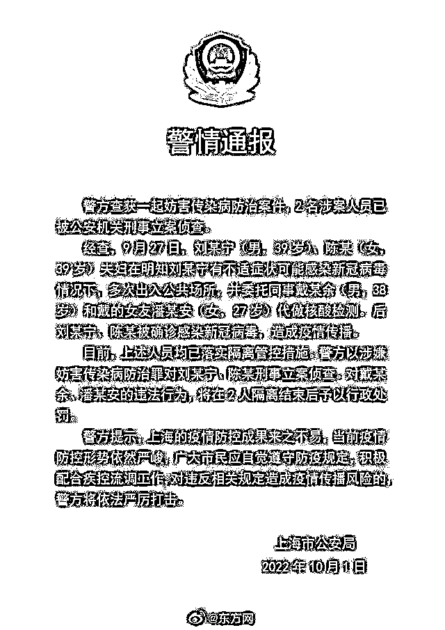
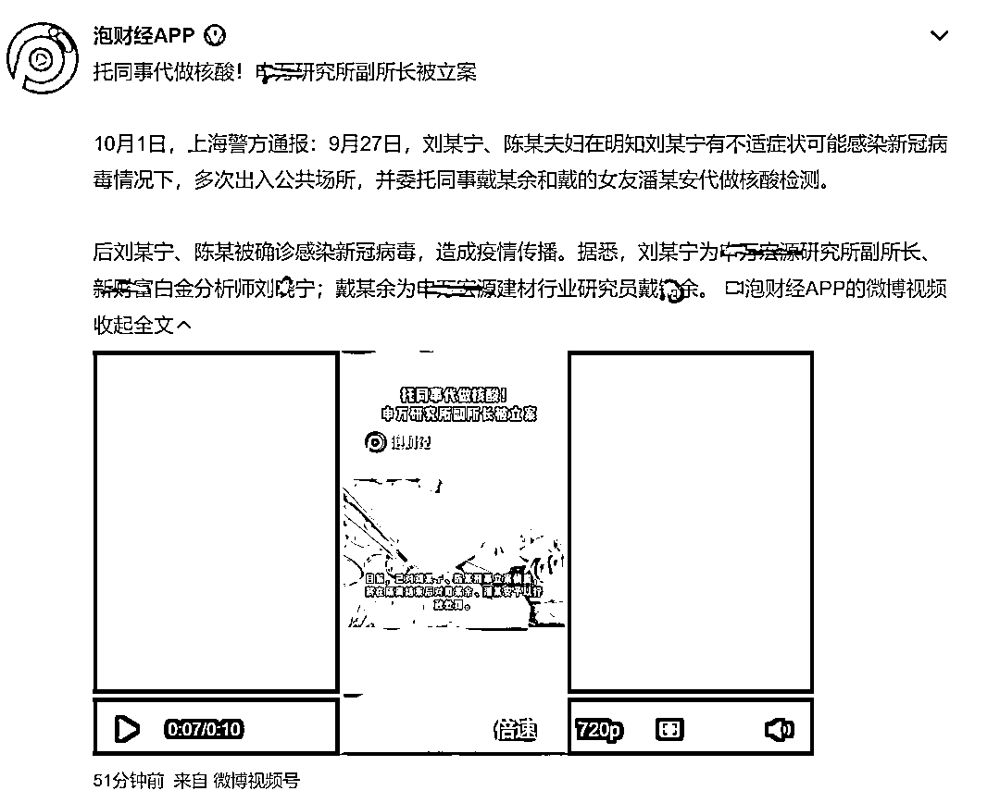
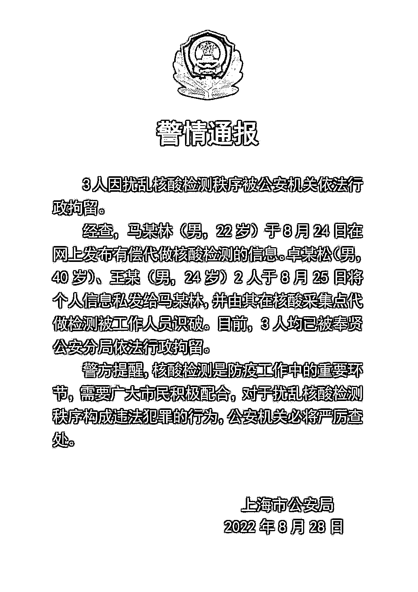
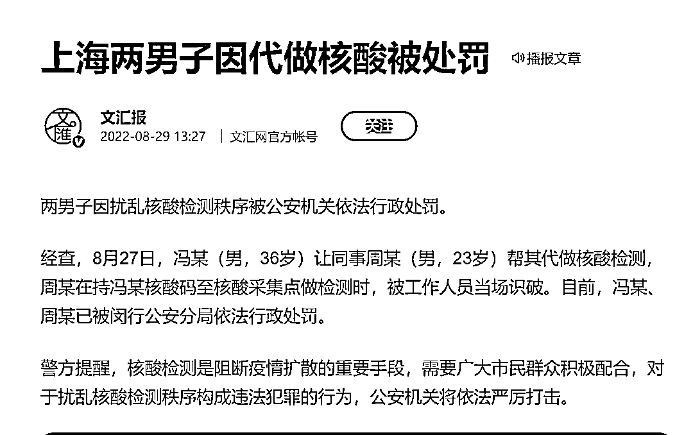
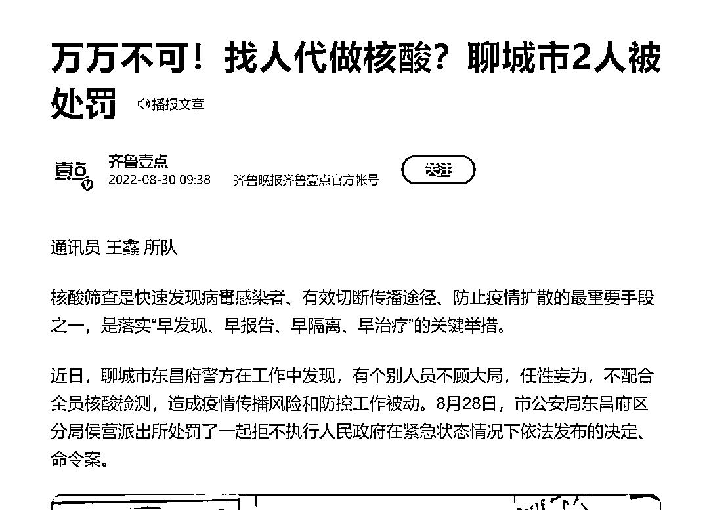

# 替身做核酸，上海何时了？

> 原文：[`mp.weixin.qq.com/s?__biz=MzIyMDYwMTk0Mw==&mid=2247544929&idx=3&sn=4a154ec6aee6fbc64ee1ca9ea1b22b83&chksm=97cbfb59a0bc724fd76b029485700846d0dc47471998f3050ee8c117f19b0502a04b47c705f8&scene=27#wechat_redirect`](http://mp.weixin.qq.com/s?__biz=MzIyMDYwMTk0Mw==&mid=2247544929&idx=3&sn=4a154ec6aee6fbc64ee1ca9ea1b22b83&chksm=97cbfb59a0bc724fd76b029485700846d0dc47471998f3050ee8c117f19b0502a04b47c705f8&scene=27#wechat_redirect)

今天看到魔都的一则魔幻新闻：

刘某宁、陈某夫妇在明知刘某宁有不适症状可能感染新冠病毒情况下，多次出入公共场所，并委托同事戴某余和戴的女友潘某安代做核酸检测。后刘某宁、陈某被确诊感染新冠病毒，造成疫情传播。

刘某宁在明知可能感染新冠病毒的情况下，居然委托同事戴某余代做核酸检测，而同事戴某余竟然接受这个委托。不得不说，这两方心都大；不得不说，这两方关系铁。

最后的结果是：“上述人员均已落实隔离管控措施。警方以涉嫌妨害传染病防治罪对刘某宁、陈某刑事立案侦查。对戴某余、潘某安的违法行为，将在 2 人隔离结束后予以行政处罚。”

“泡财经 APP”的信息显示，刘某宁、戴某余是金融业从业人员，上下级关系，怪不得刘某宁委托做核酸，戴某余言听计从的。

对核酸检测的替身戴某余、潘某安的违法行为予以行政处罚，最终适用的法律依据大概率是扰乱公共秩序或者就是拒不执行人民政府在紧急状态情况下依法发布的决定、命令。你们说，该等法律依据的适用重要不重要？不适用这些法律依据，我们的防控水平就赶上西方的防控水平了。

实际上上海的核酸检测替身案件绝不是这一起，此前即有数起，比如这个案件：

3 人因扰乱核酸检测秩序被公安机关依法行政拘留。

经查，马某林（男，22 岁）于 8 月 24 日在网上发布**有偿**代做核酸检测的信息。卓某松（男，40 岁）、王某（男，24 岁）2 人于 8 月 25 日将个人信息私发给马某林，并由其在核酸采集点代做检测被工作人员识破。目前，3 人均已被**奉贤**公安分局依法行政拘留。

这是有偿做核酸的。上海还有同事替身做核酸的：

8 月 27 日，冯某（男，36 岁）让同事周某（男，23 岁）帮其代做核酸检测，周某在持冯某核酸码至核酸采集点做检测时，被工作人员当场识破。目前，冯某、周某已被**闵行**公安分局依法行政处罚。

还有亲友替身做核酸检测的，这个不是上海的，是山东聊城的：

8 月 27 日，大车司机张某某在广州委托其亲属在聊城代替其做了核酸检测，28 日 22 时，因路程和检测时间明显不符，张某某在聊南高速路口下高速时被执勤民警和防疫工作人员进行例行检查时查获，张某某承认了他委托其亲属代替做核酸检测的违法事实。根据《治安管理管理处罚法》第五十条规定，警方对张某某行政拘留五日，对替代者张某罚款 200 元。

由此看来，替身做核酸检测的可不是一起，这也不是上海宁的“专利”，但从有关情况通报看，上海的替身核酸检测恐怕比较多一点。

目前，上海警方对刘某宁、陈某夫妇以涉嫌妨害传染病防治罪予以刑事侦查，虽说该夫妇非常讨人嫌，但也只能如此追究了。

《最高人民法院 最高人民检察院 公安部 司法部关于依法惩治妨害新型冠状病毒感染肺炎疫情防控违法犯罪的意见》规定：“故意传播新型冠状病毒感染肺炎病原体，具有下列情形之一，危害公共安全的，依照刑法第一百一十四条、第一百一十五条第一款的规定，以以危险方法危害公共安全罪定罪处罚：

　　1.**已经确诊**的新型冠状病毒感染肺炎病人、病原携带者，拒绝隔离治疗或者隔离期未满擅自脱离隔离治疗，并进入公共场所或者公共交通工具的；

　　2.新型冠状病毒感染肺炎**疑似**病人拒绝隔离治疗或者隔离期未满擅自脱离隔离治疗，并进入公共场所或者公共交通工具，造成新型冠状病毒传播的。

**其他拒绝执行卫生防疫机构依照传染病防治法提出的防控措施**，引起新型冠状病毒传播或者有传播严重危险的，依照刑法第三百三十条的规定，**以妨害传染病防治罪定罪处罚**。“

刘某宁、陈某夫妇既非确诊，也非疑似，不在上述“1”“2”情形，无法以以危险方法危害公共安全罪追究刑事责任，只能以妨害传染病防治罪定罪处罚。

今年上海的疫情给上海人民造成极其严重的影响，对上海的经济更是造成不可估量的损失，上海好不容易把严峻的疫情扭转过来，上海人民好不容易地缓了一口气，刘某宁夫妇又来一次破坏，我估计现在上海人民对这对夫妇恨之入骨了，正如去年扬州人民对“毛老太”的恨。

我向来是不惮以最坏的恶意，来推测上海人的，然而我还不料，也不信个别上海人渣到这地步。但如此渣的事竟然在经济最发达的上海屡屡发生了，让人唏嘘不已，此恶劣现象必须引起最高度的重视和警惕。

疫情防控最能体现一个城市的管理水平，防控的水平不取决于城市管理的长板，而是取决于城市管理的短板。面对一出又一出的精致主义者奇葩的表现，上海必须举一反三，防微杜渐，在补足短板上下好功夫。

 来源：庄志明律师 法之源

欢迎关注灰产圈社群服务号

