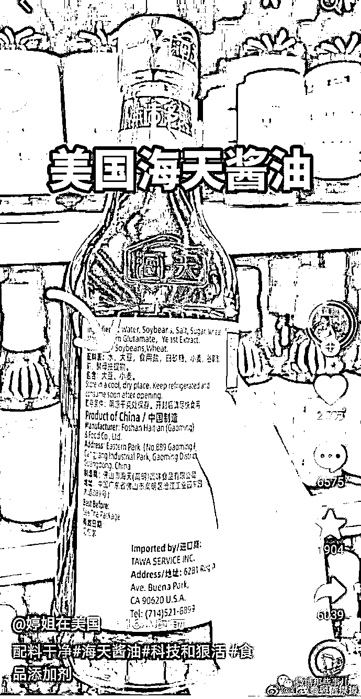

# 海天酱油又出事了！

> 原文：[`mp.weixin.qq.com/s?__biz=MzIyMDYwMTk0Mw==&mid=2247544929&idx=4&sn=007c1ac5f4ff6badc17260e808f5b885&chksm=97cbfb59a0bc724f5fc2fde75c141b8eacb78914b607c63654a6e1c63f2a2141591047cdc0f6&scene=27#wechat_redirect`](http://mp.weixin.qq.com/s?__biz=MzIyMDYwMTk0Mw==&mid=2247544929&idx=4&sn=007c1ac5f4ff6badc17260e808f5b885&chksm=97cbfb59a0bc724f5fc2fde75c141b8eacb78914b607c63654a6e1c63f2a2141591047cdc0f6&scene=27#wechat_redirect)

最近网上突然冒出来许多和“吃”有关的梗，比如：
我一勺三花淡奶；
科技和狠活；
海克斯科技... 

这些梗都是指现代食品工业的各种添加剂，在短视频上特别流行，播放近 10 亿，创造这些梗的博主叫辛吉飞，最近刚注销了他 700 万粉丝的账号，因为抖音官方给他打电话，让他改变下创作风格，因为抖音收到了对他作品的大量投诉。辛吉飞一怒之下直接注销了抖音账号。

在他的视频中，就有他用各种食品添加剂制作出来的酱油 [`v.qq.com/iframe/preview.html?width=500&height=375&auto=0&vid=x3357gjj5ao`](https://v.qq.com/iframe/preview.html?width=500&height=375&auto=0&vid=x3357gjj5ao) 辛吉飞退出了抖音，但是他掀起的这波食品添加剂的浪潮并没有结束，有些账号就把矛头指向了酱油行业的知名品牌---海天酱油。网友发现海天酱油中含有 5 种添加剂，前 3 种为增味剂，苯甲酸钠则为常用的食品防腐剂，三氯蔗糖则为甜味剂。 多位海外网友晒出自己在国外买的海天品牌的酱油，配料表上则没有添加剂，只有水、大豆、小麦、食盐等天然原料，随后有网友晒出了国内海天酱油的配料成分，对比之下，多种添加剂成分引发热议。9 月 30 日晚间“酱油茅”海天味业官方微博发布了一则声明对近期产品添加剂争议进行回应↓↓↓在声明中，海天味业表示，部分短视频账号利用大众对于食品安全的关注制造焦虑和恐慌，在网络上制造并且散播谣言，严重损害了公司品牌形象，其言行己构成对公司名誉权的严重侵害。对此，海天味业表示，海天所有产品都严格按照《食品安全法》生产，海天所有产品中食品添加剂的使用及其标识均符合我国相关标准法规要求。针对在事件中悉意造谣中伤海天品牌的短视频账号，公司己委派专业律师团队调查取证。别人问的是：为什么国外没有添加剂，国内全是添加剂？海天回答的是添加剂符合国家食品标准，有避重就轻，拿国标当挡箭牌的嫌疑。实际，海天在国内也有未添加的产品，只是价格更贵些，市面上较少。对于这件事你怎么看？留言区聊聊吧

来源：微博那些事儿

欢迎关注灰产圈社群服务号

