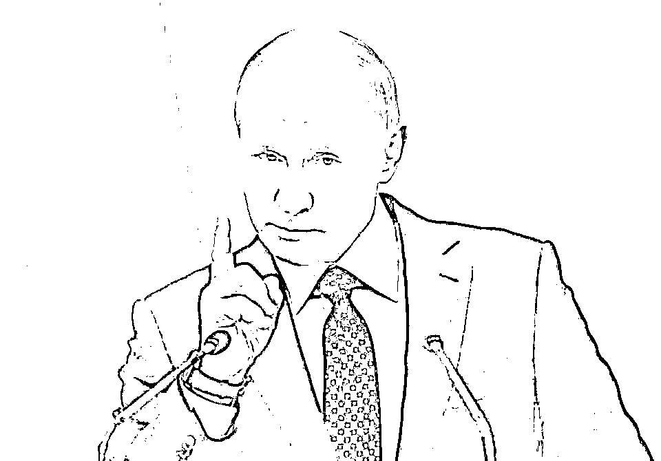
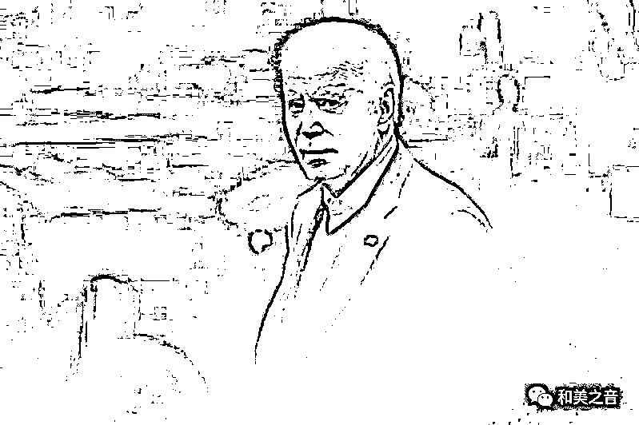
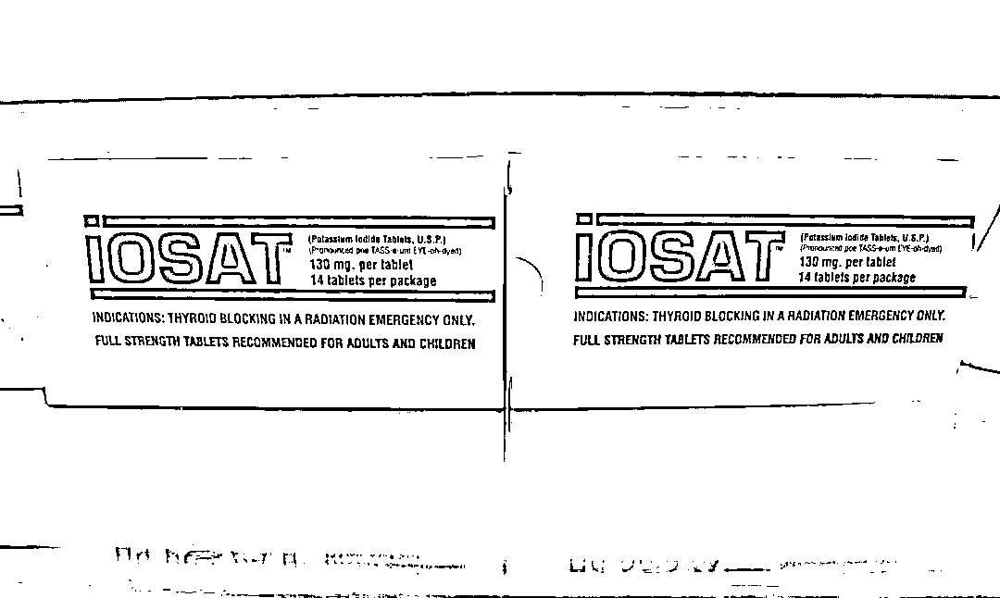
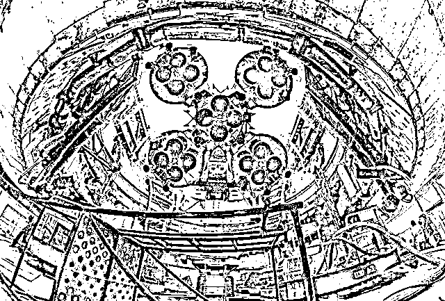
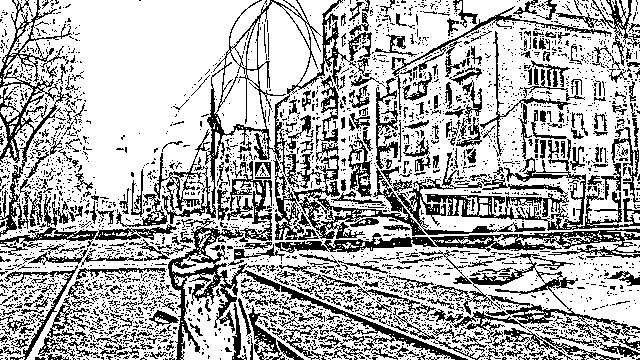

# 俄罗斯急采购碘片，核战成真？

> 原文：[`mp.weixin.qq.com/s?__biz=MzIyMDYwMTk0Mw==&mid=2247544929&idx=5&sn=de78ccc5c6824e35f4465dd3406d89e6&chksm=97cbfb59a0bc724f0d950f3d742714e5900302c14d7dc2980629916d030fc587d1f093b719fc&scene=27#wechat_redirect`](http://mp.weixin.qq.com/s?__biz=MzIyMDYwMTk0Mw==&mid=2247544929&idx=5&sn=de78ccc5c6824e35f4465dd3406d89e6&chksm=97cbfb59a0bc724f0d950f3d742714e5900302c14d7dc2980629916d030fc587d1f093b719fc&scene=27#wechat_redirect)

**传俄罗斯正大幅採购碘片,以应核战** 

**前言：**

目前，俄乌战争正持续甚至升级，有些人认为，发生核战的机会微小，但也有外界专家和研究人员对战事的扩大感到忧虑。 

俄罗斯总统普廷 9 月 30 日宣布将乌克兰 4 个州併入俄国领土，**恐加剧俄乌战争局势；**

**有谁会承认普京併入的乌克兰领土？**

**G7 集团声明：永不承认俄罗斯吞併乌克兰领土。**

北约秘书长斯托尔滕贝格谴责，俄罗斯吞併乌克兰四个地区的**“非法行为**”，针对普京威胁动用核武，北约表示，乌克兰完全有权力收复自己的领土，北约支持乌克兰一直到该国解放全部领土为止。

**欧盟领袖**发表联合声明，谴责俄罗斯吞併乌克兰领土的**“非法行为**”置全球安全于危险之中，欧盟誓言永远也不会承认俄罗斯吞并行径。

**** 美国总统拜登**谴责俄罗斯在乌克兰领土上“伪造的公投”，**他保证**美国继续全力支持乌克兰收复失土。******

****美国与七国集团还**表示，任何国家，任何个人和实体向俄罗斯非法吞併乌克兰领土的企图**提供援助都将遭到严厉惩罚。****

****

**9 月 21 日，俄罗斯总统普京宣布局部动员，还宣称不排除用核武。**

**俄罗斯前总统梅德韦杰夫也称，俄罗斯有权在必要时使用核武器。**

**近日，以色列情报公司发现，俄军开始将可携带核武的轰炸机**部署至芬兰边境。****

**以色列情报公司 ISI 发现，俄军位于芬兰边境的某空军基地，**于 8 月底开始进驻可携带核武的战略轰炸机。****

**外传俄罗斯要在 4 天内收购价值 500 万卢布碘片，波兰也向军警部门发放碘片，**外界纷传****核战发生的可能性越来越大...****

****俄罗斯媒体******27 日********报道**，俄国打算**在 4 日内，**至少****花 500 万卢布採购碘片，正在公开招标，似乎为可能的核武战争做准备。****

9 月 27 日，俄媒引述**俄罗斯国家採购部网站**显示，当局正公开採购价值最少 500 万卢布碘化钾，招标程序**为期 4 日**。

**俄**政府网站强调，**每年都会为民众购买碘化钾。**

乌克兰媒体报道，俄罗斯政府在 2020 年 12 月下旬和 2021 年 3 月上旬，也是以大致相同的数量招标採购碘化钾。

而与今次採购的唯一区别，**是招标的迫切性**。

**碘化钾是什麽?**

**碘是人体所需的一种矿物质，在制造甲状腺素有重要作用。** 

**碘化钾是一种可用于预防辐射，但也能对甲状腺造成伤害的药物。**

****碘化钾有何作用?****

****服用碘片可让人体先吸收这种稳定的碘，让甲状腺饱和，从而达到防止人体吸收放射性碘，并在体内聚积，达到保护身体的效果。****

****世界卫生组织**建议，儿童、孕妇和 40 岁以下的人服用碘，可以保护甲状腺在核事故后免受辐射。**

****

****每当出现核战的风险时，需求和销量都会上升****

**在 2018 年，美国前总统特朗普对朝鲜领袖金正恩威胁美国有“更大颗的核弹按钮”时，碘化钾的需求也曾瞬间飙升。**

**俄乌战争爆发近几周，美国的各大碘化钾存库迅速耗尽。碘化钾药品的需求与价格也随之上升。**

**平时 15 美元左右的某品牌碘化钾药片，涨价到每盒 89.95 美元。而其官网更显示正在缺货。**

**2 月 28 日，他们就已卖光所有存库。** 

****

****欧洲各国民众曾囤曾积碘片**** 

****2 月 24，俄罗斯与乌克兰战争刚开始时，普丁就在电视讲话中警告，若其他国家介入，他将使用核武。这点燃了大家对****核能毁灭性的恐惧**。******

******《欧洲新闻》指出，自从乌克兰札波罗热核电厂被袭击以来**，欧洲各地人对碘片的需求激增。********

********3 月 6 日**，**法国**外交部长勒德里安宣布，法国已经向乌克兰运送医药物资，包括帮助**人体免受于辐射影响的碘片。********

********比利时**通讯社表示，仅在 2 月 28 日就分发了 3 万多盒碘片。******

********芬兰和荷兰**的情况类似，自战争开始以来碘片需求都暴增。一些药局甚至断货。******

******在中欧，与乌克兰接壤的**波兰和罗马尼亚，以及捷克、克罗埃西亚和保加利亚**也出现了类似的热潮。******

********俄罗斯曾辐射超标，居民抢购碘** ******

******2019 年 8 月 8 日，俄罗斯北部的海军测试区发生火箭引擎爆炸事故，附近地区曾出现**高于正常标准的辐射水平。********

******据路透社 8 日报道，事故发生后，当地居民抢购碘，而俄罗斯国防部表示，辐射水平属于正常范围。******

******俄罗斯国家原子能公司 10 日公布，北部海军测试区 8 日发生火箭爆炸事故，造成该公司 5 名员工死亡，3 人严重烧伤。******

******事故发生后，现场及周围地区出现**短暂辐射。********

******测试区附近的城市北德文斯克 8 日出现辐射水平高于正常标准的情况，一度达到**每小时 2 微希。********

******40 分钟后，辐射水平回落至正常状态的**0.11 微希。********

******英国广播公司指出，这两个水平的辐射程度，都不足以令居民因辐射而致病。******

******当地居民在辐射水平上升后，抢购用于降低辐射的碘。有药房的碘全部卖光。******

******某药房表示，“今天每个人都来查询碘。”******

******俄罗斯国防部表示，辐射属于正常水平，爆炸未产生的有害化学物质**冲到了大气中。********

******目前，由于对俄罗斯发动核武攻击的恐惧，欧洲各地已掀起碘片囤积潮。******

********对此，专家警告，****不必要的使用可能反而对健康产生危害。********

********来源：和美之音********

****************

********欢迎关注灰产圈社群服务号********

****************

****************