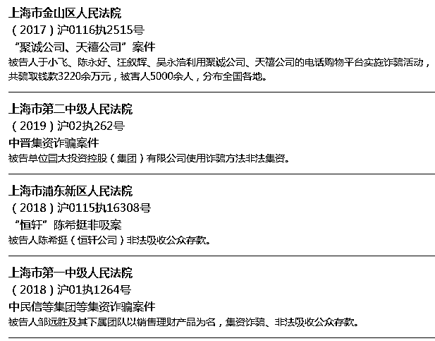

# 这 53 家立案平台已进入退款程序，有没有你投资的平台？

> 原文：[`mp.weixin.qq.com/s?__biz=MzIyMDYwMTk0Mw==&mid=2247544929&idx=6&sn=16b554a431e1937e745afe3a3e9fa828&chksm=97cbfb59a0bc724f9e87ec881e5338a3d82a72816ec9ba8acacbc77d4461a1adeb20ad707e6d&scene=27#wechat_redirect`](http://mp.weixin.qq.com/s?__biz=MzIyMDYwMTk0Mw==&mid=2247544929&idx=6&sn=16b554a431e1937e745afe3a3e9fa828&chksm=97cbfb59a0bc724f9e87ec881e5338a3d82a72816ec9ba8acacbc77d4461a1adeb20ad707e6d&scene=27#wechat_redirect)

今天，我们与大家分享上海各级法院正在办理退款手续的平台。**实名注册进入法院涉众案件资金清退系统。**

首先，你可以通过微信直接搜索“上海一中法院”，进入关注。在首页对话框里有个栏目叫“诉讼服务”，轻点诉讼服务就会跳出一组子栏目，选择“集资诈骗案登记”，详见下图。 

随即就会跳出一个登记登录页面，往下拉动即可看到**“刑事案件信息核对”，**点击此处。

一定进行注册登记，并且记住密码，当然，记住实名的手机号或身份证号也可以，一旦忘记密码也可以通过操作重置密码的。 

应根据指引完成注册，可以是身份证也可以是手机号，但必须是实名的。 

通过人脸识别完成注册，注意，在人脸识别时不宜在强阳光下进行。 

**完成注册即可进入信息核对。**

在刑事案件被害人或投资人信息核对时，选择自己的身份。 

切记，做这种登记不要玩虚的，一定实事求是，反正自己不做违法犯罪的事，不做亏心事。 

找到你所涉平台点击进入进行登记，提交完成后等待审核通过。 

在登记过程中，页面上显示一个红色星号，意思是，带有这个星号的栏目是必须填写的，否则就无法提交。

这也是自始至终，我们一直强调的每个出借人都要保留着证据，特别是合同，而账单流水也要保留，但可不作强求。 

经过梳理发现，目前，上海区域内**共有 53 家立案平台正在进行信息核对，**也就是说这些平台已经进入法院执行阶段，并且正在办理退款手续的相关准备工作。

这些平台包括：

**1、桢曦投资；** 

**2、大爱城；** 

**3、永利宝；**

**4、伟玖堂；**

**5、币盛；** 

**6、脉麟；** 

**7、荣幸；** 

**8、大䘵；**

**9、南洋联合；** 

**10、利事丰；** 

**11、卓妍；**

**12、李兴超；**

**13、长烁；** 

**14、善林金融；** 

**15、中美控股达沃斯金融；** 

**16、资邦系；**

****

**17、吴菊平、沈雪姣；** 

**18、无锡秦岭；** 

**19、瀚中公司；** 

**20、黑格公司**

**21、麦子金服；**

**22、银河惠理；** 

**23、钱浩公司；** 

**24、旭轩公司** 

**25、巨如集团；**

**26、上海大舜；** 

**27、上海贞乾；**

**28、麦街公司；**

**29、莱好股权投资；**

**30、聚诚公司、天槽公司；** 

**31、中晋；** 

**32、恒轩；** 

**33、中民信；**

**34、典融公司；** 

**35、威氏；** 

**36、赢基；**

**37、菲比特；**

**38、合盘；** 

**39、国赟嘉定第一分公司；** 

**40、威丰及威翔；**

****

**41、创怿赢；** 

**42、申彤大大宝；** 

**43、快鹿；** 

**44、逸富；**

**45、沪济公司；** 

**46、盐商；** 

**47、闵界栋；** 

**48、纽岂博公司；**

**49、橙旗；**

****

**50、连山易传统文化；** 

**51、国永；** 

**52、金银猫；** 

**53、祟逸。**

对于以上这些正在办理退款信息核对的平台出借人，请立即予以核对，此外，现在这些平台的信息核对在上海法院公布的信息核对栏目里还能看到，有的已完成了信息，有的甚至已办理了退款。如果遇到已经错过时间的平台，出借人可直接与执行法院取得联系，看能不能予以补办。

来源：百晓生道破盘界

欢迎关注灰产圈社群服务号

