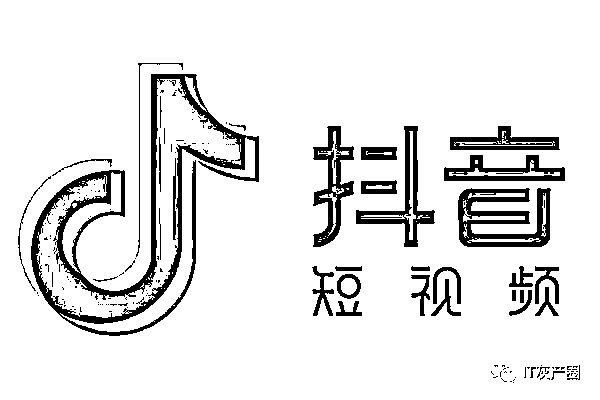

# 深扒抖音上的三大骗局，不知道的是你吃亏

> 原文：[`mp.weixin.qq.com/s?__biz=MzIyMDYwMTk0Mw==&mid=2247544929&idx=7&sn=9ef8ec98175c7fa368af6436bc189fdf&chksm=97cbfb59a0bc724f68794196fa3f0c3da3084cc86d48e2ed1542b99ab910114fd291e7b640a1&scene=27#wechat_redirect`](http://mp.weixin.qq.com/s?__biz=MzIyMDYwMTk0Mw==&mid=2247544929&idx=7&sn=9ef8ec98175c7fa368af6436bc189fdf&chksm=97cbfb59a0bc724f68794196fa3f0c3da3084cc86d48e2ed1542b99ab910114fd291e7b640a1&scene=27#wechat_redirect)

今天专门开篇文章来聊抖音，你可以说这是套路，也可以说它是骗局。 

**“套路”和“骗局”之间存在一个界限，一旦超过了这个界限，原本打法律擦边球的那些套路，也就成了违法的骗局。**

今天要说的前两个针对男性，最后一个针对女性，希望大家能抽出几分钟时间，仔细看完，说不定就能帮你挽回不少损失。

**点击图片查看**

欢迎关注灰产圈社群服务号

