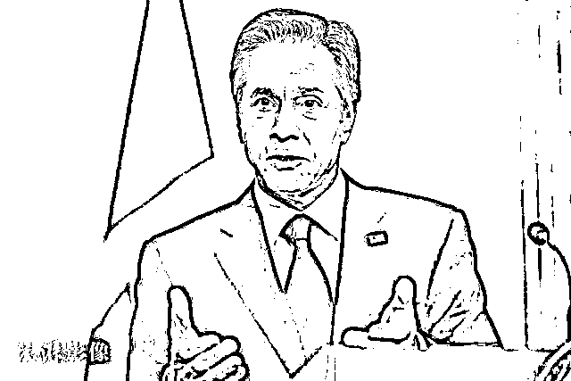

# 不装了？美方直说了：巨大机遇，一劳永逸

> 原文：[`mp.weixin.qq.com/s?__biz=MzIyMDYwMTk0Mw==&mid=2247544929&idx=8&sn=ebb669f97d5978324b4d2f647b408a65&chksm=97cbfb59a0bc724f5e1f1b4244fb1cfc8a469d1a3b6a7de3b3d0ad33787713c4e2dc8861b570&scene=27#wechat_redirect`](http://mp.weixin.qq.com/s?__biz=MzIyMDYwMTk0Mw==&mid=2247544929&idx=8&sn=ebb669f97d5978324b4d2f647b408a65&chksm=97cbfb59a0bc724f5e1f1b4244fb1cfc8a469d1a3b6a7de3b3d0ad33787713c4e2dc8861b570&scene=27#wechat_redirect)

9 月底，“北溪 1 号”和“北溪 2 号”天然气管道发现多处“神秘泄漏”，此事件前所未有，同时也导致俄罗斯同美西方国家在能源领域的争论再度升级。

当地时间 9 月 30 日，在谈及“北溪”天然气管道泄漏事件给欧洲能源供应带来更大压力时，美国国务卿布林肯透露，美国已大幅增产，向欧洲提供液化天然气等能源。他还直白地指出，当前形势是一个“巨大的机遇”，可以借此“一劳永逸地”消除（欧洲）对俄罗斯能源的依赖。

目前，俄罗斯方面指控美西方国家制造了破坏“北溪”管道的事件，俄方官员称“已掌握西方参与北溪事件证据”，俄总统普京更是指出“谁受益就是谁干的”；美国则由总统拜登领头，声称俄罗斯“散布虚假信息和谎言”，双方的“交锋战”已从两国元首回应蔓延到联合国安理会会议，冲突仍在持续之中。

美国国务院网站新闻稿截图

当地时间 9 月 30 日，美国国务卿布林肯同到访的加拿大外交部长梅拉妮·若利（Mélanie Joly，中文名：乔美兰）举行联合记者会。据美国国务院网站发布的记者会问答文字实录，现场有记者提出了有关“北溪”管道的问题。

有记者表示，“北溪”管道泄漏事件无论责任在哪一方，显然已导致欧洲能源供应形势变得更加糟糕。这名记者向美加两国最高外交官员提问，将独立或共同采取何种行动来帮助缓解这种压力？

对此，布林肯说：“我认为首先要明确的是，这些管道，即‘北溪 1 号’和‘北溪 2 号’，当时没有向欧洲输送天然气。众所周知，‘北溪 2 号’从未投入使用，由于俄罗斯将能源武器化，‘北溪 1 号’已经关闭数周。”

随后，布林肯称，在看到俄乌冲突以及俄罗斯将能源武器化后，美国已与欧洲伙伴以及世界各国密切合作，确保全球市场上拥有足够资源。其中，美国大幅增加产量，向欧洲提供液化天然气，成为了欧洲液化天然气的主要供应商，目的就是帮助欧洲弥补因俄乌冲突而损失的天然气或石油。

当地时间 9 月 30 日，美国国务卿安东尼·布林肯与加拿大外交部长若利举行新闻发布会。图自澎湃影像

此外，布林肯还称，美国努力从战略石油储备中释放石油，确保市场上的石油供应，并压低石油价格。而在几个月前，美国就与欧盟进行了接触，成立了一个工作组，同欧洲直接合作。

“归根结底，这也是一个巨大的机遇（tremendous opportunity）。这个巨大的机遇可以一劳永逸地（once and for all）消除（欧洲）对俄罗斯能源的依赖，从而使普京不再把能源武器化作为推进其‘帝国计划’的手段。这是非常重要的，为未来几年提供了巨大的战略机遇，但与此同时，我们决心尽一切可能确保所有这些后果不会由我们国家或世界各地的公民承担。”布林肯这样说道。

加拿大外长若利在回答相同问题时则表示，加拿大也已增加了自身产量，将能源产品出口到美国，然后再销往欧洲。

记者会上，有记者还提到了俄罗斯总统普京认为西方应该为“北溪管道事故”负责的说法。对此，布林肯形容普京的指控“荒谬”，俄方所做的是“令人发指的虚假信息活动”。布林肯称，美国就此事件一直与欧洲合作伙伴保持密切合作，特别是丹麦和瑞典，美国支持对事件展开调查，并确定责任方，但他不想抢在调查完成前表态。

而对此问题，加拿大外长若利也在一旁帮腔表态称，加拿大认为“北溪”管道是一个非常重要的欧洲基础设施，加方支持北约和欧盟关于管道遭破坏事件的声明。

当地时间 9 月 30 日，美国国务卿安东尼·布林肯与加拿大外交部长若利举行新闻发布会。图自澎湃影像

综合俄罗斯塔斯社、俄罗斯卫星通讯社消息，当地时间 9 月 30 日，俄罗斯对外情报局（SVR）局长谢尔盖·纳雷什金对记者称，他们已掌握的信息表明：西方参与了对“北溪”管道的破坏活动。路透社称，这是目前俄罗斯高级官员对西方提出的最直接的公开指控。

同天晚些时候，俄罗斯总统普京再次指责西方破坏俄罗斯所建造的“北溪”管道，而美国及其盟友则强烈否认俄方的这一指控。

据“今日俄罗斯”（RT）消息，普京当天在克里姆林宫发表讲话回应了“北溪”天然气管道被破坏事件，他认为，是“盎格鲁-撒克逊人”制造了这些爆炸。

普京表示，对于“盎格鲁-撒克逊人”来说，光制裁（俄罗斯）已经不够用了，所以他们采取了破坏路线，对“北溪”管道组织实施了一系列的爆炸行为。普京指出，“他们实际上已经开始摧毁整个欧洲的能源基础设施，这虽然很难令人相信，但却是事实。”他强调：“所有人都清楚谁会从中受益，当然谁受益，谁就要为此负责。”

华盛顿方面，美国总统拜登同样在 9 月 30 日对该事件作出回应。他称这一事件是一次“蓄意破坏行为”，同时指责俄罗斯人在“散布虚假信息和谎言”，声称美国将与盟友合作以查明真相。

甚至还有美国官员声称，普京的说辞是在试图转移人们对其“吞并”乌克兰部分地区的注意力。白宫国家安全委员会发言人埃德里安娜·沃森（Adrienne Watson）9 月 30 日这样说道：“我们不会让俄罗斯的虚假信息分散我们或全世界对其‘吞并’乌克兰主权领土的明显欺诈企图的注意力。”

9 月 26 日至 28 日，位于丹麦水域附近的“北溪 1 号”和“北溪 2 号”天然气管道先后被发现至少 4 处泄漏。瑞典国家地震台网地震学家称，气体泄漏的区域发生了两次水下爆炸，几处泄漏点的位置都十分接近。

当地时间 9 月 28 日，根据瑞典海岸警卫队公布画面，“北溪 2 号”天然气管道泄漏处的气泡上升到波罗的海表面，形成直径超过 1 公里的“气泡圈”。图自澎湃影像

事件发生以后，德国、丹麦、瑞典已就事故原因展开立案调查。截至目前，各方均认为“北溪”管道泄漏或为蓄意破坏所致。

俄罗斯“北溪 1 号”项目运营方北溪天然气管道公司 9 月 27 日发表声明说，“北溪 1 号”和“北溪 2 号”海底输气管道的三条管线一天内同时发生损坏的情况前所未有，目前尚无法评估维修时间。

此前最先发现的 3 处泄露点 图源：BBC

“北溪 1 号”管道 2011 年建成，东起俄罗斯维堡，经由波罗的海海底通往德国。“北溪 2 号”管道去年建成，与“北溪 1 号”基本平行，尚未投入使用，但仍有部分天然气封存在管道内。

当地时间 10 月 1 日，美联社援引丹麦能源机构的说法报道称，此前受损的“北溪 2 号”天然气管道似乎已经停止泄漏天然气。此前，据丹麦政府初步估计，“北溪 1 号”和“北溪 2 号”天然气管道受损的最坏情况将是泄漏 7.78 亿标准立方米天然气，相当于 1460 万吨碳当量的排放，而丹麦在 2020 年的排放量约为 4500 万吨碳当量，等同于该国每年温室气体排放量的三分之一。

来源：观察者网

欢迎关注灰产圈社群服务号

