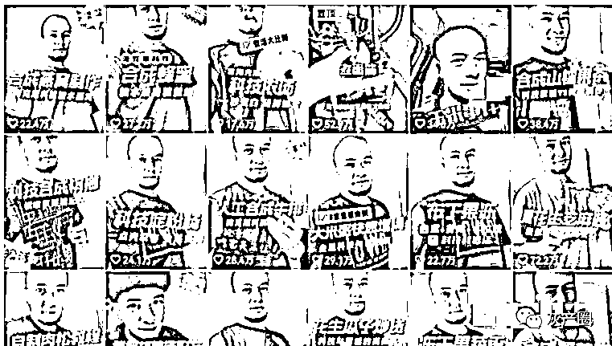
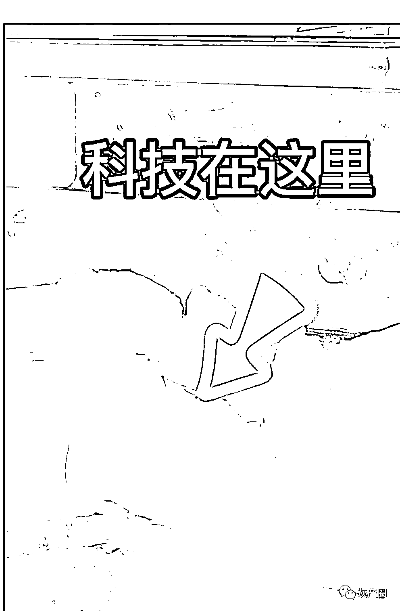
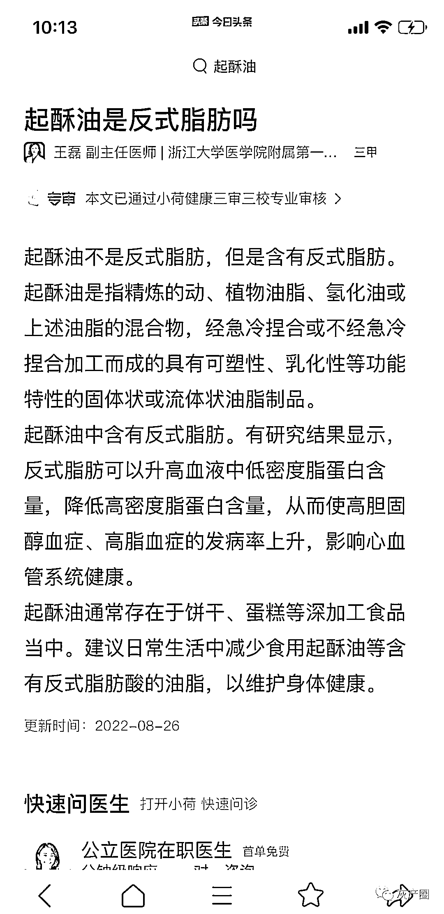

# 辛吉飞爆料肯德徳麦当当的科技与狠活，炸鸡香味的秘密都在油里！少吃！

> 原文：[`mp.weixin.qq.com/s?__biz=MzIyMDYwMTk0Mw==&mid=2247544982&idx=1&sn=5a6dd6b42449842727fb8d23e91a197f&chksm=97cbfbaea0bc72b8a63d1406af8358a37a791a161d88a350f68c6e7b1021735c0041a3a73e17&scene=27#wechat_redirect`](http://mp.weixin.qq.com/s?__biz=MzIyMDYwMTk0Mw==&mid=2247544982&idx=1&sn=5a6dd6b42449842727fb8d23e91a197f&chksm=97cbfbaea0bc72b8a63d1406af8358a37a791a161d88a350f68c6e7b1021735c0041a3a73e17&scene=27#wechat_redirect)

被称为食品行业“吹号人”的辛吉飞在把海天酱油搞得鸡飞狗跳之后，又把矛头指向了肯德徳麦当当这两大国际快餐巨头。

辛吉飞在直播中透漏，他在肯德徳/麦当当店里亲自做了一下炸鸡，发现了他们味道独特的秘密---起酥油。炸完之后，满身都是味道。

[`mp.weixin.qq.com/mp/readtemplate?t=pages/video_player_tmpl&action=mpvideo&auto=0&vid=wxv_2603143692035784705`](https://mp.weixin.qq.com/mp/readtemplate?t=pages/video_player_tmpl&action=mpvideo&auto=0&vid=wxv_2603143692035784705)

肯德徳麦当当的科技与狠活 

据医生介绍，起酥油 

后来，辛吉飞还对小吃和肯德徳麦当当的油进行了测评 

[`mp.weixin.qq.com/mp/readtemplate?t=pages/video_player_tmpl&action=mpvideo&auto=0&vid=wxv_2603140274030346240`](https://mp.weixin.qq.com/mp/readtemplate?t=pages/video_player_tmpl&action=mpvideo&auto=0&vid=wxv_2603140274030346240)

* * *

FallingDownFD：应该说的不是起酥油，我之前开店也用起酥油，我还见过用棕榈油的。。。我家的炸鸡只能说相似他们的味。。但就是不一样，看他说法，应该是起酥油配了别的

昂不里喔 bal：我以前兼职过，看他们换油，我还以为那么大块是黄油呢，我还想着，卧槽不愧卖的那么贵看了看那个箱子，他妈的起酥油

龙伊贝：二十多块钱就一大箱。。。

来源：微博那些事儿

欢迎关注灰产圈社群服务号

