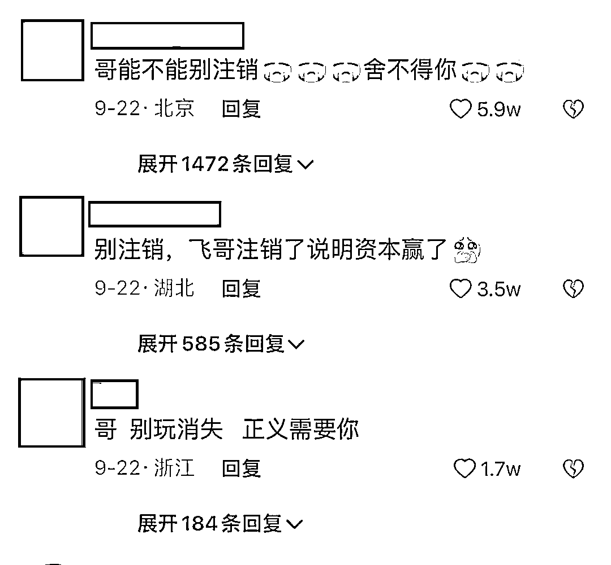

# 850 万粉丝一夜清零！辛吉飞到底动了谁的蛋糕？

> 原文：[`mp.weixin.qq.com/s?__biz=MzIyMDYwMTk0Mw==&mid=2247544982&idx=2&sn=def72bf6b328d5801def0dcd97d8e627&chksm=97cbfbaea0bc72b881c1c9f5126283fbf0a9d61b9d6d965539f9e90a461616839b3940a1c5ac&scene=27#wechat_redirect`](http://mp.weixin.qq.com/s?__biz=MzIyMDYwMTk0Mw==&mid=2247544982&idx=2&sn=def72bf6b328d5801def0dcd97d8e627&chksm=97cbfbaea0bc72b881c1c9f5126283fbf0a9d61b9d6d965539f9e90a461616839b3940a1c5ac&scene=27#wechat_redirect)

近期，那句“必是科技与狠活啊”“我一勺三花淡奶”，把整个食品、餐饮行业搅得天翻地覆，嘲讽满天飞。

而造成这一切，源自网红博主@辛吉飞。

其实蛋弟也经常能刷到他，凭借一系列揭秘“海克斯科技”美食视频，涨了一百多万的粉丝。

此时并没有引发多大的轰动，直到在九月份他揭秘了市场上便宜的“蜂蜜”制作过程，被**食品报批评。

但没想到，反而**食品报遭到网友攻击。

本来他们两个粉丝量都是一百多万，这一波下来@辛吉飞瞬间涨粉几百万，现在都已经 800 多万了。

是@辛吉飞让我们知道了。

*   超市里的玉米之所以软糯香甜，是因为在水中滴入了甜蜜素和玉米香精。

*   芋泥奶茶喝起来奶味十足，实则压根就没有奶，全是是植脂末、奶精等食用化学原料兑的。

*   垂涎欲滴的雪花肥羊，有的商家是用鸭肉和羊肉边角料经冷冻合成的。

虽然我们不能一概而论，但确实有一小部分商家为了控制成本，使用一些科技与狠活。

随着辛吉飞揭露更多的行业内幕，引发了正反双方的一波舆论攻讦。虽有粉丝拥护，网上还是出现了大量举报辛吉飞的反对者。

最终抖音官方不得不下场介入。

从 9 月 21 日网传的一支视频可以看出，抖音官方给辛吉飞打电话，说其内容违规，要求其作品基于用户体验对用词进行修改。

[`mp.weixin.qq.com/mp/readtemplate?t=pages/video_player_tmpl&action=mpvideo&auto=0&vid=wxv_2593849111016275969`](https://mp.weixin.qq.com/mp/readtemplate?t=pages/video_player_tmpl&action=mpvideo&auto=0&vid=wxv_2593849111016275969)

谁知道@辛吉飞直接硬刚官方，挂断电话后直接注销了抖音 800 万的账号，这真不是一般人能做到的。

正常网红火了以后，都会利用这个机会带货接广告赚钱，而@辛吉飞非但没有接一个广告，就连他直播打赏礼物的功能都关了。

真的佩服，不愧是“歪嘴战神”。

但根据平台规则，9 月 28 日之后抖音可能再无@辛吉飞，不少网友愤怒感叹：辛吉飞销号了，我们的食品又安全了， 最终还是资本赢了！

那@辛吉飞的视频真是在贩卖焦虑吗？

我们始终相信一分钱一分货，低价没有罪，超市里 9.9 元一瓶的勾兑蜂蜜也没有罪，但当真蜂蜜卖，诱导消费者就有罪！

我们不反对食品添加剂，也不应该妖魔化食品添加剂，我们反对的是商家过量使用。

我们消费者应该有知情权，真的就是真的，假的就是假的，合成就是合成的，应该清楚的提醒消费者。

而不是以次充好，欺骗消费者！

在这个食品行业需要有@辛吉飞这样的勇士，让大众有对各种食品的基本辨别能力，同时反向督促食品行业正规化发展。

至于是不是贩卖焦虑，

**相信消费者心中已经有了答案。**

来源：我是你蛋弟，大 R 说安全

欢迎关注灰产圈社群服务号

